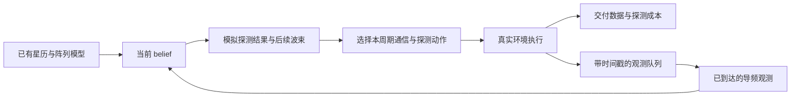

# WorldNTN：面向 IEEE ICC 的具体研究方案与原框架评估

> 本文根据 `WorldNTN_research_framework.md` 的 R0–R12 及历史框架重新收敛。目标是形成一个问题明确、机制可解释、数据可生成、结果可证伪的通信研究项目。
>
> 按你的最新要求：**不考虑截稿日期，不以开发周期压低研究深度，按内容完整性与研究价值推进。** 假定你具备搭建链路、阵列和网络仿真的能力，但当前工作区主要是研究文档，本文不声称已有仿真代码或实验结果。
>
> 文献核查日期：2026-09-30。下文严格区分已有工作、本文拟研究的机制、建议实验参数和待验证结论。任何性能提升比例都必须由实验产生，不预设“保证中稿”。

## 1. 先给评估结论

**原稿适合作为长期研究地图，但还不能直接作为一篇 ICC 论文的实施方案。** 它最值得保留的是“已知物理显式计算、未知环境学习、基于动作后果决策”；最大不足是尚未固定一个必须解决的通信问题，以及一个能与强近邻工作区别开的机制。

| 评估维度 | 原稿的实际状态 | 要达到可投稿水平，需要补上的内容 |
|---|---|---|
| 实际问题 | 提到了稀疏反馈、干扰、切换、异常等多个痛点 | 固定设备、收发方向、观测来源、动作和性能瓶颈 |
| 科学问题 | “学习未知动态以支持控制”成立，但过宽 | 说明哪些未知量会改变通信决策，何时需要额外测量 |
| 创新定位 | WM、物理残差、主动测量、MPC 都有先例 | 找到与 NTN 几何、硬件信息限制直接相连的方法区别 |
| 数学模型 | R4–R6 有有用公式，但若干接口仍是候选 | 给出从接收信号、观测分布到效用和可执行时序的完整链条 |
| 数据方案 | 知道要混合策略和隔离隐藏状态 | 还缺生成分布、字段、训练标签、划分、训练步骤和数据量 |
| 实验方案 | 基线意识较强 | 缺少具体基线实现、机制图、可否定的研究假设 |
| 论文结构 | 最新建议与历史 0–63 节并存 | 建立一个中心命题，让其他模块服务于它 |

我的判断是：**按原稿直接实现“Graph/RSSM + MPC + 异常检测”，被评价为模块组合的风险很高。** 更值得投入的是有限观测条件下的“任务可辨识性与主动信息获取”：不追求重建整个无线环境，而是判断尚未掌握的信息是否足以改变后续通信动作。

这里不估计录用概率。没有实验和完整近邻对照，给出某个中稿百分比没有依据。真正影响论文竞争力的是：问题是否必要、区别是否具体、对手是否足够强、结果是否可信。

## 2. 固定一条主线

### 2.1 推荐题目

中文工作题目：

**面向 LEO 同频干扰的任务感知主动探测与预测接收波束控制**

英文工作题目：

**WorldNTN: Task-Aware Active Probing for Predictive Receive Beam Control under LEO Cochannel Interference**

正文可以使用 world model 一词，但题目和贡献不能依赖这个名称成立。技术对象应始终是“带有限观测的干扰预测与通信决策”。

### 2.2 一句话定义要解决的问题

> 一个只能同时观察有限空间方向的 LEO 地面终端，在其他同频卫星的发射活动和实际接收功率未知时，如何利用未来轨道几何，选择何时探测哪个方向、随后使用哪个接收波束，从而在相同探测开销和服务中断约束下交付更多有效数据？

研究的是**接收端抗同频干扰**，主场景不要求恶意攻击者，不声称识别攻击意图。

### 2.3 为什么选这个场景

1. **反馈接口明确。** 终端从自己的下行导频中提取标量信道和残差干扰估计，不要求其他网络的保护接收机主动报告完整 CSI。
2. **额外测量有真实成本。** 主系统采用单 RF 链模拟相控阵。探测不同接收方向会占用接收时间；不能同时对所有阵元做数字采样。
3. **NTN 特点可以落进公式。** 期望卫星和候选干扰卫星的入射方向随轨道变化可预测；实际发射活动、波束照射增益和残差功率不可仅由星历确定。
4. **动作效果可以直接计算。** 接收波束改变期望信号增益与干扰抑制，不需要假设“换卫星就能自动避开同一个干扰源”。
5. **有机会研究比预测更深的问题。** 不同干扰状态在当前波束下可能难以区分，却要求不同的未来接收波束；测量应针对这种决策歧义。

采用单 RF 链是研究对象的硬件边界，不是所有卫星终端的通用事实。必须同时测试多 RF 链/全数字观测对照：如果所有阵元 I/Q 本来就能持续获取，额外方向探测的必要性应明显降低。

### 2.4 主场景边界

| 项目 | 主方案 |
|---|---|
| 链路 | 一颗服务 LEO 卫星到一个固定地面终端的下行 |
| 终端 | 单 RF 链、相位可控、有限量化的平面接收阵列 |
| 干扰 | 其他非协同同频 LEO 下行信号；其星历可用，活动与实际照射增益未知 |
| 几何知识 | 决策时已有星历及终端位置/姿态估计，可推算未来方向和距离 |
| 学习对象 | 实际干扰功率残差、活动持续性及期望链路慢变增益的不确定性 |
| 动作 | 通信接收波束 + 额外探测波束/是否探测 |
| 业务 | 饱和下行业务，先以单位时间有效交付量评价，不引入队列调度 |
| 控制位置 | 地面终端本地，避免无必要的卫星往返反馈时延 |
| 主约束 | 探测时间预算、低服务量时隙比例、相控阵可行性 |

“星历可用”不等于“发射波束指向、调度和干扰功率已知”。主场景可视为跨系统或缺少实时调度共享的共信道接收问题。频段与功率是研究配置，不宣称某商用系统实际采用该共存方式。

### 2.5 其他方向的处理

| 原方向 | 本次取舍与原因 |
|---|---|
| 下行发射零陷保护地面用户 | 保留为迁移方向；先落实跨网络反馈与可辨识条件，再单独建模 |
| 预测切换 | 有真实需求，但预测切换/减少测量报告已有紧邻工作；加入会引入不同的协议与资源竞争问题 |
| 未知攻击检测和恢复 | 独立研究；正常模型检测偏差不自动提供攻击后有效动力学 |
| 多星多用户资源协调 | 在单终端机制成立后，研究共享测量预算时才扩展 |
| GNN、JEPA、LLM | 暂不作为贡献；由实体交互、训练目标和实验需要决定是否采用 |

范围集中是为了识别贡献，不是因为截止日期。后文包含理论分析、数据生成、失配验证和半实物验证，研究深度并不局限于一个简单仿真。

## 3. 与已有工作的区别必须具体到什么程度

不能再把“首次 WM + 卫星”“物理先验 + 神经网络”“预测后再控制”作为主要创新。下表是本次已核查的一手近邻，而非完整系统综述。

| 近邻工作 | 已经做了什么 | 本文应证明的差异 |
|---|---|---|
| [Hussain & Michelusi, Learning and Adaptation for Millimeter-Wave Beam Tracking and Training, 2021](https://arxiv.org/abs/2107.05466) | 从有噪声反馈学习概率波束动态，并以 POMDP 设计自适应训练，论文页面注明 JSAC 接收 | 不能贡献“学习动态 + POMDP + 降低导频”；需落实已知时变 LEO 几何下的干扰任务可辨识与信息选择 |
| [Ronquillo & Javidi, Active and Dynamic Beam Tracking, 2021](https://arxiv.org/abs/2106.11281) | Bayesian belief 下主动波束跟踪，权衡互信息与频谱效率 | 必须超过最大信息量或普通 sensing–communication tradeoff |
| [Han et al., Active Sensing for Multiuser Beam Tracking with RIS, 2024](https://arxiv.org/abs/2405.03129) | 时序网络总结导频历史，联合设计后续感知与通信配置 | “历史编码 + 主动测量 + 通信波束”本身不新 |
| [Exploiting On-Orbit Characteristics for Joint Parameter and Channel Tracking in LEO Satellite Communications](https://arxiv.org/abs/2410.21658) | 利用在轨运动特征进行参数与信道跟踪 | 已知几何和经典估计应成为强基线，不能只与黑盒网络比较 |
| [Physics-Informed Digital Twins for Channel Estimation and Traffic Prediction of NTN, 2026](https://arxiv.org/abs/2605.23155) | 物理引导的稀疏/过时导频 CSI 重建及轨道相关流量预测 | 从重建误差推进到“什么信息改变动作、是否值得获取”的闭环问题 |
| [DWM-RO, 2025/2026](https://arxiv.org/html/2511.05972v3) | 星地 world model、想象学习、波束/功率相关控制与不确定性触发协调；正文说明准确本地 CSI 假设 | 有限 RF 观测、探测成本和真实观测分支是具体区别，不能仅说用了 WM |
| [MIT Lincoln Laboratory, Covariance estimation with scanning arrays, 2023](https://www.ll.mit.edu/r-d/publications/covariance-estimation-scanning-arrays-fy23-rf-systems-technical-investment-program) | 用多次波束驻留的功率观测估计协方差，支持自适应波束 | 标量扫描重建协方差也已有基础；本文应研究决策需要的部分和时变价值 |

宏观背景可引用 [Telecom World Models](https://arxiv.org/abs/2604.06882) 和 [A Wireless World Model](https://arxiv.org/abs/2603.25216)，但它们不能替代上述直接近邻。

**当前可检验的研究空白表述：**

> 对单 RF 链 LEO 接收终端，已知未来几何会改变候选波束对未知干扰功率的敏感方向。能否围绕这些未来决策所需的投影建立预测状态和探测价值，在不重建完整 CSI 的情况下减少通信决策歧义，并改善计入探测成本后的闭环性能？

这是一项待证实的研究命题。正式投稿前仍需扩展检索 interference-aware beam training、active covariance sensing、decision-focused sensing、LEO receive beamforming，不能把暂未找到完全同题论文当成首创证明。

## 4. 拟争取的三项贡献及成立条件

### 4.1 贡献一：未来通信任务所需的可辨识信息

完整阵元协方差有大量自由度，但给定有限波束候选集，控制只查询若干二次型。研究这些投影何时能从已有扫描观测中确定、哪些未确定方向会影响未来决策。

**预期产物：** 明确的任务可辨识条件、可计算的动作优势区间、带适用条件的计划/探测剪枝证书，以及与完整重建/普通不确定性之间的区别。

**失败标准：** 最后只是把协方差降维成 latent，无法说明保留或丢失的信息与动作有何关系。

### 4.2 贡献二：利用未来几何选择探测，而非仅追求估计精度

一次探测只有在结果能够返回、环境尚保留相关性、相关波束仍可执行，而且可能改变后续选择时才有通信价值。通过“模拟观测—更新 belief—重新选择波束”的分支评估这种价值。

**预期产物：** 未来几何下的决策歧义筛选/区间证书 + 可执行观测分支规划；与通用 learned-POMDP 同预算比较，单独报告剪枝的计算收益。

**失败标准：** 收益完全来自增加探测次数、更大的搜索预算，或对“最大方差”这种弱对手的比较。

### 4.3 贡献三：结构化干扰动态模型对决策的价值与边界

显式计算轨道、阵列响应和观测似然，学习活动与功率残差的时间依赖；检验它相对正确配置的 HMM/HSMM/粒子滤波是否有必要。

**预期产物：** 在动作排序、主动探测和跨轨道/活动机制迁移上的证据，以及模型匹配、不可预测、全观测情况下的适用边界。

**失败标准：** 在公平实验中复杂模型没有带来决策收益，却继续堆网络规模。此时应保留有价值的任务感知控制机制，降低对“学习世界模型”的贡献主张。

三项贡献不一定最终全部保留。至少前两项应形成一个有内容的方法区别；第三项是否必要由证据决定。

## 5. 系统模型：从接收信号开始

### 5.1 已知几何与未知功率

控制时刻为 \(t\)，控制周期为 \(\Delta\)。\(s\) 表示服务卫星，\(j=1,\dots,J_t\) 表示在候选目录和可见范围内的潜在同频干扰卫星。

终端利用决策时已有星历计算未来方向 \(\Omega_{j,t+k}\)、距离和名义路径损耗。令阵列流形向量为 \(\mathbf a(\Omega)\in\mathbb C^M\)，每个元素模长为 1，因此 \(\|\mathbf a\|^2=M\)。阵元方向图、极化和已知损耗并入链路系数。

短统计块中的阵元输入为：

$$
\mathbf x_{t,n}
=\sqrt{S_t}\,\mathbf a_{s,t}d_{t,n}
+\sum_{j=1}^{J_t}\sqrt{p_{j,t}}\,\mathbf a_{j,t}i_{j,t,n}
+\mathbf e_{t,n}.
$$

其中 \(d\)、\(i_j\) 单位平均功率且相互非相干；\(S_t\) 与 \(p_{j,t}\) 是**单阵元基准下的线性接收功率**。未知慢变量包括服务增益残差、干扰活动与照射增益。

$$
S_t=\bar S(c_t)\alpha_t,\qquad
p_{j,t}=\bar p_j(c_t)z_{j,t}\exp(\ell_{j,t}),
$$

\(c_t\) 是已知几何；\(z\in\{0,1\}\) 是活动；\(\ell\) 为自然对数功率残差；\(\alpha_t>0\) 为服务链路残差。模型也可直接预测有效 \(p_j\)，不必声称能分别辨识活动与照射增益。

**同一接收功率可能由不同发射机制导致，本文只要求能评估控制后果，不声称恢复发射方真实调度。**

### 5.2 干扰统计与硬件约束

主模型的干扰加噪声协方差：

$$
\mathbf R_t
=\sum_jp_{j,t}\mathbf a_{j,t}\mathbf a_{j,t}^{H}
+(p_{\mathrm{diff},t}+\sigma_n^2)\mathbf I.
$$

\(p_{\mathrm{diff}}\) 表示简化的未解析弥散分量。它不是任意未知干扰的准确替代；空间有色未登记干扰在失配实验中另测。

模拟接收波束满足：

$$
[\mathbf w]_m=\frac{1}{\sqrt M}e^{\mathrm i\phi_m},
\quad \phi_m\in\left\{\frac{2\pi q}{2^b}:q=0,\dots,2^b-1\right\}.
$$

因此 \(\|\mathbf w\|^2=1\)。所有主基线使用相同量化相移、扫描范围和码本。全数字 MVDR 只作为额外硬件/信息参考，不当成同条件对手。

对通信波束 \(a\) 对应的 \(\mathbf w_{a,t}\)：

$$
G_s(a,t)=|\mathbf w_{a,t}^{H}\mathbf a_{s,t}|^2,
\qquad
I(a,t)=\sum_jp_{j,t}|\mathbf w_{a,t}^{H}\mathbf a_{j,t}|^2+p_{\mathrm{diff},t},
$$

$$
\operatorname{SINR}_t(a)=\frac{S_tG_s(a,t)}{I(a,t)+\sigma_n^2}.
$$

相干干扰、宽带波束斜视或块内强时变出现时，要相应改用联合协方差/分子带模型，不能继续无条件套用这个窄带统计式。

### 5.3 为什么学习对象不包括“轨道受动作影响”

本方接收波束不会改变其他卫星轨道，也不会改变非自适应干扰方的发射过程。于是：

$$
p_\theta(\xi_{t+1}\mid \xi_{\le t},c_{\le t+1})
$$

是外生隐环境动态；动作进入观测方程、有效服务量和设备状态更新。完整混合模型仍能评估动作后果，无需让神经网络学习虚假的“接收波束导致干扰源功率变化”。

若未来研究对手响应本方动作，必须增加对应数据和动力学模型，作为另一项任务处理。

## 6. 观测接口与严格时序

### 6.1 终端实际能看到什么

正常通信波束每个控制周期已有下行导频。把这部分共同开销记为 \(\tau_0\)，所有算法都获得其结果。额外探测动作 \(m_t\) 可以为“不探测”，或切到某个探测波束 \(\mathbf v_m\) 接收另一小段服务卫星的已知导频。

不需要干扰卫星发送合作导频。探测利用期望信号的已知导频拟合其标量信道，然后估计剩余干扰加噪声。

在一个探测块内，设 \(L\) 个样本满足：

$$
\mathbf z=c\mathbf s+\boldsymbol\epsilon,
\qquad \|\mathbf s\|^2=L,
\qquad\boldsymbol\epsilon\sim\mathcal{CN}(0,q\mathbf I),
$$

$$
q=\mathbf v_m^H\mathbf R_t\mathbf v_m,
\quad
\hat c=\frac{\mathbf s^H\mathbf z}{L},
\quad
y=\frac{\|\mathbf z-\hat c\mathbf s\|^2}{L-1}.
$$

在块内信道恒定、样本条件独立且复高斯的假设下：

$$
y\mid \xi_t,m\sim\operatorname{Gamma}\left(L-1,\frac{q}{L-1}\right).
$$

因此 \(\mathbb E[y]=q\)、\(\operatorname{Var}(y)=q^2/(L-1)\)。残差含噪声，不能直接当纯干扰；建模时保留已校准的 \(\sigma_n^2\)。

\(|\hat c|^2\) 同时提供期望信号功率信息。若需要其精确条件似然，可用：

$$
\frac{2L|\hat c|^2}{q}\sim
\chi'^2_2\left(\frac{2L S_t|\mathbf v_m^H\mathbf a_{s,t}|^2}{q}\right).
$$

不能把 \(|\hat c|^2\) 当无噪声 \(S_tG_s\)，尤其在探测波束偏离服务方向时。残余 CFO、导频污染、相关样本、非高斯干扰都会使上述似然失配，后文要求专门测试。

### 6.2 一个控制周期的时序

主实现采用保守的周期边界更新：

1. 在 \(t\Delta\) 接收所有已经完成处理的报告，更新 belief。
2. 用该 belief 与当时已有星历，联合选择通信波束 \(a_t\) 和额外探测动作 \(m_t\)。
3. 周期内执行波束切换、正常导频、额外探测和数据接收。\(a_t\) 不得依赖尚未返回的 \(m_t\) 测量。
4. 给报告记录采样时间、处理完成时间、实际送入控制器时间。
5. 主实现最早在下一控制边界使用本周期报告；若处理延迟更长，则在更晚边界使用。

该一周期延迟是所选批处理实现，不是 LEO 往返传播时延。必须增加“周期内立即更新”的对照，判断收益是否依赖人为等待。若波形/设备允许同周期探测后立即调整，就按子时隙实现该版本。



### 6.3 可见信息与禁止泄漏的信息

| 控制器可用 | 仅训练监督/离线评估可用 |
|---|---|
| 已有星历、位置/姿态估计、噪声校准值 | 仿真真轨道和真姿态误差 |
| 已返回的本波束导频结果 | 未探测波束的当前干扰功率 |
| 已返回的主动探测结果 | 干扰源真实活动、全部阵元 I/Q |
| 历史动作、探测成本、到达时间 | 当前或未来隐藏 \(p_j\)、未来随机活动 |
| 从已有星历推算的未来几何 | 事后修正的星历、测试分支真值 |

知道一个潜在干扰卫星的方向，不代表知道它此刻是否正在本频带照射终端。

## 7. 动作集必须能在硬件上执行

### 7.1 通信码本

先采用有限码本，将研究重点放在信息与决策上。码本每个时刻可由已知几何生成或插值，所有算法共享。

- 一个量化的几何匹配波束。
- 面向不同候选干扰方向的若干相位约束抑制波束。
- 对少量近角度干扰组合的折中波束。
- 保留宽松/保守抑制程度，防止只有单一零陷深度。

候选生成可使用多初值投影梯度，求解：

$$
\max_{\mathbf w\in\mathcal W_{\mathrm{phase}}}
|\mathbf w^H\mathbf a_s|^2
-\eta\sum_{j\in\mathcal J_a}|\mathbf w^H\mathbf a_j|^2,
$$

其中 \(\mathcal J_a\) 和 \(\eta\) 是公开的码本构造参数，不使用隐藏真功率。先连续相位求解、再量化并重新计算实际方向图；量化后的零陷可能变浅，必须接受这个结果。

主实验约 12–32 个候选，实际数量随可见目录和剪枝规则产生。动作 ID 要绑定参数化模式，不能跨时刻随意重排。几何跟踪带来的常规相位更新计共同开销，改变抑制模式的额外切换单独计费。

不要把无约束 MVDR 向量直接当作单 RF 相移器可执行动作。需证明所用模拟码本在目标角分离和量化精度下确有信干比改善空间。

### 7.2 探测码本

探测集合包含：不探测、若干对潜在干扰方向敏感的波束、少量宽覆盖参考波束。第一版每周期最多额外探测一个方向；多方向版本把所有驻留、导频等待和往返切换时间相加。

探测成本：

$$
\tau_m=\tau_{\mathrm{dwell}}+\tau_{\mathrm{pilot\ wait}}+\tau_{\mathrm{extra\ switch}}.
$$

不能把 64 个独立采样的纯 ADC 时长随意放大成几毫秒。若成本来自导频调度间隔、统计独立性或波束恢复，需要在仿真时间线上体现。报告原始样本数与有效独立样本数的区别。

主实现冻结一张服务卫星的公开导频资源时间表，终端在已有导频资源上切换探测方向，不默认可无代价请求卫星增加导频。只有确实无法接收业务的等待时间才计入额外损失；等待导频到来时若能继续保持通信波束，就继续收数据。正常导频和探测导频重叠的资源只扣一次。若设计了新增导频协议，则另行计入卫星资源开销并单独标注。

测量期间造成的业务损失，通过实际可接收数据时间或波形排程计算。若标准导频已在所有波束下同时可用，仍只能由单 RF 链选择一个合成输出；若另有专用感知 RF 链，则需改硬件成本模型。

## 8. 目标函数：最终优化有效交付，不优化预测 MSE

### 8.1 有效数据量

令周期内可用于数据的比例为：

$$
\eta_t=\max\left(0,1-\frac{\tau_0+\tau_m(m_t)+\tau_{\mathrm{sw}}(a_{t-1},a_t)}{\Delta}\right).
$$

各时间项必须按不重叠区间合并，不能把同一次切换在 \(\tau_m\) 和 \(\tau_{\mathrm{sw}}\) 中重复扣除。

主闭环评价使用固定且公开的链路映射：

$$
D_t=B\Delta\,\eta_t\,r_{\mu_t}
\left[1-\operatorname{BLER}_{\mu_t}(\operatorname{SINR}_t)\right].
$$

\(r_{\mu_t}\) 是固定公共链路自适应规则选择的编码调制频谱效率；其选择只能使用当前可用信息。所有方法共用规则、BLER 曲线、反馈时延和重传处理。上式是期望成功比特近似；若模拟包级重传，最终 goodput 改为实际成功交付比特，避免重复计算重传。

算法调试可先用 \(B\Delta\eta_t\log_2(1+\mathrm{SINR})\) 代理，但结果必须标“有效频谱效率代理”，不能直接称实测吞吐或真实 goodput。

定义归一化服务量：

$$
g_t=\frac{D_t}{B\Delta},\qquad
v_t=\mathbf1\{g_t<g_{\min}\}.
$$

这样大量探测、停止接收或切换造成的低服务量也计入违约，不能靠不传输降低所谓 outage。

上述单个 SINR 的简写假定周期内环境近似不变。大规模解析诊断可在明确声明的离散边界改变功率；最终主验证必须允许活动在周期中间变化，并按子时隙累计：

$$
D_t=\sum_{\ell\in\mathrm{data}(t)}
B\delta_\ell r_{\mu_{t,\ell}}
\left[1-\operatorname{BLER}_{\mu_{t,\ell}}
(\operatorname{SINR}_{t,\ell})\right].
$$

\(\mu_{t,\ell}\) 仍按可用历史和公共更新规则选择，不能看到子时隙隐藏真值后选 MCS。Gamma 观测仅在足够短的导频统计块近似恒定，不要求整个 0.2–1 秒控制周期恒定。要做随机事件相对控制边界相位的敏感性测试，排除人为同步带来的优势。

在解析链路映射中，\(v_t\) 严格表示“条件期望服务量低于门限”，不等同实际包失败概率。包级/波形验证应另报告实际交付量与实际低服务事件，明确两者差距。

### 8.2 原始优化问题

策略 \(\pi\) 只能依赖已到达观测历史和已有几何信息：

$$
\max_\pi\quad
\mathbb E_\pi\left[\frac1T\sum_{t=0}^{T-1}g_t\right]
$$

$$
\text{s.t.}\quad
\mathbb E_\pi\left[\frac1T\sum_tv_t\right]\le\epsilon,
\qquad
\mathbb E_\pi\left[\frac1{T\Delta}\sum_t\tau_m(m_t)\right]\le\beta,
\qquad
\mathbf w_{a_t}\in\mathcal W_{\mathrm{phase}}.
$$

- \(\epsilon\)：低服务量时隙比例要求，例如主图扫描 1%、5%、10%；均为设计参数。
- \(\beta\)：额外探测时间占比，例如扫描 0–10%；不是“测量次数相同就公平”。
- \(g_{\min}\)：固定业务要求，先根据无干扰与有干扰链路能力确定有意义区间，冻结后测试。
- 分母包含整个预定评估窗口，不能事后删除困难时段。主实验选择服务星保持可见的窗口；干扰导致不可恢复的时段仍计入。

这是平均约束，不是逐时隙安全保证，也不是多步联合 outage 概率约束。

先用额外信息和放松切换成本的参考系统计算不可避免的低服务比例下界。如果这个乐观下界已高于目标 \(\epsilon\)，该场景的约束不可行，应报告不可行性/最小可达违约水平，不继续通过对偶参数调节暗示已经满足要求。

### 8.3 可实现的有限时域求解

先以拉格朗日形式规划：

$$
u_t=g_t-\lambda_o v_t-\lambda_m\frac{\tau_m(m_t)}{\Delta},
\qquad
\max_\pi\ \mathbb E\left[\sum_{k=0}^{H-1}\gamma^k u_{t+k}\mid b_t,c_{t:t+H}\right].
$$

主实验可取 \(\gamma=1\)。探测的业务时间损失已经计入 \(g\)；\(\lambda_m\) 是额外预算约束的对偶价格，不是再计算一次丢失比特。

在训练/验证场景更新：

$$
\lambda_o\leftarrow[\lambda_o+\zeta(\bar v-\epsilon)]_+,
\quad
\lambda_m\leftarrow[\lambda_m+\zeta(\bar\rho-\beta)]_+.
$$

随后冻结选择规则，在测试场景计算实际平均约束满足情况；不能看测试曲线后挑最有利惩罚参数。拉格朗日近似不保证每个有限 episode 都满足约束。若要每条轨迹严格限制探测量，可加入 token bucket，并给所有方法同样的预算状态。

**主结果是服务量—探测成本—违约率的 Pareto 比较。** 不能只展示一个任意 reward 的数值。

## 9. 核心分析：哪些信息真正值得恢复

### 9.1 动作相关投影

把干扰功率组成 \(\mathbf p_t\)，弥散分量也可作为一个附加维度。对给定通信波束：

$$
I(a,t)=\mathbf g_{a,t}^{\mathsf T}\mathbf p_t,
\quad
[\mathbf g_{a,t}]_j=|\mathbf w_{a,t}^H\mathbf a_{j,t}|^2.
$$

探测同样提供 \(\mathbf o_{m,t}^{\mathsf T}\mathbf p_t+\sigma_n^2\) 的有噪声信息。两者的差别是：探测方向决定“学到什么”，通信投影决定“这些信息对决策有什么用”。

在未来几何下，不同 \(\mathbf g_{a,t+k}\) 会改变。今天难区分的两个干扰状态，可能在未来产生完全不同的最佳波束；也可能始终对所有候选波束等价。

### 9.2 一个应完成的可辨识性命题

先在明确简化条件下分析：无观测噪声，短窗口环境满足已知线性传播 \(\mathbf p_{t+k}=F_k\mathbf p_t\)，观测可写为 \(\mathbf y=O_t\mathbf p_t\)。历史观测只有在能正确映射到同一个 \(\mathbf p_t\) 时才可堆叠；有过程噪声时不能直接这样做。

将未来所有要查询的动作投影堆叠为：

$$
T_t=\operatorname{stack}_{k,a}
\left(\mathbf g_{a,t+k}^{\mathsf T}F_k\right).
$$

对于不受额外先验限制的线性状态，未来任务投影可由观测唯一确定，当且仅当：

$$
\ker O_t\subseteq\ker T_t,
\qquad\text{等价于}\quad
\operatorname{row}(T_t)\subseteq\operatorname{row}(O_t).
$$

证明思路：相同观测的状态差属于 \(\ker O_t\)；如果其中某个差向量经 \(T_t\) 后非零，就存在观测相同、未来任务输出不同的两个状态。反向则直接成立。

若限制 \(\mathbf p\ge0\) 或存在稀疏先验，必要性应在可行差集上表述；上述线性条件仍是充分条件，在具有内部可行扰动时也是相应必要条件。不可把它无条件扩展成随机非线性系统的全局充分统计结论。

这个命题来自基础线性代数，**不作为全新数学定理宣传**。研究价值在于它能导出具体通信设计：完整状态不可辨识时，某些未来动作仍可可靠比较；探测应补充影响任务的未观测方向。

### 9.3 不需要探测的充分情形

令 \(\mathcal C_t\) 是当前 belief 支持的状态集合。如果所有 \(\xi\in\mathcal C_t\) 在剩余窗口中都对应同一个最优可执行控制计划，而且额外观测不改变其他约束，那么额外信息不能改善该窗口的控制选择。

在正探测成本下，此时不应探测。高环境熵本身不构成探测理由。该结论限定于给定窗口、动作集与效用；不能只检查当前最优动作相同，就断言整个未来无需测量。

### 9.4 投影误差与动作后悔值的关系

对分析用速率 \(r(I)=\log_2(1+S/(I+N))\)，固定 \(S\ge0,N>0\) 时：

$$
\left|\frac{dr}{dI}\right|
=\frac{S}{\ln2\,(I+N)(I+N+S)}
\le\frac1{N\ln2}.
$$

因此控制相关的干扰投影误差能直接界定速率误差。如果所有候选的预测效用误差不超过 \(\delta_u\)，按预测效用选动作的单步后悔值不超过 \(2\delta_u\)。

这解释为什么训练不能只追求全协方差 Frobenius 误差。对不连续的 outage 指示函数，必须另外分析距门限的裕量/概率质量，不能套用相同 Lipschitz 界。对实际 BLER 曲线，也应使用其适用的连续性界或直接实验验证。

### 9.5 把分析变成算法，而不只放一个定理

在局部线性/高斯近似下，设功率不确定性协方差为 \(P_t\)，某个探测具有行向量 \(o\) 和近似噪声方差 \(r_m\)：

$$
P_t^+(m)=P_t-P_to^\mathsf T(oP_to^\mathsf T+r_m)^{-1}oP_t.
$$

定义任务加权的信息筛选分数：

$$
\mathcal S(m)=\operatorname{tr}\left[
W_tT_t\big(P_t-P_t^+(m)\big)T_t^\mathsf T
\right].
$$

\(T_t\) 只包含报告到达后、服务窗口结束前的可执行动作；\(W_t\) 对接近决策翻转或服务门限的投影赋较大权重，权重仅使用当前 belief。标量 Gamma 观测下 \(r_m\) 可取预测 \(q^2/(L-1)\) 的局部近似。

**这个分数只用于筛选候选或构造强任务规则，不能直接等同通信价值。** 主方法仍需模拟测量返回后重新决策。应比较全部候选枚举与筛选后的解质量/计算代价，防止把剪枝误差隐藏起来。

这里的推导暂时固定服务功率。实际主模型同时存在未知服务增益，探测返回的信道幅度也可能改变 MCS/门限判断。因此真正用于剪枝时必须将服务增益并入状态和联合观测更新；仅按干扰残差筛选可能删掉有用的服务链路测量。第一版默认全枚举，任务筛选作为待验证的加速模块。

### 9.6 必须先检验秩，不能预设“任务状态天然低维”

当未知源只有 2–8 个、通信候选有 12–32 个，再堆叠多个未来时刻时，\(T_t\) 很可能列满秩。此时 \(\ker T_t=\{0\}\)，精确恢复所有任务投影与恢复有效功率向量同样困难；第 9.2 节的条件并不会自动带来测量数节省。

因此 E0 必须报告 \(T_t\) 的秩、奇异值谱、数值有效秩，以及近最优动作对功率扰动的敏感度。这里有两种合法的研究结果：

- 若自然场景中确有任务零空间/显著谱衰减，研究如何少恢复一部分环境仍保持决策质量。
- 若大多数场景满秩，则贡献改为**有限精度下的决策歧义与测量分配**：不声称精确降维，而是说明哪些状态方向需要更高精度、哪些误差不会跨过效用裕量。

例如先用经验可信区间建立近最优集合：

$$
\mathcal A_k^{\mathrm{cand}}
=\{a:\operatorname{UCB}(U_{a,k})\ge
\max_b\operatorname{LCB}(U_{b,k})\}.
$$

在局部近似中，用这些动作的成对效用差梯度
\(\nabla_{\mathbf p_t}(U_{a,k}-U_{b,k})\) 替换所有功率投影行，并按效用差接近零的程度加权，获得“决策差”版本筛选分数。服务增益不确定时同样加入梯度。该近似只负责候选筛选；保留全部候选的参考实现，验证校准误差不会错删关键动作。

正式方法必须在“完整任务投影”和“局部决策差”两版中依据训练/验证结果选择并固定一版，不能在测试场景上按效果临时切换。基础秩条件、加权实验设计和普通 POMDP 均已有理论基础；论文的新内容应由具体问题结构、可执行算法和相对最接近方法的差异共同支撑。


### 9.7 固定一个比“加权方差 + POMDP”更具体的方法产物

建议把**未来几何下的动作优势区间与有条件的剪枝证书**作为必须完成的方法模块，第 9.5 节的加权方差仅作廉价启发式。这样，最终方法与通用 learned-POMDP 的区别有独立、可关闭的实现位置。

从预测轨迹的同时覆盖集合取得每步功率界 \(p_{j,k}^-\le p_{j,k}\le p_{j,k}^+\)、服务功率界 \(S_k^-\le S_k\le S_k^+\)。因为阵列功率系数非负，可直接算：

$$
I_{a,k}^{\pm}=\sum_j g_{a,k,j}p_{j,k}^{\pm},\qquad
\gamma_{a,k}^-=
\frac{S_k^-G_s(a,k)}{I_{a,k}^++N},\qquad
\gamma_{a,k}^+=
\frac{S_k^+G_s(a,k)}{I_{a,k}^-+N}.
$$

这里的功率向量含弥散分量。若几何/阵列也不确定，需同时给增益界；主分析先条件于准确的已知几何。对固定且因果可选的 MCS、固定设备计时器，单调 BLER 曲线把 SINR 区间转换为服务量区间。第 8 节的 \(g-\lambda_o\mathbf1\{g<g_{\min}\}\) 随 \(g\) 单调，因此即使含指示函数，也可由端点直接给出效用区间 \([U_{a,k}^-,U_{a,k}^+]\)。

对尾部有限计划集合 \(\mathcal P\)，累计各计划的服务和成本区间为 \([J_P^-,J_P^+]\)。若某计划满足

$$
J_P^+<\max_{P'\in\mathcal P}J_{P'}^-,
$$

则在该覆盖集合内它不可能最优，可在 beam search 中剪枝。只有一条完整计划胜出时，该尾部计划集合内不再需要通过额外探测区分决策。**当前波束一步占优不代表整个控制窗口无需探测**；必须保留切换计时器与未来计划。

更一般地，定义

$$
\Delta_{\mathcal P}=\max_PJ_P^+-\max_PJ_P^-.
$$

在固定当前通信动作、相同尾部计划集合下，即使获得完美信息，后续选择计划的改善也不超过这个保守间隙。若某次探测的净当前效用损失下界已经超过该间隙，则这次探测在该集合内无需进一步分支评估。成本下界不能只写测量次数，应由实际丢失服务与预算价格计算；没有正成本下界时该规则不触发。

计划族必须覆盖比较中允许的波束序列，以及公共链路自适应规则可能产生的 MCS 序列；如果只固定一个 MCS 计划族，就只能对该受限族给出证书。这个证书有明确边界：它只在所声明的轨迹集合和计划族中成立；经验预测区间不是无条件真实保证。必须独立校准整条轨迹/全部相关变量的覆盖，报告集合外误剪率；不能用多个 95% 边际区间声称 95% 同时覆盖。区间太宽导致不剪枝，也是应接受的结果。

实现比较固定为：

1. B6 使用相同动态模型、观测似然、完整几何和未剪枝观测分支规划。
2. 本方法只增加上述几何可计算的区间、计划剪枝和必要时的探测排除。
3. 同搜索空间充分计算时，应接近 B6 的决策质量；同实际计算预算时，检验是否能保留更有价值的分支或使用更长窗口。
4. 单独报告任务投影训练带来的模型收益，不能与剪枝收益混在一起。

区间支配和完美信息上界同样有经典基础，不凭一个不等式宣称新理论。值得争取的独立贡献是：给出这个 LEO 接收问题中**可计算、包含真实成本、能说明何时不必继续观测/搜索的机制**，并证明其误差条件与实际计算收益。若区间过松、几乎从不触发，就如实判定这一机制价值不足，继续深化误差界或调整贡献，而不是仅靠换名称投稿。

## 10. 混合世界模型怎么做

### 10.1 解析部分与学习部分

| 解析计算 | 学习/估计 |
|---|---|
| 轨道传播、距离、可见性、入射方向 | 活动与有效照射功率的时间依赖 |
| 阵列响应、候选波束方向图 | 未知慢变服务链路增益 |
| 观测似然及报告到达时序 | 在当前反馈条件下的隐状态后验 |
| SINR、链路映射、时间占用和切换状态 | 非线性/非几何规律及模型失配 |

输出不必是完整复数 CSI。第一版输出非负功率状态的概率转移，由解析层构造半正定协方差和动作投影。

### 10.2 推荐的可实现架构

采用**学习到的状态转移 + 粒子 belief + 解析观测似然**，比直接把 GRU 隐向量叫作“概率 belief”更容易检查。

1. 每个潜在源用共享参数的 GRU 更新动态记忆，输入过去采样的活动/功率状态、当前已知几何特征和时间间隔。
2. 转移头输出下一步活动概率及活动时 log-power 的混合高斯参数；服务残差与弥散分量有各自非负分布头。
3. 若源之间共享业务模式，引入一个小型全局 latent，使采样保留跨源相关性；不要将各源边际独立采样后声称建模了相关活动。
4. 维护 \(N_p\) 个带权粒子，每个粒子包含当前功率状态和相应 GRU 记忆。新观测到达时，用第 6 节的似然重新加权。
5. 有效粒子数低于阈值时重采样；使用小幅、受约束的 rejuvenation 或提议分布避免退化，并记录退化频率。
6. 独立训练 3–5 个模型形成 episode-bootstrap ensemble，传播时保留成员身份，分别检查过程随机性与成员分歧。

起点：共享 GRU 隐维 64–128，2–3 个 log-power 混合分量，128–256 个粒子；这些是计算预算起点，不是最佳超参数结论。

滞后报告不能直接更新当前状态。保留覆盖最大延迟的粒子轨迹/祖先索引，对采样时刻的状态计算似然，再传播或重放至当前时刻。若延迟超过缓存范围，按声明规则丢弃或重初始化，并计入失配实验。

### 10.3 为什么不用大模型作起点

这里最难的部分是信息是否可获得、观测是否能区分控制相关状态、预测分布是否可用。增大 Transformer 不能自动解决这些问题。

当跨卫星身份、阵列规模或观测集变化是实质瓶颈时，再比较集合编码器/轻量注意力结构。给它与 GRU 相同训练数据、输入信息和在线计算预算。大模型能力可以用来提高表征、转移和不确定性建模质量，不必转成语言模型接口。

## 11. 训练目标与训练步骤

### 11.1 必须区分三类目标

- **控制目标：** 第 8 节的有效服务量、违约和探测预算。
- **模型训练目标：** 分布预测、观测一致性、动作相关预测。
- **报告指标：** 独立测试的实际交付量、违约率和成本。训练 loss 降低不自动证明前两者改善。

### 11.2 仿真监督预训练

仿真器提供隐藏有效功率轨迹，作为明确声明的额外监督。所有学习基线获得相同监督条件；经典模型可用同一训练轨迹估计参数。

$$
\mathcal L_{\mathrm{trans}}
=-\sum_t\log p_\theta(\xi_{t+1}\mid \xi_{\le t},c_{\le t+1}).
$$

零活动与连续功率应使用匹配的混合分布，不能对零功率直接取 log。训练时把不可区分的活动/照射机制看成可选仿真标签，不把它们的分类准确率当实际系统可验证能力。

### 11.3 多步自由展开

从一段可用历史形成初始 belief，然后连续采样 \(H\) 步；展开中不喂真实未来隐藏状态。对多步投影分布使用 CRPS/energy score 等适当评分。

例如对标量投影 \(Y\) 的预测样本 \(\hat y_1,\dots,\hat y_K\)：

$$
\operatorname{CRPS}(\hat F,y)
=\frac1K\sum_i|\hat y_i-y|
-\frac1{2K^2}\sum_{i,j}|\hat y_i-\hat y_j|.
$$

$$
\mathcal L_{\mathrm{proj}}
=\sum_{k=1}^{H}\omega_k
\sum_{a\in\mathcal A_{\mathrm{train}}}
\operatorname{CRPS}\left(
\widehat F_{I(a,t+k)/P_0},I^{\mathrm{true}}(a,t+k)/P_0
\right).
$$

\(P_0\) 是固定功率归一化尺度，例如噪声功率；\(\omega_k\) 归一化。CRPS 比只将预测均值压到单次随机未来的 MSE 更能保留不确定性。

### 11.4 实际可观测数据的似然

对每条已返回测量，用**同化该测量之前**的预测 belief 计算。设采样时刻为 \(t_r\)、到达时刻为 \(a_r\)，\(b_{t_r\mid\mathcal H_{a_r^-}}\) 是到达前全部合法信息对采样时刻状态的条件分布：

$$
\mathcal L_{\mathrm{obs}}
=-\sum_{r\in\mathcal R_{\mathrm{available}}}
\log\int p(y_r,|\hat c_r|^2\mid\xi_{t_r},m_r)
\,b_{t_r\mid\mathcal H_{a_r^-}}(d\xi).
$$

延迟情况下，这需要滞后滤波/平滑状态，不能把过去测量直接套到当前功率上；同一到达批次按固定顺序逐条处理，避免重复使用当前标签。若采用模拟量化反馈，似然应积分到量化 bin，不能把量化值当连续无噪声真值。丢失数据按 mask 处理，不以零值代替观测。

可先在仿真监督下训练转移，再以可观测似然微调。粒子重采样的梯度估计必须写清；工程上可先固定滤波器、只对预测密度做截断反向传播，明确这是近似优化。

### 11.5 是否加入动作排序损失

可选辅助目标是比较候选波束的条件期望效用。标签必须对应控制器可见历史 \(\mathcal H_t\)，即 \(\mathbb E[U_a-U_b\mid\mathcal H_t]\)。生成时先对根 belief 中可能的当前隐藏状态积分，再对各状态的未来外生过程采样；不能只固定真实隐藏根状态、重复未来采样，得到 \(\mathbb E[U_a-U_b\mid\xi_t^{\mathrm{true}}]\) 后直接当成部分观测策略的最优动作标签。

若根 belief 无可靠参考，可只保留动作结果的 proper scoring 监督，暂不加入硬排序标签。不能用单次不可预测未来的“赢家”强迫模型学习先知排序。

$$
\mathcal L_{\mathrm{rank}}
=\log\left(1+\exp[-s_{ab}(\hat U_a-\hat U_b)/\tau_r]\right),
$$

其中 \(s_{ab}\) 只在分支期望效用差超过 Monte Carlo 不确定性时赋标签。先作为消融，确认相对 proper scoring 有稳定闭环收益后才保留。

总损失建议从以下组合开始：

$$
\mathcal L
=\mathcal L_{\mathrm{trans}}
+\lambda_p\mathcal L_{\mathrm{proj}}
+\lambda_y\mathcal L_{\mathrm{obs}}.
$$

各项先按维数和尺度归一化，\(\lambda_p,\lambda_y\) 在验证集选择。不要为了“方法完整”同时加入十几个 loss。

### 11.6 训练流程

1. 用仿真真状态预训练动态模型，建立可计算的分布转移。
2. 在有缺失、延迟与策略偏置的日志上运行粒子滤波，检查真实状态覆盖与观测预测似然。
3. 加入多步自由展开的任务投影损失，检查 horizon、观测年龄与动作上的校准。
4. 训练/验证集选择模型规模与规划参数，独立校准集调风险温度或区间尺度。
5. 冻结后做闭环评估；必要时在训练场景用当前策略重新收集数据，再训练，所有新增数据预算计入比较。
6. 增加仅可观测反馈训练/微调的版本，量化仿真特权监督带来的差距。

不要求最终必须保留仿真真值预训练，但第一篇若依赖它，必须把部署前提写清楚。

## 12. 主动探测与控制如何真正联合规划

### 12.1 不能用“先看到未来真值再选动作”的伪规划

对根动作 \(u=(a,m)\)，正确结构为：

$$
Q(b_t,u)=\mathbb E\left[
u_t+V_{H-1}\big(\mathcal B(b_t,u,Y),c_{t+1:t+H}\big)
\right],
$$

其中 \(Y\) 是按当前 belief 生成的、未来实际会返回的观测，\(\mathcal B\) 为带时序的滤波更新。\(V\) 的后续动作依赖更新后的 belief，不能依赖用于生成 \(Y\) 的隐藏粒子编号。

“不额外探测”也会收到通信波束自带的导频结果。两条分支必须都模拟这部分观测；否则会人为放大主动探测收益。

### 12.2 第一版算法：一层观测分支 + 多步控制展开

1. 从相同当前 belief 出发，枚举候选通信波束与探测动作；计算第 9.7 节的优势区间，只有满足声明条件时才按证书剪枝。第 9.5 节的启发式作为单独消融。
2. 对每对动作采样 \(K_y\) 组可能返回的观测，每组包含正常通信观测以及选中的额外探测观测。
3. 对每组观测，用完整粒子集合更新 belief，而非把生成观测的粒子当已知真实状态。
4. 对该分支求一个共同的多步控制计划。所有未被后续观测区分的粒子共享动作，不能逐粒子各选最优波束。
5. 第一版尾部不再分叉，采用公开的开环 beam search，或固定的可观测反馈策略 rollout；两者需分开命名。开环尾部是可计算近似，不声称解出了最优 POMDP。
6. 汇总各观测分支期望效用，选择根动作，实际只执行当前周期动作。
7. 真反馈返回后重新规划。

若报告在 \(d>1\) 个周期后返回，之前的控制必须保持非预知性；待返回时再展开该报告的分支。若跨出预测窗口，不能靠给它虚构终端收益制造探测价值。

```text
input: arrived reports, known ephemeris, current device state
b <- delay-aware filter update
future_geometry <- propagate currently available ephemeris
root_candidates <- feasible communication/probe pairs
intervals <- future-geometry utility bounds on declared trajectory set
root_candidates <- conditional certificate pruning (otherwise keep all)

for each root pair u:
    immediate_value <- expectation under b, including all time costs
    for each sampled observable report Y:
        b_branch <- Bayesian update of the whole belief using Y
        tail_value <- common-action planning under b_branch
    score[u] <- immediate_value + weighted mean(tail_value)

execute argmax(score) for the current interval
enqueue measurements with sample and availability timestamps
```

### 12.3 更深规划与计算预算

主方法先用一层观测分支说明机制，再评估两层有限树或 belief-value 近似。需要报告 \(H\)、根动作数、观测分支数、粒子数、搜索宽度和实际时延。

建议起点：\(H\in\{1,5,10,20\}\)、\(K_y=8\) 或 16、\(N_p=128\) 或 256。若每个候选执行完整尾部搜索，实际复杂度还包含尾部搜索宽度，不能只报一个简化乘积。

做两类比较：同计算预算下的通信性能，以及达到同通信性能时的运行成本。模型很准但推理在动作生效后才完成，同样没有部署价值。

## 13. 训练数据具体如何生成

### 13.1 不从“随机生成 SINR”开始

先生成轨道和收发物理量，再得到阵列输入、合法观测与动作后果。不能独立采样每个波束的 SINR，因为不同波束观察的是同一个干扰环境，其相关性决定信息价值。

数据分为三层：

| 数据层 | 内容 | 用途 |
|---|---|---|
| 外生场景层 | 轨道、服务/干扰发射过程、天气/遮挡、硬件误差 | 所有策略共享，构成可复现的物理世界 |
| 因果交互层 | 行为策略动作、可见测量、时间戳、业务交付 | 训练滤波、验证信息条件与闭环控制 |
| 隐藏标签层 | 有效源功率、全动作投影、真实协方差、分支结果 | 仿真监督和离线评价，与在线输入物理隔离 |

### 13.2 第一步：生成真实可解释的几何

可采用两条来源：

- 参数化 Walker 星座作为可控主实验；保存壳层高度、倾角、轨道面数、相位、地面位置和 epoch。
- 固定版本的公开 TLE/星历快照作为外部几何验证，保存来源、下载时间、epoch、文件 hash 及传播器版本。

轨道数据提供几何，不提供真实发射活动、商用频率规划或性能测量。不能将“使用真实 TLE”写成“使用真实通信数据”。

服务星按公开规则选择，例如窗口开始时满足仰角门限且整个窗口可见。候选干扰集合根据可见性、研究频带重叠假设和最大可能耦合上界建立；不要按未来真实干扰功率挑选 Top-K。

建议主窗口 120 秒；\(\Delta=0.2\) 秒时约 600 个控制步。另做完整可见 pass 验证。仰角门限、频段、阵列参数见第 14 节。

### 13.3 第二步：生成有因果来源的干扰动态

至少使用三个难度层，不能只让模型击败一个人为弱化的 AR 基线。

**D0：解析诊断集。** 干扰功率静态、AR 或 HMM，参数可知/可估；用于检验滤波与规划正确性。给匹配模型的经典基线相同参数知识，它应具有竞争力。

**D1：主训练集。** 两部分生成有效功率：

1. 几何相关基准：距离损耗与干扰卫星到终端的发射方向图增益。发射波束按地面小区服务任务随时间变化。
2. 隐藏业务活动：发射占用由业务到达和波束调度产生，或使用拟合的半 Markov on/off 持续时间模型；活动时的残差功率采用相关过程。

可控原型中，活动状态持续时间可先用截断 log-normal 或 negative-binomial 采样，量级扫描 0.2–10 秒；log-power 相关时间扫描 0.5–20 秒。参数是研究变量，最终应根据生成调度器或实测统计选择，不能只保留最利于长时预测的一段范围。

**D2：机制失配集。** 使用不同的调度器/占用持续时间分布、突发重尾过程、未登记干扰源、非高斯波形、阵列误差。至少一个关键测试集应由与训练集不同实现的生成器产生，减少“学生只是记住老师公式”的问题。

若使用业务队列驱动干扰方活动，其业务到达与调度规则由该网络自身决定，不能受本方接收波束直接影响。隐藏队列可以驱动 \(p_j\)，但不需要本模型重建全部队列。

### 13.4 第三步：生成可观测测量

大规模训练用第 6 节的解析采样加速：生成 \(\hat c\) 与 Gamma 残差，叠加量化、丢失和真实时间戳。

独立链路级验证从复数导频/OFDM 样本出发：完成 Doppler 补偿、LS 估计和残差统计，再与解析采样的均值、方差、相关性比较。有效样本数不能等于原始 ADC 采样数就结束，需考虑滤波与时频相关性。

这两条实现应有独立随机过程与检查代码。否则既训练又评价同一个解析观测公式，只能证明内部一致，不能说明真实测量有效。

波形验证至少包含非协同 OFDM、相对 CFO、异步符号边界、不同导频序列以及部分相关导频。导频污染可能被 LS 吸收到期望信道估计中，使残差低估真实数据干扰；仅调低有效样本数无法解释这类偏差。

### 13.5 第四步：用混合行为策略收集日志

初始配比可为：

| 行为策略 | episode 占比起点 | 覆盖目的 |
|---|---:|---|
| 几何匹配波束 + 周期扫描 | 25% | 常规工作模式与基础观测 |
| 经典滤波 + 干扰感知码本选择 | 25% | 高质量通信动作 |
| 合法随机波束/探测，含随机驻留 | 25% | 避免只看到一个动作附近的数据 |
| 事件触发/最大不确定性/预算策略混合 | 25% | 变化点、低测量和陈旧信息状态 |

以上比例可在训练集覆盖诊断后调整，并固化版本。随机行为只用于离线仿真，不假装适合真实在线运行。

训练时记录策略 ID 和可计算的行为概率，检查每类几何、活动强度、波束和观测年龄的覆盖。因为本场景环境外生，覆盖主要影响观测和控制状态，不需要夸称随机动作能够创造新的自然信道动力学。

### 13.6 第五步：生成分支标签

保存相同外生场景和控制状态，从一个根状态分别执行多个合法动作/探测方案。所有分支共享未来外生轨迹，但各自拥有真实的观测、设备计时器和数据损失。

按 `(scenario_id, time, entity_id, process_type)` 索引独立随机流。仅设置相同随机种子不够，因为不同动作可能消耗不同数量的随机数。

- 单步全码本的干扰投影可直接由隐藏协方差计算，适合训练任务预测。
- 多步分支效用要显式计入探测、延迟和后续控制，不等价于一张全动作 SINR 表。
- 状态条件分支标签要重复未来随机过程；面向部分观测决策的排序标签还必须对同一可见历史下的当前状态不确定性积分。单条未来轨迹只适合 realised outcome 误差，不能当期望最优标签。
- 分支接口在最终在线测试中关闭，planner 只能调用学到的模型。

### 13.7 建议数据规模

以下给出可启动的数量，不要求为了达到数值而机械生成低质量重复数据。

| 数据集合 | 建议规模 | 作用 |
|---|---:|---|
| 工程诊断 | 200–500 episodes | 验证单位、时序、观测似然和动作效果 |
| 主训练 | 8,000 episodes × 600 steps，约 480 万步 | 训练动态与 belief；保存四类行为覆盖 |
| 开发验证 | 1,000 episodes | 网络、损失和 planner 超参数选择 |
| 独立校准 | 1,000 episodes | 预测区间/风险尺度校准，不用于挑模型 |
| ID 测试 | 至少 2,000 episodes | 统计主结果与配对置信区间 |
| OOD 测试 | 每类先 500 episodes，再按区间精度扩充 | 几何、业务机制、观测、硬件的独立迁移 |
| 分支诊断 | 从训练根状态抽 10,000–50,000 个 | 比较动作投影、条件期望和决策歧义 |

先画样本效率曲线（例如 10%、25%、50%、100% 数据）。若小模型已饱和，应增加场景多样性或独立测量验证，而不是只增加相邻时间窗口。

### 13.8 数据划分：先场景，再窗口

先按轨道 pass、地点、日期块和干扰布局组成 `scenario_group_id`，再分训练/验证/校准/测试。最后才切历史与预测窗口。

同一外生场景的所有行为策略、反事实分支、增强样本必须归在同一集合。相邻地点若共享近似完全相同几何，也应检查是否形成隐蔽泄漏。

区分：

- ID：相同参数分布、全新场景组。
- OOD geometry：未见轨道壳层、地理区域或不同角分离分布。
- OOD dynamics：未见活动持续时间和调度机制。
- OOD sensing/hardware：新延迟、丢失率、阵列误差或 RF 链数。

归一化、似然校准、门限和权重全部由训练/验证/校准集确定。零样本、少量适应和重新训练要分别报告。

### 13.9 推荐字段

```text
metadata:
  schema_version, generator_version, scenario_group_id, episode_id
  orbit_source, orbit_epoch, orbit_hash, antenna_config, frequency_hz
  random_stream_manifest, behavior_policy_id, split

controller_visible:
  control_time, available_ephemeris, predicted_geometry
  arrived_reports[{sample_time, available_time, beam_descriptor,
                   pilot_length, channel_power_estimate, residual_power,
                   quantizer_id, validity_mask}]
  previous_actions, device_timers, remaining_probe_budget

actions_and_outcomes:
  communication_beam_parameters, probe_beam_parameters
  action_effective_time, dwell_time, switching_time
  data_airtime, mcs, delivered_bits, service_violation

privileged_separate_store:
  true_geometry, true_source_powers, true_service_gain
  source_activity, true_covariance_or_factors
  counterfactual_action_projections, branch_returns
```

不要只存 `SINR, action, reward`。那样无法重建观察过程，也无法排查时序泄漏。

## 14. 建议物理参数与必须做的量级核查

以下均为**起始研究配置**，不是 3GPP 或某商用系统指定值。

| 参数 | 起点/扫描范围 | 核查方式 |
|---|---|---|
| 轨道高度 | 主场景约 600 km，另测 500–1,200 km | 使用真实传播器，不匀速平移角度冒充轨道 |
| 服务仰角门限 | 起点 25°，再扫描 | 由几何产生可见窗口 |
| 载频/带宽 | 起点 20 GHz / 20 MHz | 窄带近似、阵列响应与干扰频带一致 |
| 阵列 | 主场景 16×16，8×8 与 32×32 对照 | 阵元间距 λ/2，报告实际方向图 |
| RF 链/相位 | 主场景 1 RF、4-bit；扩展 2/4 RF | 码本严格满足硬件约束 |
| 接收机噪声系数 | 起点 5 dB | \(N=-174+10\log_{10}B+NF\) dBm，温度约定一致 |
| 服务方向 EIRP | 起点约 43 dBW/20 MHz | 仅作链路预算例子，实际按卫星/波束模型配置 |
| 阵元增益/损耗 | 例：5 dBi / 2 dB | 与阵列归一化分开，不能重复加阵列增益 |
| 控制周期 | 0.2 s 起点；0.02–1 s 扫描 | 对应慢统计调度，非逐符号衰落控制 |
| 预测窗口 | H=1/5/10/20，必要时更长 | 报告秒数，检查相关时间与模型误差 |
| 导频样本 | 有效独立数 16/64/256 | 从波形相关性或实测估计有效数量 |
| 本地处理延迟 | 由实现测得；扫 0/1/2/5 周期 | 不是自动加入 RTT |
| 额外探测占比 | 扫 0–10% | 从驻留和资源排程计算 |
| 干扰强度 | 覆盖无害、可抑制、不可恢复区间 | 用真实链路预算生成，再按 INR 分层报告 |

链路预算示例：20 GHz、1,000 km 的自由空间损耗约 178.5 dB。若服务方向 EIRP 为 43 dBW，阵元增益 5 dBi、额外损耗 2 dB，单阵元功率约 −102.5 dBm；16×16 理想匹配阵列增益约 24.1 dB；20 MHz、NF=5 dB 的噪声约 −96 dBm。这只用于排查单位和数量级，不是验证真实设备性能。

必须绘制三个诊断量：

1. 预测窗口内的相对角变化 / 实际半功率波束宽度。如果该比值始终极小，就不能把收益归因于高速 LEO 几何。
2. 干扰活动相关时间 / 控制周期，以及 / 预测窗口。未来近似独立时，时序模型不应“预测”随机发生时刻。
3. 最佳可行波束相对几何匹配波束的真实收益分布。近共线、主瓣宽度不足或量化失效时，任何学习方法都可能无法恢复服务。

近角度事件可以分层强化采样用于机制研究，但主结果必须同时报告自然几何分布下的事件比例与总体性能，不能只抽取对方法有利的干扰遭遇。

另外保存“潜在角接近 → 实际频带重叠 → 发射波束照射 → 有害干扰”的逐级事件比例。干扰强度必须来自发射方向图、地面服务区域和占用过程，不能先抽取高 INR 再为它配有利的近角度轨迹。

传播和 NTN 术语可参考 [3GPP TR 38.811 官方条目](https://portal.3gpp.org/desktopmodules/Specifications/SpecificationDetails.aspx?specificationId=3234)。引用报告不等于已经实现完整标准信道或协议。本研究的主动探测调度是明确的系统设计假设，需单独解释与实际导频资源的映射。

## 15. 基线：哪些必须实现，哪些不能冒充公平比较

| 编号 | 基线 | 具体实现与用途 |
|---|---|---|
| B0 | 几何匹配 + 正常通信导频 | 只跟踪服务方向，不额外探测；必要参考但不能作为主要胜利对象 |
| B1 | 周期扫描 + 经典估计 + 码本优化 | Gamma 观测下用非负功率估计/粒子滤波，公平调扫描周期和加载程度 |
| B2 | 最大不确定性/最大信息量探测 | 用同一 belief 选择方差或信息增益最大的方向，后续控制同主方法 |
| B3 | 强任务规则 | 未来接近主瓣/服务门限、剩余窗口、报告时延、任务投影方差共同决定探测；不是只给一个粗阈值 |
| B4 | HMM/HSMM/AR 状态转移 + 同一观测分支规划 | 检验学习复杂动态是否必要；在模型匹配集给其正确或一致估计的参数 |
| B5 | 所提模型 + 固定/规则探测 | 分离模型改进与主动信息决策的贡献 |
| B6 | 通用学习动态 + belief/POMDP 规划 | 依据 2021 年 learned beam-training POMDP 的思想适配同一环境，公开适配差异；比较任务投影机制本身 |
| B7 | 完整协方差/黑盒投影预测 + 同 planner | 相同输入与数据，检验解析几何和任务表征是否有价值 |
| B8 | 无模型 recurrent PPO 等 | 可作为补充，动作包含探测、相同预算和交互数；不能代替 B4/B6 |

B1 若先重建完整协方差，应说明扫描数、先验和正则化；不能在单 RF 观测下免费使用全阵元样本协方差。

额外参考：

- **已知真实动态模型、仍只有同样观测的 planner**：隔离模型误差，近似规划未必构成严格上界。
- **当前完整状态、未知未来随机量**：量化部分观测损失，不等于先知。
- **整段未来状态已知、同码本和执行成本的动态规划**：可作为该有限动作问题的非因果性能上界，需要真的求解对应问题，而非随意称 oracle。
- **全数字多 RF 接收机**：额外硬件参考，不能与单 RF 算法混称公平基线。

主要证据应来自 B3、B4、B6；只打败 B0/B1 不足以说明方法新意。

B4/B6 都获得同一已知方向字典、未来几何、解析观测模型和码本。若 B6 已使用相同学习模型和完整信息价值展开，任务筛选/证书的主要区别应体现为计算—通信性能权衡；不能只通过不给对手公开物理信息来证明“物理结构有效”。

## 16. 实验矩阵：每组实验回答一个问题

### E0：问题真的存在吗？

先不训练网络，比较完整状态控制、稀疏观测经典控制与几何波束。输出角分离、真实干扰强度、各码本方向图、观测歧义和交付损失。

若码本没有实际可控空间，或额外测量几乎免费且能扫全量，必须先修改/承认问题边界；不靠神经网络弥补不成立的物理场景。

### E1：主性能曲线

横轴额外探测时间占比，纵轴平均有效交付量；用子图或不同目标展示低服务量比例。加入每条方法的计算时延和基线名称。

比较“同实际探测时间、同违约水平”的交付量；若无法同时对齐，展示 Pareto 前沿，不在两个不等约束的工作点比较百分比。

### E2：测量真的改变了决策吗？

构造两个当前观测相似的状态：一个高不确定干扰源在未来仍不会影响可执行波束；另一个不确定性较小的源即将使最佳波束翻转。比较测谁、不测、随机测，并统计后续动作变化和净业务收益。

再改变角度、报告时延、持续时间使优先级反转，检验算法是否跟着变化。例子只用于解释机制，主结论必须来自随机场景总体。

### E3：任务可辨识与完整状态可辨识有什么区别？

控制 \(O_t\) 与 \(T_t\) 的相对行空间，生成：完整状态不可辨识但任务可辨识、任务不可辨识但通过一项探测可恢复、任何可用探测都不可恢复三类实例。

报告任务矩阵秩/奇异值谱、完整状态误差、任务投影误差、最优动作一致率、动作后悔值，以及区间覆盖、剪枝比例、误剪率和计算节省。预期应看到“状态估计更准”不必然等于“决策更好”，同时显示投影表征在换码本时的局限。

### E4：模型与探测机制的 2×2 分解

|  | 强任务规则探测 | 观测分支规划 |
|---|---|---|
| 最强经典动态模型 | C1 | C2 |
| 所提学习动态模型 | C3 | C4 |

所有格子共享观测、码本、成本和规划预算。若 C2≈C4，贡献主要来自探测规划，不能全部写成世界模型；若 C3≈C4，复杂观测分支可能不必要。

### E5：未来几何到底贡献多少？

对照：正确未来几何、冻结当前几何、相同几何作为黑盒特征、显式进入任务投影/可行动作。分层报告角变化/波束宽度比值。

在接近静态的几何区间，结构收益变小是合理结论。不能用打乱时间形成不可能轨道作为唯一对照。

### E6：模型预测与动作评估

报告多步 NLL/CRPS、投影误差、区间覆盖率、动作排序与后悔值。按 horizon、报告年龄、INR、活动机制分别统计。

加入只训练全状态 MSE、只训练观测 NLL、加入任务投影损失的对照。检查未参与训练的波束抑制程度/码本，防止只记住固定动作索引。

### E7：分布变化与负对照

必须包含：确定性环境、匹配 HMM 环境、独立随机活动、完全新鲜全状态反馈、几何不可分离、无有害干扰、极长报告延迟、阵列/星历误差、非高斯相关干扰。

合理预期是：无干扰时不应频繁探测；不可预测活动下学习模型不应虚假自信；全观测下主动探测收益消失；共线不可抑制时不应制造虚假恢复。

### E8：真实实现成本与半实物验证

报告每次决策 p50/p95/p99 时延、CPU/GPU型号、batch、候选数、内存及采样次数。实际决策延迟计入生效时刻，不只给离线每秒吞吐。

半实物优先验证最关键接口：用多路信号源/数字基带合成期望与干扰信号，经可控相位合成或信道模拟器得到单 RF 输出；验证导频残差估计、切换稳定时间和非高斯失配。单纯离线数字投影可验证算法，但不能证明真实 RF 切换成本与动态范围。

没有相控阵硬件时，可使用独立波形级仿真验证模型，不把它写成实测。完整商用卫星空口试验不是开展论文的必要前提，但至少应有一项与主训练生成器独立的验证证据。

## 17. 统计规范与报告指标

主指标：平均有效交付量、低服务量时隙比例、每 episode 最长低服务连续时长、5% 分位服务量、探测时间占比、总切换时间、在线计算延迟。

预测指标：观测 NLL/CRPS、任务投影误差、分组区间覆盖、动作后悔值。除非研究完整状态恢复，不必把全 CSI NMSE 当核心图。

至少 5 个独立训练 seed，所有方法评估相同的独立外生场景。对 episode 配对差值做 bootstrap，按场景组重采样，不能把同一 pass 的 600 个相关时隙当 600 个独立试验。

同时展示训练 seed 差异与测试场景差异；可采用分层 bootstrap。稀有违约报告事件数、暴露量和区间，不把“0 次观测违约”解释为零风险。样本量按所需区间宽度扩充，而非只追求一个 p 值。

模拟器配置、数据 hash、模型权重、随机流、基线调参空间、planner 预算和绘图脚本应可追溯。

## 18. 工程实施接口与交付物

建议目录仅为后续实现约定，本文尚未创建这些代码：

```text
worldntn/
  configs/                 # geometry, RF, traffic, observations, datasets
  physics/                 # orbit, array manifold, link budget, codebooks
  environment/             # exogenous processes, timing, waveforms, step
  data/                    # scenario manifests and dataset builders
  models/                  # classical transitions, neural transitions
  belief/                  # particle filter and delayed-report updates
  planning/                # rules, task screening, observation branches
  baselines/               # matched implementations
  evaluation/              # closed loop, uncertainty, paired statistics
  tests/                   # physical and causality invariants
  results/                 # frozen run manifests and generated figures
```

建议环境 API：

```python
reset(config, scenario_id)
observe(controller_time)  # only arrived reports and public context
future_geometry(available_ephemeris, horizon)
legal_actions(controller_time, hardware_state)
step(communication_action, probe_action)

# Offline only; inaccessible to the deployed controller:
snapshot()
restore(snapshot)
evaluate_branch(snapshot, actions, exogenous_trace_id)
export_privileged_labels()
```

必须通过的检查：功率单位与阵列归一化、无干扰匹配波束增益、量化波束可行性、Gamma 观测统计、导频信号消除、报告到达前不可见、跨策略外生过程一致、数据分组无泄漏、成本不重计、无主动测量时正常导频仍存在。

如果由两人协作：你可主导物理/波形、码本、仿真和链路验真；合作者主导概率转移、belief、训练与规划；任务可辨识分析、近邻定位和闭环实验由双方共同负责。不要只以一份 SINR CSV 作为合作接口。

## 19. 按证据推进的研究阶段

本节不绑定日期或周数，每个阶段以具体产物和判断条件验收。

| 阶段 | 交付物 | 进入下一阶段的条件 |
|---|---|---|
| A：问题和物理成立 | 一份冻结系统配置、合法码本、链路预算、可观测接口、E0 诊断图 | 稀疏观测造成可解释损失，且存在实际可执行的改进动作 |
| B：理论和机制成立 | 任务可辨识命题、歧义实例、强任务规则、已知模型分支 planner | 测量可改变未来决策，计入开销后存在价值 |
| C：数据和强基线成立 | 可复现数据生成器、严格划分、B1/B3/B4/B6、独立观测统计验证 | 数据与基线没有信息/预算不对称 |
| D：学习机制成立 | 学习动态、粒子滤波、投影训练、多步校准、2×2 结果 | 明确学习贡献及其适用条件，或有依据地删掉多余模型 |
| E：完整验证 | 主 Pareto、几何机制、OOD、负对照、运行成本、独立波形或半实物结果 | 主要结论在合理场景下稳健，失败范围清楚 |
| F：论文形成 | 聚焦摘要、贡献表、方法/定理、主图、复现清单 | 每一项主张都有对应公式、实验或来源 |

建议最先落实的不是大网络，而是这六个实物成果：

1. 一套可执行单 RF 相控阵码本及方向图。
2. 一组自然 LEO 几何下的干扰遭遇与角分离统计。
3. 能返回合法导频残差、时间戳和成本的环境。
4. 一个 HSMM/粒子滤波 + 强任务规则基线。
5. 一个小规模已知模型的观测分支规划器。
6. 一个当前观测相近、未来最佳波束不同的配对机制实验。

这六项若成立，后续学习、理论深化和规模扩展才有明确价值。

## 20. 论文应该怎样讲

中心论点：

> 在有限 RF 观测的 LEO 接收链路中，额外探测应针对未来通信动作之间的歧义，而不是一般环境不确定性；已知轨道决定这些歧义何时重要，学习动态提供其持续性和概率，观测分支规划决定是否值得付出通信时间。

建议正文顺序：实际瓶颈和近邻差异 → 系统/观测/目标 → 任务可辨识分析 → 结构化动态与探测规划 → 主性能和机制验证 → 适用边界。

优先准备的图：

- 系统与严格时序图：单 RF、正常导频、额外探测和后续动作。
- 任务可辨识示例：相同当前观测、不同未来动作，以及有用/无用探测。
- 主 Pareto：探测时间、有效交付和低服务量比例。
- 2×2 分解及相对最强 learned-POMDP 的方法差异。
- 几何变化/环境相关性下的收益区间、失配与计算成本。

六页可以作为最终表达的组织练习，不用它限制研究工作量；最终按目标投稿类别的要求调整。推导、参数和扩展实验应先完整做出来，再决定如何压缩表达。

候选贡献表述应使用“提出并验证”，不使用“首次”“保证安全”或“适用于任何未知干扰”。若最后证据只支持经典模型加任务感知探测，就据实调整题目与贡献。

## 21. 最容易导致拒稿的质疑与应答证据

| 可能质疑 | 需要的实际证据 |
|---|---|
| 这不就是主动 beam training 吗？ | 与 2021 learned-POMDP、2024 active sensing 的逐项区别；任务可辨识与未来几何机制的消融 |
| 为什么需要 world model？ | B4/B6 和模型匹配负对照；若无优势则收缩模型贡献 |
| 为什么终端不能直接得到协方差？ | 单 RF 信号链、真正收到的观测、全数字对照 |
| 探测成本是不是人为夸大？ | 导频资源图、驻留与切换时长、零/低成本敏感性 |
| 为什么 LEO 几何比地面场景特殊？ | 自然轨道下角变化/波束宽度、未来投影变化、冻结几何对照 |
| 星历已知，为什么还需要测量？ | 同方向不同活动/照射功率的歧义，以及其造成的控制差异 |
| 你是否提前知道未来干扰？ | 控制器输入白名单、报告时序检查、独立随机未来负对照 |
| 单 RF 如何实现任意零陷？ | 量化相位约束码本、真实方向图、不可恢复几何统计 |
| 数据全是自己生成，是否只匹配自己的假设？ | 不同生成机制、独立波形链路或半实物测试，清楚标明实测范围 |
| 平均吞吐好但可靠性差？ | 同违约/同测量预算比较、连续低服务时长、尾部分位数 |

## 22. 最终建议与可证伪标准

建议围绕上述单一主线投入：**有限 RF 观测 → 控制相关干扰歧义 → 未来几何决定信息价值 → 主动探测与接收波束联合决策。**

值得继续深化的证据是：在同信息、同硬件、同探测和计算预算下，任务相关探测稳定优于强任务规则与通用 learned-POMDP；这种优势能由可辨识性、几何变化和动态相关性解释，并在独立生成器或波形验证中保持。

需要调整方向的证据是：所有收益来自人为设置的长探测时延、刻意可预测的活动过程、特权训练/测试泄漏、弱基线，或只在不具代表性的近角度事件中存在。也可能算法并无问题，但现实可用动作无法改善物理链路；这应成为边界结论，不能通过改 reward 隐藏。

这份方案的价值不在模块数量，而在于每个问题都有对应状态、动作、观测、目标、训练数据和验证路径。完成这些证据后，才能决定论文最终应强调任务感知控制、概率世界模型，还是二者的实质耦合。
