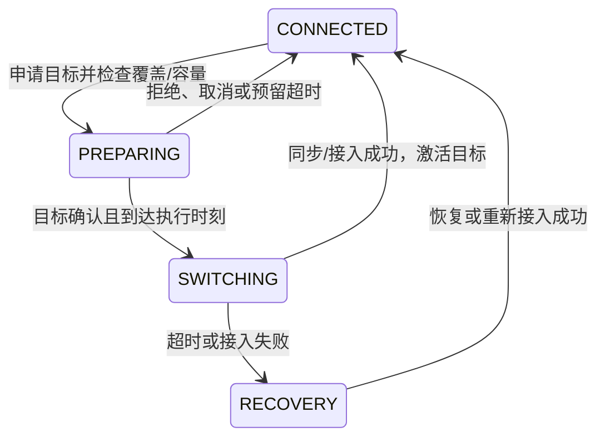

# WorldNTN：部分可观测干扰下的多用户、多卫星联合接收波束与资源迁移规划

> **研究主线：** 在部分可观测干扰下，联合规划地面终端接收波束、卫星关联与资源迁移，权衡局部抗干扰、切换损失和其他用户的服务代价。
>
> **版本说明：** 本文替换原来的单终端、固定服务卫星、主动探测主线。新版面向横跨美国的多个地面终端和多颗 LEO 卫星，保留单 RF 链相位控制与有限观测，将多用户资源竞争、关联切换和可执行迁移时序纳入核心。主动探测作为可选扩展，不再是必须成立的主贡献。
>
> **状态：** 具体研究方案，尚不声称已有实现或实验结果。参数均为建议起点；创新性和性能必须通过近邻对照与实验验证。不以截稿日期限制研究深度。文献核查日期：2026-09-30。
>
> 英文讨论稿：[WorldNTN Research Brief](WorldNTN_ICC_research_brief_EN.md)。

## 1. 研究问题与工作题目

中文工作题目：**部分可观测干扰下 LEO 网络的联合接收波束、卫星关联与资源迁移预测规划**。

英文工作题目：**WorldNTN: Predictive Joint Receive Beamforming, Satellite Association, and Resource Reallocation under Partially Observed Interference**。

核心问题：

> 当某个终端受到干扰，或某颗卫星即将对另一个地区更有价值时，系统应让当前用户调整接收方向图、减少或改变资源，还是切换卫星？如果切换会挤占其他用户的资源，怎样安排整个用户集合在未来一段时间内的服务和迁移，才能提高有效交付并保护弱势用户？

决策对象是**一段时间内多个用户的联合策略**。每次预测未来覆盖、干扰与需求，规划关联、调度和接收波束，实际只执行当前可生效部分；新观测到达后重新规划。

这里的“动态规划”是一般意义的动态决策。初始算法采用滚动时域的 belief-space MPC 与有限搜索，不预先声称能用精确 Bellman 动态规划求解全国规模最优策略。

## 2. 两个必须由模型自然产生的机制

### 2.1 提前释放资源与连接稳定性的权衡

用户 A 当前连接 S1，继续保持连接可减少切换；但未来 B 对 S1 的服务机会更好，而且 B 的替代卫星很差。若 A 可转到 S2，提前迁移 A 可能改善全网服务。

必须比较：A 的中断和链路变化、B 的收益、S2 上原有用户的损失，以及更远期再次迁移的成本。不能只比较 A 的即时 SINR，也不能只按最长可见时间选择卫星。

### 2.2 干扰引起的关联与资源连锁调整

以下是说明性实例，须先验证覆盖与容量可行：

| 用户 | 当前状态              | 联合候选动作                           |
| ---- | --------------------- | -------------------------------------- |
| A    | 连接 S1，受到干扰     | 留在 S1 调相位，或转到 S2              |
| B    | 连接 S2，资源接近满配 | 留下分享资源，或迁移到 S3              |
| C    | 连接 S3               | 保持资源、接受减配，或使用其他可见卫星 |

A 的迁移不必强迫 B 迁移。只有服务要求、带宽、波束或接入容量产生约束时，连锁调整才可能更优。资源充足时，系统应允许直接接入而不制造额外切换。

全国用户不是任意两两竞争：竞争边来自共同可用的资源池、实际同频干扰和迁移依赖。美国不同地区可以通过重叠覆盖形成连续竞争关系，也可能属于相互独立的区域。自然几何下必须统计其发生频率。

## 3. 系统边界：先确定一个可实现的主问题

| 项目       | 主方案与边界                                                                             |
| ---------- | ---------------------------------------------------------------------------------------- |
| 地面实体   | 分布在美国本土不同地区的固定独立终端；每个实体有自己的位置、阵列、业务与观测             |
| 受控网络   | 同一运营方协调的多颗 LEO 卫星；所有候选关联受可见性、波束覆盖和准入限制                  |
| 关联       | 单终端同时至多一条活动数据连接；一颗卫星可以服务多个用户                                 |
| 终端硬件   | 单 RF 链、恒模且量化的相移器阵列；不免费获得所有阵元 I/Q                                 |
| 控制位置   | 地面网络控制器汇总延迟报告、做联合规划；终端执行接收波束，卫星调度器执行资源与准入命令   |
| 主要动作   | 卫星关联/迁移开始时间、目标预留、通信资源分配、终端接收波束模式                          |
| 卫星发射端 | 主版使用公开的几何跟踪方向图和固定每资源块功率规则；不同时学习全自由度发射预编码         |
| 干扰       | 本系统其他下行传输形成的受控同频干扰，以及未知外部干扰；二者必须分开                     |
| 业务       | 主版采用有时间相关性的外生速率需求；先评价需求满足与交付，不必加入队列；队列扩展单独定义 |
| 路由与供给 | 假设数据已在服务接入层可用，馈电/回传足够且切换上下文代价显式建模；不优化星间路由        |
| 主观测     | 当前通信导频、合法邻星测量、负载与协议报告，均带时间戳；额外主动扫描作为扩展             |

主版采用一个明确的星内正交时频资源模型，并允许星间同频复用。这是便于隔离机制的设计边界，不代表所有商用多波束系统。星内空间复用、发射功率优化、分布式控制与星间路由作为后续扩展。

若以“地区用户群”代替终端，不能给整片地区凭空配置一副共用阵列。必须保留组内真实终端和位置，或把聚合实体明确解释为一个固定接入终端及其业务。主实验采用独立终端，地区只作地理分组。

## 4. 接收相位控制具体指什么？

用户 $u$ 的接收输出为：

$$
y_u=\mathbf w_u^H\mathbf x_u,
\qquad [\mathbf w_u]_m=\frac1{\sqrt M}e^{j\phi_{u,m}},
\qquad \phi_{u,m}\in\left\{\frac{2\pi n}{2^b}:n=0,\ldots,2^b-1\right\}.
$$

改变阵元之间的相对相位，改变接收方向图；所有阵元一起增加相同相位不会改变方向图。

- **Beam steering：** 根据所选卫星方向，对准并跟踪期望信号。
- **Interference-aware receive beamforming：** 在相位约束下权衡服务方向增益和干扰方向抑制，条件允许时形成零陷。
- **Satellite association：** 改变服务卫星，涉及准入、资源和切换；同时需要更新接收方向图。

如果只有几何 steering，相位通常可直接计算，研究中的独立动作主要是卫星选择。如果要比较“本地调相位”与“跨星迁移”，就必须提供真实可执行的干扰抑制波束。

主版为每个用户—候选卫星对生成约 8–16 个接收波束模式：量化匹配波束、不同抑制强度的候选波束、少量多方向折中波束。候选由公开几何和合法观测生成，不能使用未测得的真实干扰功率。量化后重新计算方向图，接受零陷变浅和期望增益损失。

**限制：** 单 RF 模拟阵列不是任意复数权重的全数字 MVDR；近共线、阵列校准误差和量化可能使抑制失败。切换到另一颗卫星也不保证摆脱同一个地面宽带干扰源。

## 5. 时间、状态和决策变量

网络控制周期为 $\Delta_N$，每个周期包含若干资源调度/协议子时隙 $\ell$，长度 $\delta_\ell$。阵列几何跟踪可以更快执行，间隔为 $\Delta_B\le\Delta_N$。

初始版本在每个网络周期联合选择关联、资源和接收抑制模式，周期内根据已知几何插值跟踪。更快的终端局部模式重选是单独扩展；其反馈规则必须在规划中一致，不能让执行器获得规划器没有计入的额外能力。

定义：

| 变量                  | 含义                                                         |
| --------------------- | ------------------------------------------------------------ |
| $V_{u,s}(\ell)$     | 用户—卫星的几何/指向可服务指示，不包含未来隐藏干扰真值      |
| $x_{u,s}(\ell)$     | 实际已经接通、可用于数据调度的连接，不是尚未完成的目标关联   |
| $\rho_{u,s}(\ell)$  | 目标卫星为用户保留的服务上下文/波束配置容量，尚未激活        |
| $a_{u,s,q}(\ell)$   | 卫星$s$ 的资源块 $q$ 在该子时隙是否给用户 $u$ 发送数据 |
| $r_{u,s,q}(\ell)$   | 未激活连接预留的资源块，激活后转为实际分配，不能重复计算     |
| $\mathbf w_u(\ell)$ | 用户当前接收相位向量，单 RF 链在同一时刻只使用一个方向图     |
| $d_{u,t}$           | 外生业务需求，单位 bit/s；主控制器仅获得已报告值及预测       |
| $\chi_{u,t}$        | 当前服务星、目标星、协议阶段、计时器、失败/重试状态          |
| $h_{u,t}$           | 周期内完成的星间切换次数；尝试、失败与强制脱网另行统计       |

总状态拆分为外生隐状态 $\xi_t$、可预测几何 $c_t$ 和受动作影响的网络/协议状态 $\chi_t$。控制器维护它们在已到达信息条件下的 belief，不把延迟负载报告视为即时全知状态。

## 6. 资源约束：让出的是资源，不是整颗卫星

### 6.1 关联与服务容量

$$
\sum_s x_{u,s}(\ell)\le1,\qquad x_{u,s}(\ell)\le V_{u,s}(\ell).
$$

主版每个活动终端会话占用一个可维持的服务波束/上下文槽，容量为 $C_s$。目标预留也占容量：

$$
\sum_u\big(x_{u,s}(\ell)+\rho_{u,s}(\ell)\big)\le C_s.
$$

同一用户在同一卫星上的激活与预留互斥；每个用户最多一个待切换目标。旧连接与目标预留可以暂时存在于不同卫星，但终端没有同时接收两条数据流。

$C_s$ 必须对应所选载荷与准入模型，不能用任意小容量人为制造连锁切换。主版把会话保留与服务波束槽绑定；允许大量空闲上下文、波束按时隙共享的模型应作为放松对照，分离带宽竞争与上下文限制的作用。

### 6.2 时频资源与功率

设每星有 $Q$ 个固定带宽 $B_{\mathrm{RB}}$ 的资源块。初始模型同一卫星同一资源块同一子时隙最多服务一个用户：

$$
\sum_u\big(a_{u,s,q}(\ell)+r_{u,s,q}(\ell)\big)\le1,
\quad a_{u,s,q}(\ell)\le x_{u,s}(\ell),
\quad r_{u,s,q}(\ell)\le\rho_{u,s}(\ell).
$$

$a,r$ 为二元变量，预算可按子时隙累积形成连续资源份额。预留只在声明的起止时间占用账本，预留本身不发射信号。实际调度还要求终端处于数据可接收时段；探测、同步和接收相位切换期间禁止对应数据分配。

卫星对每个发射资源块使用固定或公开规则决定的 $P_{s,q}$，满足逐子时隙总发射功率预算。主版可取固定 $P_{s,q}=P_s^{\max}/Q$，空闲资源块静默；暂不引入独立连续功率优化。波束成形后的发射方向增益仍须计入其他用户的干扰。

若增加星内频率复用，必须改为逐波束资源池、空间复用约束和相应星内干扰；不能保留上述单池预算，却声称模拟了完整多波束复用。

## 7. 链路与干扰：资源动作会改变网络内干扰

### 7.1 候选链路的 SINR

在用户 $u$ 由卫星 $s$ 使用资源块 $q$ 服务时：

$$
\Gamma_{u,s,q}(\ell)=
\frac{S_{u,s,q}(\ell)|\mathbf w_u^H\mathbf a_{u,s}(\ell)|^2}
{\mathbf w_u^H\left[\mathbf R^{\mathrm{ext}}_{u,q}(\ell)+\mathbf R^{\mathrm{net}}_{u,q}(\ell)+\sigma_q^2\mathbf I\right]\mathbf w_u}.
$$

$S$ 为单阵元基准的期望信号功率，含发射方向图、传播和慢变残差；阵列流形元素模长为 1。噪声以每资源块带宽计算，避免总带宽噪声被重复计入。

网络内干扰为：

$$
\mathbf R^{\mathrm{net}}_{u,q}(\ell)=
\sum_{s'\ne s}\sum_v
 a_{v,s',q}(\ell)P_{s',q}\,\beta_{u,s'\to v,q}(\ell)
\mathbf a_{u,s'}(\ell)\mathbf a_{u,s'}^H(\ell).
$$

$\beta_{u,s'\to v,q}$ 包含卫星 $s'$ 朝用户 $v$ 发射时，在受扰用户 $u$ 处的方向增益和传播增益。本系统关联与调度改变发射对象和资源占用，因此改变此项；不能把它预生成成与动作无关的干扰轨迹。

主版假定不同传输非相干，使用窄带/逐子带协方差；宽带斜视、相干干扰和块内变化通过失配或扩展模型验证。

### 7.2 外部干扰及其空间相关性

可采用公共外部源状态映射到多个地面位置：

$$
\mathbf R^{\mathrm{ext}}_{u,q}(t)=
\sum_j p_{u,j,q}(t)\mathbf a(\Omega_{u,j,t})\mathbf a^H(\Omega_{u,j,t})
+\mathbf R^{\mathrm{diff}}_{u,q}(t).
$$

有效功率由源活动、发射指向、距离、频带和接收位置产生，不能为每个候选服务星独立抽取一个“干扰值”。同一终端切换卫星后，外部物理场不会自动消失；变化来自接收方向图、使用频率和期望信号。

场景至少包括非协同卫星同频下行、局部地面干扰、短时突发与持续干扰。地面干扰只按真实可达范围影响终端，不无条件覆盖全国。

恶意和无意干扰可以在相同物理框架下表示功率与活动，但不从接收功率推断攻击意图。第一版不要求干扰方响应本方动作；会跟踪切换的自适应干扰方需增加动作依赖的对手状态和训练数据，单独作为扩展/压力测试。

## 8. 观测接口与信息时序

单 RF 链终端通过当前波束获得导频信道估计、残差干扰功率、解码反馈及时间戳；候选卫星信息来自已公开的同步/导频资源和明确排程的测量间隙。不能免费获得每颗候选卫星的实时完整 CSI。

短导频块采用：

$$
\mathbf z=c\mathbf s+\boldsymbol\epsilon,\quad
\hat c=\mathbf s^H\mathbf z/L,\quad
y=\|\mathbf z-\hat c\mathbf s\|^2/(L-1).
$$

在块内恒定、独立复高斯残差条件下：

$$
y\mid\xi,\mathbf w,\text{schedule}\sim
\operatorname{Gamma}(L-1,\nu/(L-1)),
$$

$\nu$ 是该波束与该频率上的总残差干扰加噪声功率（Gamma 第二参数为尺度），包含当时实际生效的网络内调度。$|\hat c|^2$ 同样有估计噪声；观测不能直接当真实信道功率。

初始版所有算法使用同一邻星测量规则和预算，区分测量间隙与正常导频。额外主动探测作为 E10 扩展：观测价值由是否改变联合关联/资源决策决定，并将用户测量损失和网络报告成本计入。

控制器可用：已有星历、配置与校准、已收到的终端报告、命令日志、已经确认的资源占用、已报告需求。不可用：未测候选链路的真实干扰、未来活动、未来需求、仿真真实姿态、尚未返回的测量与确认。

定义四个时刻：采样、报告到达、计算完成、命令生效。包括上报、控制器计算、下发、卫星/终端执行延迟。决策在生效前继续使用既有合法策略。远程控制不是零时延本地控制，也不统一机械加一个 RTT 常数。

延迟报告更新采样时刻的状态，再传播至当前时刻；模型预测应覆盖从当前信息年龄到真正执行时刻的区间。协议失联时使用预先声明的本地保底规则，不能调用全局即时真值。

## 9. 切换必须有执行过程，不能只比较相邻关联矩阵

主版采用单 RF 链的 **break-before-make 数据切换**，同时允许在网络侧提前准备目标资源。准备不等于双连接接收。



时序规则：

1. PREPARING 阶段可继续接收旧星数据，但邻星测量间隙仍扣除；目标只按获准时段预留。
2. SWITCHING 阶段旧数据连接已释放，终端重定向、同步、接入，不能同时从两星收数据。
3. 目标激活将预留转为活动分配；失败按超时规则释放预留，失败成本仍进入统计。
4. 同一用户不能叠加互相冲突的迁移命令。覆盖消失引起的强制脱网和主动切换分别标记。
5. 波束调整只产生相应硬件稳定时间，不自动收取完整星间切换代价。

**满载交换的关键边界：** A→S2、B→S1 在最终状态可能可行，但若两星当前全满，先预留两份额外容量可能不可能。可选择等待第三处容量、显式先释放部分旧连接并承担中断，或采用另行定义的协调释放流程；不能假设一次原子交换免费完成。规划必须逐子时隙检查预留与实际占用。

控制器规划目标关联和命令，实际 $x,\rho,a$ 由状态机与执行器产生，不能把尚未接通的目标直接当作可用链路。卫星维护权威资源账本，最终准入/预留采用带版本的确认；控制器不能因确认尚未到达就提前释放已承诺资源。陈旧命令导致的拒绝、重试和服务损失全部入账，所有基线共用这一执行器。

主版优先使用可验证的目标确认流程，不在算法中隐含无条件抢占权。公共最低驻留时间、迟滞和切换启动速率限制作为可调系统参数；涉及紧急脱网的例外规则对所有算法一致。

资源迁移指会话服务资源重新分配，不是默认移动卫星本体，也不必包含任务计算迁移。若切换涉及缓存/上下文传输，其时间与流量需显式参数化；主版不借此声称解决星间路由。

## 10. 目标：全网交付、用户保障与切换成本

### 10.1 从可执行调度计算交付

在公共因果 MCS 规则下，用户一周期的链路可交付量为：

$$
\widetilde D_{u,t}=
\sum_{\ell\in t}\sum_{s,q}
B_{\mathrm{RB}}\delta_\ell a_{u,s,q}(\ell)
\,r_{\mu_{u,q,\ell}}
\left[1-\operatorname{BLER}_{\mu_{u,q,\ell}}(\Gamma_{u,s,q}(\ell))\right].
$$

只有数据可接收的子时隙允许 $a=1$，因此导频、切换、等待与测量不再额外乘一次损失系数。主版将需求视为当周期提供的可交付业务，$D_{u,t}=\min(\widetilde D_{u,t},d_{u,t}\Delta_N)$，未交付部分记需求缺口；不默认跨周期排队。

上述 BLER 映射给出条件期望交付；独立包级/波形验证报告实际成功比特。MCS 只能使用当时可用信息，不能看到真实 SINR 后选择最优编码。重传消耗显式扣除，成功比特只计一次。

### 10.2 公平目标与服务约束

定义与需求无关、测试前固定的归一化速率尺度 $R_{\mathrm{ref}}>0$：

$$
g_{u,t}=D_{u,t}/(R_{\mathrm{ref}}\Delta_N),\qquad
\bar g_u=T^{-1}\sum_tg_{u,t}.
$$

一个主目标为：

$$
\max_\pi\;\mathbb E\left[\sum_u\omega_u\log(\varepsilon_0+\bar g_u)
-\lambda_{\mathrm{sig}}\frac1T\sum_{u,t}c^{\mathrm{sig}}_{u,t}\right].
$$

其中权重 $\omega_u$、$\varepsilon_0>0$ 固定公开；切换中断已经降低 $D$，$c^{\mathrm{sig}}$ 只计尚未体现的信令或其他明确成本，不能重复扣除相同丢失比特。对数长期服务效用鼓励公平，同时报告原始总交付量，避免只看效用。

对 $d_{u,t}>0$ 的用户定义服务不足：

$$
v_{u,t}=\mathbf1\{D_{u,t}<\kappa_ud_{u,t}\Delta_N\},\qquad
\frac{\mathbb E\sum_tv_{u,t}}{\mathbb E\sum_t\mathbf1\{d_{u,t}>0\}}\le\epsilon_u.
$$

无需求周期置 $v=0$；分母为该用户预定窗口中的业务活跃周期，不删掉因干扰、切换或拥塞而无法服务的周期。可另设每用户窗口切换数上限、最长连续中断要求和最低平均服务；先区分平均约束与确实可执行的硬预算。

滚动规划保留每用户已交付累计量或预先定义的平滑服务状态，计算候选未来交付对同一公平目标的边际贡献，不能把长期对数效用无说明地替换成逐时隙对数速率。比较不同预测窗口和公共终端价值近似，检查窗口末端是否人为推迟必要切换或透支服务保障。

系统应报告约束不可行区间。在强干扰、覆盖或容量不足时，最优策略也可能无法满足所有用户。以理想信息/放松模型给出乐观可行性参考，不通过放大惩罚系数暗示已获得保证。

### 10.3 队列扩展

若业务必须持续积压而非当周期截止，引入明确的到达与队列：

$$
Q_{u,t+1}=[Q_{u,t}+A_{u,t}-D_{u,t}]^+,
\qquad D_{u,t}\le Q_{u,t}+A_{u,t}.
$$

到达时点、队列迁移位置、截止期和丢包需另行定义，此时服务保障用队列时延/按期交付评价，不能与主版的当周期需求满足率混为同一指标。队列状态由动作影响，更新公式应显式计算。

## 11. 科学问题与拟争取的贡献

### 11.1 贡献一：局部波束恢复与全网迁移代价之间的决策边界

研究干扰持续时间、角度可分离性、资源紧张程度、替代卫星和切换时延如何共同决定：留星调整相位、留星重分资源、主动迁移、或等待。

对联合候选计划 $P$ 与保持方案 $P_0$，在相同预测外生场景中分解其效用差：

$$
\Delta J(P,P_0)=\Delta J_{\mathrm{affected\ user}}
+\sum_{v\ne u}\Delta J_v
-\Delta C_{\mathrm{unaccounted\ overhead}}.
$$

各用户效用项由已经扣除中断的交付计算；该分解用于解释谁获益、谁受损，不能又将“其他用户损失”作为完整全网目标之外的重复惩罚。

产物：一个能预测迁移是否值得、其他用户代价来自哪里、收益何时超过切换代价的可解释机制，而不是只有平均 reward 曲线。

### 11.2 贡献二：对迁移依赖显式建模的可执行预测规划

在随时间变化的用户—卫星可服务图上，增加资源竞争边、干扰边和预留/释放依赖。规划器不仅选目标关联，还选可执行的迁移开始时间和短期资源安排。

初始搜索使用保持、减配、单用户迁移、相互交换、有限长度迁移链等候选操作；对每个候选模拟整个受影响邻域的资源与协议状态。链不是强制迁移模板，必须保留“接纳新用户但原用户不迁移”和“局部波束抑制即可”的动作。

有限深度/候选邻域会产生搜索近似；不能称全局最优。与相同模型、相同搜索预算的一般 MPC 比较，检验图结构和迁移依赖是否真正提高每单位计算的决策质量。

### 11.3 贡献三：概率预测是否改善部分观测下的联合控制

未知外部干扰持续性和需求预测可能改变未来资源机会成本。检验结构化世界模型相对正确配置的 HMM/HSMM/AR 与同样 planner 是否有优势。

如果经典模型已经足够，则保留联合规划贡献、收缩学习主张。GNN、GRU、MPC 的组合不自动构成创新；“多用户、多卫星”和“使用世界模型”也不能单独作为首创点。

## 12. 结构化世界模型：学未知，显式更新已知

### 12.1 状态转移分工

$$
\xi_{t+1}\sim p_\theta(\xi_{t+1}\mid\xi_{\le t},c_{\le t+1}),\qquad
\chi_{t+1}=F_{\mathrm{protocol/resource}}(\chi_t,A_t,\xi_{t:t+1}),
$$

$$
Y_t\sim p_{\mathrm{obs}}(Y_t\mid\xi_t,\chi_t,A_t,c_t).
$$

外生状态包含外部源活动、功率残差、链路残差和业务到达/需求。受控状态包含关联、资源占用、预留、切换计时器、历史服务与可选队列。观测依赖接收波束、调度、测量间隙和报告延迟。

| 解析/协议模块                      | 学习/估计模块                   |
| ---------------------------------- | ------------------------------- |
| 轨道、可见性、阵列响应、几何方向图 | 外部干扰活动和有效功率分布      |
| 资源守恒、预约释放、切换状态机     | 外生业务需求及空间时间相关性    |
| 网络内调度对干扰的作用             | 未知传播/设备残差               |
| SINR、BLER 接口、业务交付          | 在稀疏延迟观测下的隐状态 belief |

如果命令丢失、切换成功率或处理时延是随机量，可从独立数据估计相应分布，但协议阶段及资源守恒仍显式执行。不能让网络直接输出不守恒的未来负载。

### 12.2 初始架构

采用共享的源/区域动态编码器与概率输出头，配合粒子或结构化近似 belief。节点包括终端、受控卫星和可建模外部源；边表达可服务、资源竞争和干扰关系。GNN 只在跨节点关联确实有用时加入，并比较同数据量的非图时序模型。

起点：GRU 隐维 64–128，活动分布与 2–3 分量 log-power 混合头，3–5 个独立训练模型，局部子图 128–256 个粒子。全国全状态粒子滤波可能退化，这些数字不能直接当全国规模保证；应共享公共干扰源因子并对局部状态条件化，验证跨用户相关性和扩展性。

不能为各用户独立采样同一外部源后声称建模了公共干扰。未知源方向/数量的失配用额外弥散或未登记源模型测试，不声称唯一恢复发射方意图。

### 12.3 训练目标

$$
\mathcal L=\mathcal L_{\mathrm{transition\ NLL}}
+\lambda_y\mathcal L_{\mathrm{observation\ NLL}}
+\lambda_d\mathcal L_{\mathrm{multi\!step\ delivery/projection}}.
$$

多步项使用 CRPS/energy score 等分布评分，覆盖候选波束投影、服务与迁移效用差；自由展开不喂真实未来。观测似然在同化当前测量之前计算，延迟测量作用于采样时刻。

可使用仿真真值预训练，但须将同等监督提供给学习基线，并给经典模型相同训练轨迹估计参数。加入只用可观测日志训练/微调的版本，报告特权监督差距。

决策标签若依赖当前不可见状态，应从当前 belief 和多条未来轨迹求条件期望，不能用单次未来的最优关联强迫模型学习先知决策。

### 12.4 让世界模型具有实质优势的重点建模

**研究定位进一步明确为：历史可推断、跨用户相关的隐环境动态，加上具有持续后果的联合动作。** 选择这些有物理/业务来源的特征，是为了检验模型的估计与预测能力；不能通过削弱对手信息、人为拉长时延或只保留有利测试场景来保证胜出。

世界模型和 MPC 不是互斥方法：本方案使用学习式世界模型辅助 MPC。应分别证明学习相对强经典/神经预测器的价值，以及想象展开相对直接策略或单步控制的价值。

| 重点特征 | 如何落入当前场景 | 可能发挥的能力 | 需要控制的边界 |
|---|---|---|---|
| 当前测量相近，但历史预示不同未来 | 相同当前残差干扰功率可能来自临近结束的短突发，或刚进入持续照射；历史、邻居报告和已有几何提供线索 | 从历史估计隐模式及剩余持续时间 | 完全相同的合法历史不能被强行赋予可确定区分的隐标签；必须输出混合概率 |
| 多用户相关、具有多种时间尺度的动态 | 公共干扰源影响可达地区；外部网络的真实业务/调度驱动占用；区域会话到达形成相关需求 | 学习跨用户联合预测及持续性，区别“某条链路可能差”与“多个替代链路同时变差” | 用真实覆盖/共同原因产生相关性，不凭空让全国终端共享同一个随机变量 |
| 动作影响后续服务与观测 | 预留、切换和释放改变其他用户资源；新关联/波束改变可获得的导频 | 对候选联合动作展开不同服务与反馈轨迹 | 资源守恒和已知协议显式计算；不能仅凭这些已知机制宣称神经模型更强 |
| 历史有用，但信息不完全 | 不同终端上报不同时间、方向和质量的测量 | belief 更新、跨报告融合和校准的风险估计 | 不能通过免费历史/邻居信息只增强本方法；延迟不能大到历史完全失效 |
| 环境样本有限，但同一模型需评价很多动作 | 在同一观测历史下比较保持、调波束、重分资源和迁移计划 | 重用动态模型评价多种候选，测试样本效率与适应能力 | 计入世界模型训练、特权标签、仿真查询和在线搜索总成本；便宜解析模型也须参与比较 |

优先选择的验证场景是：**干扰持续性与地区需求具有可从合法历史推断的隐模式，候选卫星存在真实但非全面饱和的资源竞争，切换准备和释放跨越多个决策步。** 对低负载、无相关性、已知简单动态和极强不可恢复干扰仍完整报告结果。

示例：两个历史的当前干扰读数相同。历史一表明短突发接近结束，且目标星即将承接其他用户；历史二表明持续照射刚开始，且目标星在后续窗口有余量。前者可能适合本地调整相位并等待，后者可能适合提前预留并迁移。是否成立由模拟到达/照射过程与信息质量决定，不把人工指定的“正确答案”喂给模型。HMM/HSMM 和 recurrent 策略也获得同一历史。

### 12.5 模型输出与优势证据必须对应

模型输出应是条件于已到达历史的**联合未来分布**，再通过解析模块形成动作相关的网络轨迹：

$$
\widehat p_\theta\!\left(\xi_{t:t+H}\mid\mathcal H_t,c_{t:t+H}\right)
\quad\xrightarrow[\text{协议/资源/阵列}]{\text{候选动作}}
\widehat p\!\left(\chi_{t+1:t+H},D_{t:t+H-1},Y^{\mathrm{available}}\mid\mathcal H_t,A_{t:t+H-1}\right).
$$

$\mathcal H_t$ 只含合法可用历史。不能把各用户各时刻独立采样的边际拼成轨迹：相同平均功率、不同持续性或空间相关性，可能产生完全不同的连续中断和资源迁移风险。

训练关注剩余干扰持续时间、联合服务不足、全网候选计划的效用差，而不是只优化单步 SINR MSE。用 proper scoring 和校准检验分布质量，再用同一 planner 测计划排序与闭环后悔值。动作比较标签必须对当前隐状态与未来随机性求条件期望。

网络中的长期影响不能无限展开。重点测量报告年龄、有效可预测时间、切换完成时间和规划窗口之间的关系：若反馈及执行总延迟已超过可预测时间，预测性迁移收益应减小；若模型误差随窗口扩大超过候选计划的收益差，应缩短展开或加强公共保底策略。窗口长度和回退门限在验证集确定，不按测试结果临时挑选。

方法依据：[PlaNet](https://arxiv.org/abs/1811.04551) 展示了学习潜在动态后进行多步规划的路线；[PETS](https://arxiv.org/abs/1805.12114) 使用概率集成与轨迹采样传播不确定性；[MBPO](https://arxiv.org/abs/1906.08253) 分析模型使用偏差并采用从真实数据出发的短展开。这些工作支持模型设计思路，不构成其在本 NTN 问题中必然优于基线的证据。

## 13. 联合规划器的可实现版本

### 13.1 多层时间尺度，但联合评价

外层选择关联、预留和迁移时序；内层为候选计划分配资源并选择接收波束模式。分层是计算方式，候选比较必须使用包含其他用户和干扰反馈的全网效用。

若先做关联再独立选波束，需迭代更新或联合枚举关键候选；不能只做一次解耦，却将性能归因于完整联合优化。内层包含干扰和离散模式时通常非凸，应报告启发式、迭代次数和可行性检查，不默认是凸问题。

```text
输入：已到达的终端/卫星报告、已有星历、命令日志、资源与协议 belief
1. 做延迟感知状态更新；预测覆盖和外生干扰/需求场景
2. 以保持当前可行策略为基准，定位受扰、紧张和即将失去覆盖的邻域
3. 生成保持、局部调波束、重分资源、迁移与有限迁移链候选
4. 逐子时隙模拟预留/释放、切换成功/失败及实际命令生效
5. 在每个候选场景中计算资源、网络内干扰和各用户可交付量
6. 比较全网公平效用、每用户服务与迁移代价；保留可执行方案
7. 下发当前部分动作，未来动作仅作条件计划
8. 新报告到达后重新规划；超时使用预先声明的可行保底策略
```

规划使用情景 MPC，未来动作不能按仿真隐藏状态分支。初始版尾部采用共同开环计划，在实际反馈到达时重新规划；它不完整计算信息价值。若加入未来观测分支，只能在报告实际到达时按可见观测更新 belief，未被观测区分的场景必须共享动作。

### 13.2 处理计算规模

建立时间展开的可服务图与局部冲突子图；按共享资源、受控干扰和迁移依赖扩展邻域。边界外用户的保留资源与干扰要作为显式边界条件，不能忽略他们的服务损失。

候选链长度、根动作数、情景数、搜索宽度与窗口长度必须公开。同预算下一般 MPC 和经典模型 MPC 应获得相同候选空间和已知几何，不能通过弱化对手制造收益。

小实例使用有限码本下的穷举/混合整数优化参考。只有求解到已证明最优或带可验证上下界的间隙，才能称有限离散问题的最优参考。知道整条未来的解是非因果参考，不是可部署策略；近似 oracle 也不自动是上界。

### 13.3 可选的收益区间与候选剪枝

可将预测外部功率、服务增益和需求的同时覆盖集合传播为**完整可执行计划**的效用区间。若 $J_P^+<\max_{P'}J_{P'}^-$，则在该集合与候选族内剪枝。

需要同时计入网络内干扰、资源变化、协议阶段和其他用户效用；原单终端的固定波束排序条件不能原样当作全网证书。若范围太宽、同频耦合不能给可靠区间，则先关闭此模块，以完整候选评价为基准。

该分析属于可选的计算加速贡献，须报告同时覆盖、误剪率、节省与同预算收益，不承诺无条件安全。

## 14. 数据生成、划分与建议参数

### 14.1 按物理和协议生成，分离外生与受控部分

1. 传播 Walker 星座与固定版本公开星历，生成美国本土地面位置、可见性、发射覆盖与几何；保存 epoch、传播器、配置和 hash。
2. 生成用户外生需求、服务残差与外部干扰过程。负载紧张应由业务和容量产生，不直接手填一个偏爱所提方法的饱和状态。
3. 按实际动作生成本系统资源占用和网络内干扰，按接收波束采样导频/反馈，执行真实命令和切换时序。
4. 使用保持/迟滞、经典负载均衡、随机合法动作、干扰感知规则与联合策略混合收集日志。
5. 隐藏真值与控制器输入物理分离。分支回放共享外生轨迹，但必须重新计算资源、受控干扰、观测和数据损失。
6. 随机流按场景、时间、实体和过程类型索引；仅设置相同 seed 不保证不同动作使用同一外生过程。

划分先按地理区域/地点组、轨道 pass、日期块、需求模式和外部干扰布局分组，再切窗口。同一场景的策略日志与反事实分支归同一集合。另设 ID、几何 OOD、业务/干扰机制 OOD、时延/硬件 OOD；零样本、适应和重训分别报告。

### 14.2 建议起点

下列为研究配置，不是商用系统或标准强制参数。

| 参数            | 起点与扫描                                                                             |
| --------------- | -------------------------------------------------------------------------------------- |
| 地域            | 美国本土分散终端；先小型重叠覆盖机制例，再全国真实几何                                 |
| 用户规模        | 6–12 用户机制例；全国主版约 60 个终端，20/100/200 扫描                                |
| 受控卫星数      | 由星座与终端可见集合的并集决定；报告总数、每用户候选数和负载，不强行固定一个不真实数字 |
| 轨道/仰角       | 约 600 km / 25° 起点；另测 500–1,200 km 与不同门限                                   |
| 载频/总资源带宽 | 20 GHz / 20 MHz；按资源块计算噪声和功率                                                |
| 星内资源        | 20 个等宽资源块；服务槽$C_s=8$ 起点，4/16 与宽松上下文模型对照                       |
| 阵列            | 主版$16\times16$、半波长间距、1 RF、4-bit；$8\times8$、$32\times32$、2/4 RF 对照 |
| 接收候选        | 每用户—候选星约 8–16 个模式，实际可生成数与方向图公开                                |
| 控制时钟        | $\Delta_N=1$ s 起点，0.2/2/5 s 对照；$\Delta_B=0.1$ s 几何跟踪起点                 |
| 预测窗口        | $H=1/5/10/20/60$ 个网络周期，同时报告秒数                                            |
| episode         | 主版约 600 s，另测完整可见 pass；比较不同窗口与终端成本                                |
| 延迟与切换      | 由通信/协议/处理分解生成；零成本仅作对照，扫描实际占控制周期的比例                     |
| 干扰/业务       | 扫描无害、可抑制、不可恢复，以及低/中/高负载；相关时间与预测窗口分别扫描               |
| 模型/规划规模   | 局部 128–256 粒子，16/32/64 情景；链长 0/1/2/3 与搜索宽度扫描                         |

链路预算必须从发射 EIRP、路径损耗、阵元增益、阵列归一化和资源块噪声逐项核查。不同阵列规模不重复叠加阵列增益。可见并不等于已具备足够业务速率。

数据量起点：200–500 个诊断 episode；约 8,000 个训练、1,000 个验证、1,000 个独立校准、至少 2,000 个 ID 测试；每类 OOD 先 500 个，再按置信区间精度扩充。600 s/1 s 时约 480 万个**网络时间步**，不是独立样本数，也不是仅 480 万个用户观测。若成本过高，先按样本效率曲线缩放。

记录当前/候选卫星、波束参数、每块资源、预留与协议阶段、命令版本、所有时间戳、业务需求、成功交付和干扰源真值的隔离标签，不能只保存 SINR/action/reward。

### 14.3 优先生成能检验学习价值的数据，而非仅增加随机性

保留简单静态/AR/HMM/HSMM 诊断集并给匹配经典模型正确或可估的参数。重点训练集由独立的外部会话/业务队列、发射波束排程与共享源物理过程生成，产生持续性、相关性和模式变化；生成器不直接使用待训练的神经网络作为“老师”。业务队列可以存在于外部流量生成器，不意味着主控网络的第 10 节服务模型已改为排队模型。

从固定随机场景中标注“当前观测近似相同、历史和后续决策分布不同”的样本，用作机制诊断；不能只用这些挑选样本报告主结果。加入合法历史长度、上报丢失率、空间相关强度和活动相关时间的扫描，并在独立生成器中测试。

所有方法共享情景、观测、预测上下文与监督预算。建立 10%/25%/50%/100% 数据学习曲线；另外区分仅更换效用权重/预算的模型复用与真实环境变化后的微调。报告全部环境查询和新增标签成本，测试集不得用于校准或选难度。

## 15. 基线和公平比较

| 编号 | 基线                                                     | 要回答的问题                                            |
| ---- | -------------------------------------------------------- | ------------------------------------------------------- |
| B0   | 最长可见时间/最大合法测得信号 + 公共迟滞 + 标准资源分配  | 必要参考，不能作为唯一胜利对象                          |
| B1   | 逐用户预测切换 + 相同接收波束 + 容量准入                 | 不联合考虑其他用户的代价会损失多少                      |
| B2   | 每周期全局匹配/资源优化，$H=1$，包含当前切换与预留状态 | 收益是否来自多步而非仅全局协调                          |
| B3   | 轨道感知负载均衡与切换成本的确定性多步 MPC               | 同样预测几何的强优化对手                                |
| B4   | HMM/HSMM/AR 概率外部干扰/需求 + 同一联合 planner         | 学习动态是否必要；匹配诊断集给正确或一致估计参数        |
| B5   | 所提模型 + 通用情景 MPC/匹配搜索                         | 图邻域、迁移依赖与候选设计相对一般规划的收益            |
| B6   | MAPPO/TarMAC 或 recurrent 多用户策略 + 相同准入执行器    | 与学习式关联/切换方法比较；同观测、硬件、监督与训练预算 |
| B7   | 固定关联只调波束；几何 steering 只做关联；完整联合控制   | 物理层和网络层联合的必要性                              |

所有方法获得相同的星历、资源模型、测量规则、报告时延、发射策略、相位码本和公共 MCS。B1 的准入协调只能保证可行，不能偷偷替它做主方法的全网优化。B6 若复现接口不同，标为适配基线，公开差异。

**世界模型收益的新增强对照：** 在 B4/B5 下加入能利用同一历史、几何和跨用户信息的 GRU/Transformer 联合概率预测器（含校准）+ 完全相同 MPC，并使用足够表达持续时间/公共隐因子的 HSMM 等经典模型。若该预测器与所提混合世界模型在输出分布和解析后果接口上相同，两者属于等价模型类，不能仅换名称宣称胜出。还应与相同历史输入的 recurrent MAPPO 比较，而非只比较无记忆策略。
分别比较同信息和同实际计算预算，以及达到相同服务水平所需成本。特权参考包括：相同观测下已知真实动态、当前全状态但未知未来、整条未来已知的有限问题最优解、额外 RF 硬件。它们不是同条件基线，也不能相互混称“oracle 上界”。

## 16. 实验矩阵与必要负对照

| 编号 | 科学问题                     | 核心实验与输出                                                                      |
| ---- | ---------------------------- | ----------------------------------------------------------------------------------- |
| E0   | 这个网络问题真实存在吗？     | 自然轨道覆盖重叠、共享容量、业务负载、干扰强度、合法方向图和可改善空间；先不训练    |
| E1   | 全网效果如何？               | 总交付—用户低服务—切换/中断 Pareto；按负载与干扰扫描                              |
| E2   | 提前释放资源何时值得？       | A 保持或提前迁移，对 B 和 S2 原用户的后续影响；扫描机会窗口与切换成本               |
| E3   | 局部相位能否避免迁移？       | 波束单独、关联单独、联合控制；扫描角度分离、量化和干扰持续时间                      |
| E4   | 连锁迁移是否有必要且可执行？ | 容量紧张与宽松、目标预留、满载交换、失败回退；链长、受影响人数和逐用户收益/损失     |
| E5   | 是否真的需要多步？           | $H=1$ 与多步；同模型同预算；冻结几何、需求不可预测、短/长干扰对照                 |
| E6   | 模型和规划各贡献多少？       | 经典/学习动态 × 独立/联合规划的 2×2；两类模型共用执行器、信息与预算               |
| E7   | 预测服务于决策吗？           | 多步 NLL/CRPS、校准、关联/波束排序、计划 regret 与网络内干扰误差                    |
| E8   | 对谁更好、谁被牺牲？         | 用户/地区 5% 分位服务、需求满足、最长中断、重复迁移负担；改变公平权重               |
| E9   | 是否可部署并可迁移？         | 用户/卫星规模、不同地区和壳层、命令/报告延迟、p50/p95/p99 计算时延、独立波形/半实物 |
| E10  | 主动观测是否还值得？         | 固定测量与任务相关探测，计入单 RF 间隙与网络报告成本；主算法成立后再加入            |

E2/E4 的配对机制例只作解释；主结论必须来自自然场景总体，并报告干扰事件和共享资源链的发生比例。连锁切换的计数由迁移依赖日志辅助描述，因果收益需要同外生轨迹的对照，不能把同一时段的所有切换都归因于某个用户。

必做负对照：无外部干扰、资源富余、独立随机干扰、全新鲜状态反馈、完全不可分离的干扰方向、近静态几何、极长延迟、零与高切换成本、未登记干扰源、错误星历与阵列、非高斯/相关导频。资源富余时不应凭空出现让路链；不可预测环境中模型不应虚假自信；强同方向干扰不能被假造为切星后必然恢复。

**补充 E11：优势出现的范围。** 绘制“可预测持续时间/执行延迟 × 资源负载”的收益图，分层比较历史长度、空间相关性与 horizon。报告自然分布结果和完整扫描，区分历史估计、联合分布、规划长度各自的贡献；在独立活动、全观测和匹配经典模型条件下允许优势消失。

**补充 E12：数据效率与模型复用。** 同样数据量下比较闭环服务，同样服务水平下比较环境交互、总训练耗时和在线计算。冻结动态模型后改变服务权重/资源预算时，各预测型方法都允许重新规划，策略基线给予声明的适应预算。不能把模型免费获得的新标签或额外计算隐藏起来。

## 17. 统计、真实性与实现验收

至少 5 个独立训练 seed，所有方法使用配对外生场景。按场景组进行 bootstrap，地区/用户和时间相关性不能被当作独立样本。分开报告训练 seed 与测试场景变化；稀有失效报告事件数、暴露量和置信区间。

在线指标包括每用户实际交付、服务缺口、最长连续中断、切换尝试/成功/失败、信令、预留浪费、切换频率、5% 分位服务、公平性和控制器开销。训练模型误差仅为机制指标，不替代闭环服务结果。

独立验证至少包含一条：不同实现的干扰/业务生成器、复数 OFDM 导频与数据链路、或可控信号源/相位合成的半实物实验。重点核查导频污染、CFO、相关样本、硬件切换稳定时间和动态范围。离线数字投影不是 RF 实测，真实 TLE 也不是在轨通信数据。

必须通过的实现检查：

- 单位、阵列归一化、量化相位与无干扰匹配增益正确。
- 一个单 RF 终端不会同时接收两颗卫星数据；目标预留不产生虚假吞吐或干扰。
- 每个子时隙资源/功率/服务槽守恒；预留转激活不重复占用。
- 未确认、未生效和未返回的信息不能提前使用；过期命令有明确处理。
- 切换中断、测量与相位切换开销不重复计；切换失败和不可行周期不删掉。
- 不同动作共享外生轨迹，但网络内干扰与负载必须重新计算。
- 数据划分无相邻窗口/反事实分支泄漏；真值接口部署时关闭。
- 控制器计算超时实际延迟执行，并使用同一声明的保底策略。

建议模块：`geometry`、`array/codebook`、`external_processes`、`resource_scheduler`、`handover_fsm`、`observations/timing`、`belief`、`world_model`、`planner`、`baselines`、`evaluation`。本文件仅定义研究接口，尚未创建这些代码。

## 18. 与近邻工作的关系及创新边界

下表依据本次可读取的一手摘要/页面及已读本地 PDF，不是完整系统综述，也不推断摘要未交代的假设。

| 工作                                                                                                                                                                                | 已有内容                                             | 本文必须落实的区别                                                                |
| ----------------------------------------------------------------------------------------------------------------------------------------------------------------------------------- | ---------------------------------------------------- | --------------------------------------------------------------------------------- |
| [Load Balanced Handover Planning for LEO Satellite Communication Networks, 2024](https://ieeexplore.ieee.org/document/10564237/)                                                     | 利用可预测轨道进行用户组负载均衡与切换次数规划       | 不能只贡献“多步关联”；需证明部分观测干扰下接收波束与可执行迁移的耦合            |
| [Handover strategy for LEO satellite communication using graph neural network, 2025](https://www.sciencedirect.com/science/article/pii/S2405959525000098)                            | GNN 选择候选星，卫星通过 ACK/准入控制处理负载        | 图表示与容量准入已有基础；需比较未来他人服务代价及资源迁移时序                    |
| [Multi-Agent Reinforcement Learning for Handover Management and Power Allocation in LEO Satellite Networks, 2026](https://ieeexplore.ieee.org/abstract/document/11667348/)           | 联合波束关联、功率及切换损失，使用 MAPPO/TarMAC 协调 | 多用户学习、切换惩罚和邻居消息均不足为新意；必须有同条件强基线                    |
| [Handover-Aware Power Minimization: Joint Cooperative Beamforming and Scheduling, 2026 preprint](https://arxiv.org/abs/2603.07434)                                                   | 将切换操作、有效传输窗口、协作波束和调度共同建模     | 明确本研究是单连接终端接收相位与部分观测干扰，不以“计入切换成本”为唯一贡献      |
| [Graph World Model for Energy-Efficient Hybrid Beamforming，本地 PDF](<literature%20review/Graph_World_Model_for_Energy-Efficient_Hybrid_Beamforming_in_LEO_Satellite_Networks.pdf>) | 固定慢时关联下，用图性能代理辅助数字发射预编码训练   | 本研究需有跨时隙资源/协议状态和非预知联合关联，不能把单步性能代理等同长期世界模型 |

新的候选空白是：**有限接收观测下，利用干扰与需求的概率预测，明确比较本地相位恢复和有执行成本的全网资源迁移，并使其他用户受到的服务损失进入同一个可执行规划。**

这仍是待验证定位。继续检索 interference-aware handover、receive beamforming with association、handover reservation scheduling、partially observable network control 与 cascading reassignment。相关机制和优化技术均有既有基础，不使用“首次”“保证抗干扰”“普适最优”等未经证明表述。

## 19. 按证据推进的阶段

| 阶段              | 产物                                                | 继续推进的条件                                   |
| ----------------- | --------------------------------------------------- | ------------------------------------------------ |
| A：物理与容量     | 美国轨道/用户图、合法接收码本、链路预算、资源池模型 | 有自然覆盖竞争，且相位/资源/关联存在实际改善空间 |
| B：可执行切换     | 状态机、延迟观测、预留账本、满载交换例              | 所有比较满足相同信息和逐子时隙约束               |
| C：机制与强基线   | 经典预测 MPC、单用户/全局短视对照、E2–E4           | 全网代价与多步规划带来可解释收益                 |
| D：概率学习       | 数据、校准、动态模型、2×2 分解                     | 学习对决策有独立价值，或据证据删减其主张         |
| E：规模与独立验证 | 全国/OOD、尾部服务、运行成本、波形或半实物          | 收益不依赖少数人工事件与不真实时延               |
| F：论文形成       | 问题/方法、近邻差异、关键图、复现材料               | 每项主张有公式、实验或来源                       |

首先交付：一个有接收方向图的三用户/三卫星可行例；一个带真实资源账本的切换执行器；一个经典动态的联合 MPC；一组自然美国覆盖与容量统计。先用这些决定机制是否值得扩大，再训练复杂世界模型。

若同信息同预算下联合规划只比弱贪心好，不能宣称机制优越；若强经典预测与学习同样好，减少学习贡献；若资源富余或几何不可改善，应承认适用边界。若全部收益来自人为拉长切换、免费未来 CSI、强制驱逐用户或删掉困难样本，必须修正模型后重做。

## 20. 与导师讨论时的中心表述

> 我们考虑美国多个地面终端共享多颗 LEO 卫星的下行资源。终端只能获得有限且延迟的接收观测，可以通过相位控制改变接收方向图，也可以切换服务卫星。一次切换可能帮助当前受扰用户，却消耗目标卫星的资源并影响其他用户，进一步引发迁移。我们希望用显式的轨道、阵列和切换协议模型，结合未知干扰与需求的概率预测，规划未来关联、资源和接收波束，只执行当前可行动作。研究重点是何时本地抗干扰足够、何时值得承担全网迁移代价，以及联合预测在同信息和计算预算下能否改善交付、公平与中断表现。

需要导师反馈的决策：运营方能获取哪些报告、控制延迟如何实现；资源池与载荷容量如何映射到现实系统；主贡献应聚焦局部波束—迁移边界还是可扩展联合规划；是否有独立波形/硬件证据支持干扰与切换接口。
