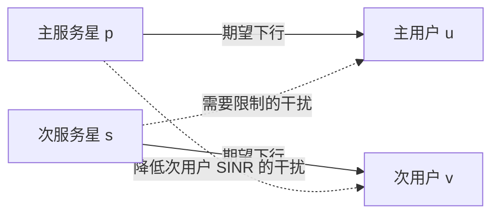

# 论文讲解与 World Model 评估：密集 LEO 星座的同频共存

> **论文做了什么？** 研究两个 LEO 卫星系统在相同频率同时下行时，次系统能否通过选择服务卫星，既保护主系统用户，又保持自身较好的链路质量。作者用星座、天线方向图和链路预算仿真，给出了这种共存的可行性证据。
>
> **可以用 world model 吗？** 可以，但原文的单时刻选择问题通常不需要学习型世界模型。更值得研究的是：在有限且延迟的观测下，预测未来干扰与资源状态，比较“保持连接、调整接收波束、重分资源、切换卫星”的多步后果。
>
> **对 WorldNTN 的判断：** 这篇文章适合作为同频干扰模型、保护约束与卫星选择基线的依据；它没有证明世界模型的必要性。应先验证带切换成本的预测规划确实有收益，再检验学习型模型是否优于同信息条件下的经典预测模型。

## 1. 论文信息与阅读边界

| 项目         | 内容                                                                                                                 |
| ------------ | -------------------------------------------------------------------------------------------------------------------- |
| 标题         | *Feasibility Analysis of In-Band Coexistence in Dense LEO Satellite Communication Systems*                         |
| 作者         | Eunsun Kim、Ian P. Roberts、Jeffrey G. Andrews                                                                       |
| 发表         | IEEE Transactions on Wireless Communications，24(2)，1663–1677，2025 年 2 月                                        |
| DOI          | [10.1109/TWC.2024.3511660](https://doi.org/10.1109/TWC.2024.3511660)                                                  |
| 本地原文     | [打开 PDF](Feasibility_Analysis_of_In-Band_Coexistence_in_Dense_LEO_Satellite_Communication_Systems.pdf)              |
| 公开版本入口 | [arXiv:2311.18250](https://arxiv.org/abs/2311.18250)，本文解释以本地期刊版为准                                        |
| 项目背景     | [WorldNTN 具体研究计划](../WorldNTN_ICC_concrete_research_plan.md)、[英文讨论稿](../WorldNTN_ICC_research_brief_EN.md) |

下文“原文第几页”指 PDF 页码：第 1 页对应期刊第 1663 页。论文结果未经独立复现；扩展公式、方案与判断均为本文分析，不是原作者已经完成的工作。

星座规模、系统角色和保护门限均按论文设定讲解，不代表当前实际部署数量或现行监管要求。文末补充了截至 2026-09-30 核查到的直接相关后续研究，因此不能把原文的 future work 自动视为今天仍空缺的方向。

## 2. 它研究的场景是什么？

### 2.1 两个系统都想用同一段频谱

论文将 Starlink 设为 **primary system（主系统）**，Kuiper 设为 **secondary system（次系统）**。这里的“主、次”表示论文中的干扰保护责任，不是同一网络里的主星和备用星。

设主用户为 $u$，次用户为 $v$，主服务星为 $p$，次服务星为 $s$：

两个用户在主实验中位于同一地理位置，但各自有独立终端和接收阵列。这个设定使次卫星朝次用户发射时，主用户也处于其较强发射覆盖方向，便于分析严重干扰情形。作者说明，用户相隔 5 km 时也得到类似结论。（原文第 3、5 页。）

**关键矛盾：次系统不能只挑对自己信号最强的卫星，还必须考虑这颗卫星会不会严重干扰主用户。**

### 2.2 为什么换一颗卫星可能有效？

终端接收阵列有方向性。主用户把接收波束指向 $p$ 后，从不同方向到达的次系统信号，会经历不同的接收增益。

如果 $p$ 和 $s$ 从地面看几乎在同一个方向，次系统干扰可能进入主用户接收主瓣；如果两者角度分离较大，干扰可能落在旁瓣或较低增益方向。

不过，**不能把选择规则简化为“角度越大越好”**：距离、仰角、期望信号增益、发射方向图和接收旁瓣都会影响结果。论文计算完整链路指标，再比较卫星选择。

### 2.3 它的分析范围比“全网共存”窄

论文模拟了完整星座的轨道位置，但核心链路分析是：**一对主、次地面用户，加上分别服务它们的两颗卫星**。没有同时累加整个星座所有同频波束对所有用户的干扰，也没有求解全网资源调度。

因此，“有许多可选卫星”不等于“这些卫星都有空闲容量”，“这对链路可以共存”也不等于“全网所有用户可以同时这样共存”。这是将论文用于 WorldNTN 时必须保留的边界。（原文第 3 页、结论。）

## 3. 核心模型：SNR、INR、SINR 分别回答什么？

### 3.1 三个指标

| 指标 | 含义                          | 在这篇文章中解决的问题                     |
| ---- | ----------------------------- | ------------------------------------------ |
| SNR  | 期望信号功率 / 噪声功率       | 忽略另一系统时，这条链路本身有多好？       |
| INR  | 干扰功率 / 噪声功率           | 另一系统造成的干扰有多严重？               |
| SINR | 期望信号功率 /（干扰 + 噪声） | 两个系统同时工作时，用户实际链路质量如何？ |

以次用户为例：

$$
\mathrm{SINR}(v,s;p)=\frac{\mathrm{SNR}(v,s)}{1+\mathrm{INR}(v,s;p)}.
$$

**这里必须使用线性值，不能直接把 dB 数字代入分式。** 原文式 (1)–(7)，第 3–4 页。

### 3.2 为什么干扰同时依赖两颗服务卫星？

次卫星对主用户的 INR 为：

$$
\mathrm{INR}(u,p;s)=
\frac{P_{\mathrm{tx}}(s)\,G_{\mathrm{tx}}(u,s;v)\,G_{\mathrm{rx}}(u,s;p)}
{L(u,s)\,P_n(u)}.
$$

其中：

- $G_{\mathrm{tx}}(u,s;v)$：次卫星朝 $v$ 发射时，在 $u$ 方向上的发射增益。
- $G_{\mathrm{rx}}(u,s;p)$：主用户朝 $p$ 接收时，在 $s$ 方向上的接收增益。
- $L(u,s)$：传播损耗；$P_n(u)$：主用户接收噪声功率。

所以，即使次卫星不变，主系统更换服务星、改变用户接收指向，也会改变干扰。对于 WorldNTN，这意味着 **干扰应由源活动、几何和实际波束共同计算，不能为每颗候选服务星独立随机生成一个“干扰值”。**

### 3.3 保护约束：限制次系统给主用户造成的 INR

论文采用：

$$
\mathrm{INR}(u,p;s)\leq\eta.
$$

一个重点门限为 $\eta=0.06$，即 $10\log_{10}(0.06)\approx-12.2$ dB；同时测试了 −15、−6、0 dB 等门限。门限越小，保护越严格。（原文第 5–6 页、式 (10)、图 3。）

直观上，−12.2 dB 表示允许干扰功率约为噪声功率的 6%。按上述模型自行计算，这会使固定期望信号下的 SINR 相比无干扰 SNR 最多下降约：

$$
10\log_{10}(1+0.06)\approx0.253\ \mathrm{dB}.
$$

这是链路公式的推导，不是吞吐率固定下降 6%，也不意味着次用户相对最佳卫星的损失同样只有 0.253 dB。

## 4. 作者具体做了哪些分析？

### 4.1 第一步：看“最好”和“最坏”能差多少

每个时间快照，枚举可见主星集合 $\mathcal P$ 与可见次星集合 $\mathcal S$，计算不同 $(p,s)$ 组合下的干扰，得到绝对最大值和最小值。

随后令主系统先选出自身 SNR 最大的卫星：

$$
p^\star=\arg\max_{p\in\mathcal P}\mathrm{SNR}(u,p),
$$

固定 $p^\star$，再统计次系统的最大、最小可能干扰。

这一步想确认的是：**主系统独立作出选择之后，次系统是否仍然有机会选到干扰足够小的服务星。** 最大和最小干扰跨度大，说明不能仅凭平均干扰判断是否可共存，也说明选择卫星有价值。（原文第 6–7 页、式 (11)–(15)、图 4。）

### 4.2 第二步：比较四种选择规则

| 规则                | 次系统如何选星                       | 显式保护主用户？ |
| ------------------- | ------------------------------------ | ---------------- |
| Greedy max-SNR      | 自己的 SNR 最大                      | 否               |
| Greedy max-SINR     | 自己的 SINR 最大                     | 否               |
| Protective max-SNR  | 在满足保护约束的卫星中选 SNR 最大者  | 是               |
| Protective max-SINR | 在满足保护约束的卫星中选 SINR 最大者 | 是               |

最值得保留的基线是 protective max-SINR：

$$
s^\star=\arg\max_{s\in\mathcal S}\mathrm{SINR}(v,s;p^\star)
\quad\text{s.t.}\quad
\mathrm{INR}(u,p^\star;s)\leq\eta.
$$

**通俗理解：先排除会严重伤害主用户的卫星，再在剩下的卫星里选自己实际链路质量最好的。**

给定候选链路指标后，这个单用户、单时刻问题可以遍历候选卫星求解。论文没有在这里训练神经网络或强化学习策略。（原文第 8–10 页、式 (18)–(21)。）

### 4.3 第三步：区分“可行”和“好用”

“可行”只要求对主用户干扰不过界。“好用”还要求次用户 SINR 与无干扰最佳 SNR 的差距足够小。

作者统计两类卫星的数量。这比只报告一个最优解更有意义：如果只有一颗卫星好用，它一旦被占用或离开覆盖区，系统就没有多少余地；如果有多颗，才更有希望支持调度与持续服务。

但原文统计的是候选数量，没有验证这些候选是否能满足其他用户的并发需求。（原文第 10 页、式 (22)、图 9。）

### 4.4 第四步：不知道主服务星时怎么办？

论文假设次系统知道主星的轨道位置，但不知道哪颗主星正在服务用户。它只知道主服务星位于某方向 $\mu$ 周围、半径为 $\gamma$ 的角度范围内：

$$
\mathcal P'=\{p\in\mathcal P:\angle(\mu,p)\leq\gamma\}.
$$

对所有可能的主服务星都满足保护约束，再最大化次用户的最坏情况 SINR：

$$
s^\star_{\mathrm{robust}}
=\arg\max_{s\in\mathcal S}\min_{p\in\mathcal P'}\mathrm{SINR}(v,s;p),
$$

$$
\text{s.t.}\quad \max_{p\in\mathcal P'}\mathrm{INR}(u,p;s)\leq\eta.
$$

以上用统一符号重述原文第 12–13 页式 (23)–(27) 的保护逻辑。

这是**基于不确定集合的鲁棒选择**。它没有根据连续测量学习主系统策略，也没有维护随观测更新的概率 belief。仿真构造集合时，用最大 SNR 主星的方向作为中心；没有进一步实现这个方向估计在真实系统中的获取流程。因此，不能把这一节理解为“论文已解决有限观测下的在线感知”。

## 5. 仿真条件与主要结果

### 5.1 它在哪些条件下得到这些结论？

| 项目             | 原文设置                                                                                            |
| ---------------- | --------------------------------------------------------------------------------------------------- |
| 星座             | 依据公开申报参数构造的 Walker-Delta 多轨道壳层星座                                                  |
| 主系统           | 第一代 Starlink 模型，共 4,408 颗，轨道高度 540–570 km                                             |
| 次系统           | Kuiper 模型，共 3,236 颗，轨道高度 590、610、630 km                                                 |
| 频率与带宽       | 20 GHz、400 MHz                                                                                     |
| 可选卫星最低仰角 | 两系统统一使用 35°；原文另说明申报值存在差别                                                       |
| 卫星阵列         | 半波长间隔$64\times64$ UPA，朝用户做匹配波束成形                                                  |
| 用户阵列         | $8\times8$、$16\times16$、$32\times32$ UPA                                                    |
| 信道             | LOS 与自由空间损耗；在其假设下忽略部分额外传播损耗                                                  |
| 时间             | 24 小时，每 30 秒一个快照，约 2,880 个时间步                                                        |
| 地点             | Vancouver、Madrid、Seoul、Cape Town、Austin、Rio de Janeiro、Bangalore；后续详细选择实验聚焦 Austin |
| 主要统计         | 干扰和 SINR 的经验 CDF、可行/好用卫星数量                                                           |

来源：原文第 4–7 页，表 I–III 和相关正文。这里的时间采样不能直接用于验证更短尺度上的切换中断或干扰峰值。

### 5.2 最重要的结果怎么读？

| 原文结果                                                                                                    | 含义与适用边界                                             | 位置             |
| ----------------------------------------------------------------------------------------------------------- | ---------------------------------------------------------- | ---------------- |
| 在所测场景中，同一时刻可能同时存在高干扰和低干扰卫星组合                                                    | 密集星座带来干扰风险，也带来可选择的空间                   | 图 4，第 7 页    |
| Austin 设置中，门限 −12.2 dB 时，约 55% 的时间有至少 15 颗可行次卫星                                       | 保护约束未必使候选集合变得很小；不是每时刻至少 15 颗的保证 | 图 5，第 8 页    |
| 仅最大化自身 SINR 通常优于仅最大化 SNR，但仍会违反主用户保护约束                                            | “自己表现好”不能代替显式干扰保护                         | 图 6–7，第 9 页 |
| 已知主服务星时，protective max-SINR 经常接近无干扰性能上界                                                  | 在原文场景里，保护另一系统的额外代价可能很小               | 图 8，第 10 页   |
| 容许相对最佳无干扰 SNR 损失约 1 dB 时，通常有 1–3 颗好用卫星；放宽到 2–3 dB 时，约有 4–12 颗             | 链路性能与调度选择余地存在权衡，数字随门限变化             | 图 9，第 10 页   |
| 不确定范围扩大时，鲁棒可行卫星减少，保证的 SINR 变差；即便严格约束和很大不确定性，图中仍有平均约 3 颗可行星 | 平均可行数量不能当成逐时刻可用性保证                       | 图 13，第 12 页  |
| 在图 14(a) 的 −12.2 dB 约束下，大部分时候相对无干扰上界的保证 SINR 损失小于约 4 dB                         | 是指定仿真下的分布结论，不能推广为任意星座的最坏情况上界   | 图 14，第 13 页  |

这里的“上界”主要指最佳无干扰 SNR。比较算法时必须明确是在对比这个物理上界，还是对比不带保护约束的 max-SINR。

**文章最有价值的结论是：在它的建模条件下，同频共存经常有可行而且性能不错的卫星选择。** 它提供了设计控制算法的动机，但没有交付一个完整可部署的网络控制器。

## 6. 这篇文章没有解决什么？

| 原文边界                           | 对 WorldNTN 的影响                                 |
| ---------------------------------- | -------------------------------------------------- |
| 按时间快照计算和统计               | 有时间变化，不等于已优化动作序列和长期累计收益     |
| 不显式计入切换中断、同步、命令延迟 | 每时刻链路最好，可能需要频繁切换，实际交付未必最好 |
| 不联合调度多个用户和资源池         | 不能回答“把 A 移到 S2 后，S2 原有用户 B 怎么办”  |
| 核心考虑一颗异系统卫星造成的干扰   | 需要另建多波束、同频复用和聚合干扰模型             |
| 匹配波束跟踪服务方向               | 没有比较受硬件约束的接收零陷/抑制波束与跨星切换    |
| 不确定主星用给定角度集合描述       | 没有解决稀疏观测、报告延迟、动态 belief 更新       |
| 使用预设轨道和理想化链路模型       | 商用系统真实策略、设备残差和业务负载并未由实测验证 |

例如，若很多次系统发射各自都恰好满足同一个 −12.2 dB 门限，它们的**总干扰仍可能超限**。网络扩展应在线性功率域累加实际同频发射，并限制总和，或显式分配干扰预算。

## 7. World model 到底能放在哪里？

### 7.1 对原文原封不动换成神经网络：技术上能做，研究价值有限

原文已知轨道、方向图和功率，完全信息情况下遍历候选星即可求解单时刻选择。神经网络可以拟合 INR、SINR 或直接输出选星结果，但应先回答：

1. 相比解析计算，究竟节省了多少端到端时间？
2. 是否引入保护约束误判，尤其是漏判危险候选？
3. 是否只是一个单步性能代理，而没有预测动作的长期后果？

**模型规模大、使用 Transformer，或者把输出叫作“世界状态”，都不能自动建立 world model 的贡献。**

这里将 world model 理解为：根据可用历史估计环境状态，并支持预测候选动作序列下的未来观测、状态和服务结果。学习型世界模型支持多步决策的一种代表是 [Dreamer 的原始研究](https://www.nature.com/articles/s41586-025-08744-2)；这仅提供方法背景，不证明它在本卫星问题上优于解析或经典模型。

### 7.2 更有价值的问题：现在这样做，未来会发生什么？

以下为说明性场景，不是论文结果：

> 用户 A 当前受到干扰。方案一是留在 S1 并调整接收波束；方案二是切到 S2，但要经历中断，还会占用用户 B 的资源。如果干扰很快结束，留在 S1 可能更好；如果干扰将持续较久，而且 S2 能容纳 A，切换才可能值得。若 B 即将失去其他覆盖机会，则还要计算 B 的代价。

仅预测下一时刻哪个 SINR 最大，不足以解决这个问题。模型要帮助比较干扰持续时间、切换完成时刻、后续覆盖以及多用户交付。

需要区分两个命题：

- **需要预测规划吗？** 只要存在未来机会和动作的跨时刻代价，就值得验证。
- **需要学习型世界模型吗？** 只有在未知动态具有可学习结构，并且经典估计与解析规划不足时，才有更强理由。

即使全部动态已知，解析模型加 MPC 也可能完成多步控制；“需要看未来”不等于“需要神经网络”。

### 7.3 建议采用物理模型与学习模型结合的结构

| 显式计算或执行               | 需要估计/学习的部分                      |
| ---------------------------- | ---------------------------------------- |
| 轨道、可见性、距离与相对方向 | 非协同系统的关联、波束活动或有效干扰动态 |
| 给定波束下的阵列方向图       | 有限观测下的传播、功率和设备残差         |
| 实际调度造成的网络内干扰     | 外生需求、干扰持续性及跨用户相关性       |
| 资源预留、释放和容量守恒     | 隐状态分布及预测不确定性                 |
| 切换状态机及命令生效规则     | 可从数据估计的切换成功率或随机时延参数   |

**不要训练模型重新发现已知轨道规律，也不要让神经网络自由生成可能违反资源守恒的负载变化。**

## 8. 一个与现有 WorldNTN 方案一致的实现框架

下面是研究建议，尚非实现或实验结果。

### 8.1 输入、状态、动作与输出

| 项目               | 建议定义                                                                                  |
| ------------------ | ----------------------------------------------------------------------------------------- |
| 可用输入           | 已到达的导频/残差干扰测量、合法邻星测量、ACK/BLER、带时间戳的负载需求报告、星历、命令记录 |
| 外生隐状态$z_t$  | 外部源活动、干扰功率残差、未知主系统关联及业务需求等；按实际场景选择，不要求全都加入      |
| 已知几何$c_t$    | 候选星轨道、可见性、方向和路径损耗的解析部分                                              |
| 受控状态$\chi_t$ | 当前连接、目标预留、资源占用、切换阶段和计时器                                            |
| 动作$a_t$        | 关联/切换启动、资源分配、可执行的接收波束模式                                             |
| 输出               | 不同候选计划下的多步交付、SINR/干扰风险、服务不足、切换结果及其概率分布                   |

单 RF 链、相位量化终端只能提供其测量接口实际支持的观测。不能把仿真器中所有候选链路的真实 SINR、完整协方差或未来主系统关联直接输入控制器。

此外，**在次用户测得主系统干扰，并不自动等于知道自己对主用户造成的干扰**。保留跨系统保护任务时，还需要明确主用户位置、接收指向和保护反馈来自何处；得不到的信息必须用不确定集合或分布表示。

### 8.2 外生动态与动作后果分开建模

一种结构化表达为：

$$
z_{t+1}\sim p_\theta(z_{t+1}\mid z_{\leq t},c_{\leq t+1}),
$$

$$
\chi_{t+1}=F_{\mathrm{protocol/resource}}(\chi_t,a_t,z_{t:t+1},c_{t:t+1}),
$$

$$
y_t\sim p_{\mathrm{obs}}(y_t\mid z_t,\chi_t,a_t,c_t).
$$

如果非协同主系统不响应本方动作，不应假设“我换星会改变它的轨道或策略”。动作仍会改变本方接收方向、资源占用、可获得的观测和累计交付；这些已经足以构成动作相关的整体未来轨迹。

受控网络内部的干扰则必须随实际发射动作重新计算。例如某卫星因调度而静默，它造成的相应干扰应消失，不能继续播放一条预先固定的干扰序列。

### 8.3 用多步预测做滚动规划

令 $D_{u,t}$ 为用户 $u$ 在一个执行周期中实际交付的数据量，已扣除切换、测量和无法收数的时段。一个示意目标为：

$$
\max_{a_{t:t+H-1}}
\mathbb E\!\left[
\sum_{k=0}^{H-1}
\left(\sum_u U_u(D_{u,t+k})-\lambda_h N^{\mathrm{HO}}_{t+k}\right)
\middle|\mathcal H_t
\right],
$$

同时满足可见性、单活动连接、资源容量和所采用的干扰保护约束。$U_u$ 表达服务/公平目标，$N^{\mathrm{HO}}$ 的额外惩罚可表示信令或稳定性偏好；若中断损失已经计入 $D$，不要再重复扣同一笔损失。

每次只执行当前可生效的动作，新报告到达后重新规划。预测必须覆盖信息年龄和执行延迟；假设“观测、算完、切完都发生在同一时刻”会虚增收益。

若仍沿用原文严格保护目标，可先保留对不确定集合的鲁棒约束。若改用机会约束，例如：

$$
\Pr\!\left(\mathrm{INR}^{\mathrm{total}}_{u,t+k}>\eta_u\mid\mathcal H_t,a_{t:t+H-1}\right)\leq\epsilon,
$$

就已经改变了保护标准，不能再声称与原文逐时刻硬约束完全等价。还要检验风险校准，以及逐步风险与整个规划窗口累计风险的差别。

### 8.4 与现有项目最重要的映射区别

现有 WorldNTN 主线是**一个受控网络内部的多卫星、多用户协调，加上未知外部干扰**。原文则是**两个独立系统之间，次系统必须保护主系统**。

二者可以结合，但不能直接等同：

- 接收波束调整主要改变本方接收到的信号和干扰。仅改变次用户接收波束，不会降低次卫星在主用户处造成的发射干扰。
- 对外保护通常要靠选星、发射指向、资源占用、静默或功率等动作实现；在当前项目边界内，优先使用关联和资源动作。
- 如果当前任务不包含外部受保护用户，就不能声称已经实现原文的跨系统保护；此时借鉴的是干扰几何和选星机制。

## 9. 怎么证明 world model 有用？

### 9.1 先复现，再逐项增加难度

| 阶段                 | 实验内容                                                             | 要回答的问题                           |
| -------------------- | -------------------------------------------------------------------- | -------------------------------------- |
| A：原文基础场景      | 单对用户、匹配波束、已知或集合不确定主星；复现四种选择规则及鲁棒规则 | 是否得到相近的干扰和候选数量趋势？     |
| B：时间连续决策      | 加入明确的切换中断、延迟和连接状态；先使用解析动态                   | 未来规划是否比当前最优加滞回更好？     |
| C：有限观测          | 加入有时间相关性的隐藏活动、测量缺失和报告延迟                       | 学习型预测是否优于经典状态估计与预测？ |
| D：WorldNTN 联合控制 | 多用户、资源竞争、接收波束模式和动作相关网络内干扰                   | 联合规划的收益是否来自真实资源耦合？   |

不应一次加入所有机制后，只与一个简单贪心规则比较。

### 9.2 必须有的对照

1. **原文选择方法**：protective max-SINR 和集合鲁棒 max-guaranteed-SINR；全信息版本应明确标为参考上界类对照，不能与有限观测算法混为同信息比较。
2. **同观测短视规则**：使用相同估计输入，加切换滞回或最短驻留时间。
3. **经典预测 + 同一个 MPC**：用 HMM/HSMM、适当的时间序列模型或滤波方法估计动态，匹配观测和搜索预算。
4. **学习型世界模型 + 同一个 MPC**：固定规划器，只替换预测/估计模型，隔离学习收益。
5. **完整方案的消融**：去掉多步规划、去掉接收抑制动作、去掉资源耦合、去掉不确定性传播，观察各自贡献。
6. **未来真值参考**：只用于评价可改进空间，明确不可部署，不作为在线算法的信息来源。

预测评价应同时看多步概率校准、干扰持续时间和候选计划排序；控制评价应看实际交付、低分位用户服务、保护违例及其持续时间、切换次数/中断、计算与执行延迟。单独降低 SINR 的 MSE 不足以证明决策更好。

训练、验证和测试应按连续时间段、轨道配置或场景划分，避免相邻快照随机分割造成泄漏。数据采集还需覆盖不同波束和关联动作，否则模型可能只会描述旧策略走过的轨迹，无法可靠比较未见计划。

### 9.3 哪些结果意味着不应该继续强化 world model？

如果经典模型在同一规划器下已经达到相同交付与风险表现，学习模型主要增加训练和推理成本，就应收缩学习主张。

如果干扰持续时间短于反馈与切换生效时间，提前迁移可能来不及发挥作用。如果资源充裕、候选星长期都很好，或所有候选都无法通过几何和波束改善干扰，复杂联合规划的收益也可能很小。

这些都是应当报告的适用边界，不应通过人为挤压容量、夸大切换成本或删除困难样本来制造优势。

## 10. 后续文献对创新定位的影响

核查到同一研究团队的后续工作 [*Satellite Selection for In-Band Coexistence of Dense LEO Networks*，作者公开 PDF](https://wireless.ee.ucla.edu/pdf/pub/satellite-selection.pdf)。其摘要与贡献部分已经涉及全网关联、绝对及时间平均干扰约束、基于拉格朗日松弛的求解，以及用深度学习预测主系统关联。

因此，**“把这篇可行性分析扩展到全网，并用神经网络预测主系统”已经有直接近邻，不能单独作为新意。** 这里对后续论文只作方向核查，未完成逐式复现；进一步立题应详细比较其观测信息、切换代价和控制接口。

结合现有项目，更值得验证的候选贡献是：

> 在有限且延迟的接收观测下，用解析几何与协议模型结合未知动态的概率预测，联合比较局部接收抗干扰、资源调整和跨星迁移，并把对其他用户的服务影响纳入可执行的多步决策。

这仍然是**待验证的研究定位**。只有在同信息、同动作空间和相近计算预算下，优于强经典预测规划或直接相关方法，才有依据突出 world model 的作用。

## 11. 对这篇论文的最终评价

**作为文献基础：很有用。** 它解释了密集 LEO 星座为何既存在严重同频干扰，又存在通过选星实现共存的机会；提供了清晰的保护约束、可行/好用候选定义和易于复现的选择基线。

**作为直接套用 world model 的任务：必要性较弱。** 原文的大部分计算可以由已知物理模型和有限枚举完成，且瞬时性能已经经常接近上界。

**作为 WorldNTN 的起点：值得推进，但重点应转向真实连续决策。** 先验证预测对于切换、资源竞争和实际交付的价值，再验证学习型预测对于未知动态的额外价值。原文提供“选星有空间”的证据，WorldNTN 需要补上“何时值得改变当前状态、如何执行、其他用户付出什么代价”的证据。
