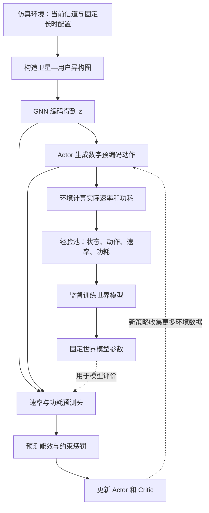

# 论文讲解：用图世界模型优化 LEO 卫星网络的节能混合波束赋形

> **一句话理解**：作者把多卫星下行网络表示成图，训练一个能预测“某组数字波束配置会带来多少用户速率、消耗多少功率”的神经网络，再用它辅助训练波束配置策略；部署时，策略根据当前信道一次前向计算就输出数字预编码。
>
> **最重要的阅读要点**：本文的 World Model 是**当前状态与动作到即时性能的单步代理模型**。它没有学习下一时刻状态，没有循环潜在动态，也没有多步想象轨迹。

## 1. 论文信息

| 项目 | 内容 |
|---|---|
| 英文标题 | *Graph World Model for Energy-Efficient Hybrid Beamforming in LEO Satellite Networks* |
| 作者 | Renpeng Liu、Xiaozhe Wang、Yiyang Fu、Bo Hu、Shanzhi Chen |
| 作者单位 | 北京邮电大学、中国信息通信科技集团相关国家重点实验室 |
| 发表信息 | IEEE Transactions on Green Communications and Networking，Vol. 10，2026，pp. 3772–3785 |
| DOI | `10.1109/TGCN.2026.3716365` |
| 方法名称 | GWM-RA：Graph World Model for Resource Allocation |
| 本地原文 | [打开 PDF](Graph_World_Model_for_Energy-Efficient_Hybrid_Beamforming_in_LEO_Satellite_Networks.pdf) |

本文依据提供的 PDF 整理，页码指 PDF 第 1–14 页，而非期刊连续页码。实验数字是作者报告的仿真结果；说明性例子和讨论会单独标明，未独立复现实验。

## 2. 先理解它要解决的工程问题

### 2.1 多颗卫星同时服务用户，会互相干扰

论文考虑多颗低轨卫星向地面单天线用户发送数据。卫星用天线阵列把信号朝用户方向集中，以弥补较大的传播损耗。

当一颗卫星同时给多个用户发送信号时，给用户 A 的信号也可能被用户 B 收到，形成**星内干扰**；其他卫星的信号也可能到达 B，形成**星间干扰**。

因此，不能只让每条链路发得更强。提高某个用户的发射功率，可能提高它自己的速率，也可能降低其他用户的速率，同时增加功耗。波束方向、复数权重和功率需要协调。

### 2.2 目标是“每消耗一焦耳，传多少数据”

论文优化系统能效：

$$
\mathrm{EE}=\frac{\sum_k R_k}{\sum_s P_s^{\mathrm{tot}}}.
$$

其中 $R_k$ 是用户速率，$P_s^{\mathrm{tot}}$ 是卫星总功耗。速率单位是 bit/s，功率单位是 J/s，因此 EE 的单位是 bit/J；实验使用 Mbps/W，等价于 Mbit/J。

**说明性例子**：方案 A 的总速率是 1,000 Mbps、总功耗是 100 W，能效为 10 Mbps/W；方案 B 的总速率是 1,200 Mbps、总功耗是 150 W，能效只有 8 Mbps/W。B 吞吐量更高，却不一定是节能方案。

同时，系统必须考虑用户最低速率、每颗卫星总功率上限和每个用户数字预编码的功率限制。否则，单纯追求比值可能牺牲难以服务的用户。

### 2.3 为什么不直接每个时隙解优化问题？

信道变化会要求数字预编码频繁更新。传统迭代优化每次都要重复求解含干扰耦合的非凸问题，计算开销较大。

普通学习方法可以在训练后快速输出动作，但训练策略需要反复查询环境，获得“这个波束方案到底好不好”的反馈。

本文试图同时改善两件事：

1. **在线决策快**：训练完成后，一次网络前向计算输出数字预编码。
2. **训练时少查询环境**：学习速率和功耗的代理模型，用预测反馈进行额外策略更新。

这里的“环境交互”主要对应论文仿真环境中的状态、动作和真实性能评价，不能直接等同于真实卫星在轨试验次数。

## 3. 混合波束赋形是什么？本文究竟控制哪一部分？

### 3.1 模拟和数字两级共同形成实际波束

对卫星 $s$ 服务的用户 $k$，有效预编码向量为：

$$
\mathbf w_k=\mathbf F_s^{\mathrm{RF}}\mathbf f_k^{\mathrm{BB}}.
$$

| 量 | 含义 | 直观作用 |
|---|---|---|
| $\mathbf F_s^{\mathrm{RF}}$ | 模拟预编码矩阵，维度 $N_{\mathrm{TX}}\times N_{\mathrm{RF}}$ | 通过移相器网络形成空间波束 |
| $\mathbf f_k^{\mathrm{BB}}$ | 用户数字预编码向量，维度 $N_{\mathrm{RF}}$ | 在基带调整各 RF 链上的复数权重，协调干扰与功率 |
| $\mathbf w_k$ | 用户实际有效预编码，维度 $N_{\mathrm{TX}}$ | 决定各天线最终发送该用户信号的权重 |

混合架构使用少于天线数量的 RF 链，减少硬件和静态功耗。论文默认每颗卫星有 **64 根天线、8 条 RF 链**，每个短时隙同时发送的用户流数量不超过 8。

模拟预编码满足恒模约束：

$$
\left|[\mathbf F_s^{\mathrm{RF}}]_{m,n}\right|=\frac{1}{\sqrt{N_{\mathrm{TX}}}}.
$$

### 3.2 两个时间尺度分工

| 时间尺度 | 已知信息 | 执行内容 | 是否由本文的短时隙策略学习 |
|---|---|---|---|
| 长时间尺度 | 用户地理分布、可见性、统计信息 | 确定用户关联与调度集合，配置模拟波束 | 用户关联由上层调度器提供；模拟波束采用码本与贪心程序 |
| 短时间尺度 | 当前瞬时 CSI | 更新各调度用户的数字预编码 | 是，GWM-RA 的核心任务 |

模拟波束来自二维 DFT 码本。作者先为用户寻找匹配的候选波束，再贪心选择能增加用户覆盖的码字，并考虑波束间隔；候选不足时，算法使用补选机制凑齐 RF 链对应的列数。具体见第 6–7 页 Algorithm 1。

**准确理解研究范围**：论文先写出包含模拟预编码、关联和数字预编码的总体问题 P0，但实际学习方法求解的是固定长时间尺度配置后的数字预编码子问题 P1。它没有实现任意拓扑变化下的全联合实时调度。

## 4. 物理模型怎样把“动作”变成“性能”？

### 4.1 信道包含几何衰减与随机衰落

卫星到用户的信道可写成：

$$
\mathbf h_{s,k}[t]=\sqrt{\beta_{s,k}}\,\widetilde{\mathbf h}_{s,k}[t].
$$

$\beta_{s,k}$ 表示由距离、天线增益、大气损耗等决定的大尺度增益；$\widetilde{\mathbf h}_{s,k}[t]$ 使用 Rician 模型，包含视距阵列分量和散射分量。

本文假设短时隙之间的小尺度信道独立重新生成，即 **i.i.d. 块衰落**：一个时隙内保持不变，不同时隙独立。大尺度背景则随长时间尺度的几何关系变化。（第 4 页）

这一假设直接决定了世界模型的形式：当前数字预编码不会改变下一次生成的物理信道，因此本文选择学习当前动作的即时性能。

### 4.2 数字预编码同时影响有用信号与干扰

设 $s_k^*$ 是服务用户 $k$ 的卫星，则：

$$
\Gamma_k=
\frac{|\mathbf h_{s_k^*,k}^{H}\mathbf w_k|^2}
{\displaystyle
\sum_{j\in\mathcal K_{s_k^*},j\ne k}|\mathbf h_{s_k^*,k}^{H}\mathbf w_j|^2
+\sum_{s\ne s_k^*}\sum_{j\in\mathcal K_s}|\mathbf h_{s,k}^{H}\mathbf w_j|^2
+\sigma^2}.
$$

分母依次是星内干扰、星间干扰和噪声。用户速率为：

$$
R_k=B\log_2(1+\Gamma_k).
$$

这说明策略必须看多条关联和干扰链路。只根据用户自己的信道分配功率，容易忽略对其他用户的影响。（第 5 页，式 (7)–(11)）

### 4.3 功耗包含硬件和速率相关开销

论文采用：

$$
P_s^{\mathrm{tot}}=
\frac{1}{\eta}\sum_{k\in\mathcal K_s}\|\mathbf w_k\|_2^2
+N_{\mathrm{RF}}P_0^{\mathrm{RF}}
+N_{\mathrm{PS}}P_0^{\mathrm{PS}}
+P_c
+c_{\mathrm{eff}}\sum_{k\in\mathcal K_s}R_k.
$$

五项分别是功放耗电、RF 链功耗、移相器功耗、固定基带与控制功耗，以及随速率增加的处理和转发功耗。

因此，论文优化的能效没有只计算辐射功率。另一方面，它也没有把训练服务器的耗电计入这个通信系统能效指标。（第 5 页，式 (12)–(17)）

## 5. 数学问题：固定模拟波束后，优化数字预编码

省略时间下标，P1 的核心形式是：

$$
\begin{aligned}
\max_{\{\mathbf f_k^{\mathrm{BB}}\}}\quad
&\frac{\sum_k R_k}{\sum_sP_s^{\mathrm{tot}}}\\
\text{s.t.}\quad
&R_k\ge R_{\min},\quad \forall k\in\mathcal K^{\mathrm{sch}},\\
&P_s^{\mathrm{tot}}\le P_s^{\max},\quad \forall s,\\
&\|\mathbf f_k^{\mathrm{BB}}\|_2^2\le p_k^{\max},\quad \forall k\in\mathcal K^{\mathrm{sch}}.
\end{aligned}
$$

非凸性主要来自干扰耦合以及分式目标：改变一个用户的预编码，其他用户的 SINR 和全网能效也会变化。

论文把它写成**时域长度为 1 的强化学习问题**，也称 contextual decision problem，可理解为“根据当前情境选择一次动作并获得即时反馈”：

- **状态**：当前卫星—用户信道及图结构上下文。
- **动作**：所有已调度用户的数字预编码向量。
- **原始奖励**：本时隙实际 EE。
- **策略训练目标**：使用代理模型预测的 EE，并扣除速率和功率违规惩罚。

这里没有需要优化的多步折扣回报、队列演化或当前动作影响未来资源状态的建模。这个定位比笼统地称它为“预测未来网络的强化学习”更准确。（第 6–7 页）

## 6. 图世界模型到底学了什么？

### 6.1 输入、输出与监督信号

核心映射是：

$$
f_{\mathrm{WM}}:(G_t,a_t)\longmapsto
\left(\widehat{\mathbf R}_t,\widehat P_t\right).
$$

| 部分 | 具体内容 |
|---|---|
| 图 $G_t$ | 卫星和用户是不同类型的节点；通信与潜在干扰关系构成边；边特征包含信道向量 |
| 动作 $a_t$ | 一组候选数字预编码 |
| 速率输出 $\widehat{\mathbf R}_t$ | 每个调度用户的预测速率 |
| 功耗输出 $\widehat P_t$ | 全系统预测总功耗，为一个聚合量 |
| 标签 | 仿真环境依据实际执行动作算出的用户速率和总功耗 |

为什么既输入状态又输入动作？同样的信道条件下，不同的数字预编码会产生不同干扰和功耗。只看信道的预测器无法比较这些候选方案。

### 6.2 GNN 负责提取相互影响的结构

GNN 使用异构注意力消息传递。每个节点根据邻居特征和链路信道计算注意力权重，再聚合邻居信息。经过多层传播后，readout 汇总得到图表示 $z_t$：

$$
z_t=\operatorname{GNN}_{\mathrm{enc}}(G_t).
$$

可直观理解为：模型不仅看“我与服务卫星的链路好不好”，还结合相连卫星、其他用户和潜在干扰的关系形成表示。

随后，两个 MLP 预测头接收 $z_t$ 和动作：

$$
\widehat{\mathbf R}_t=f_R(z_t,a_t),\qquad
\widehat P_t=f_P(z_t,a_t).
$$

**$z_t$ 是当前图的中间表示，不是下一时刻潜状态，也不是世界模型需要监督预测的标签。**（第 7–8 页，式 (25)–(28)）

### 6.3 训练它，本质上是监督回归

世界模型最小化：

$$
\mathcal L_{\mathrm{WM}}=
\mathbb E\left[
\omega_R\|\widehat{\mathbf R}_t-\mathbf R_t\|_2^2
+\omega_P(\widehat P_t-P_t)^2
\right].
$$

也就是说，先让模型学会回答：

> “当前网络这样，假如采用这个数字波束方案，各用户速率和全网功耗大约是多少？”

学会之后，可以用它评价策略生成的候选动作，减少每次更新策略都去重新调用真实环境评价的需要。

### 6.4 为什么称为 World Model，但又没有动态预测？

作者明确把 World Model 限定为任务层面的性能代理模型。本文具备“学习环境反馈、用模型辅助策略改进”这一特点，但没有常见序列世界模型中的状态转移、历史记忆与多步想象。

| 对比项 | 本文 GWM-RA | 带潜在动态的序列世界模型 |
|---|---|---|
| 主要学习对象 | $(G_t,a_t)\rightarrow(\mathbf R_t,P_t)$ | 状态、动作到后续状态及奖励等量的动态关系 |
| 时间结构 | 单步 | 连续多步 |
| 潜在表示 | 当前图的编码 $z_t$ | 可包含历史记忆与随机隐状态 |
| “想象”含义 | 在当前状态下预测候选动作的即时性能 | 根据模型递推产生未来轨迹 |
| 本文是否实现 | 是 | 否 |

阅读或引用时，建议使用“**图条件、动作条件的单步速率与功耗代理模型**”描述它。不能因为标题里有 World Model，就认为作者实现了 RSSM、Dreamer 或未来信道预测。

## 7. 代理模型怎样帮助训练策略？

### 7.1 Actor 输出动作，并保证用户级数字预编码约束

Actor 输出实数功率变量 $\widetilde p_k$，以及数字方向原型的实部和虚部，合成 $\widetilde{\mathbf v}_k$。随后映射为：

$$
p_k=p_k^{\max}\operatorname{sigmoid}(\widetilde p_k),\qquad
\mathbf u_k=\frac{\widetilde{\mathbf v}_k}
{\max(\|\widetilde{\mathbf v}_k\|_2,\epsilon)},\qquad
\mathbf f_k^{\mathrm{BB}}=\sqrt{p_k}\,\mathbf u_k.
$$

这样可以直接保证：

$$
\|\mathbf f_k^{\mathrm{BB}}\|_2^2\le p_k\le p_k^{\max}.
$$

这保证的是 C3：**用户数字预编码向量的范数上界**。卫星的真实辐射功率仍应由有效波束 $\mathbf F_s^{\mathrm{RF}}\mathbf f_k^{\mathrm{BB}}$ 计算，且卫星总功耗还包含电路等项。（第 7 页，式 (23)–(24)）

### 7.2 预测奖励包含能效和违规惩罚

论文用预测量构造：

$$
\widehat r_t=
\frac{\sum_k\widehat R_k}{\widehat P_t}
-\lambda_R^{\mathrm{pen}}\sum_k[R_{\min}-\widehat R_k]^+
-\lambda_P^{\mathrm{pen}}\left[\widehat P_t-\sum_sP_s^{\max}\right]^+,
$$

其中 $[x]^+=\max(x,0)$。第一项鼓励能效，第二项惩罚用户速率不足，第三项惩罚预测总功耗超过全网预算。

这里有一个重要近似：**原问题要求每颗卫星各自不超功率，代理奖励只惩罚全网总功率超标。**

**说明性例子**：两颗卫星各有 200 W 上限，实际用了 250 W 和 100 W。总量 350 W 小于 400 W，因此总量惩罚不触发；但第一颗卫星已经违反原约束。精确预测总量也不能消除这种约束松弛。（第 9 页，式 (30)）

### 7.3 Critic 和策略更新都是单步的

Critic $V_\phi(z_t)$ 估计该状态下策略的期望预测奖励，训练目标是：

$$
\mathcal L_V=\mathbb E[(V_\phi(z_t)-\widehat r_t)^2].
$$

Actor 使用优势：

$$
A_t=\widehat r_t-V_\phi(z_t),
$$

并按论文给出的策略梯度更新：

$$
\nabla_\theta J=
\mathbb E[\nabla_\theta\log\pi_\theta(a_t\mid z_t)A_t].
$$

Critic 的作用是提供基线，降低策略梯度估计的方差。由于只有一步，式子中没有下一状态价值或多步回报。

另外，论文强调代理模型“可微”，但明确列出的 Actor 更新是上述对数概率形式的策略梯度。**不要自行把它改述成“作者通过环境模型对动作求导并做梯度穿透优化”**；这是可能的其他实现方式，不是原文这些公式直接展示的过程。（第 9 页，式 (31)–(33)）

## 8. 从离线训练到在线执行，完整流程是什么？



训练可以概括为：

```text
固定某个长时间尺度的模拟预编码和用户关联配置
用随机探索收集初始环境数据，放入经验池

循环：
    从经验池采样，用实际速率和功耗标签训练世界模型
    固定世界模型参数
    编码采样状态，让 Actor 生成候选动作
    世界模型预测候选动作的用户速率和总功耗
    计算预测奖励，更新 Critic 与 Actor
    用更新后的策略收集新的真实环境评价，加入经验池

部署：
    获取当前瞬时 CSI，构造图
    GNN 编码 + Actor 前向计算 + 动作归一化
    执行输出的数字预编码
```

在线不需要使用速率预测头、功耗预测头或 Critic。**世界模型主要为训练服务；部署时使用 GNN 编码器和 Actor。**

这也解释了为什么 GWM-RA 与同样采用 GNN 的无模型基线可以有相同的在线推理时间，而训练开销不同。（第 9 页）

## 9. 实验设置与对照方法

### 9.1 主要参数

下表来自第 4 页 Table II。

| 参数 | 数值 |
|---|---|
| 协作卫星数 | 5 |
| 轨道高度、倾角 | 550 km、53° |
| 载频、带宽 | 20 GHz（Ka 波段）、100 MHz |
| 每星天线 | 64，$8\times8$ UPA |
| 每星 RF 链、移相器 | 8、512 |
| Rician 因子 | 10 dB |
| 噪声功率谱密度 | −174 dBm/Hz |
| 功放效率 | 0.5 |
| 每 RF 链、每移相器功耗 | 0.5 W、0.1 W |
| 固定功耗 $P_c$ | 10 W |
| 速率相关功耗系数 | 10 W/Gbps |
| 默认每星最大总功率 | 200 W |
| 用户最低速率 | 1 Mbps |
| GNN 层数 | 3 |
| 优化器、学习率 | Adam、$10^{-4}$ |
| Batch size、经验池容量 | 128、$10^5$ |

除另有说明，结果在 20 个独立随机种子上平均，阴影表示 95% 置信区间。

### 9.2 每个基线在检验什么？

| 基线 | 做法 | 对比意义 |
|---|---|---|
| WMMSE-EE | WMMSE 与 Dinkelbach 分式优化结合 | 与迭代能效优化参考方法比较 |
| ZF-EE | 先用迫零确定方向，再优化功率 | 与低复杂度线性预编码方案比较 |
| GNN-MFRL | 同类 GNN 编码器，直接用环境奖励训练 Actor–Critic | 检验性能代理模型带来的增益 |
| MLP-MFRL | 展平信道输入，采用 MLP 的无模型 Actor–Critic | 检验图结构表示的作用 |
| MLP-WM-RA | 保留代理模型框架，把 GNN 替换成 MLP | 在有模型方案内部消融图编码器 |
| GWM-RA（Pure EE） | 去掉预测奖励中的约束惩罚 | 检验只优化能效会不会牺牲可行性 |

这些对照支持在所测试方案之间比较，并不证明优于所有增强型无模型 RL，也不意味着达到全局最优。

## 10. 实验结果应如何理解？

### 10.1 能效与图结构的收益

作者报告，在用户数量和卫星功率预算的扫描中，GWM-RA 的能效高于所比较的基线。默认消融设置下：

| 方法 | 能效（Mbps/W） |
|---|---:|
| GWM-RA | 15.2 |
| GNN-MFRL | 14.0 |
| MLP-WM-RA | 11.8 |

从 GNN-MFRL 到 GWM-RA，能效约提高 $8.6\%$；把 GWM-RA 的 GNN 换成 MLP，能效相对完整方法下降约 $22.4\%$。它们分别支持代理辅助训练和图结构表示的作用。（第 10–12 页，图 3、4、7）

### 10.2 “减少超过 60% 交互”具体指什么？

达到 **12.5 Mbps/W** 这个目标阈值时：

| 方法 | 环境交互次数 |
|---|---:|
| GWM-RA | $0.8\times10^6$ |
| GNN-MFRL | $2.2\times10^6$ |
| MLP-MFRL | 未达到该阈值 |

按报告数值计算：

$$
1-\frac{0.8}{2.2}\approx63.6\%.
$$

因此，这个结论是：**在采用的训练协议下，到达同一个能效阈值所需的环境交互更少**。它不是“总训练耗时减少 60%”，也不是“总运算量减少 60%”。（第 11 页，图 5、Table III）

### 10.3 少查询环境，需要付出更多训练计算

| 指标 | GWM-RA | GNN-MFRL | MLP-MFRL |
|---|---:|---:|---:|
| 收敛交互次数 | $1.9\times10^6$ | $3.3\times10^6$ | $4.5\times10^6$ |
| 世界模型梯度更新 | 约 $1.5\times10^5$ | 不适用 | 不适用 |
| Actor/Critic 梯度更新 | 约 $1.5\times10^6$ | 约 $2.5\times10^5$ | 约 $3.5\times10^5$ |
| 训练时长 | 2.8 h | 1.7 h | 1.2 h |
| 单时隙推理时间，用户负载为 8 | 1.2 ms | 1.2 ms | 0.4 ms |

WMMSE-EE 在该测量点的在线时间约为 1,350 ms。以上时间来自双 RTX 4090 GPU、64 线程 Intel Xeon CPU 的服务器，**不能直接视为星载硬件实测时间**。

作者的方法用更多离线更新换取更少环境评价。它是否有总体成本优势，取决于环境评价的实际代价与可用训练算力；不能只根据交互次数判断。（第 11 页，Table III）

### 10.4 约束惩罚有效，但没有实现零违规

| 方案 | 能效（Mbps/W） | QoS 违规率 | 功率违规率 |
|---|---:|---:|---:|
| GWM-RA，包含惩罚 | 15.2 | 0.8% | 0.5% |
| GWM-RA，只有 EE 奖励 | 16.5 | 27.3% | 18.9% |

去掉惩罚后，能效表面上更高，却明显增加违规。因此评价资源分配方案必须同时看能效和约束表现。

作者说明，报告的性能来自环境中实际执行的动作，没有事后投影、修复或删除不可行动作；这些非零违规反映了惩罚训练的实际结果。上述违规率是在消融工作点报告的，不应扩展成全部实验条件下的保证。（第 9、12–13 页，Table IV）

### 10.5 热点场景：能效最高，但相对降幅并非最小

热点设置把 70% 的调度用户放在 30% 的覆盖区域内，以增强干扰。每星调度用户数为 8 时：

| 方法 | 均匀分布 EE | 热点分布 EE | 降幅 |
|---|---:|---:|---:|
| GWM-RA | 16.8 | 13.5 | 19.6% |
| WMMSE-EE | 14.2 | 11.8 | 16.9% |
| GNN-MFRL | 11.5 | 9.4 | 18.3% |
| ZF-EE | 11.1 | 6.8 | 38.7% |
| MLP-MFRL | 8.5 | 5.5 | 35.3% |

EE 单位均为 Mbps/W。GWM-RA 在热点场景中仍取得最高绝对能效，但其相对降幅不是最小。因此，更准确的结论是“在该热点设置下保持较好的绝对性能”，而不是“在所有意义上最鲁棒”。

这里的 16.8 与消融实验中的 15.2 来自不同工作点，原文明确提醒不能混用。该跨场景结果也不足以单独证明完全不微调的零样本泛化。（第 12–13 页，图 8、Table V）

## 11. 这篇论文的贡献应如何定位？

它的核心贡献是把以下三部分组合成面向多卫星数字预编码的训练框架：

1. **图结构表示**：用卫星—用户关系和信道边特征编码干扰关系。
2. **动作相关的性能代理**：预测用户速率和全网功耗，而不仅仅拟合一个总奖励。
3. **代理辅助的策略改进**：在减少环境查询的同时，训练部署时可一次输出动作的策略。

分别预测速率与功耗的好处是，模型输出能用来重构 EE，也能检查用户速率不足等情况，比只有一个奖励预测更容易与通信目标联系起来。但本文只预测聚合功耗，也造成了每星功率约束处理不完整的问题。

从方法性质看，它更接近**图性能代理辅助的单步策略优化**。论文的主要证据是样本效率、能效和在线推理时间，而不是长时域规划能力或未来状态预测能力。

## 12. 值得注意的局限与后续研究切口

以下是结合原文提出的分析，不是作者已经完成的功能。

### 12.1 单步设定限制了对长期网络行为的解释

论文没有显式建模队列、业务积压、电池、切换成本或跨时隙公平性，也没有学习相关信道的多步动态。它的结果主要回答“当前信道下怎样选数字预编码”。

若研究目标是 WorldNTN 中的长期资源编排，需要先确定哪些状态会被动作改变、怎样随时间演化，再决定是否需要真正的状态转移模型。仅把当前信道换成更复杂的神经网络输入，并不会自动形成长期世界模型。

### 12.2 可行性只得到部分保证

动作映射保证用户数字预编码范数上界，但最低速率依赖惩罚，每星总功率又被放松成全网总量惩罚。即使代理模型没有预测误差，也不能仅凭该奖励保证原始 P1 的全部约束。

一个直接改进方向是让功耗头预测每颗卫星的功耗向量，再加入明确的可行性处理。不过，改成逐星惩罚仍然是软约束，不等于自动获得硬保证。

### 12.3 代理误差及策略利用误差的风险需要单独测量

策略可能偏好被模型高估速率、低估功耗的动作。补充真实环境数据能够缓解分布偏移，但论文没有给出充分的速率/功耗预测误差、校准或分布外动作评价来完整刻画这一问题。

有价值的检验包括：留出数据上的逐用户速率误差、逐星功耗误差、约束边界附近误判率，以及策略更新后误差是否增大。

### 12.4 有解析公式时，学习代理的必要性还值得直接对照

本文仿真已经给出速率与功耗公式。一个自然的研究问题是：同样采用 GNN 策略，如果直接通过解析性能计算训练，能否获得类似收益？

可增加“解析性能模型辅助训练”的对照，并统一梯度更新预算、环境评价预算和墙钟时间，以更清楚地区分图编码、额外策略更新和学习代理各自的作用。这是分析建议，不能据此断言论文方法无效。

### 12.5 GNN 的结构优势不等于任意拓扑泛化

论文明确说明训练以给定长时模拟配置为条件，大幅更换模拟子空间可能需要微调或部分重训。

此外，编码器能处理图，并不自动说明后续 MLP 动作输出和用户速率向量能适配任意节点数。复现时仍需明确用户排序、padding/masking、输出维度，以及用户数变化时是否重训。

### 12.6 用户负载与并发流数量要分开

论文默认每星只有 8 条 RF 链，因此并发流上限是 8。图中更大的“每星用户数”被作者解释为局部场景中的用户负载，而非全部同时服务。

如果要复现规模实验，需要弄清楚更多候选用户如何进入图、上层调度如何选择当前集合，以及未被调度用户是否计入服务评价。只看并发用户的最低速率，不能推出所有候选用户的长期公平性或服务保障。

## 13. 阅读时最容易产生的误解

| 容易误读成 | 更准确的说法 |
|---|---|
| 世界模型预测未来信道 | 它预测当前图和候选动作下的速率、功耗 |
| 在潜在空间多步想象并规划 | 它使用单步代理奖励更新策略 |
| 联合学习模拟波束、用户关联和数字波束 | 实际短时策略只控制数字预编码，其他配置来自慢时程序与上层调度 |
| 减少 60% 训练时间 | 到达指定能效阈值的环境交互约减少 64%，报告的训练时间更长 |
| 所有功率约束都由输出映射保证 | 映射只保证用户数字预编码范数上界 |
| 1.2 ms 已证明可在卫星上实时运行 | 这是给定服务器上的测量，需要另做星载验证 |
| GNN 可以直接泛化到任意星座与规模 | 论文只验证特定拓扑家族，长时配置变化可能需要再训练 |

## 14. 汇报时可以直接使用的概括

这篇论文研究多卫星 LEO 下行网络中数字预编码的能效优化。作者采用双时间尺度混合波束赋形：慢时间尺度固定模拟波束和用户关联，快时间尺度根据瞬时 CSI 生成数字预编码。方法用异构 GNN 表示卫星、用户及干扰链路，再学习“图状态和动作到用户速率、总功耗”的单步性能代理，用预测奖励辅助训练 Actor–Critic。部署时只需 GNN 与 Actor 的一次前向计算。

在所报告的仿真中，方法比匹配的 GNN 无模型基线用约 64% 更少的环境交互达到指定能效，但训练时间从 1.7 小时增至 2.8 小时。它在测试基线中取得较好的能效，加入约束惩罚后显著降低违规率。方法的主要边界是：不包含多步环境动态，逐星功率约束在代理奖励中被聚合松弛，在线时间来自服务器测量，跨模拟配置和任意规模的泛化仍需验证。

## 15. 原文定位索引

| 内容 | 原文位置 |
|---|---|
| 动机、世界模型的单步定位、贡献 | 第 1–3 页，Introduction |
| 网络架构、两时间尺度、信道假设 | 第 3–4 页，Section II-A/B |
| 仿真参数 | 第 4 页，Table II |
| SINR、速率和功耗 | 第 5 页，式 (7)–(17) |
| 总体问题 P0、实际问题 P1 | 第 6 页，式 (18)–(20) |
| 模拟波束配置 | 第 6–7 页，Section III-A、Algorithm 1 |
| 动作参数化与世界模型定义 | 第 7 页，式 (23)–(25) |
| 图编码和训练架构 | 第 8 页，图 2、式 (26)–(28) |
| 模型损失、预测奖励、Actor–Critic | 第 9 页，式 (29)–(33) |
| 离线训练、在线推理与复杂度 | 第 9 页，Section III-B3/C |
| 基线与能效扫描 | 第 10–11 页，图 3、4 |
| 样本效率与计算代价 | 第 11 页，图 5、Table III |
| 推理扩展性与消融 | 第 12 页，图 6、7 |
| 约束违规与热点场景 | 第 12–13 页，图 8、Table IV/V |
