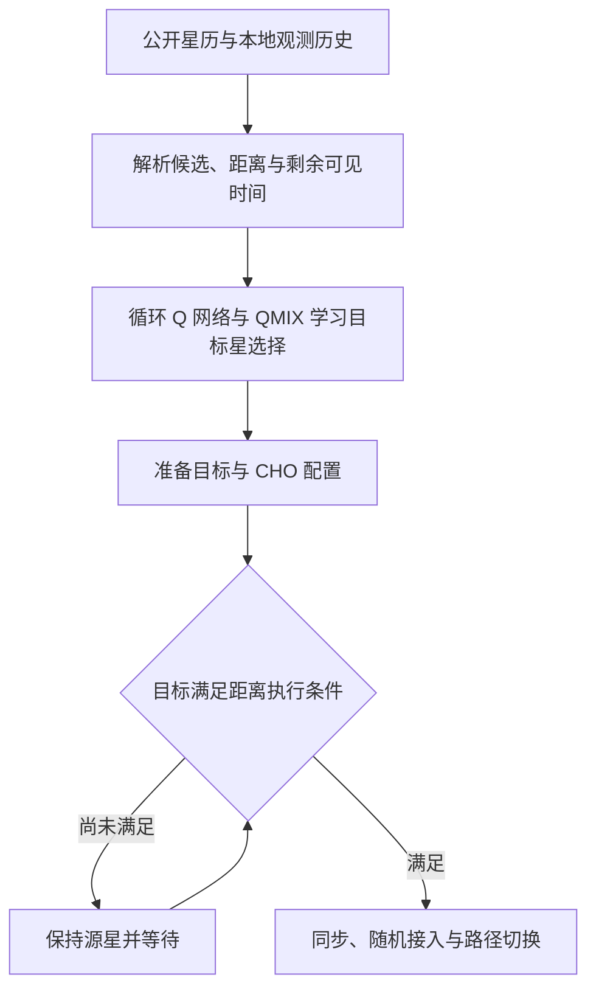

# ILCHO：论文讲解与多星座 World Model 方案的重合分析

分析日期：2026-10-02。

**判断：这篇论文已经覆盖“利用星历提前选星、将准备与执行分开、多 UE 部分观测、循环强化学习、容量约束和切换惩罚”。因此，你不能把“轨道前瞻”“提前准备”或“历史观测”单独当作新意。它与你最新版方案的区别集中在：未建模的同频外方干扰、有限且延迟的方向测量、不同候选计划的显式服务推演，以及可选的外方行动响应。相较 PMA-PPO，ILCHO 更接近一个利用解析几何的条件切换控制器，没有给出学习未知功率转移的环境模型。**

本文基于你提供的 18 页完整 PDF，并查看了表 II–IV 的原始页面。下文同时给出 PDF 页码和印刷页码，方便核查。原文结果与对你方案的推断分别说明。

## 1. 论文信息与比较对象

| 项目 | 内容 |
| --- | --- |
| 标题 | *Intelligent Handover Scheme for Improved 6G NTN LEO Satellite Network Performance* |
| 作者 | Minsu Choi、Minseung Park、Junwon Kim、Jong-Moon Chung |
| 期刊 | IEEE Transactions on Mobile Computing |
| 正式卷期 | Vol. 25, No. 5, May 2026，pp. 6863–6880 |
| 时间 | 首次在线发表日期为 2025-12-10；正式卷期年份为 2026，不能仅按 DOI 中的 2025 认定卷期年份 |
| DOI | [10.1109/TMC.2025.3642278](https://doi.org/10.1109/TMC.2025.3642278) |
| 方法名称 | Intelligent LEO Satellite Conditional Handover，ILCHO |
| 主要学习算法 | QMIX，采用循环 agent 网络；不是 PPO |
| 原文 | [本地 PDF](Intelligent_Handover_Scheme_for_Improved_6G_NTN_LEO_Satellite_Network_Performance.pdf) |

书目信息也可通过作者所在机构的[论文记录](https://yonsei.elsevierpure.com/en/publications/intelligent-handover-scheme-for-improved-6g-ntn-leo-satellite-net/)核查；技术分析以所给全文为依据。

主要比较对象是你 2026-10-02 的[多星座对等共存详细方案](多星座对等共存_历史观测世界模型与预测切换_详细研究方案.md)和[神经网络输入输出简表](多星座世界模型_神经网络输入输出简表.md)：独立同频星座、本方合法历史观测、共享概率 RSSM、解析链路/协议与 MPC；第一篇可以做 L1 或 L1+L2，L3 是后续扩展。

该版本采用满缓冲连续服务，不生成数据包、重传或交付确认；网络学习未知功率动态，速率和累计服务量由解析模块计算。这里按这一范围分析，不把早期 ICC 版本的全部功能都算入最新版。

## 2. 论文要解决什么问题

LEO 快速移动会带来频繁切换；链路质量差异小、测量可能过时，而多个 UE 会竞争卫星有限资源。只选择当前距离最近或可见时间最长的星，可能导致过度切换、资源集中和切换失败。

ILCHO 结合两类工具：

1. 用星历和轨道几何提前计算候选可达性、距离和剩余可见时间。
2. 用 QMIX 学习目标星选择，再由距离条件决定何时执行已经准备的切换。

它希望提高用户服务质量，同时控制切换次数和失败。其学习目标包含长期回报，所以也具有前瞻性；区别在于前瞻来自几何和价值学习，没有给出逐计划展开未知干扰与协议状态的环境预测模型。

## 3. 系统模型与解析几何

### 3.1 星座与资源设置

主要参数见表 II（PDF 第 12 页，印刷页 6874）。

| 项目 | 设置 |
| --- | --- |
| Phase 1-a | 高度 550 km、倾角 53°；72 轨道面 × 22 星，共 1584 星 |
| Phase 2-a | 高度 340 km、倾角 53°；48 轨道面 × 110 星，共 5284 星 |
| 混合场景 | 合并上述两类 Starlink 壳层参数，比较多壳层表现 |
| UE | 5–100 个固定 VSAT 用户，乡村环境 |
| 区域 | 纬度 39–41°N、经度 39–41°E |
| 链路 | Ka-band，表列信道带宽 250 MHz；最小仰角 30° |
| 资源 | 每星最多 8 个信道，限制可同时服务的 UE 数量 |
| 评估时间 | 每次服务 10 分钟，时间步长 1 s |
| 训练 | 学习率 $10^{-4}$，折扣 0.99，batch 32，3000–30000 episode |

这些是论文采用的商用星座参数化仿真场景，不是对 2026 年实际在轨状态的独立测量。Phase 1/2 的 hybrid 场景也没有建立两个私有信息互不共享的运营方。

### 3.2 三个 Lemma 的作用

- **Lemma 1：轨道位置。** 根据轨道面、倾角、相位和时间，推导卫星的位置。
- **Lemma 2：可达性。** 给定 UE 位置和最低仰角，判定卫星能否接入，构造候选集合。
- **Lemma 3：复杂度主张。** 作者将固定时刻的关联问题归为广义指派问题并称其 NP-hard；这一主张的适用条件需要注意，见第 7 节。

几何部分可用以下关系理解，符号为本讲解统一记法：

$$
d_{u,s}(t)=\|\mathbf p_s(t)-\mathbf p_u(t)\|,
$$

$$
\psi_{u,s}(t)=\arcsin\!\left(
\frac{\mathbf p_u(t)^\top[\mathbf p_s(t)-\mathbf p_u(t)]}
{\|\mathbf p_u(t)\|\,d_{u,s}(t)}\right),
\qquad \psi_{u,s}(t)\ge\psi_{\min}.
$$

它还利用剩余可见时间 RVT 判断目标是否值得接入。只在当前可达候选上定义动作，避免直接把数千颗卫星的全局编号都作为动作输出。

原文图 5 给出 Phase 1-a/2-a 最大可达链接数分别为 17/27。这说明候选裁剪已是该论文的重要设计，你设置最多 4 个候选属于实现选择，不能单独视为创新。

### 3.3 信道以 SNR 为核心

原文 §III-B 包含自由空间损耗、阴影、LoS/NLoS、杂波和大气衰减，使用 SNR 与 Shannon 公式计算服务速率。它没有建立外方星座每个实际活动 RB 的辐射干扰，也没有优化接收阵列对不同干扰方向的抑制。

解释吞吐公式时应将 dB SNR 转成线性值：

$$
\gamma_{\rm lin}=10^{\gamma_{\rm dB}/10},\qquad
R=B\log_2(1+\gamma_{\rm lin}).
$$

你的最新版需要 $\Gamma=S/(I+N)$；候选星改变接收指向后，即使 B 的源活动轨迹相同，接收干扰也可能改变。这个方向相关的质量变化不是距离排序能够自动处理的。

## 4. ILCHO 如何准备并执行切换

原文 §IV-A 和图 3 将过程区分为准备、执行、完成。

**准备阶段：** UE 发送测量报告；系统选择目标，源星向目标请求 CHO，收到 ACK 后向 UE 发送命令；目标在等待执行时预留资源。

**执行阶段：** 满足条件后，UE 通知源星，进行数据转发、目标同步、上行分配和随机接入，随后发送确认。

**完成阶段：** 修改承载、切换路径，目标向源星发送完成消息。

距离执行事件是原文式 (28)：

$$
d_{u,\rm target}<d_{u,\rm serving}-O_{\rm off}.
$$

其中 $O_{\rm off}$ 是距离偏置。目标星更近并超过偏置时执行；目标选择由学习算法决定，是否马上执行由条件门槛决定。

**与你的重合非常直接：选择目标、提前准备和等待执行已被区分。** 你更具体的差异应是依据累计服务与风险规划准备/等待时机，以及把未获确认、批准过期、单 RF 断流和失败恢复真实推进进每条分支。

论文确实讨论了预留、ACK 和同步过程，不能描述成它完全没有协议。另一方面，它在 §IV-C（PDF 第 8–9 页，印刷页 6870–6871）明确说明忽略信令时延，并未给出与你方案同等详细的子秒事件执行与服务损失积分。

## 5. QMIX 的状态、动作、奖励与历史处理

### 5.1 每个 UE 是一个智能体

原文式 (26) 的本地观测包含每个可达候选的：

$$
o_u^t=\{I_{u,n}^t,D_{u,n}^t,L_{u,n}^t,V_{u,n}^t\}_{n=1}^{N_{\max}},
$$

即候选索引、距离、已使用信道数和剩余可见时间。动作是选择候选列表中的一个目标。

虽然作者强调 UE 看不到其他 UE 的本地观测，候选负载仍作为输入提供。这与“完全没有任何其他用户信息”不同，也与“只能从本方延迟功率观测估计外方私有状态”不同。

### 5.2 它已使用历史与上一动作

原文 §IV-C 明确采用 DRQN：agent 网络接收当前观测和上一动作，通过循环状态保留历史。**不能把 ILCHO 说成只有瞬时观测、没有记忆的 RL，也不能把你使用 GRU 历史编码这一点当作相对它的创新。**

它学习的是 $Q_u(\tau_u,a_u)$，即基于观测历史的动作价值；你的 RSSM 则需要学习可递推的未知功率状态，并用解析模块得到不同计划的未来服务。这是学习目标和使用方式的差别。

### 5.3 集中训练、分散执行

QMIX 把各 agent 的 Q 值混合为联合 Q 值，用全局信息生成混合网络权重，并满足：

$$
\frac{\partial Q_{\rm tot}}{\partial Q_u}\ge0.
$$

该约束使所表示的联合 Q 函数与局部贪心选择相容。训练使用全局信息；运行时每个 agent 依赖本地历史。

这一性质不意味着在任意部分观测问题中必然收敛到真实全局最优，也不等于没有通信的独立运营方会形成均衡。你的 L3 属于另一类训练与交互问题，不能只通过引用 QMIX 的单调性就宣布已解决。

### 5.4 奖励兼顾服务、可见时间和切换

论文式 (27) 可概括为：成功切换罚 $p_1$，失败罚 $p_2$，其余时间依据吞吐与 RVT 的 sigmoid 型项评分。

$$
r_u^t=
\begin{cases}
-p_1,&\text{切换成功},\\
-p_2,&\text{切换失败},\\
-U_{u,R}^t+U_{u,\rm RVT}^t,&\text{其他情况}.
\end{cases}
$$

作者意图是避免“剩余可见时间长但吞吐差”和“当前吞吐好但马上出覆盖”的目标，并通过失败惩罚间接避免拥塞。没有显式负载均衡奖励项，但这不等于没有负载意识：状态含已使用信道数，拥塞导致失败并产生惩罚。

论文比较 sigmoid 与线性奖励，前者在所示实验中训练更稳定。该实验支持它在该设置下的效果，不能外推成所有切换问题都必须采用 sigmoid。复现时还需检查原文成本函数的符号、缩放与单调性是否实现了作者描述的奖励方向。

## 6. 实验结果：哪些数字可以引用

### 6.1 对照算法与失败定义

比较对象包括最小距离 MD、最大可见时间 MVT、负载平衡 Q-learning 方法 LBSH，以及基于网络流的 HSNF。实验在 Python 3.11/PyTorch 2.1.0 下实现。

论文将 HOF 定义为目标资源不足、目标剩余可见时间耗尽或目标不可达导致的失败。这不等同于涵盖所有同步、随机接入、时延超时与失败恢复风险。

### 6.2 Phase 2-a 负载扫描

原文图 8 及对应文字（PDF 第 13–14 页，印刷页 6875–6876）报告：

| 指标 | 原文结果 | 单位/口径 |
| --- | --- | --- |
| 5 UE 时平均切换次数 | 10.8 | 每 UE、每 10 分钟服务期 |
| 100 UE 时平均切换次数 | 12.95 | 每 UE、每 10 分钟服务期 |
| 50 UE 时平均失败次数 | 0.48 | 每 UE、每服务期，不是 0.48% |
| 100 UE 时平均失败次数 | 1.38 | 每 UE、每服务期，不是 1.38% |
| 5/50/100 UE 时平均吞吐指标 | 3.85 / 3.79 / 3.76 | 图中单位 bps/Hz，实际上是频谱效率指标 |

它在所比较方法中保持较低切换/失败次数和较高频谱效率。不要把上述失败“次数”与 PMA-PPO 的失败“概率”直接比较。

### 6.3 多壳层汇总

表 III（PDF 第 15 页，印刷页 6877）汇总 5–100 UE 配置下的平均值：

| 场景 | 平均 HO 次数 | 平均 HOF 次数 | 平均吞吐指标，bps/Hz |
| --- | --- | --- | --- |
| Phase 1-a | 8.64 | 0.53 | 3.375 |
| Phase 2-a | 12.67 | 0.67 | 3.788 |
| Hybrid | 12.24 | 0.97 | 3.647 |

这里是跨 UE 配置的汇总，不是某一个固定 100 UE 场景，也不是重复训练随机种子的置信区间。较高壳层通常有较长可见时间和较少切换，较低壳层具有链路预算优势；hybrid 体现组合权衡。

### 6.4 公平性与负载均衡

图 11 在 100 UE、Phase 2-a 下给出 Jain 公平性指数 0.9798，10% 分位 3.508 bps/Hz、中位 3.846 bps/Hz、平均 3.757 bps/Hz。

表 IV 在 50 UE、Phase 2-a 下给出可达卫星共同资源池的信道占用方差：

| 方法 | ILCHO | MD-CHO | MVT-CHO | LBSH | HSNF |
| --- | --- | --- | --- | --- | --- |
| 占用方差 | 0.072 | 0.372 | 0.400 | 0.077 | 0.089 |

这说明它也评估公平性和负载分布。JFI 高表示该场景中的用户服务较均匀，不能据此证明所有场景、独立运营方或全部弱覆盖用户都不存在长期损失。

## 7. 局限与复现时需要核查的条件

### 7.1 部分观测不等于真实测量受限模型

论文的部分观测主要是 agent 不直接读取其他 agent 的观测；它仍获得各候选距离、负载和 RVT。全文没有建立你计划的单 RF 每秒有限扫描、未检出/缺测掩码、报告年龄和候选方向测量机会。

论文关心过时测量带来的问题，但主要用可预测几何与距离事件缓解；没有演示在一套明确的延迟功率报告模型中做 belief 过滤。

### 7.2 信令时延被忽略，协议成本主要是抽象惩罚

原文解释星历有效期相对传播时延较长，进而忽略信令时延。**我的判断：星历是否过期与切换准备/批准/接入是否来得及，是不同问题。** 星历仍有效，并不能保证短暂高 SINR 窗口足以覆盖切换执行成本。

因此，你可以研究它没有细化的执行后果，但必须用共享执行器验证，不能仅给自己的方法添加更完善协议，然后让基线拥有不同的能力或成本。

### 7.3 未包含强学习基线和显式环境预测对照

本篇性能实验没有同条件比较循环 MAPPO/PPO、GRU+MPC 或结构化环境预测器。使用了 QMIX，不代表已经通过实验优于所有 MARL 方法。

反过来，你也应加入循环策略与本篇思路的适配基线。如果只比较最近距离、最长覆盖，再宣称世界模型必要，证据不足。

### 7.4 NP-hard 主张需核对具体问题

原文 Lemma 3 的固定时刻式 (16)只有每 UE 最多一个连接、每星最多 $J$ 个连接，以及预先给定的链路收益。若每条连接都占一个单位容量、收益与其他连接无关，该静态问题可写成带容量的二分图匹配/最大费用流，并不因称为“广义指派”就自动变成 NP-hard。

异质资源消耗、动作引起的干扰、时序切换成本或协议耦合可能改变复杂度。这里应区分作者的复杂度主张与式 (16)实际写出的简化问题；你自己的论文也应先精确定义耦合，再论证计算困难。

### 7.5 O(K) 有固定条件，不能直接理解成任意规模线性可部署

论文将网络尺寸和候选上限固定时的开销表述为随 UE 数 $K$ 线性增长。实际候选更新、负载信息收集、混合网络尺寸和训练时间仍受场景影响。

你的 MPC 也应报告整条在线链的耗时、超时率和实际服务影响；不能只比较网络前向 FLOPs，而忽略候选轨迹、采样和协议展开。

## 8. 与你的最新版 idea 逐项比较

| 维度 | ILCHO | 你的最新版方案 | 重合判断 |
| --- | --- | --- | --- |
| LEO 选星/切换 | 核心任务 | 核心任务 | 高 |
| 公开几何前瞻 | 解析轨道、候选可达性、RVT | 解析星历传播、方向、距离与覆盖 | 高；不是新贡献 |
| 提前准备和条件执行 | 已明确区分 | 规划准备、等待、取消与执行 | 高；更细的规划与真实代价需验证 |
| 历史观测 | DRQN 和上一动作 | RSSM belief、功率历史、年龄和控制事件 | 历史有重合，学习对象不同 |
| 部分观测 | 不直接看到其他 UE 的观测 | 外方私有状态不可得，候选方向缺测且报告延迟 | 宽泛术语重合，具体信息约束不同 |
| 学习方法 | 循环 Q 值 + QMIX 集中训练 | 未知功率概率转移 + 显式 MPC | 方法不同，需同条件实验 |
| 链路质量 | SNR 与几何损耗 | 同频方向干扰下的 SINR | 有明确问题差异 |
| 候选行动后果 | 通过 Q 值学习长期回报 | 按保持/切换/延迟计划生成服务分布并比较 | 有使用方式差异；不能宣称 RL 无长期后果学习 |
| 执行成本 | 切换/失败惩罚，CHO 流程；忽略信令时延 | 时延、单 RF 断流、确认、失败恢复进入服务窗口积分 | 一般切换成本重合，事件建模不同 |
| 跨运营方 | 未建立私有信息的同频共存机制 | 只切本方授权星，不读取外方关联和资源表 | 有明确系统差异 |
| 外方响应 | 没有本方发射引起外方延迟切换的模型 | L2 中各候选计划分别演化外方响应 | 该具体机制在所给全文未覆盖 |
| 多方学习 | 多 UE 在共同服务目标下训练 | L3 各方独立模型、对手版本变化 | 多学习者重合，目标关系与泛化问题不同 |

**它与你最容易撞到的不是“世界模型”这个名称，而是预测切换的流程描述。** 如果你的贡献只写成“看轨道、提前选择目标、先准备再执行、减少切换失败”，评审很容易指出 ILCHO 已经做了这些。

## 9. L1、L2、L3 分别应怎样判断重合

### 9.1 只做 L1：证明未知干扰与真实服务规划的价值

L1 中 B 不响应 A，但仍移动、换星和改变发射活动。你可以复用同一 B 源轨迹来比较不同 A 计划，不过各计划仍需重算接收指向、SINR、资源和断流。

相对 ILCHO 的研究空间是：几何仍可预测，但它无法给出未知同频活动；有限功率历史是否能识别干扰持续性，并帮助选择整段收益更高、实际来得及执行的目标？

关键对照是解析几何/距离 CHO、当前 SINR CHO、历史 QMIX/PPO，以及 GRU+同一 MPC。只有优于这些对照，才支持额外世界模型结构的必要性。

### 9.2 加入 L2：比较每个行动的不同干扰未来

具体反馈链是：

$$
A\text{ 的发射变化生效}
\rightarrow B\text{ 收到延迟质量测量}
\rightarrow B\text{ 按固定规则准备并切换}
\rightarrow A\text{ 后续干扰变化}.
$$

ILCHO 没有研究这一跨运营方反馈。它的多 UE 协调主要来自共享信道容量，不能直接等同于上述独立控制链。

但“动作会改变未来”也是强化学习的一般特征。你应证明的是：同一历史下保持、立即切换和延后切换产生不同响应；动作条件功率预测能识别响应的时间与持续性；完整服务规划因此减少干扰反弹和返星。不要只用总吞吐改善代替机制验证。

### 9.3 L3 留待后续：不能只把双方训练称作创新

ILCHO 已经是多智能体学习。你的后续区别是独立运营方各自优化服务，响应规律随模型版本变化，需要对手池、交叉版本与未见规则测试。

双方分别训练不自动产生公平、稳定或均衡；每方服务与振荡行为需要独立报告。该扩展不应成为首篇完成 L1 或 L1+L2 的前提。

## 10. 如何把 ILCHO 变成有用的研究对照

### 10.1 建议使用分层适配基线

| 基线 | 核心设计 | 回答的问题 |
| --- | --- | --- |
| 几何 CHO | 最短距离/最长覆盖 + 距离偏置事件 | 是否只靠星历就足够 |
| 测量 CHO | 本方实际收到的 SINR + 滞回/计时器 | 是否只需替换质量门槛 |
| ILCHO 思路适配 | 循环 QMIX/候选 Q 网络，使用合法本方历史与已知资源，接同一协议 | 学习型条件切换是否已足够 |
| GRU/HSMM + MPC | 与 RSSM 使用相同历史、未来上下文和执行器 | 概率潜状态结构是否提供额外价值 |
| 结构化 RSSM + MPC | 学未知功率，解析算服务与协议 | 所提完整方案 |

你的首版每个运营方只有一个 UE，不能因此假装已经完整复现 ILCHO 的多 UE QMIX。单 UE 可先用循环 Q 网络保留它的历史选星思路；在本方多 UE 扩展时再加入 QMIX 的联合训练，并明确这是方法适配。

原论文的严格距离执行门槛在干扰场景可能限制较远但质量更好的目标。因此可同时报告“保留原距离事件”的参考和“在相同合法动作中允许基于质量/服务执行”的适配版，避免只靠解除基线动作限制获得优势。

### 10.2 两组场景能直接揭示差异

**场景 A：较近目标遭遇持续同频干扰。** A2 更近且满足距离事件，A3 稍远但受干扰较小、可用服务时间足够。保持相同几何，改变 B 的实际活动和功率，检查距离控制器、当前 SINR 控制器、历史策略与完整规划分别怎么选。几何相同而最优计划不同，才能检验未知动态的价值。

**场景 B：即时高质量不足以覆盖执行成本。** A2 只好几秒，A3 稍弱但持续更久；准备、确认、断流和恢复按公共执行器推进。比较是否有人过度追逐短暂峰值，报告累计服务与最长中断。若没有备用星或切换时间比可用窗口长，应允许结论是保持最好。

若纳入 L2，再构造“切 A2 后 B 延迟换星使干扰反弹”的分叉场景；所有分支重跑 B 的测量与规则，不能回放同一条 B 轨迹冒充动作响应。

## 11. 与早期 ICC 版本的关系及建议表述

对根目录[早期英文简报](../WorldNTN_ICC_research_brief_EN.md)中的协调网络、多 UE 关联与资源重分配，ILCHO 已覆盖共享资源、负载意识和合作学习；这些动机重合较强。早期版本的量化接收波束优化、干扰观测、连续资源重分配与逐事件迁移约束仍有更具体差异。

最新版的贡献应围绕当前已经确定的控制变量，不把早期接收波束优化或数据包交付模型继续算作已包含功能。

建议的 **L1 表述**：在独立同频 LEO 共存下，利用本方有限、延迟和方向相关的历史功率测量估计未知干扰，结合解析几何与切换执行模型选择未来累计服务更好的卫星和行动时机，并通过同信息的条件切换、历史策略和简单预测规划验证收益。

建议的 **L1+L2 表述**：进一步把本方已生效行动引起的外方延迟响应纳入候选计划条件化预测，验证这种反馈建模是否改善服务并减少干扰反弹和返星。

这些是相对本篇论文仍需验证的研究主张，不是已经获得的新颖性或性能结论。还应与已有同频共存选星、预测其他系统关联和世界模型工作一起比较。

## 12. 与另一篇论文合起来看

| 工作 | 已有贡献的主要边界 | 对你方案的直接提醒 |
| --- | --- | --- |
| ILCHO | 解析几何、候选裁剪、循环 QMIX、提前准备、距离条件执行 | 不能把星历前瞻、历史与分阶段切换当作新意 |
| PMA-PPO | GRU 预测未来 SNR/负载、卫星侧 PPO、多目标协调 | 不能把未来质量预测 + MARL 切换当作新意 |
| 你的 L1 | 未知同频干扰、受限观测、结构化服务推演与协议执行 | 需要超过历史策略和简单预测器 + 同 MPC |
| 你的 L2 | 本方行动改变外方延迟响应，各计划具有不同干扰未来 | 需要分叉数据与行动无关/条件模型对照 |

两篇合起来说明宽泛的“预测智能切换”已经相当拥挤。较有辨识度的问题是：**在只能得到本方有限历史的条件下，预测各个可执行计划带来的服务后果，并验证未知干扰及行动反馈为什么改变正确决策。**

## 13. 原文证据索引

| 阅读问题 | 原文位置 |
| --- | --- |
| 作者、日期、DOI | PDF 第 1 页，印刷页 6863 |
| 贡献、相关工作 | PDF 第 2–3 页，6864–6865 |
| 轨道和可达性推导 | PDF 第 4–6 页，6866–6868，Lemma 1–2 |
| 信道、SNR 与指派问题 | PDF 第 6–7 页，6868–6869，式 (8)–(16) |
| 准备、执行和完成流程 | PDF 第 7–8 页，6869–6870，§IV-A |
| QMIX、DRQN 与信令时延假设 | PDF 第 8–9 页，6870–6871，§IV-C |
| 观测、奖励和距离事件 | PDF 第 10–11 页，6872–6873，式 (26)–(28) |
| 仿真参数和奖励对照 | PDF 第 12–13 页，6874–6875，表 II、图 6–7 |
| 对照、HOF 定义、Phase 2 结果 | PDF 第 13–14 页，6875–6876，图 8 |
| 多壳层汇总 | PDF 第 15 页，6877，表 III |
| 公平性与负载方差 | PDF 第 15–16 页，6877–6878，图 11、表 IV |

另一篇详细分析：[PMA-PPO 论文讲解与多星座 World Model 重合分析](PMA_PPO_论文讲解与多星座WorldModel重合分析.md)。

## 14. 补充：整体模型与神经网络的输入输出

**整体 ILCHO 输入星历、用户位置、候选几何与信道占用，输出目标星选择及条件切换安排。神经网络的直接输出是各候选动作的 Q 值、混合网络参数和联合 Q 值。图 4 的 agent 网络也使用 GRU，但它没有输出未来 SNR、干扰或吞吐轨迹。**

本节主要依据 §IV-C、§V、图 4 和式 (23)–(28)，对应 PDF 第 9–11 页、印刷页 6871–6873。图 4 明确画出 **GRU → FC layer → FC layer** 的 agent 结构。

### 14.1 整体方法的输入输出是什么

| 层次/模块 | 输入 | 输出 | 输出如何得到 |
| --- | --- | --- | --- |
| 整体 ILCHO 控制器 | 星历/轨道参数、时间、UE 位置、最低仰角、卫星信道容量与占用；当前服务星和距离执行偏置 | 各 UE 的推荐目标星；满足条件时准备/执行切换，改变用户—卫星关联 | 解析几何 + 候选构造 + 循环 Q 网络 + CHO 执行规则 |
| 解析几何 | 卫星轨道、UE 位置、当前时间 | 卫星位置、距离、仰角、可达候选、RVT | Lemma 1–2 与解析计算 |
| UE 的目标选择 | 自身候选观测、上一动作及循环记忆 | 候选动作 Q 值，再选择一个目标候选 | Agent 网络与动作选择 |
| 集中训练 | 所有 agent 的观测、动作价值、环境奖励和下一步数据 | 联合 Q 值、TD 损失及更新后的参数 | Hypernetwork + mixing network + 训练算法 |
| 条件执行 | 已选/已准备目标、服务星距离、目标距离、$O_{\rm off}$ | 当前是否执行切换 | 式 (28)距离条件和协议 |
| 环境/评估 | 链路预算、关联、资源占用和事件 | 速率/频谱效率、HO/HOF 次数、JFI、占用方差 | 物理公式与统计，非网络预测头 |

这里有两个不同的控制结果：

1. **选哪个目标：** 神经网络提供 Q 值，动作选择得到候选编号，再映射到实际卫星。
2. **什么时候执行：** 目标满足距离事件且协议允许时执行，网络没有直接输出一个未来执行时间序列。

最终关联可用原文 $l_{m,k}$ 表示，标记 UE $k$ 是否连接卫星 $m$。该关联由控制与接入过程产生，不能把它等同于 GRU 本体的直接输出。

### 14.2 Agent 网络直接接收哪些特征

每个 UE $k$ 的本地观测是原文式 (26)：

$$
o_k^t=\{I_{k,n}^t,D_{k,n}^t,L_{k,n}^t,V_{k,n}^t\}_{n=1}^{N_{\max}}.
$$

| 直接输入项 | 含义 | 数据来源/性质 |
| --- | --- | --- |
| $I_{k,n}^t$ | 第 $n$ 个可达候选的卫星逻辑索引 | 候选列表与卫星标识 |
| $D_{k,n}^t$ | UE 与候选星的距离 | 星历/位置解析计算 |
| $L_{k,n}^t$ | 候选星当前已使用的信道数 | 论文提供给 agent 的资源状态 |
| $V_{k,n}^t$ | 候选星剩余可见时间 RVT | 几何预测/计算 |
| $a_k^{t-1}$ | UE 上一步选过的动作 | 自身动作记录 |
| $h_k^{t-1}$ | 上一步 GRU 隐状态，本文用 $h$ 表示 | 网络内部记忆，编码过去观测与动作 |

**SNR、RSRP、SINR、吞吐和奖励没有被列为式 (26)的直接观测特征。** 距离与 RVT 用来表示链路/覆盖条件，吞吐和切换事件通过奖励影响训练；不能因此把吞吐再填入网络在线输入。

星历与 UE 位置首先进入解析几何模块，变成距离、可达性和 RVT，再进入 agent。它们是整体模型输入，但原文没有把原始轨道参数列为该 agent 网络的直接输入。

按“每个候选四个标量”理解，观测包含 $4N_{\max}$ 个数值条目；这是语义层面的条目数。卫星索引是否用 embedding、上一动作是否用 one-hot、候选不足如何 padding/masking，以及归一化方法没有完整给出，所以精确张量维度仍取决于编码。

原文最大候选数为 Phase 1-a 的 17 和 Phase 2-a 的 27。对应的是最多 17/27 个候选动作评分，不意味着网络输出 1584/5284 个全星座动作值。

### 14.3 Agent 的 GRU 与全连接层直接输出什么

图 4 和 §IV-C 的结构可写为：

$$
h_k^t=\operatorname{GRU}\big([o_k^t,\operatorname{enc}(a_k^{t-1})],h_k^{t-1}\big),
$$

$$
\mathbf q_k^t=\operatorname{FC}_2\!\left(\operatorname{FC}_1(h_k^t)\right),
\qquad
\mathbf q_k^t=
\big[Q_k(\tau_k^t,1),\ldots,Q_k(\tau_k^t,N_{\max})\big].
$$

这是依据图示整理的接口记法；$\operatorname{enc}$ 表示未详细公开的上一动作编码，FC 之间的具体激活函数和隐藏宽度不在这里补写。

| 部分 | 直接输出 | 含义 |
| --- | --- | --- |
| GRU 本体 | 当前隐藏状态 $h_k^t$ | 汇总观测和动作历史的记忆 |
| 后续全连接输出 | 候选动作对应的 $Q_k(\tau_k^t,a)$ | 从当前历史出发选择该候选的折扣回报估计 |
| 网络之后的动作选择 | 候选编号 $a_k^t$ | 训练中使用 $\epsilon$-greedy；贪心执行选择 Q 值最大的合法动作 |
| 编号映射 | 实际目标星 $I_{k,a_k^t}^t$ | 候选列表中的卫星，不是全星座编号直接回归 |

论文用 $Q_k(\tau_k,a_k)$ 表示各动作价值；上式将这些评分整理为候选向量，便于说明输入输出。Q 值不是动作概率，不要求在 0–1 之间，也不要求总和为 1；动作选择发生在网络输出之后。

例如 $a_k=2$ 表示推荐当前候选表中的第 2 颗星。它不表示“2 秒后切换”，也不表示某个 SINR 预测值。

### 14.4 Hypernetwork 和 mixing network 的直接输入输出

QMIX 集中训练时，还使用两个网络模块。

| 神经网络 | 直接输入 | 直接输出 | 作用 |
| --- | --- | --- | --- |
| Hypernetwork，超网络 | 全局状态 $s^t$；本篇将其定义为各 agent 本地观测的集合 | Mixing network 的状态相关权重；图 4 还显示由状态分支提供偏置项 | 根据当前联合状态配置混合函数，并约束其对各 agent Q 值的单调性 |
| Mixing network，混合网络 | 各 agent 对当前所选动作的标量 $Q_k(\tau_k^t,a_k^t)$；使用超网络生成的权重/状态分支参数 | 一个标量 $Q_{\rm tot}(\boldsymbol\tau^t,\mathbf a^t,s^t)$ | 给联合动作估计折扣回报，供 TD 训练 |

可以用如下接口表示：

$$
s^t=\operatorname{Aggregate}(o_1^t,\ldots,o_K^t),\qquad
\Theta_{\rm mix}^t=\operatorname{HyperNet}(s^t),
$$

$$
Q_{\rm tot}^t=
\operatorname{Mix}_{\Theta_{\rm mix}^t}
\big(Q_1(\tau_1^t,a_1^t),\ldots,Q_K(\tau_K^t,a_K^t)\big).
$$

Mixing network 的一个输入标量对应一个 agent 的已选动作价值；不能把“所有候选 Q 值”与“选定联合动作下的每-agent Q 值”混为一谈。

Hypernetwork 的输出是**另一个网络的参数**，不是卫星功率、波束权重或接收阵列相位。$Q_{\rm tot}$ 的输出是**联合动作价值**，不是下一步总吞吐，也不是用户关联矩阵。

论文还使用目标网络进行 TD 学习。目标网络是这些价值模块的延迟更新副本，输入输出类型相同，不新增“未来物理量预测”功能。

### 14.5 训练和在线运行时分别需要哪些量

| 阶段 | 必要数据 | 使用的输出 |
| --- | --- | --- |
| 在线目标选择 | 当前本地候选观测、上一动作、循环隐状态 | Agent 的各动作 Q 值，再选目标 |
| 在线条件执行 | 当前目标/服务星距离、距离偏置、准备状态 | 规则得到的执行判断；不是 mixing network 输出 |
| 集中训练 | 全体 agent 观测/历史、联合动作、环境奖励、下一步观测和目标网络估计 | $Q_{\rm tot}$ 与 TD 目标的差，更新模型参数 |
| 仿真评估 | 真实链路速率、资源和切换/失败事件 | 吞吐、公平性和失败统计 |

分散执行时按本地 Q 值选动作，不需要每次在线求出集中 mixing network 的 $Q_{\rm tot}$ 才能决策。全局观测主要用于集中训练，不能默认每个运行中的 UE 都直接拥有所有其他 UE 的信息。

### 14.6 一张表区分“计算出的量”和“网络直接输出”

| 量 | 谁产生 | 是否为神经网络直接输出 |
| --- | --- | --- |
| 未来轨道位置、距离、仰角、RVT | 轨道几何/解析模块 | 否 |
| 当前候选信道占用 | 网络资源状态/环境 | 否，是 agent 输入 |
| 历史记忆 $h_k^t$ | Agent 内部 GRU | 是，内部表示 |
| 候选动作价值 $Q_k$ | Agent 的 GRU + FC | 是，目标选择评分 |
| 混合网络权重/偏置 | Hypernetwork/图 4 状态分支 | 是，用于配置混合函数 |
| 联合动作价值 $Q_{\rm tot}$ | Mixing network | 是，训练价值标量 |
| 推荐目标星、执行时机判断 | 动作选择、候选映射、距离事件与协议 | 是整体算法输出；不是 GRU 的直接物理预测 |
| SNR、速率和切换失败 | 链路公式/环境/执行过程 | 否，没有相应的未来序列预测头 |
| Jain 公平性、HO/HOF 次数 | 评估统计 | 否 |

两篇论文的 GRU 可以这样对照：

| 工作 | GRU/神经网络的直接外部输入 | 完整对应网络的最终输出 |
| --- | --- | --- |
| PMA-PPO 的 SNR 预测器 | 历史 SNR、距离与几何特征 | 未来 5 步 SNR |
| PMA-PPO 的负载预测器 | 历史负载、切换到达和移动信息 | 未来 5 步负载 |
| ILCHO 的 agent 网络 | 当前候选索引/距离/占用/RVT、上一动作，结合循环记忆 | 各候选动作的 Q 值 |
| 你的最新版学习核心 | 合法历史功率测量、方向/资源、时间/掩码、动作与控制确认，递推时加入几何及所选 level 的行动条件 | 未知入射功率分布与潜状态；速率和累计服务量由解析模块另算 |

因此，ILCHO 使用 GRU 并不等于已经训练了一个未来信号世界模型。相对它，你需要证明可递推功率预测与计划服务展开的价值；相对 PMA-PPO，还需要证明为何 SNR/负载点预测不足以处理你的信息限制和外方响应。
