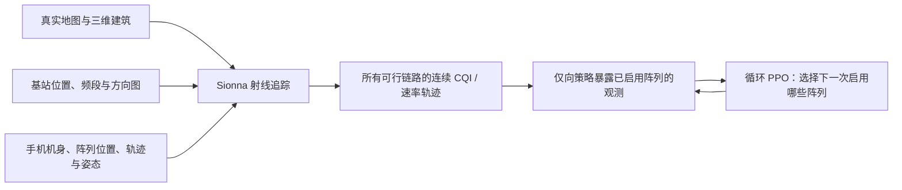
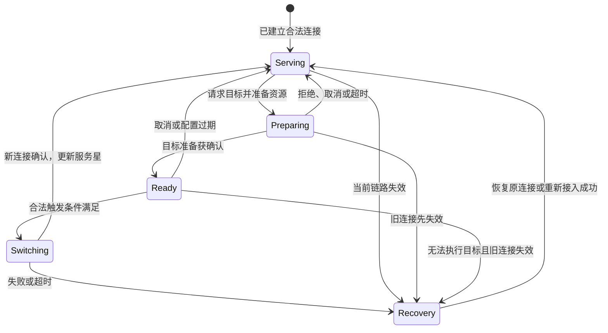

# MCMB-HDT 论文讲解：能否改成单频段 LEO 卫星选择的 World Model？

> **论文主旨：** 建立一个包含城市传播、手机机身、多个天线阵列和手机运动的数字孪生，再训练 PPO，让手机在只能观测少量阵列的条件下，决定保留哪个阵列、何时额外开启一个阵列测量。
>
> **对你的问题的判断：** 可以迁移为“地面 UE 在同一频段的多颗 LEO 卫星之间选择服务目标”，也可以引入 world model。但应保留轨道、链路和协议仿真作为数据与验证环境，在其上增加能预测动作后果的学习模型；单纯把 PPO 换成另一种网络，或者把基站编号改成卫星编号，研究问题还没有实质改变。
>
> **推荐主线：** 在有限且延迟的链路观测下，预测候选卫星的服务质量、资源竞争与切换结果，联合决定“保持、准备目标、执行切换”，提高扣除测量和切换损失后的实际交付量。地面终端一次只接收一条数据连接，多个用户可以共享同一颗卫星。

本文将**原论文内容**、**标准与公开系统资料**、**建议的研究扩展**分开说明。论文结果未独立复现；后面的公式、算法和实验建议不是原作者已经完成的工作。资料核查日期：2026-09-30。

## 1. 论文信息与阅读路线

| 项目 | 内容 |
| --- | --- |
| 标题 | *MCMB-HDT: A Multi-Cell Multi-Band Handset Digital Twin for Learning-Based Closed-Loop Array Activation* |
| 作者 | Ruibin Chen、Haozhe Lei、Marco Mezzavilla、Hitesh Poddar、Tomoki Yoshimura、Sundeep Rangan |
| 本地文件 | [JSAC_digital_twin.pdf](JSAC_digital_twin.pdf) |
| 阅读版本 | 你提供的 13 页 PDF；下文页码均为该 PDF 页码 |
| 发表信息 | 该文件未提供可确认的期刊卷期和 DOI；不能仅根据文件名认定已正式发表于 JSAC |
| 项目背景 | [WorldNTN 具体研究计划](../WorldNTN_ICC_concrete_research_plan.md) |

阅读顺序建议：第 2–4 节理解原文；第 5 节理解 world model 到底增加了什么；第 6 节看实际接入与切换；第 7–10 节看可实施的研究方案；第 11–12 节看如何验证价值。

## 2. 原论文到底想解决什么？

### 2.1 手机上有多个阵列，但不能一直全部开启

设想一个手机上有多个接收阵列。有些适合较低频率，有些适合较高频率；它们位于手机不同位置，朝向也不同。

同一个人沿街走路时，至少有三类变化同时发生：

- 人的位置变化：建筑遮挡、反射路径和可见基站改变。
- 手机姿态变化：转动、倾斜会改变各阵列面对的来波方向。
- 机身遮挡变化：即使位置相同，不同阵列受到的机身遮挡也可能不同。

因此，“刚才最好的阵列”过一会儿未必最好。但为了找出最好阵列，每次都把所有阵列开启测量，又会增加硬件使用和功耗。

**作者研究的是：只保留一个阵列工作，并且偶尔允许额外开启一个阵列时，怎样用有限测量持续找到较好的链路。** 这不是直接研究多用户负载均衡，也不是研究完整的蜂窝切换协议。（第 1–2、7–9 页。）

### 2.2 数字孪生负责生成“足够真实的连续无线环境”

论文的 MCMB-HDT 可理解为以下流水线：



这里最重要的不是三维画面，而是**在同一个连续场景中，不同阵列、不同频段的信道变化具有共同的物理原因**。不能把每条链路每个时刻的质量独立随机抽样，否则手机旋转、建筑遮挡带来的相关性就丢失了。

### 2.3 实际实例化了什么？

| 项目 | 论文设置 |
| --- | --- |
| 城市场景 | 纽约 NYU Tandon 校区附近，约 1 km × 1 km |
| 地面基站站点 | 2 个 |
| 每站频段 | 3.5 GHz / 100 MHz，以及 15 GHz / 200 MHz |
| 系统模型中的小区 | 4 个，即每个站点的两个频段各对应一个小区 |
| 手机 | 金属长方体机身，约 7 cm × 15 cm × 1 cm |
| 接收阵列 | 共 8 个：4 个 FR1、4 个 FR3 |
| 可行链路 | 频率匹配的小区—阵列组合，共 16 个 |
| 采样间隔 | 50 ms |
| 单条轨迹 | 60 s，共 1200 个采样点 |

第 3–5 页、表 I–IV。部分示意图只展示 4 个阵列，不表示后面的控制实验只有 4 个阵列。

论文用不同速度和转角分布生成运动轨迹，再通过移除建筑、移除详细机身、固定局部姿态等消融，观察最佳链路与速率轨迹如何改变。它说明这些建模要素会影响控制器看到的数据，但不等于已经用实测验证了整个数字孪生的准确度。（第 5–7 页，图 4–6。）

## 3. 原文控制方法：动作、观测、奖励分别是什么？

### 3.1 动作是“是否再开一个阵列”

令 $k_t^{\mathrm{keep}}$ 为当前保留的阵列，$a_t$ 为策略输出的阵列编号，则启用集合为：

$$
\mathcal A_t=
\begin{cases}
\{k_t^{\mathrm{keep}}\}, & a_t=k_t^{\mathrm{keep}},\\
\{k_t^{\mathrm{keep}},a_t\}, & a_t\ne k_t^{\mathrm{keep}}.
\end{cases}
$$

第二种情况相当于额外测一个阵列。只有启用阵列对应的可行链路向策略提供观测；没有开启的阵列，其实时质量对策略不可见。（式 (16)–(18)，第 8 页。）

随后环境在已观测链路中选择服务链路，并将其阵列保留到下一步。因此，**PPO 主要学习测量/阵列启用策略，服务链路的选取还包含一个环境内的贪心规则**；不是 PPO 直接联合求解全网关联和资源分配。

### 3.2 链路速率怎么计算？

原文用连续质量代理量 $\gamma_{ikt}$ 表示小区 $i$ 到阵列 $k$ 的链路质量，并映射到速率：

$$
R_{ikt}=B_i\min\left\{\rho_{\max},\ \beta\log_2(1+\gamma_{ikt})\right\}.
$$

其中 $B_i$ 是带宽，$\beta=0.6$ 是编码效率系数，$\rho_{\max}=4.8$ bit/s/Hz 是频谱效率上限。这里的 $\gamma$ 应使用线性值。（式 (7)、(15)，第 4、7 页。）

这是带上限的速率近似，并不是把真实 NR 的离散 CQI、MCS、BLER、HARQ 和调度过程全部实现了一遍。

### 3.3 “risk”在这里主要指什么？

作者定义一个动态变量：

$$
z_{t+1}=(1-\alpha)z_t+\alpha|\mathcal A_t|,\qquad z_1=1.
$$

因为 $|\mathcal A_t|$ 只能是 1 或 2，所以 $z_t$ 记录近期启用阵列数量的指数滑动平均。

进一步令 $e_t=\mathbf 1\{a_t\ne k_t^{\mathrm{keep}}\}$，则：

$$
z_{t+1}-1=(1-\alpha)(z_t-1)+\alpha e_t.
$$

所以 $z_t-1$ 可以解释为近期额外探索使用量的平滑估计。若 $z_t\ge1+\varepsilon$，该步被强制只保留一个阵列。

**这里的 risk 不是卫星链路掉线概率、尾部时延风险或 CVaR，也没有直接量化成焦耳。** 将它迁移到 LEO 时，应重新定义扫描时间、测量能耗和中断风险，而不是把这个变量改个名字就当可靠性保证。（式 (21)–(35)，第 8–9 页。）

### 3.4 PPO-rate 和 PPO-risk 的区别

PPO-rate 使用对数速率奖励：

$$
r_t^{\mathrm{rate}}=\log R_t.
$$

PPO-risk 在对数速率上乘以一个与阵列使用状态和当前速率有关的衰减因子：

$$
r_t^{\mathrm{risk}}
=(\log R_t)\,
\exp\left[-\lambda_1(z_t-1)\frac{R_t}{\lambda_2+R_t}\right].
$$

这是按原文式 (25) 的乘性惩罚含义整理的写法。当当前链路已经不错时，额外探索更容易受到惩罚；链路较差时，更愿意继续寻找替代阵列。

策略使用循环网络汇总历史，形式为：

$$
\pi_\theta(a_t\mid h_t,k_t^{\mathrm{keep}},z_t),
\qquad
h_{t+1}=f_\theta(h_t,o_t,a_t,\tilde r_t).
$$

实验中的 actor 和 critic 分别使用单层 GRU，隐藏维度 256。（第 9、11 页，表 V。）

**GRU 能记忆过去，不等于已经构建 world model。** 原文没有训练一个显式预测未来状态、观测和动作后果的环境模型，也没有通过模型内的多步想象来评估候选行动。

### 3.5 “闭环”为什么还能用提前生成的轨迹？

原文先用数字孪生生成 RF 轨迹，PPO 训练时回放其中一条轨迹，只暴露当前启用阵列的测量，再更新保留阵列和风险状态。（第 10 页。）

这种闭环成立，是因为动作改变了**信息获取、服务链路和内部控制状态**；它通常不改变已经设定的建筑、行人轨迹与潜在传播路径。

但如果扩展到多 UE 卫星网络，关联与调度会改变负载和同频干扰，便不能继续用一份与动作无关的“最终吞吐率轨迹”回答所有反事实动作。可以缓存几何、传播和外部随机过程，受本方动作影响的速率与资源状态必须重新计算。

## 4. 论文结果说明了什么？又没有说明什么？

### 4.1 数据与结果

研究区域分为 D1–D5；D1、D3–D5 用于训练，D2 留作测试。训练集共 4000 条轨迹，测试集 1000 条，均包含 medium/high 两种运动设置。（第 10 页。）

核心指标是 best-rate ratio：

$$
\mathrm{BR}_{\pi}=
\frac{\sum_t R_t^\pi}
{\sum_t\max_{(i,k)\in\mathcal C_{\mathrm{feas}}}R_{ikt}}.
$$

分母是假设每一步知道所有可行链路质量时的最佳累计速率。它是全信息参考，不是实际系统中免费的可实现策略。

表 VII 在 $\varepsilon=0.3,\lambda_1=0.3,\lambda_2=300$ 下报告：

| 指标 | PPO-risk | bandit-risk | $\varepsilon$-greedy |
| --- | --- | --- | --- |
| BR，均值 ± 标准差 | 0.867 ± 0.065 | 0.843 ± 0.076 | 0.817 ± 0.080 |
| 速率，Mbps，均值 ± 标准差 | 740.2 ± 127.7 | 719.9 ± 129.7 | 698.9 ± 131.2 |
| 平均 $z_t$ | 1.117 ± 0.059 | 1.251 ± 0.061 | 1.297 ± 0.013 |

由表内均值计算，PPO-risk 的平均速率相对 bandit-risk 约高 **2.8%**，相对 $\varepsilon$-greedy 约高 **5.9%**。这两个百分比是本文计算值，不是额外实验结果。

图 9 进一步表明，PPO-rate 倾向获得较高 BR；PPO-risk 在保留大部分速率收益的同时，降低额外阵列启用量。（第 11–12 页。）

### 4.2 读结果时需要保留的边界

1. **同一个 $\varepsilon$ 不等于相同实际测量预算。** PPO/bandit 使用风险阈值，$\varepsilon$-greedy 直接使用探索概率。表 VII 的 $z_t$ 已经显示它们实际开销不同；图 9 用经验探索量比较更有参考意义。
2. **结果是该仿真场景中的链路速率。** 没有完整的多用户调度、排队、准入与星间切换损失，不能直接理解为用户应用层吞吐量。
3. **测试区域仍属于同一校园环境。** 地域留出优于随机切片，但还不足以证明跨城市、不同硬件或实际卫星网络的泛化。
4. **高保真组件不自动等于实测校准。** 文中所展示的消融证明组件影响结果，不等于证明生成分布与真实场景一致。

### 4.3 复现前值得核对的文字和公式问题

- **小区计数表述：** 第 II 节明确为两个站点、四个频率小区、16 条可行链路；第 IV 节和图 7 又使用“two serving TX cells”等措辞。实现时应检查究竟指两个站点还是两个逻辑小区。
- **质量和干扰定义：** 第 II-A5 节将 $\gamma$ 写作平均接收 SNR；第 III 节又说同频干扰包含在测量数据里。原文没有给出完整同频干扰生成公式，不能据此认定其已实现动作耦合的干扰模型。
- **最大 CQI 与最大速率不总相同：** 式 (19) 取最大 $\hat\gamma$，后文式 (48) 又把全局速率奖励写成各阵列最大速率奖励；由于两个频段带宽不同，两者一般不等价，除非质量定义另有归一化。你的单频段、同带宽模型可以消除这一项歧义，但负载差异仍会使最大 SINR 不等于最大交付率。
- **零速率奖励：** $\log R_t$ 在 $R_t=0$ 时不可用。若复现，需要核实速率下限、归一化单位和 $\lambda_2$ 的单位，不能凭空假设作者代码的处理方式。

这些是依据当前 PDF 的核对项，不据此断言论文代码一定存在相同问题。

## 5. 能否改用 World Model？该替换哪一层？

### 5.1 数字孪生、预测器、world model、策略是不同角色

| 对象 | 回答的问题 | 在新方案中的用途 |
| --- | --- | --- |
| 数字孪生/物理仿真器 | 给定环境和动作，系统如何演化？ | 生成训练交互，提供独立测试环境 |
| 信道/吞吐率预测器 | 未来某条链路指标是多少？ | 可作为较轻量的预测基线 |
| 学习型 world model | 根据已知历史，在候选动作下，未来观测、协议状态、资源和收益如何变化？ | 预测多步动作后果，支持规划或想象训练 |
| PPO 等策略 | 当前应执行什么动作？ | 将历史/状态映射为动作，可作为基线或模型上的策略 |
| MPC 等规划器 | 哪一段未来行动方案预期更好？ | 用预测模型比较方案，滚动执行第一步 |

广义上，数字孪生也可以充当环境模型。这里为了明确研究贡献，将 **world model 专指从交互数据学习、可用于动作条件预测的模型部分**。

典型的 Dreamer 方法学习潜在环境动力学，再利用模型生成的未来轨迹训练行为；本项目可以借鉴这一点，但不必整套照搬，更不需要生成视频或调用大语言模型。[DreamerV3 原论文](https://arxiv.org/html/2301.04104v2)

### 5.2 推荐的是“保留物理环境，增加学习模型”


**最有研究价值的替换，是把“仅凭历史输出一个动作”扩展成“先预测多个动作方案的后果，再决策”。** 数字孪生仍然用于建立可信的测试环境；world model 用于在线估计和快速推演。

### 5.3 哪些情况下没必要上复杂 world model？

如果所有候选星质量实时可见、轨道完全已知、资源充足、没有切换中断、没有时间相关遮挡，那么当前选最大可用速率可能已经足够。

即使有切换成本，只要几何决定绝大部分变化，**轨道预测 + 规则控制或经典 MPC** 也可能表现很好。仅仅“卫星在移动”不足以证明学习模型的价值。

更适合 world model 的条件是：候选链路只能间歇测量；遮挡、干扰或业务负载具有可学习的时间相关性；准备与执行存在延迟；错误切换会影响后续可用资源与服务连续性。是否真的满足这些条件，应通过实验，而不是在问题描述里预设答案。

## 6. 实际 LEO 中，地面 UE 和卫星如何配对？

### 6.1 先区分“卫星、波束、小区、基站”

它们不能直接画等号。透明转发 NTN 中，无线协议经卫星转发到地面侧；可选服务对象还涉及波束和小区配置。准地固覆盖在一定时间内服务同一地理区域，地球移动覆盖则随卫星运动扫过地面。[TS 38.300 V18.5.0，§16.14.1](https://www.etsi.org/deliver/etsi_ts/138300_138399/138300/18.05.00_60/ts_138300v180500p.pdf#page=210)

对研究建模，更完整的关联标识应写成：

$$
\ell=(s,b,c,g),
$$

其中 $s$ 是卫星，$b$ 是服务波束，$c$ 是小区，$g$ 是控制该接入的 gNB/接入节点标识。

如果第一版只想研究“选卫星”，可以**明确约定：每个 UE 对每颗候选卫星只保留一个由既定规则确定的可接入波束/小区**，把 $b,c,g$ 作为该候选的属性。这样动作写作 $s$ 才不会丢失必要协议信息。这是本文建议的简化，不是实际系统的一星一小区规定。

### 6.2 不是“天空中看见了，就能连”

建议按以下层次建立候选集；前四层得到可请求集合，最后一层得到已批准、可执行的目标：

| 层次 | 要回答的问题 | 在模拟器中如何体现 |
| --- | --- | --- |
| 几何与终端能力 | 仰角、遮挡、阵列视场、可跟踪角速度是否允许？ | 轨道计算、天线能力及已知静态障碍筛选 |
| 服务覆盖 | 该星是否有正在或即将覆盖 UE 的可用波束/小区？ | 网络覆盖计划和波束服务时间窗 |
| 网络资格 | 是否属于允许接入的网络、频段和业务配置？ | 运营方/接入限制和配置掩码 |
| 可测与可同步 | 是否能在配置时间窗内接收同步/参考信号？相关信息是否新鲜？ | 候选测量记录、信息年龄和同步状态 |
| 准入与资源 | 目标能否接纳该用户并提供所需资源？ | 请求、接受/拒绝、资源准备和确认事件 |

这是将实际限制转为研究接口的建议。特别要区分：**没有测过，不代表物理上不可用；看起来信号好，也不代表资源已获批准。** 控制器不能用仿真器内部的未知遮挡或真实负载来提前删去坏候选。

### 6.3 初始接入：UE 先找到合适小区，再建立通信

在 NR 的空闲/非激活状态，小区选择和重选由 UE 按配置规则进行；初始选择的目标是找到 suitable cell，并不要求先穷举所有候选的长期吞吐率。接收电平、质量门限和接入限制都参与判断。[TS 38.304 V18.4.0，§5.2–5.3](https://www.etsi.org/deliver/etsi_ts/138300_138399/138304/18.04.00_60/ts_138304v180400p.pdf#page=21)

物理过程可概括为：搜索同步信号、读取必要系统信息、建立时间/频率同步，再进行所需接入交互。NTN 上行还需要处理传播时延和 Doppler，后者涉及服务链路频率预补偿。[TS 38.300 V18.5.0，§16.14.2.2](https://www.etsi.org/deliver/etsi_ts/138300_138399/138300/18.05.00_60/ts_138300v180500p.pdf#page=212) 不能把“下行测到信号”直接等同于“已经能够双向通信”。同步、时序调整与随机接入的物理过程见 [TS 38.213 V18.5.0，§4、§8](https://www.etsi.org/deliver/etsi_ts/138200_138299/138213/18.05.00_60/ts_138213v180500p.pdf)。

SIB19 可提供 NTN 接入辅助信息，包括星历、公共 TA 参数、历元及相关有效性信息，并可包含邻区辅助信息；它不是所有候选卫星实时 SINR 和负载的全知接口。[TS 38.331 V18.5.1，SIB19 / NTN-Config](https://www.etsi.org/deliver/etsi_ts/138300_138399/138331/18.05.01_60/ts_138331v180501p.pdf#page=648)

**研究建议：** 第一版可以从“已建立一个合法初始连接”开始，把冷启动作为后续实验。但断链后的恢复必须存在，不能让失联用户下一步凭空获得任意卫星连接。

### 6.4 已连接后的切换：谁决定，谁执行？

普通连接态切换包含网络侧的目标准备和配置，目标接入节点处理准入，UE 执行收到的切换配置。条件切换（CHO）则允许网络提前配置候选及条件，由 UE 在条件满足时执行。[TS 38.300 V18.5.0，§9.2.3、§16.14.3.2](https://www.etsi.org/deliver/etsi_ts/138300_138399/138300/18.05.00_60/ts_138300v180500p.pdf#page=88)

NTN 的条件切换还可使用时间或位置条件；RRC 中有相应的条件事件和参数。研究算法可以优化候选准备时机和配置，但若使用不同于标准事件的任意学习触发器，需要声明为研究扩展。[TS 38.331 V18.5.1，§5.3.5 条件重配置与条件事件定义](https://www.etsi.org/deliver/etsi_ts/138300_138399/138331/18.05.01_60/ts_138331v180501p.pdf#page=147)

因此，本项目若要同时考虑多个 UE 的资源竞争，建议把控制器放在**有权协调这些接入节点的网络侧**。UE 提供测量并执行指向/接入；网络侧决定目标、准备资源与执行计划。如果改成纯 UE 端算法，其输出应是候选偏好或请求，准入成功率和控制权限都要重新建模。

### 6.5 换卫星不一定是完整的 L3 小区切换

Rel-18 支持在特定准地固、同 SSB 频率、同 gNB 条件下，通过保持 PCI 的 satellite switch with re-synchronization 换星，避免 L3 移动性过程；该版本也支持满足条件的 RACH-less handover。[TS 38.300 V18.5.0，§16.14.3.2.1–3](https://www.etsi.org/deliver/etsi_ts/138300_138399/138300/18.05.00_60/ts_138300v180500p.pdf#page=213)

由此得到一个直接建模要求：至少区分**指向/波束调整、换星重同步、小区切换**三类事件，分别配置耗时、失败条件和服务中断。不能给所有卫星编号变化统一加一个“完整 RRC 重建”的固定罚项。

反过来，一颗卫星换成另一颗也可能是网络覆盖计划驱动的整体替换。若终端所在小区在某段时间根本没有多个被授权的替代接入路径，UE 就没有自由择星空间。**实验必须统计真正存在多个可执行候选的时间比例。** 若一个波束/小区内的用户必须随整体覆盖计划一起换星，就应以该服务组为决策单位，或给 UE 级选择加入组内一致性约束，不能允许每个用户独立改动共享的卫星—小区映射。

### 6.6 单频段仍然有测量、同步与竞争问题

单频段能去掉跨频段选择，但不会使所有候选卫星的信号都自动可见。对于本项目假设的单 RF 链、定向接收终端，测另一个方向可能需要占用测量窗口，暂时离开服务方向；一个波束有时也能接收到多个参考信号，应按实际方向图和信号时序决定，而不是机械规定“一次只能看到一颗星”。

这里将“单频段”具体化为**一个固定下行载频 $f_c$ 和带宽 $B$，所有候选卫星在这个服务载频上竞争/复用**。载频和频段不作为动作。资源块仍是该带宽内部的调度单位，不是新增可选频段。

此外，本文引用的 Rel-18 NR NTN 架构适用于 FDD。因此，单频段研究应保留必要的配对上行控制/接入通道；不能据此声称上下行都在同一物理频率上完成。[TS 38.300 V18.5.0，§16.14.1](https://www.etsi.org/deliver/etsi_ts/138300_138399/138300/18.05.00_60/ts_138300v180500p.pdf#page=211)

### 6.7 商用宽带 LEO 与 NR NTN 应分开描述

商用宽带星座的终端、载荷和控制协议不应直接当作完整 NR NTN 实现。Starlink 官方资料说明其终端可利用遮挡信息进行主动换星，这支持“服务对象会动态调整”的事实，但不足以恢复其全部选择策略。[Starlink：Obstructions Explained](https://starlink.com/au/support/article/d79d6c7f-b871-78fb-8083-a11f41b45eeb)

测量论文 *Making Sense of Constellations* 提供了存在分层控制的证据：全局层分配卫星与终端，星上层调度用户流量。这是研究者基于测量的推断，不是运营方公开的完整算法，也不保证适用于所有时期和终端。[原研究，arXiv:2307.00402](https://arxiv.org/abs/2307.00402)

**本文方案的定位：** 同一运营方协调的 LEO 服务链路研究模型，借鉴 NR NTN 的可执行接入/切换约束；采用定向地面终端，不声称复刻 Starlink 私有协议，也不把单 RF 链当作所有商用终端的硬件事实。

## 7. 如何把原论文改成你的单频多卫星场景？

### 7.1 一一对应哪些概念？

| 原文概念 | 建议保留的思想 | 在 LEO 中的变化 |
| --- | --- | --- |
| 小区—阵列链路 $(i,k)$ | 多条有相关性的候选链路 | UE—卫星—服务波束/小区链路 |
| FR1/FR3 两个频段 | 不需要保留 | 固定一个下行载频和带宽 |
| 手机位置和转动 | 信道存在连续变化 | 以卫星运动、覆盖窗口、局部遮挡为主；终端姿态按设备场景设置 |
| 保留当前阵列 | 保持已有服务可减少开销 | 保留当前服务连接并持续跟踪 |
| 额外开一个阵列 | 测量需要预算 | 配置候选测量窗口；单 RF 主版不假设双接收链 |
| 已观测链路中取最大值 | 有限观测下比较候选 | 要再考虑准入、负载、同步和切换时间 |
| $z_t$ 控制探索使用 | 显式记录测量开销 | 记录测量时长、信息年龄、信令与中断 |
| 轨迹回放环境 | 可复用外生轨迹 | 关联、调度、准入和干扰响应必须在线更新 |
| 循环 PPO | 需要历史记忆 | 作为强基线；新方法另加 world model 与规划 |

**两项不能直接搬：** 原文“一步选出服务链路”的理想化规则，以及“额外阵列开启后免费得到该阵列全部候选测量”的观测能力。

### 7.2 一个收敛、可实施的主场景

沿用项目已有研究计划中的固定地面终端，但本篇将主动作先收敛为卫星选择与切换时机：

- 同一受控运营方；多个固定地面 UE，每个有自己的业务和单 RF 定向接收阵列。
- 同一下行服务频段，各 UE 同时至多一条活动数据连接；一颗卫星可服务多个 UE。
- 波束指向由几何跟踪器执行；第一版不同时学习连续相位、发射预编码和功率控制。
- 网络控制器获得带时间戳的链路、负载和协议报告，协调候选准备、准入与切换。
- 下层调度器使用所有算法共用的固定规则；上层动作主要是关联和切换过程。
- 主版馈电/回传资源充足、业务可供给到接入层，显式计入必要控制延迟；网关和星间路由拥塞作为扩展。
- 星内采用一个正交资源池、星间允许同频复用。这是隔离关联机制的简化，不代表完整多波束空间复用系统。

接收抗干扰波束、联合资源优化可以随后接回 [WorldNTN 研究计划](../WorldNTN_ICC_concrete_research_plan.md)，但第一组实验先回答：“**只增加有物理和协议约束的前瞻卫星选择，到底有没有收益？**”

### 7.3 几何可预测，但剩余可服务时间不只由仰角决定

轨道与终端位置给出距离 $d_{us}(t)$、仰角、方位和径向速度；近似几何量为：

$$
\tau_{us}^{\mathrm{service}}(t)=\frac{d_{us}(t)}{c},
\qquad
f_{D,us}(t)\approx-\frac{f_c}{c}\dot d_{us}(t).
$$

这些是服务链路单程时延与未补偿 Doppler 的近似，不是端到端 RTT。透明转发架构还需考虑馈电链路、处理和信令调度。

建议定义可请求集合：

$$
\mathcal S_u^{\mathrm{req}}(t)=
\{s:\text{已知几何、视场、服务波束和网络配置允许请求}\}.
$$

剩余可服务时间 $T_{us}^{\mathrm{avail}}$ 应取相关约束最先失效的时刻，例如仰角越界、视场越界、波束服务结束或已知资源授权到期。对未知遮挡和未知负载，只能保留预测分布，不能当成确定的未来可用性。

### 7.4 关联变量必须表示“已经接通”

令 $x_{us}(\ell)\in\{0,1\}$ 表示协议子时隙 $\ell$ 中已经接通的数据连接：

$$
\sum_s x_{us}(\ell)\le1,\qquad x_{us}(\ell)\le V_{us}(\ell).
$$

$V_{us}$ 是环境中的物理/配置可服务指示；控制器只使用其合法已知信息或估计。

**目标选择命令 $s_u^{\mathrm{target}}$ 不等于 $x_{us}=1$。** 只有完成相应同步、接入和确认之后，新目标才成为活动连接。准备阶段可保留旧连接，目标侧准备也不意味着 UE 同时收两路数据。

### 7.5 单频段中的资源共享和同频干扰

把固定带宽划分为 $Q$ 个资源块，每块带宽 $B_{\mathrm{RB}}$。在主版星内正交资源模型中，令 $a_{usq}(\ell)$ 为实际数据分配，$r_{usq}(\ell)$ 为目标资源预留，均为二元变量：

$$
\sum_u\big(a_{usq}(\ell)+r_{usq}(\ell)\big)\le1,
\qquad a_{usq}(\ell)\le x_{us}(\ell).
$$

只有已经批准且未过期的目标准备才可产生 $r$；预留激活后转为 $a$，不能双重占用。若模型只准备上下文而不预留具体资源块，就令该阶段 $r=0$，另行模拟准入时的可用资源。不要凭空给每颗卫星设置“只能连接一名用户”。

若所选硬件/接入模型确有上下文或波束槽上限，再显式加入该容量；未准备好资源时，网络应拒绝、等待或重新调度，而不是让 UE 任意挤掉其他用户。

同一资源块上的下行 SINR 可建模为：

$$
\Gamma_{usq}(\ell)=
\frac{P_{sq}g_{s\to u}^{(u)}(\ell)}
{N_0F B_{\mathrm{RB}}+I_{uq}^{\mathrm{ext}}(\ell)
+\sum_{s'\ne s}\sum_v a_{vs'q}(\ell)P_{s'q}g_{s'\to u}^{(v)}(\ell)}.
$$

$g_{s'\to u}^{(v)}$ 包含卫星 $s'$ 朝服务对象 $v$ 发射时，在受扰 UE $u$ 处的发射增益、路径增益及 $u$ 当前接收方向图。$F$ 为线性噪声系数，所有功率须使用一致的线性单位。总发射功率也要满足预算。

由此可以看出：

- **关联与调度会改变本网络干扰。** 不能预先为每颗卫星存一条与动作无关的最终 SINR。
- **可见卫星不一定正在同资源发射。** 空闲资源不应自动产生满功率干扰。
- **换星不会让外部干扰自动消失。** 外部物理源保持一致，变化可来自接收指向和期望信号。
- **同频复用不等于任何情况下都被强干扰限制。** 方向图、空间隔离和实际资源重叠决定干扰强度。

### 7.6 用实际交付量，而不是瞬时最好链路，评价选择

令 $g_u^{\mathrm{data}}(\ell)$ 表示终端在该子时隙是否能接收数据；扫描其他方向、重同步或中断期间可为 0。一个控制周期内潜在服务量为：

$$
\widetilde D_{u,t}=
\sum_{\ell\in\mathcal I_t}\delta_\ell\,g_u^{\mathrm{data}}(\ell)
\sum_{s,q}a_{usq}(\ell)B_{\mathrm{RB}}\eta\big(\Gamma_{usq}(\ell)\big).
$$

$\eta$ 是注明假设的成功传输频谱效率映射，可先采用带上限近似，再用 MCS/BLER 映射做稳健性检查。调度器应同时禁止给不可接收时段分配实际数据，避免无效占用。

若每周期需求为 $d_{u,t}$ bit，第一版采用无跨周期积压的业务模型：

$$
D_{u,t}=\min\{d_{u,t},\widetilde D_{u,t}\}.
$$

未服务需求计入缺口。若改成有队列业务，必须新增队列递推和等待时延，不能在两种模型之间混用指标。

可采用归一化奖励：

$$
r_t=\sum_u w_u\log\left(1+\frac{D_{u,t}}{D_{\mathrm{ref}}}\right)
-\lambda_d\sum_u\frac{(d_{u,t}-D_{u,t})_+}{D_{\mathrm{ref}}}
-\lambda_o\sum_u\frac{T_{u,t}^{\mathrm{out}}}{\Delta}
-\lambda_h N_t^{\mathrm{attempt}}
-\lambda_m\frac{T_t^{\mathrm{meas}}}{\Delta}.
$$

$D_{\mathrm{ref}}>0$ 是参考交付量；$T^{\mathrm{out}}$、$T^{\mathrm{meas}}$ 是中断与测量时长。交付量已经扣除了这些损失，附加罚项表示额外的连续性、信令或测量偏好，应通过消融说明，避免无意重复惩罚。

硬性的网络资格、资源和协议可执行条件由约束保证，不能只希望策略在奖励惩罚后“学会不违规”。

## 8. 把“选一颗星”落成可执行的切换过程

以下状态机是**研究抽象**，用于保留协议的因果顺序；并不是逐条替代标准消息或实现完整协议栈。



| 状态 | UE 能否继续收旧星数据？ | 控制器可执行什么？ |
| --- | --- | --- |
| Serving | 通常可以，测量窗口除外 | 保持、安排测量、请求准备目标 |
| Preparing | 旧连接有效时可以 | 等待、取消；目标资源尚不能当成已接通 |
| Ready | 旧连接有效时可以 | 按配置继续等待、取消、启动执行 |
| Switching | 单 RF 主版在离开旧服务方向后中断 | 跟踪目标、同步、执行所需接入，等待结果 |
| Recovery | 通常没有正常数据服务 | 使用预先声明的本地恢复/重新选择规则 |

同一 UE 第一版至多保留一个待执行目标，便于控制动作空间；多候选 CHO 准备作为扩展。若采用同小区换星重同步，使用对应的较简状态转移；不能强制走完整跨小区流程。

### 8.1 每一步动作与效果之间有时间差

建议至少记录以下时间戳：

1. $t^{\mathrm{sample}}$：UE 实际测量的时刻。
2. $t^{\mathrm{report}}$：报告到达控制器的时刻。
3. $t^{\mathrm{decision}}$：计算完成、形成命令的时刻。
4. $t^{\mathrm{effective}}$：命令实际到达并生效的时刻。
5. $t^{\mathrm{complete}}$：目标接入完成且结果确认的时刻。

模型要从已收到报告所对应的历史，预测到真正执行时刻。报告还在路上时，不能提前用于当前决策；控制器没收到确认，也不能假定切换已成功。

整个切换过程并非全程断数传。**网络准备阶段可以继续旧连接，终端离开旧链路后的同步/接入阶段才造成对应的数据中断。** 两者应分别计时，而不是将全部准备延迟都扣成掉线时间。

### 8.2 保留两个时间尺度

- **通信/协议尺度：** 参考信号、测量窗口、同步、资源调度和计时器事件。
- **关联规划尺度：** 几百毫秒到若干秒量级的候选评估与重规划，具体随场景校准。

后者只是建模起点，不是标准规定。可先试关联周期 $\Delta=0.5$ s、预测窗 5–20 s，配合更细的事件驱动协议执行，再检查计算量与结论对时间步长的敏感性。不能因为关联周期为 0.5 s，就把所有测量和接入耗时都舍入成瞬时。

预测窗应覆盖“准备 + 执行 + 切换后收益显现”的时间，否则规划器只看到了开销，看不到收益。更远的确定性覆盖边界可以用终端价值或覆盖约束表达，不必把每毫秒一直展开到整段过境结束。

## 9. World Model 具体学什么，怎么用？

### 9.1 先把状态拆开，避免让网络重新学习轨道公式

设系统状态为：

$$
s_t=(c_t,\xi_t,\chi_t).
$$

| 部分 | 示例 | 建模建议 |
| --- | --- | --- |
| $c_t$：已知/可预测几何与配置 | 星历、距离、方位、仰角、服务时间窗、固定方向图 | 解析轨道和已知规则；星历误差作为失配测试 |
| $\xi_t$：未完全观测的外生状态 | 动态遮挡、外部干扰活动、背景业务需求、传播残差 | 学习具有不确定性的时序模型 |
| $\chi_t$：网络和协议状态 | 服务星、准备目标、资源账本、协议阶段、计时器、待确认命令 | 已知规则显式递推；不确定执行结果由模型估计 |

受控用户的关联、预留和已下达命令不是无法解释的“隐藏负载”。它们应从账本递推；尚未到达的确认、未知背景业务和执行失败才需要估计。

在外部源不响应本方动作的主设定下，可写成：

$$
\begin{aligned}
c_{t+1}&=F_{\mathrm{orbit/config}}(c_t),\\
\xi_{t+1}&\sim p_\theta(\xi_{t+1}\mid\xi_t,c_t),\\
\chi_{t+1}&=\Phi(\chi_t,A_t,c_t,\xi_t,\nu_t),\\
o_{t+1}^{\mathrm{arrived}}&\sim
p_\theta(o_{t+1}^{\mathrm{arrived}}\mid c_{\le t+1},\xi_{\le t+1},\chi_{\le t+1},A_{\le t}).
\end{aligned}
$$

$A_t$ 是多 UE 联合控制动作，$\nu_t$ 表示同步、接入或执行的不确定结果。观测模型包含采样掩码、接收波束、测量噪声和到达延迟；必要时用待发送/待到达消息队列实现。

**即使外部干扰本身不受动作影响，完整模型仍然是动作条件的。** 因为动作改变当前接收方向、资源占用、可见观测、接入状态和未来可执行动作。若要研究会追踪本方切换的干扰源，才需进一步给外生状态转移加入动作依赖，并专门采集相应数据。

### 9.2 输入应是控制器真的能获得的历史

对每个候选 UE—卫星链路，输入可以包含：

- 已知几何、预计服务结束时间、波束/小区属性。
- 最近一次链路测量、测量时间、接收方向、噪声/置信度、缺失标志。
- 当前服务对象、连接已持续时间、协议阶段及其计时器。
- 已到达的负载与准入报告、已确认资源、待确认请求。
- 用户已报告业务需求、历史实际交付量和解码反馈。

未测候选不应填成“当前真实 SINR”；旧测量也不应当成新测量。模型隐状态 $h_t^{\mathrm{WM}}$ 汇总历史，形成对当前未知状态的估计 $b_t$；它与原文的阵列风险变量 $z_t$ 是不同对象。

第一版可以用 GRU/RSSM 加候选掩码。候选数量变化时，用共享链路编码器与集合聚合；多 UE 竞争明显时，再用 UE—卫星二部图表达共享资源与实际干扰关系。图网络应服务于真实耦合关系，而不只是模型名字。

### 9.3 输出必须支持比较不同动作后果

世界模型至少要支持推演：

| 推演对象 | 为什么影响选择 |
| --- | --- |
| 链路质量/成功交付的分布 | 短暂变差与持续变差应该触发不同决策 |
| 目标准备、准入和接入结果 | 信号好但无法接入的目标不能获得虚构收益 |
| 资源竞争与共享后的可服务量 | 两个 UE 同时选同一颗星会改变彼此收益 |
| 未来观测及其到达时间 | 决定执行时知道什么、还不知道什么 |
| 完成切换后的剩余服务窗口 | 防止刚完成切换又立刻被迫换星 |

已知的资源守恒、定时器和速率计算尽量直接实现，模型主要预测其中未知的量。不必另用神经网络重复学习已知奖励公式。

建议预测分布或使用模型集成，给出不确定性；平均预测正确但低估失败尾部，可能仍会让规划器选择危险目标。多步预测质量也比仅报告下一时刻 MSE 更重要。

### 9.4 训练数据怎样获得？

建议保存交互记录：

```text
场景/轨迹 ID，几何与公开配置
测量采样时间、报告到达时间、缺失掩码与测量值
控制请求、网络批准动作、实际生效动作及各自时间戳
资源分配、协议状态、执行结果、交付量与业务缺口
```

训练数据混合来自带滞回的贪心、最长服务时间、负载感知策略和受约束探索。否则只收集“始终选最强星”的轨迹，模型难以知道从未尝试过的其他关联组合会怎样。

训练目标包括已观测量的似然/预测误差、准入/失败结果预测、多步一致性和不确定性校准。缺失观测要用掩码处理，不能把缺失当零，也不能自动作为全量监督。

模拟器隐藏真值可用于诊断，或作为另行标注的辅助监督实验；推理输入仍只能用合法历史，且应报告去掉特权监督后的结果。

**反事实数据的边界：** 可以固定同一外生随机种子，对不同动作重新运行网络与协议状态；不能仅修改一份历史日志中的卫星编号，却保留原来的资源分配、干扰和吞吐率，当作新动作标签。

### 9.5 推荐先做 world-model MPC，再考虑 Dreamer 风格训练

第一阶段使用模型滚动规划，容易解释收益来自何处：

$$
A_{t:t+H-1}^{\star}\in
\arg\max_{A\in\mathcal A_{\mathrm{feas}}(b_t)}
\left[
\mathbb E_{\hat p_\theta}\sum_{k=0}^{H-1}\gamma^k r_{t+k}
-\lambda_{\mathrm{unc}}\mathcal U(A,b_t)
\right].
$$

这里 $\mathcal U$ 为模型不确定性惩罚，约束包含资源、服务窗口和协议可执行性；这不是自动获得的可靠性证明。执行第一步后，等待新报告再更新估计和规划。

实现顺序可以是：

```text
每到一个关联决策时刻：
  1. 接收截至当前时刻真正到达的测量、准入与切换确认。
  2. 更新隐藏状态估计，并递推已知几何、资源和协议账本。
  3. 构造合法动作：保持、准备目标、等待、取消、执行已批准目标。
  4. 用模型预测不同方案的交付量、测量/中断损失及未来资源占用。
  5. 删除确定性不可行方案，对模型不确定性较大的方案降低评分。
  6. 下发当前可执行动作；在其生效前继续已有合法服务。
  7. 下层调度与协议模块推进，记录实际结果，进入下一次更新。
```

主实验可固定所有方法共用的候选测量规则，不把主动扫描加入动作。先证明“利用同样的有限观测预测切换后果”有效，再研究“主动选择测哪颗星”。这样更容易分离测量策略收益和关联规划收益。

多 UE 时不要直接枚举 $K^U$ 个联合关联。可先按真实共享资源形成局部竞争组，使用受约束候选搜索或逐用户协调更新，并固定相同计算预算。近似搜索得到的是可行方案，不能称为全局最优。

模型内部的未来随机状态只用于模拟；未来动作只能依赖模拟出来、当时已可获得的观测，不能读取抽样出的隐藏真值。第一版采用开环动作序列加滚动重规划最容易保证这一点；加入未来观测反馈时，需要显式构造因果的反馈策略。

之后若在线搜索太贵，再比较“模型内想象训练策略”或将规划器蒸馏成策略网络。PPO 也可以保留作为候选方案生成器；world model 与 PPO 并不是互斥选项。

## 10. 一个小例子：为什么要预测多步结果？

以下数字仅用于解释，**不是实测值、标准参数或论文结果**。假设业务充足，目标 B 已具备必要的准入条件，20 s 窗口内：

| 方案 | 当前/未来服务 | 有效交付量 |
| --- | --- | --- |
| 保持 A | 前 2 s 为 12 Mbps，随后 18 s 因遮挡降至 2 Mbps | $12\times2+2\times18=60$ Mbit |
| 转到 B | 中断 0.5 s，随后持续 8 Mbps | $8\times19.5=156$ Mbit |

瞬时速率会倾向 A，前瞻规划可能选择 B。但若 A 的下降只持续很短时间，或者 B 即将拥塞，保持 A 也可能更优。

**这个例子只能说明预测规划有用，不能证明神经 world model 必要。** 若几何/遮挡变化已知，经典 MPC 同样可以做出正确选择。学习模型的价值需要来自对未知、有限观测动态的更好估计。

多 UE 时还要算被迁入者影响的其他用户：如果另一个用户只能使用 B，让两个用户平分 B 的资源，原来计算的 156 Mbit 就不再成立。控制器应比较联合交付和最低需求，而不是每个 UE 独立抢自己的最高预测速率。

## 11. 怎样证明这个改法有价值？

### 11.1 至少需要这些基线

| 基线 | 目的 |
| --- | --- |
| 最佳已测 RSRP/SINR + 滞回 + 持续触发时间 | 排除收益仅来自避免频繁乒乓切换 |
| 最长剩余可服务时间 | 排除收益仅来自已知轨道和覆盖窗口 |
| 负载感知的即时选择 | 排除收益仅来自把容量竞争算进去 |
| 循环 PPO，使用同样观测、动作和协议执行器 | 与原文方法思想直接比较，排除收益仅来自历史记忆 |
| 物理几何 + 简单时间模型 + MPC | 检验学习复杂动态的必要性；可用 HMM、状态空间模型或自回归残差 |
| 相同学习预测器 + 单步决策 | 区分“预测更准”与“多步规划”的贡献 |
| 混合 world model + MPC | 建议主方法 |
| 未来真值辅助的协议可行规划器，小规模 | 衡量剩余改进空间；若只做近似搜索，应称参考而非严格上界 |

比较时保持相同的候选资格、测量预算、到达延迟、硬件能力、资源规则和执行状态机；让所有可部署基线都使用已公开几何。调整滞回、触发时间和奖励权重应使用验证集。

无切换成本、每步知道所有链路的贪心 oracle 可作理想化参考，但不能拿它与真实执行方案直接比较，再把差距都归因于预测误差。

### 11.2 用分阶段实验隔离收益

| 阶段 | 场景 | 应验证的事实 |
| --- | --- | --- |
| E0 | 几何已知、资源充足、全观测、无未知动态 | 经典预测方法是否已经足够；复杂模型不应靠额外信息获胜 |
| E1 | 单 UE、多候选星、固定测量预算、动态遮挡/干扰 | 历史与不确定性估计是否提高有效交付 |
| E2 | 加入报告、准备、同步和执行延迟 | 瞬时择星所得收益在真实流程下是否仍存在 |
| E3 | 多 UE 共享卫星资源、真实同频干扰 | 联合关联是否优于各用户独立选择 |
| E4 | 未见地理位置、日期/轨道相位、负载强度和干扰模式 | 泛化、校准与模型失配时的表现 |
| E5 | 增加主动测量，或恢复接收波束控制 | 额外动作的收益是否超过测量/控制成本 |

先使用真实轨道几何生成候选，再选有代表性的少量 UE 场景排查模型。还要报告自然场景中的多候选比例、候选数量分布和用户竞争频率，不能只展示手工构造的“总是有三颗完美替代星”的情形。

至少做以下消融：不带历史、去掉动作条件、去掉几何先验、忽略测量年龄、忽略切换状态、单步预测替代多步预测、去掉不确定性处理。去掉动作条件时，仍允许外生过程保持独立，但要移除完整模型对关联/协议后果的区分，才能测试真正的问题。

### 11.3 报告什么指标？

**最终通信效果：** 累计实际交付、需求满足率、各 UE 的低分位服务水平、最长连续中断、切换失败率、乒乓次数、准入拒绝率。

**执行开销：** 测量时间与次数、控制信令、准备资源占用、切换准备时间和数据中断时间，分别统计。

**预测质量：** 多个预测步长的误差/似然、失败概率校准、置信区间覆盖率，以及选错目标造成的实际交付损失。仅下一步平均 MSE 更低不够。

**计算与训练代价：** 端到端决策延迟、超时率、数据量、训练成本。规划计算所消耗的时间应计入命令生效过程，不能在仿真中暂停系统等待算法想完。

训练/验证/测试按完整轨迹、日期和地理区域划分，避免重叠窗口泄漏。不同方法使用共同外生场景种子，并报告多次训练与测试的置信区间。

### 11.4 允许出现“world model 不值得”的结果

出现下列情况，应简化方法或调整研究问题：

- 可执行候选几乎始终只有一个：择星自由度不足。
- 几何预测加滞回已接近可行参考：学习模型空间有限。
- 剩余不确定性近似独立噪声：不能凭历史可靠预测。
- 增益只在不计测量成本或不给基线星历时出现：比较不公平。
- 预测误差虽下降，实际交付和中断没有改善：模型未提供决策价值。
- 计算耗时或目标资源预留抵消收益：需缩小模型或采用策略蒸馏。

这些结果有助于判断问题的真实结构，不应通过人为增大切换罚项、压低卫星容量或额外限制基线来制造优势。

## 12. 对你的选题的具体建议

### 12.1 推荐工作题目与研究问题

中文：**有限观测下基于混合世界模型的单频 LEO 卫星关联与切换规划**。

英文：**World-Model-Assisted Single-Band LEO Association and Handover Planning under Partial Observability**。

核心研究问题可以写为：

> 在地面终端只能间歇获取候选链路信息、网络准入和切换需要时间、多个用户共享同频卫星资源的条件下，如何结合可预测轨道与学习得到的未知动态，选择服务卫星及其准备/切换时机，以提高有效交付和服务连续性？

潜在贡献应落在三个可验证点上：**协议可执行的部分观测建模、物理与学习结合的动作后果预测、相同观测预算下的多步关联决策收益**。

### 12.2 不宜声称“首次把 world model 用到卫星”

已经有 LEO 研究联合优化卫星切换与视频码率，并包含 MPC 和 RL 方法。因此“有预测”“考虑切换”或“使用 PPO”本身都不是充分创新点。[Joint-LEO 作者代码与论文信息](https://github.com/kyoungjunpark/Joint-LEO)

卫星计算网络中也已有 world-model 方法，例如 WM-MAPPO 用学习的状态动力学辅助任务卸载。它与本文的接入关联任务不同，但说明“world model + 卫星”的宽泛组合不能作为首创主张。[Collaborative Task Offloading in Space Computing Power Network，IEEE TCCN，2026](https://ieeexplore.ieee.org/document/11627949/)

以上仅为定向检索发现的近邻工作，不是完整创新性查新。正式定题时还应逐项对照：控制对象、可用观测、是否有动作耦合资源/干扰、是否模拟接入过程、是否与同信息的经典预测控制比较。

### 12.3 最小实施顺序

1. **先做可用环境。** 一个固定下行载频、轨道可见性、服务波束映射、候选测量、单活动连接、准入和切换状态机。
2. **先确认规划空间。** 跑滞回选择、最长服务时间、负载感知和经典 MPC，检查是否存在多步决策价值。
3. **再加学习型模型。** 学几何之外的未知动态，先比较单 UE，再加入多个 UE 的竞争。
4. **最后扩展控制维度。** 只有关联规划收益成立后，再研究主动扫描、接收抗干扰波束或联合资源优化。

原文最值得继承的是：**用具有物理相关性的环境，研究有限观测下的信息与通信性能权衡。** 对你的场景，真正需要新增的是：**把服务对象选择变成一个受网络许可、资源竞争和接入时序约束的连续决策过程，并用实验检验学习型预测是否值得。**

## 13. 主要依据与核查入口

| 资料 | 本文使用范围 |
| --- | --- |
| [本地 MCMB-HDT PDF](JSAC_digital_twin.pdf)，第 1–13 页 | 原论文设定、公式、表 VII 结果和方法边界 |
| [TS 38.300 V18.5.0](https://www.etsi.org/deliver/etsi_ts/138300_138399/138300/18.05.00_60/ts_138300v180500p.pdf)，§9.2.3、§16.14 | NTN 架构、切换与换星重同步的范围 |
| [TS 38.304 V18.4.0](https://www.etsi.org/deliver/etsi_ts/138300_138399/138304/18.04.00_60/ts_138304v180400p.pdf)，§5.2–5.3 | 空闲/非激活态小区选择与接入限制 |
| [TS 38.331 V18.5.1](https://www.etsi.org/deliver/etsi_ts/138300_138399/138331/18.05.01_60/ts_138331v180501p.pdf)，§5.3.5、SIB19、NTN-Config | 条件配置、辅助信息与信息可得性 |
| [TS 38.213 V18.5.0](https://www.etsi.org/deliver/etsi_ts/138200_138299/138213/18.05.00_60/ts_138213v180500p.pdf)，§4、§8 | 同步、上行时序和随机接入的物理流程 |
| [Making Sense of Constellations](https://arxiv.org/abs/2307.00402) | 基于测量研究商用卫星—终端调度的证据 |
| [Starlink：Obstructions Explained](https://starlink.com/au/support/article/d79d6c7f-b871-78fb-8083-a11f41b45eeb) | 官方对遮挡感知与主动换星的公开说明 |
| [DreamerV3](https://arxiv.org/html/2301.04104v2) | 学习型 world model 与模型内想象的算法参照 |
| [Joint-LEO](https://github.com/kyoungjunpark/Joint-LEO) | 切换、业务质量与预测控制的近邻工作 |
| [WM-MAPPO 卫星任务卸载论文](https://ieeexplore.ieee.org/document/11627949/) | 已有卫星 world-model 应用的范围参照 |

标准引用固定版本以便复核，不代表已覆盖截至核查日所有 Release 的新增功能。本文的参数与执行模型仍需针对最终选定的终端和网络架构校准。
