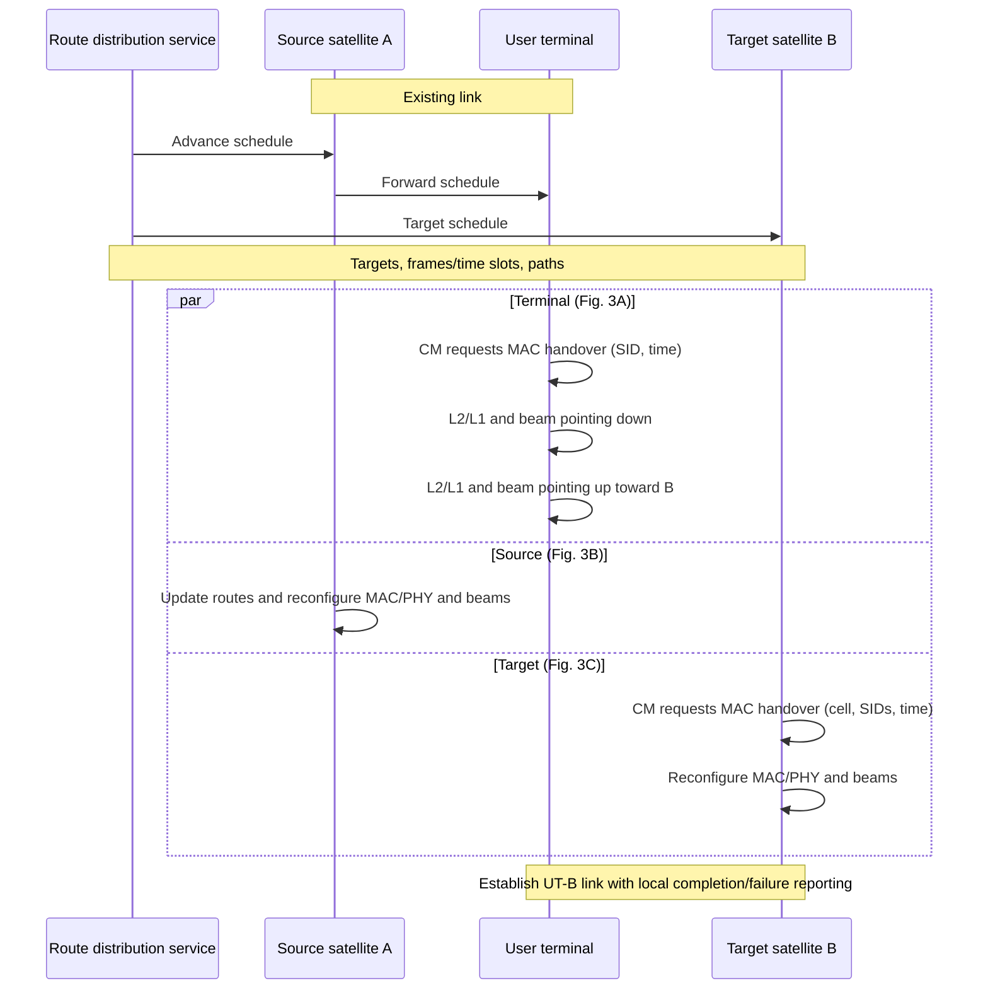

# How LEO Satellites Establish and Maintain Connections with Ground Users

**A concise literature review — sources checked 6 October 2026**

**Scope.** Discovery, beam acquisition, synchronization, random access, authentication, data delivery, and mobility in dedicated-terminal broadband and direct-to-cell (DTC) systems. Evidence combines 3GPP specifications, research papers, and first-party technical disclosures. Standardized procedures, measured behavior, proposed algorithms, and announced systems are distinguished throughout.

## 1. The essential distinction

**A usable connection requires both a radio link and admission to an end-to-end network.** Pointing an antenna at a visible satellite is only one step.

| Access model | Equipment that talks to the satellite | Main mechanism |
|---|---|---|
| Dedicated-terminal broadband: Starlink, Amazon Leo, OneWeb | A powered satellite terminal with a directional antenna | Typically operator-specific satellite radio/access; the terminal distributes connectivity through Ethernet/Wi-Fi. NR-NTN can also support this terminal class. |
| DTC using existing cellular phones: e.g., Starlink's documented LTE system | A compatible ordinary handset | The satellite network accommodates a terrestrial cellular air interface and integrates with a mobile operator. |
| Standardized 3GPP NTN: NR-NTN and IoT-NTN | A device implementing the relevant NTN capabilities and bands | Cellular protocols explicitly extended for satellite delay, Doppler, and mobility. |

**Terminal type and radio protocol are independent choices:** NR-NTN can serve handhelds or dedicated terminals, and DTC can carry broadband traffic. A phone using Wi-Fi behind a Starlink dish, or a terrestrial base station using satellite backhaul, is not directly accessing the satellite. NTN is broader than LEO and also covers other satellite orbits. [P1], [P2], [O1], [O5]

## 2. What has to happen before data can flow?

The following is a **functional synthesis**, not a claim that every operator uses the same messages. [P1], [P7]

| Stage | What the system does | Why it is needed |
|---|---|---|
| 1. Identify a usable coverage opportunity | Assess coverage, received quality, beam availability/load, remaining visibility, and onward routing. | The closest or strongest satellite is not necessarily the usable or preferred one. |
| 2. Acquire a beam and downlink | A directional terminal points/scans; a phone searches supported cellular frequencies and synchronization signals. | The receiver must obtain sufficient signal strength and identify the serving radio channel. |
| 3. Synchronize | Recover carrier/frame timing and compensate propagation delay and Doppler. | Uplink signals must reach the receiver within its timing and frequency tolerances. |
| 4. Request access | Send the applicable access request/preamble; resolve contention and obtain uplink resources. | The network learns which terminal is requesting service. |
| 5. Establish the service | Authenticate/authorize the subscriber or terminal, establish connectivity, and install forwarding state. | Successful RF reception is not yet an Internet or mobile-service session. |
| 6. Maintain and transfer the connection | Schedule traffic, track the channel, adjust transmission, and change beams/satellites/gateways. | The serving geometry changes even when the user is stationary. |

**How does the satellite find a user initially?** It first illuminates geographic coverage areas with acquisition/control signals. A terminal discovers that coverage and responds. The network does not need instantaneous channel knowledge for every unknown user before broadcasting. Subsequent signaling and measurements support finer scheduling and beam control; one satellite beam can serve many users. The exact signaling-beam/service-beam relationship is implementation-specific. [P5], [P7]

### Why LEO requires special timing and antenna design

For slant range $d$, carrier frequency $f_c$, radial relative velocity $v_r$, and light speed $c$:

$$
\tau=d/c,\qquad |f_D|=|v_r|f_c/c,\qquad L_{\mathrm{FS}}=20\log_{10}(4\pi d f_c/c).
$$

**Illustrative calculations, not network measurements:** at $d=550$ km, one-way propagation is about **1.83 ms**. With $|v_r|=7.5$ km/s, Doppler magnitudes are approximately **50 kHz at 2 GHz**, **300 kHz at 12 GHz**, and **500 kHz at 20 GHz**; actual values vary with geometry. Free-space loss at that distance is about **153 dB at 2 GHz** and **169 dB at 12 GHz**, before antenna gains and other losses.

Broadband terminals contribute substantial antenna gain and electrical power. Ordinary phones have much less uplink power and antenna gain, so DTC puts more of the link-budget burden on the satellite's receive aperture, beamforming, and receiver. Low elevation, blockage, interference, and—especially at Ku/Ka bands—weather further constrain acquisition and availability. [P1], [O5], [O7]

## 3. Dedicated-terminal broadband: what is publicly established?

| System | User link and terminal | Connection and onward path | Disclosure boundary |
|---|---|---|---|
| **Starlink broadband** | Ku-band; electronic phased-array terminal. A documented allocation uses 10.7–12.7 GHz downlink and 14.0–14.5 GHz uplink. | Electronic satellite tracking; traffic reaches terrestrial gateways directly or through optical inter-satellite links (ISLs). | Downlink waveform and network behavior have been measured; the complete commercial access/authentication protocol is not publicly specified. [O1], [O2], [P3], [P4] |
| **Amazon Leo, formerly Project Kuiper** | Ka-band phased-array terminals; documented broadband shells span 590–630 km. | Terminal–satellite connectivity, optical ISLs, gateway infrastructure, and terrestrial network/cloud interconnection. | Amazon discloses proprietary RF/signal processing and network architecture, not a complete over-the-air attachment sequence. [O3] |
| **Eutelsat OneWeb Gen-1** | Ku-band user links; electronically steered or tracking-dish terminals; approximately 1,200 km operational altitude. | Bent-pipe relay between the user link and Ka-band gateway link; ground infrastructure manages access and mobility. | Terminal and gateway architectures are public; detailed acquisition and authentication exchanges remain operator-specific. [O4] |

**Starlink.** Humphreys et al. measured a proprietary OFDM downlink with synchronization sequences and approximately **240 MHz signal bandwidth on a 250 MHz channel raster**. This establishes how a receiver can detect and synchronize to the studied signal; it does not reveal subscriber authentication or prove the waveform is NR. Mohan et al. observed globally aligned **15-second reconfiguration intervals**. Such intervals should not automatically be equated with a satellite handover every 15 seconds. Both findings describe the generations and measurement periods studied. [P3], [P4]

**Amazon.** Its disclosed terminal designs electronically track passing satellites, while its network connects gateways to terrestrial infrastructure and supports Internet or private-network delivery. Optical links expand routing options beyond the gateway visible to the serving satellite. A claim that Amazon uses NR SIB19 or NR PRACH would require additional evidence. [O3]

**OneWeb.** The Gen-1 bent-pipe path requires a usable satellite-to-gateway path alongside the user link. Eutelsat lists both flat-panel terminals and dual-parabolic designs supporting satellite handover. Therefore, “all LEO terminals use a single electronically steered panel” is incorrect. [O4]

**A demonstrated standards-based alternative:** in November 2025, ESA and partners reported a **Release-19 NR-NTN trial over OneWeb**, using a flat-panel terminal, transparent satellites, Ku-band service links, Ka-band feeder links, **50 MHz channels**, a ground gNB/core, and conditional handover. This demonstrates NR-NTN broadband with a dedicated terminal; it does not establish that ordinary phones access OneWeb or that its entire commercial service migrated to NR. [O11]

For these broadband systems, **geometry-assisted acquisition followed by signal tracking and network-controlled resource allocation** is a useful engineering abstraction. The selected sources do not establish one common preamble, access timer, credential format, or satellite-selection algorithm.

## 4. What 3GPP standardizes

### 4.1 Release and specification map

| Standardization stage | Relevance to establishing a connection |
|---|---|
| **Release 15–16 studies** | TR 38.811 examines scenarios/channel models; TR 38.821 studies NR adaptations. These are study reports, not proof of deployed interoperability. [P2] |
| **Release 17** | Establishes the NR-NTN baseline, with transparent satellite payloads, FDD, GNSS-capable UEs, and satellite-specific synchronization/timing. A separate IoT-NTN track adapts NB-IoT/eMTC. [S1], [S8] |
| **Release 18** | Enhances coverage and mobility, including RACH-less handover and satellite switching with re-synchronization in specified scenarios. [S6] |
| **Release 19** | Explicitly supports regenerative payloads hosting a gNB, alongside transparent payloads. The reviewed V19.2.0 specification still requires GNSS-based NTN synchronization; GNSS-free access should not be assumed. [S7] |

The most useful implementation references are **TS 38.300 §16.14** (NTN architecture and operation), **TS 38.331** (RRC/SIB19), **TS 38.321 §5.1** (random access), **TS 38.213** (physical-layer timing/control), and **TS 23.502** (registration and sessions). [S1]–[S5]

**Transparent versus regenerative:** a transparent satellite forwards the radio waveform to a ground gNB through a gateway; a regenerative satellite can terminate the NR radio interface onboard. An onboard packet router or laser link alone does not establish that the satellite hosts a 3GPP gNB. The location of radio termination determines which propagation legs affect radio-protocol timing. [S1], [S7]

### 4.2 Representative NR-NTN initial connection

This is a representative **initial registration using four-step contention-based random access**. Resume, re-establishment, and other access variants can use different exchanges.

1. **Cell discovery and system information.** The UE detects the synchronization signal block (SSB), obtains synchronization/cell identity, decodes PBCH/MIB, and acquires SIB1. SIB1 provides essential access configuration and information needed to obtain further system information. [S2], [S4]
2. **Obtain satellite assistance.** SIB19 carries NTN configuration, including ephemeris, common timing-advance parameters, epoch/validity information, and scheduling-related offsets. Ephemeris can be represented as position/velocity or orbital parameters. Optional neighbor and service-time information assists mobility. [S2]
3. **Pre-compensate before transmitting.** Using valid GNSS position and satellite assistance, the UE estimates service-link delay and Doppler, advances its uplink timing, and shifts its uplink frequency accordingly. The network handles feeder-link Doppler and transponder errors. The reviewed baseline bars transmission when required position/assistance becomes invalid. [S1]
4. **Perform random access.** **Msg1:** PRACH preamble. **Msg2:** random-access response with timing correction, an uplink grant, and a temporary identifier. **Msg3:** scheduled uplink carrying the initial RRC request. **Msg4:** contention resolution, with RRC setup as applicable. Failed attempts trigger the configured retry/backoff procedure. NTN timing rules account for the delayed response. [S2], [S3]
5. **Register and establish security.** After RRC setup, NAS registration reaches the 5G core through the gNB. Subscriber authentication, security setup, and registration/admission are handled by the cellular network, not solely by the satellite. [S5]
6. **Establish a data session.** PDU-session procedures configure the user-plane path and radio bearers; IP addressing is provided for an IP session. The gNB schedules uplink/downlink resources, and the terminal continues timing/frequency tracking. Registration alone does not imply that an Internet data session exists. [S3], [S5]

**Timing advance is not the scheduling offset.** Timing advance aligns uplink arrivals. $K_{\mathrm{offset}}$ allows sufficient time between downlink control reception and a required uplink action; $K_{\mathrm{mac}}$ addresses applicable MAC timing relationships. These mechanisms complement delay-aware random-access windows and HARQ operation. Satellite support cannot be achieved merely by increasing a terrestrial cell's range setting. [S3], [S4]

### 4.3 Spectrum, IoT, and device compatibility

Representative Release-17 NR satellite bands are **n255**: UL 1626.5–1660.5 MHz / DL 1525–1559 MHz; and **n256**: UL 1980–2010 MHz / DL 2170–2200 MHz. TS 38.101-5 specifies 5/10/15/20 MHz channel options subject to subcarrier-spacing restrictions. These are representative baseline bands, not an exhaustive later-release spectrum list. Allocated spectrum, channel bandwidth, and an individual user's scheduled bandwidth are different quantities. [S9]

**IoT-NTN is a separate access branch.** NB-IoT/eMTC use their corresponding LTE-family channels and procedures, with NTN timing, GNSS/ephemeris compensation, repetition handling, and support for discontinuous coverage. The NR SSB/SIB19/PRACH sequence should not be copied verbatim into an NB-IoT description. Likewise, having an ordinary LTE modem does not automatically provide standardized IoT-NTN or NR-NTN capability. [S8]

## 5. DTC: existing-phone access and standards-based evolution

### 5.1 Starlink's documented LTE design

SpaceX's January 2024 technical disclosure explicitly describes **standard LTE/4G**, an **onboard eNodeB**, large phased arrays, and custom processing to accommodate weak handset signals, delay, and Doppler. Traffic is carried through Starlink's laser/ground infrastructure to the partner mobile operator's core, with roaming-like integration. This architecture should not be described as the Release-17 NR-NTN SIB19 procedure. [O5]

The representative cellular sequence is: **search/camp on an allowed LTE cell → LTE random access and RRC establishment → EPS attach or the applicable mobility/service procedure → SIM-based authentication/security and bearer setup → permitted services**. These are standard LTE functions; the exact SpaceX adaptations are proprietary. A phone already registered with reusable context need not repeat a full initial attach on every transition. [S8], [S10]

A concrete spectrum example is the FCC's **November 2024 authorization** for SpaceX/T-Mobile SCS: **1910–1915 MHz uplink and 1990–1995 MHz downlink** in the United States. This is a specific licensed cellular-band arrangement, not the same allocation as n255/n256. Compatibility still depends on the supported band, device/carrier configuration, subscription, and available coverage. [O6]

### 5.2 Starlink's next-generation NR-NTN direction

SpaceX's **2026 submission to Canada's ISED** explicitly distinguishes its first-generation service using small blocks of terrestrial spectrum from a **planned second generation using NR-NTN and 2 GHz MSS spectrum**. It also discusses the transition to compatible chipsets/devices. Thus, “Starlink DTC uses LTE” is generation-specific: future Starlink mobile access is directly relevant to 3GPP NTN. The filing describes plans, not proof of a fully deployed NR-NTN service or compatibility with every legacy LTE phone. [O10]

### 5.3 Other DTC/D2D approaches

| Example | Connection mechanism and interpretation |
|---|---|
| **AST SpaceMobile** | Large satellite arrays receive ordinary handset signals; gateway processing compensates delay/Doppler and connects to partner mobile networks. Its disclosed architecture shows that DTC does not universally require an onboard eNodeB. “4G/5G to an unmodified phone” alone does not prove use of the NR-NTN extensions. [O7] |
| **Lynk** | Published demonstrations include registration of unmodified phones on its satellite cellular system. This supports the existing-phone approach, but does not by itself establish continuous coverage or all advertised service capabilities. [O8] |
| **Amazon Leo D2D proposal, 2026** | Separate from its Ka-band broadband terminals: proposed L-/S-band device links, onboard processing, optical ISLs, and Ka-/V-band gateway links. Amazon states deployment would begin in 2028 and refers to compatible devices. This is an announced system, not evidence of deployed access or compatibility with every existing handset. [O9] |

**D2D is broader than DTC.** Satellite messaging and IoT services may use dedicated satellite-capable hardware/protocols; neither a “satellite” label nor an emergency-messaging feature establishes ordinary cellular or NR-NTN compatibility.

## 6. Maintaining the connection: beams, channels, and mobility

**Beam pointing and channel estimation solve different problems.** Orbital/position information predicts the line-of-sight direction, delay, and bulk Doppler. Reference signals and measurements are still needed to track residual errors and link quality. Exact instantaneous CSI at the satellite is not a prerequisite for initial discovery. You et al. show how statistical CSI can support LEO multiuser transmission, but this is a proposed design, not evidence of a particular operator's precoder. FDD also means uplink observations cannot simply be treated as identical downlink complex-channel coefficients. [P6]

| Change | What actually changes |
|---|---|
| **Beam change** | The radio beam serving a user changes; the satellite or logical cell can remain unchanged. |
| **Satellite/service-link switch** | Another spacecraft carries the user link; whether this requires a cell/gNB handover depends on architecture and cell mapping. |
| **Gateway/feeder-link switch** | The satellite's terrestrial connection changes; this may occur independently of the user beam. |
| **Terrestrial–satellite mobility** | The terminal changes access network; radio coverage and core-network continuity both matter. |

NR-NTN supports measurement-assisted mobility and conditional handover using time/location information. Release-18 procedures can, under specified conditions, retain the physical cell identity during a satellite switch with re-synchronization, or avoid random access during handover. Idle/inactive devices instead use cell selection/reselection and coverage information. Handover is therefore not synonymous with repeating complete registration. [S6]

Make-before-break behavior requires overlapping coverage and suitable radio/network capabilities. Packet interruption, buffer transfer, gateway reachability, and user density still matter. A constellation or terminal advertised as “seamless” should not be modeled as guaranteeing zero interruption. [P4], [P7]

### 6.1 Scheduled broadband handover: a patent-based abstraction

**Figure 1.** Simplified from SpaceX patent US20240031892A1, Figs. 2–3C and its schedule-distribution description. Inter-node arrows show logical control-plane delivery; self-arrows summarize device-internal operations. [O12]

**Interpretation.** CM means connection manager; SID identifies a service, flow, or destination. Parallel branches do not prescribe simultaneous RF actions. Readiness/completion responses are local MAC-to-CM messages; the figure does not introduce a target-to-controller acknowledgment or an over-the-air handshake. The terminal tears down its old link before bringing up the new one. This patent embodiment does not establish make-before-break operation or verify deployed Starlink behavior. [O12]

## 7. What the research establishes—and what remains open

| Selected literature | Main contribution | Limitation for interpreting commercial access |
|---|---|---|
| **Kodheli et al., 2021 [P1]** | Broad synthesis of satellite air interfaces, access, and networking. | Foundational background, not a current commercial protocol description. |
| **Lin et al., 2021 [P2]** | Explains the design rationale behind 3GPP NTN adaptations. | Predates completed later releases; use current TS documents for requirements. |
| **Humphreys et al., 2023 [P3]** | Measures Starlink downlink waveform and synchronization structure. | Does not recover the complete uplink, authentication, or network scheduler. |
| **Mohan et al., 2024 [P4]** | Measures operational Starlink behavior and periodic reconfiguration. | End-to-end observations do not uniquely reveal internal control decisions. |
| **Kim et al., 2025 [P5]** | Proposes ephemeris-assisted initial access to reduce beam-search delay and random-access collisions. | Simulation-based proposal; not an adopted 3GPP requirement or verified deployment. |
| **You et al., 2020 [P6]** | Develops statistical-CSI multiuser transmission after delay/Doppler compensation. | Addresses data transmission, not complete network attachment. |
| **Xiao et al., 2022 [P7]** | Connects random access, beam management, and Doppler-resistant transmission. | Research framework rather than a commercial implementation specification. |

**Research implications, synthesized from these sources:** evaluate access probability and time-to-first-data, not only received SNR or throughput; include collisions and mass handovers; model stale ephemeris/GNSS errors, blockage, and residual Doppler; and couple user association with beam capacity and gateway/ISL availability. Distinguish maintaining a radio link from preserving an authenticated session. The central evidence gap is the undisclosed control plane of proprietary broadband and existing-phone DTC systems. [P4]–[P7]

## References

Reference labels are clickable. **P** = research paper; **S** = normative standard; **O** = operator, manufacturer, mission, or regulatory source. Versions and announcement dates matter; a document's existence does not establish operator deployment of its features.

### Research papers

- [P1] O. Kodheli et al., “Satellite Communications in the New Space Era: A Survey and Future Challenges,” *IEEE Communications Surveys & Tutorials*, 2021. DOI: [10.1109/COMST.2020.3028247](https://doi.org/10.1109/COMST.2020.3028247). Open author manuscript linked.
- [P2] X. Lin et al., “5G from Space: An Overview of 3GPP Non-Terrestrial Networks,” *IEEE Communications Standards Magazine*, 2021. DOI: [10.1109/MCOMSTD.011.2100038](https://doi.org/10.1109/MCOMSTD.011.2100038). Open author manuscript linked.
- [P3] T. E. Humphreys et al., “Signal Structure of the Starlink Ku-Band Downlink,” *IEEE Transactions on Aerospace and Electronic Systems*, 59(5), 6016–6030, 2023. DOI: [10.1109/TAES.2023.3268610](https://doi.org/10.1109/TAES.2023.3268610). Author PDF linked.
- [P4] N. Mohan et al., “A Multifaceted Look at Starlink Performance,” *ACM Web Conference*, 2024. DOI: [10.1145/3589334.3645328](https://doi.org/10.1145/3589334.3645328). Open author manuscript linked.
- [P5] H. Kim, H. Lee, I. Kim, and D. Hong, “NR-NTN Initial Access: Ephemeris-based Approach,” *IEEE Transactions on Aerospace and Electronic Systems*, 61(4), 10913–10920, 2025. DOI: [10.1109/TAES.2025.3556659](https://doi.org/10.1109/TAES.2025.3556659). Contribution summarized from the authors' institutional abstract.
- [P6] L. You et al., “Massive MIMO Transmission for LEO Satellite Communications,” *IEEE Journal on Selected Areas in Communications*, 38(8), 1851–1865, 2020. DOI: [10.1109/JSAC.2020.3000803](https://doi.org/10.1109/JSAC.2020.3000803).
- [P7] Z. Xiao et al., “LEO Satellite Access Network (LEO-SAN) Towards 6G: Challenges and Approaches,” arXiv:2207.11896, 2022; reviewed author version.

### Standards

- [S1] 3GPP **TS 38.300 V17.11.0**, especially §16.14: baseline NR-NTN architecture, timing, and mobility.
- [S2] 3GPP **TS 38.331 V17.11.0**, RRC; see SIB19, NTN-Config, EphemerisInfo, and RRC establishment.
- [S3] 3GPP **TS 38.321 V17.11.0**, MAC; especially §5.1 random access and uplink synchronization/HARQ procedures.
- [S4] 3GPP **TS 38.213 V17.11.0**, physical-layer control; synchronization, timing advance, and random-access timing.
- [S5] 3GPP **TS 23.502 V17.5.0**, especially §4.2.2.2 registration and §4.3.2 PDU-session establishment.
- [S6] 3GPP **TS 38.300 V18.8.0**, especially §16.14.3 mobility and §16.14.9 coverage enhancements.
- [S7] 3GPP **TS 38.300 V19.2.0**, especially §16.14.1 regenerative/transparent architectures and §16.14.2.2 synchronization.
- [S8] 3GPP **TS 36.300 V17.7.0**, LTE/E-UTRAN; especially §23.21 NB-IoT/eMTC NTN support.
- [S9] 3GPP **TS 38.101-5 V17.10.0**, satellite-access UE RF requirements; Tables 5.2.2-1 and 5.3.5-1.
- [S10] 3GPP **TS 23.401 V17.11.0**, EPS; especially §5.3.2.1 initial attach.

### System disclosures

- [O1] SpaceX, *Starlink Technology*; terminal tracking corroborated by its [antenna explanation](https://starlink.com/en-qa/support/article/0dfd853a-c719-74c7-7817-90614c9c82c7).
- [O2] FCC, **DOC-381420**, SpaceX Services user-terminal licensing public notice, 2022.
- [O3] Amazon, *Amazon Leo* technical overview; [Ka-band terminal and orbital details](https://www.aboutamazon.com/news/innovation-at-amazon/jetblue-amazon-project-kuiper-in-flight-wifi-partnership), [Leo Ultra design](https://www.aboutamazon.com/news/amazon-leo/amazon-leo-satellite-internet-ultra-pro), and [gateway/network architecture](https://www.aboutamazon.com/news/innovation-at-amazon/amazon-project-kuiper-aws).
- [O4] Eutelsat, *OneWeb LEO constellation* and [equipment catalog](https://www.eutelsat.com/satellite-network/oneweb-leo-constellation/leo-equipment); [ground-network disclosure](https://www.eutelsat.com/system/files/2025-09/DOC_Investors_10-Orion-Exemption-Document_EN_280923.pdf), 2023; ISRO, [OneWeb Gen-1 bent-pipe description](https://www.isro.gov.in/LVM3M2MissionLandingPage.html), 2022.
- [O5] SpaceX, *Direct to Cell: First Text Update*, January 2024.
- [O6] FCC, **DA 24-1193**, SpaceX/T-Mobile Supplemental Coverage from Space authorization, November 2024.
- [O7] AST SpaceMobile, *How It Works*, technical description of handset–satellite–gateway–operator connectivity.
- [O8] Lynk, *Lynk Proves Direct Two-way Satellite-to-Mobile-Phone Connectivity*, September 2021.
- [O9] Amazon, *How Amazon Leo plans to connect mobile devices from space*, 2026 D2D proposal.
- [O10] SpaceX, response to ISED **SMSE-008-26**, 2026; see responses Q1–Q2. Official source: `SMSE-008-26_SpaceX.pdf` in ISED's [comments bundle](https://ised-isde.canada.ca/site/spectrum-management-telecommunications/sites/default/files/documents/SMSE-008-026_comments_commentaires_0.zip).
- [O11] ESA/MediaTek/Eutelsat and partners, *Rel-19 NR-NTN Connection over OneWeb LEO Satellites*, 3 November 2025; joint trial announcement.
- [O12] SpaceX, *Low latency schedule-driven handovers*, US20240031892A1, published 25 January 2024; Figs. 2–3C and accompanying description. Patent embodiment; not deployment evidence. Comparison checked 7 October 2026.

[P1]: https://arxiv.org/abs/2002.08811
[P2]: https://arxiv.org/abs/2103.09156
[P3]: https://radionavlab.ae.utexas.edu/wp-content/uploads/starlink_structure.pdf
[P4]: https://arxiv.org/abs/2310.09242
[P5]: https://yonsei.elsevierpure.com/en/publications/nr-ntn-initial-access-ephemeris-based-approach/
[P6]: https://arxiv.org/abs/2002.08148
[P7]: https://arxiv.org/abs/2207.11896
[S1]: https://www.etsi.org/deliver/etsi_ts/138300_138399/138300/17.11.00_60/ts_138300v171100p.pdf
[S2]: https://www.etsi.org/deliver/etsi_ts/138300_138399/138331/17.11.00_60/ts_138331v171100p.pdf
[S3]: https://www.etsi.org/deliver/etsi_ts/138300_138399/138321/17.11.00_60/ts_138321v171100p.pdf
[S4]: https://www.etsi.org/deliver/etsi_ts/138200_138299/138213/17.11.00_60/ts_138213v171100p.pdf
[S5]: https://www.etsi.org/deliver/etsi_ts/123500_123599/123502/17.05.00_60/ts_123502v170500p.pdf
[S6]: https://www.etsi.org/deliver/etsi_ts/138300_138399/138300/18.08.00_60/ts_138300v180800p.pdf
[S7]: https://www.etsi.org/deliver/etsi_ts/138300_138399/138300/19.02.00_60/ts_138300v190200p.pdf
[S8]: https://www.etsi.org/deliver/etsi_ts/136300_136399/136300/17.07.00_60/ts_136300v170700p.pdf
[S9]: https://www.etsi.org/deliver/etsi_TS/138100_138199/13810105/17.10.00_60/ts_13810105v171000p.pdf
[S10]: https://www.etsi.org/deliver/etsi_ts/123400_123499/123401/17.11.00_60/ts_123401v171100p.pdf
[O1]: https://starlink.com/technology
[O2]: https://docs.fcc.gov/public/attachments/DOC-381420A1.pdf
[O3]: https://www.aboutamazon.com/what-we-do/devices-services/amazon-leo
[O4]: https://www.eutelsat.com/satellite-network/oneweb-leo-constellation
[O5]: https://starlink.com/public-files/DIRECT_TO_CELL_FIRST_TEXT_UPDATE.pdf
[O6]: https://docs.fcc.gov/public/attachments/DA-24-1193A1_Rcd.pdf
[O7]: https://ast-science.com/how-it-works/
[O8]: https://lynk.world/news/lynk-proves-direct-two-way-satellite-to-mobile-phone-connectivity/
[O9]: https://www.aboutamazon.com/news/amazon-leo/amazon-leo-direct-to-device-satellite-service-explained
[O10]: https://ised-isde.canada.ca/site/spectrum-management-telecommunications/en/learn-more/key-documents/comments-received-smse-008-26-preliminary-consultation-mobile-satellite-service-developments-and-use
[O11]: https://www.mediatek.com/press-room/esa-mediatek-eutelsat-airbus-sharp-itri-and-rs-announce-worlds-first-rel-19-5g-advanced-nr-ntn-connection-over-oneweb-leo-satellites
[O12]: https://patents.google.com/patent/US20240031892A1/en
