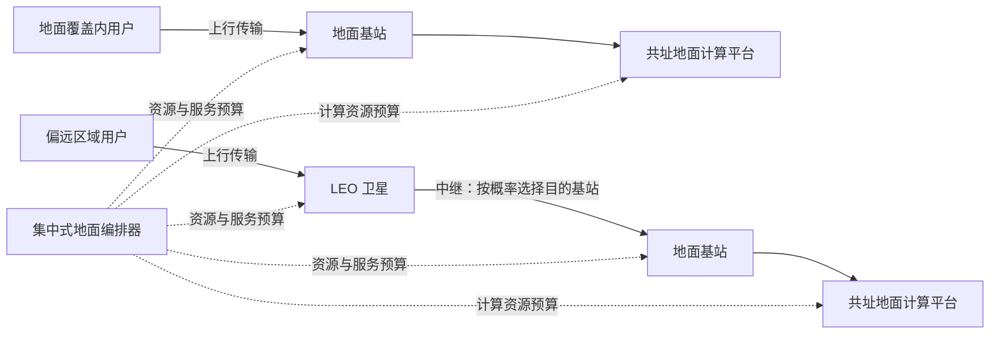
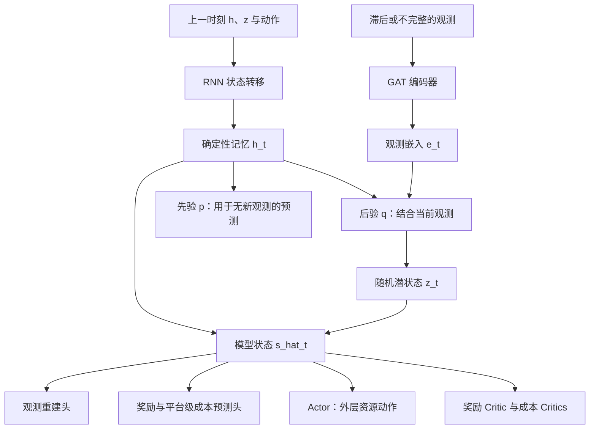

# 论文讲解：面向卫星辅助 MEC 的时延约束 RAN 编排与世界模型

> **核心结论**：这篇论文研究如何在网络状态观测滞后、业务随机到达的情况下，联合分配通信与地面计算资源，在控制业务超时的同时降低能耗。其主要方法是：用 **GAT + RSSM 世界模型**学习环境动态，在潜在空间生成未来轨迹来训练受约束的资源分配策略，再用低复杂度的时隙级均分调度执行。
>
> **阅读提醒**：论文展示了特定仿真场景中的性能优势，但没有证明逐包时延的严格保证。摘要中的“低于 20 ms”、正文中的计算时延结果以及图表中的尾部样本，需要分开理解。

## 1. 论文信息与阅读范围

| 项目     | 信息                                                                                                           |
| -------- | -------------------------------------------------------------------------------------------------------------- |
| 标题     | *Latency-Centric RAN Orchestration with World Model for Satellite-Assisted Mobile Edge Computing*            |
| 作者     | Dong-eui Kim、Seonghoon Kim、Jihwan P. Choi                                                                    |
| 单位     | 韩国 KAIST                                                                                                     |
| 发表信息 | 2026 IEEE International Conference on Communications Workshops（ICC Workshops）                                |
| DOI      | `10.1109/ICCWorkshops63917.2026.11586279`                                                                    |
| 篇幅     | 7 页                                                                                                           |
| 本地原文 | [打开 PDF](Latency-Centric_RAN_Orchestration_with_World_Model_for_Satellite-Assisted_Mobile_Edge_Computing.pdf) |

本文以提供的 PDF 为依据，页码均指 PDF 内的第 1–7 页。下面区分三类内容：**原文定义和报告的结果**、**为帮助理解所作的解释与例子**、**根据公式和实验设计提出的分析意见**。未运行作者代码，也未独立复现实验。

## 2. 这篇论文究竟在解决什么问题？

### 2.1 场景：卫星提供接入和转发，地面服务器负责计算

系统中有多个地面基站，每个基站旁边部署计算平台。城市或有覆盖区域的用户直接把任务交给地面基站；偏远区域的用户先连接 LEO 卫星，再由卫星转发给某个地面基站及其计算平台。



**这里的 satellite-assisted MEC 不等于卫星搭载计算服务器。** 论文明确考虑卫星的体积、重量与功率限制，把主要计算放在地面。卫星承担通信接入与任务中继。（第 1–2 页）

### 2.2 要同时处理的三个困难

1. **业务时延需求不同**：LSS 是时延敏感业务，任务较小、截止时间较短；LTS 是时延容忍业务，任务较大、截止时间较宽松。
2. **控制器看不到当前完整状态**：状态反馈经过传播存在滞后，离散快照也无法覆盖快衰落等细粒度变化。
3. **未来不确定**：用户移动、任务到达、信道与计算效率都随时间变化。

假设控制器现在收到某个地面服务器“负载较低”的报告，但报告已经过时。若它把后续任务大量转发给该服务器，任务真正到达时可能遇到拥塞。因此，当前观测到的空闲资源不一定代表未来可用资源。

世界模型的作用，是结合历史、当前观测和过去动作，形成对系统隐状态及后续演化的估计，让策略有机会提前调整资源。

### 2.3 标题强调时延，数学目标却是能耗

论文不是直接最小化平均时延，其原始问题是：

> **在满足通信与计算阶段的时延约束、资源容量约束的条件下，最小化长期平均总能耗。**

时延是限制资源节省幅度的条件。如果只关心省电，策略可能过度压低资源，导致任务积压；如果只关心时延，策略可能持续开满资源。本文试图在两者之间找到可行的分配方式。（第 4 页，式 (25)–(26)）

## 3. 系统模型：先弄清楚谁控制什么

### 3.1 关键术语

| 符号或缩写 | 含义                               | 理解要点                             |
| ---------- | ---------------------------------- | ------------------------------------ |
| UE         | 用户设备                           | 产生待计算任务                       |
| TBS        | 地面基站                           | 接入用户，也接收卫星转发任务         |
| CMP        | 通信平台                           | 包括地面基站与卫星                   |
| CPP        | 计算平台                           | 部署在地面基站侧                     |
| UL         | 上行链路                           | UE → 地面基站，或 UE → 卫星        |
| ReL        | 中继链路                           | 卫星 → 地面基站                     |
| LSS / LTS  | 两种服务类别                       | 分别偏重低时延和较宽松时延           |
| CPOMDP     | 受约束的部分可观测马尔可夫决策过程 | 同时描述隐状态与约束成本             |
| RSSM       | 循环状态空间模型                   | 用确定性记忆和随机潜变量共同描述状态 |
| GAT        | 图注意力网络                       | 对图结构观测进行编码                 |

地面基站编号为 $i\in\mathcal I=\{1,\ldots,I\}$，卫星编号为 $i=0$。用户优先接入覆盖范围内最近的地面基站，没有地面覆盖时才接入卫星。因此，**用户的初始接入关联主要由几何规则决定，并非任意可学习的全局关联动作**。（第 2 页）

### 3.2 两个时间尺度

时间被分成持续 $\Delta T$ 的帧，每帧包含 $S$ 个时隙，时隙长度为：

$$
\delta=\frac{\Delta T}{S}.
$$

仿真中每帧为 **100 ms**，每个时隙为 **10 ms**，所以每帧有 10 个时隙。

| 层级              | 执行频率 | 决策内容                                                 | 实现                           |
| ----------------- | -------- | -------------------------------------------------------- | ------------------------------ |
| 外层策略$\pi_O$ | 每帧     | 平台资源总量、服务间份额、时延预算拆分、卫星任务转发概率 | 世界模型辅助训练的强化学习策略 |
| 内层策略$\pi_I$ | 每时隙   | 给具体用户分配带宽和计算时间                             | 等份分配启发式                 |

这是一种“先定预算，再分给用户”的分层设计。例如，外层先决定某基站启用多少带宽、其中多少服务 LSS；内层再把 LSS 的带宽在对应用户之间均分。

### 3.3 外层的五类主要动作

| 动作             | 代表符号                         | 意义                                             |
| ---------------- | -------------------------------- | ------------------------------------------------ |
| 平台总带宽       | $B_i^\ell[t]$                  | 某平台、某链路类型启用多少带宽                   |
| 服务带宽份额     | $B_i^{\ell,sl}[t]$             | LSS 与 LTS 如何分配带宽                          |
| 计算与内存资源   | $C_i[t],F_i[t],\rho_i^{sl}[t]$ | 启用多少算力和内存带宽，以及各服务的份额         |
| 时延预算拆分     | $\Theta_i^{sl}[t]$             | 一个任务的截止时间中，多少留给通信，多少留给计算 |
| 中继目的选择概率 | $O_i^{sl}[t]$                  | 某类卫星任务转发到各地面基站的概率               |

中继目的概率满足：

$$
O_i^{sl}[t]\geq 0,\qquad \sum_{i\in\mathcal I}O_i^{sl}[t]=1.
$$

它体现的是地面计算平台之间的负载分流，不是将同一个任务切成连续比例分发给所有服务器。原文按概率采样目的基站，且选定的中继目的地在该次中继传输结束前保持不变。（第 2–3 页，式 (1)–(2) 及式 (16) 后说明）

## 4. 通信、计算与能耗模型如何联系起来？

### 4.1 通信：带宽决定每个时隙能发送多少数据

原文使用正交多址 OMA，假设各链路使用隔离的无线资源以避免干扰。对链路 $\ell\in\{\mathrm{UL},\mathrm{ReL}\}$，用户速率为：

$$
r_{u,i}^{\ell}[t_s]
=b_{u,i}^{\ell}[t_s]B_i^{\ell,sl}[t]
\log_2\left(1+\mathrm{SNR}_{u,i}^{\ell}[t_s]\right).
$$

其中 $B_i^{\ell,sl}$ 是外层分配给该服务的带宽，$b_{u,i}^{\ell}$ 是内层给某用户的比例。

SNR 与发射功率、天线增益、信道增益、噪声谱密度及分配带宽有关；信道含随几何变化的大尺度项和随机小尺度衰落。因此，资源份额相同也不代表不同用户有相同速率。

一个数据量为 $d_u$ 的任务，需要累积足够多时隙的有效发送量才能完成：

$$
N_u^{\mathrm{UL}}
=\min\left\{N:\sum_{k=0}^{N-1}r_{u,i}^{\mathrm{UL}}[t_s+k]\delta\geq d_u\right\},
\qquad T_u^{\mathrm{UL}}=N_u^{\mathrm{UL}}\delta.
$$

地面用户只有 UL 阶段；卫星用户还要经过 ReL：

$$
T_u^{\mathrm{CMP}}
=T_u^{\mathrm{UL}}
+\mathbf 1_{\{i_u=0\}}T_u^{\mathrm{ReL}}.
$$

因此，卫星用户的一个“通信阶段预算”实际上需要覆盖两跳传输。（第 3 页，式 (15)–(17)）

### 4.2 计算：不仅可能缺算力，也可能缺内存带宽

论文使用 Roofline 思路描述执行速率：

$$
r_{u,i}^{\mathrm{CPP}}[t_s]
=\eta^{\mathrm{CPP}}[t]
\frac{\min\left(C_i^{sl}[t],I^{\mathrm{WL}}F_i^{sl}[t]\right)}{\Gamma^{\mathrm{WL}}}
f_{u,i}^{\mathrm{CPP}}[t_s].
$$

| 量                         | 单位      | 意义                             |
| -------------------------- | --------- | -------------------------------- |
| $C_i^{sl}$               | FLOP/s    | 分给该服务的计算吞吐量           |
| $F_i^{sl}$               | byte/s    | 分给该服务的内存带宽             |
| $I^{\mathrm{WL}}$        | FLOP/byte | 工作负载的算术强度               |
| $\Gamma^{\mathrm{WL}}$   | FLOP/bit  | 每 bit 输入需要多少计算          |
| $\eta^{\mathrm{CPP}}$    | 无量纲    | 热节流与系统开销等引起的效率系数 |
| $f_{u,i}^{\mathrm{CPP}}$ | 无量纲    | 用户占有的处理时间份额           |

关键是 $\min(C,IF)$：计算吞吐量不足时，增加内存带宽不会显著加快任务；内存供给不足时，单独增加算力也不能解决问题。

服务之间共用一个份额变量：

$$
C_i^{sl}=\rho_i^{sl}C_i,\qquad
F_i^{sl}=\rho_i^{sl}F_i,\qquad
\sum_{sl}\rho_i^{sl}\leq 1.
$$

因此，同一服务获得的计算份额与内存份额绑定；平台层面的总 $C_i$ 与总 $F_i$ 仍分别受控制。（第 3 页，式 (10)–(14) 及后续速率定义）

### 4.3 能耗：省资源和缩短执行时间可能相互牵制

通信功率采用“静态功率 + 与分配带宽成比例的电路功率”；计算功率包括空闲功率、共享 GPU 基础功率和随运算量变化的动态功率。最终按照时间累积得到能量：

$$
E_u^{\mathrm{Total}}=E_u^{\mathrm{CMP}}+E_u^{\mathrm{CPP}}.
$$

直观上，提高资源配置会增加某些功率项，但也可能缩短任务执行时间，减少静态功率持续支付的时间。因此不能仅凭“资源少”推断“总能量一定少”，策略需要学习完整的能耗与时延关系。（第 3–4 页，式 (18)–(24)）

论文把返回结果视为远小于任务输入，忽略计算结果回传链路；传播时延则作为最坏情况下的常数，从可用时延预算中先行扣除。

## 5. 时延预算拆分：把端到端要求变成可协调的两部分

### 5.1 参数 $\Theta$ 的含义

对一类业务，外层选择 $0\leq\Theta_i^{sl}\leq1$，将任务预算 $T_u^{\max}$ 拆成：

$$
T_u^{\mathrm{CMP}}\leq\Theta_i^{sl}T_u^{\max},
$$

$$
T_u^{\mathrm{CPP}}\leq(1-\Theta_i^{sl})T_u^{\max}.
$$

两条均成立时，通信与计算之和不超过可用总预算。（第 4 页，式 (26b)–(26d)）

**说明性例子，不是论文实验样本**：某任务扣除传播时延后还有 50 ms，策略令 $\Theta=0.6$，则通信有 30 ms，计算有 20 ms。若实际分别为 35 ms 和 12 ms，总和为 47 ms，但通信阶段仍超出分配预算 5 ms，会触发通信约束成本。

这说明分阶段约束比单纯检查总时延更严格。它可以防止一个阶段耗尽另一个阶段需要的时间，但也可能惩罚“总时延合格、阶段预算不合格”的任务。$\Theta$ 的自适应调整就是为缓解这种不匹配。

### 5.2 约束成本关注的是超标量，而不是原始时延

对每个服务类别 $sl$ 和平台类型 $com\in\{\mathrm{CMP},\mathrm{CPP}\}$，论文定义一帧内最严重的正超标量：

$$
\nu_{sl}^{com}(s_t,a_t)
=\max_{\text{该帧相关平台、用户、时隙}}
\left[T_u^{com}-T_u^{M,com}\right]^+,
\qquad [x]^+=\max(x,0).
$$

这里 $T_u^{M,com}$ 是对应阶段的预算。两类业务乘以两种阶段，形成 **4 类系统级成本**。（第 5 页，式 (27)）

这种设计不让大量正常任务的低时延直接冲淡最坏任务的超时，但也有代价：最大值对极端样本敏感，且它没有直接记录“有多少个任务超时”。因此仅凭该成本还不能得到违约概率、P99 时延等完整 QoS 信息。

## 6. 为什么要建模成 CPOMDP？

### 6.1 控制器获得的是观测，不是真实状态

原文以 $s_t$ 表示真实状态，$o_t$ 表示观测，$a_t$ 表示资源配置动作，$b_t$ 表示 belief，即根据历史形成的隐状态信念。

例如，“当前待处理量、真实瞬时信道、正在发生但尚未上报的任务到达”可能构成真实环境信息，但控制器只拿到滞后或聚合后的反馈。这里的例子用于解释部分可观测性；原文没有给出完整的观测字段清单。

理论上应根据历史观测和动作推断状态分布，实际系统很难精确维护它。论文用 RSSM 的潜在表示来承担这种历史汇总与状态估计功能，**但没有证明潜在表示就是精确的 belief state**。

### 6.2 奖励和拉格朗日约束

奖励定义为一帧内总能耗的负数：

$$
r_t=-\sum_{s,u}E_u^{\mathrm{Total}}[t_s].
$$

为避免和后文的 $\lambda$-return 混淆，下面将原文的拉格朗日乘子 $\lambda_{sl,t}^{com}$ 改记为 $\mu_{sl}^{com}\geq0$。策略训练考虑：

$$
\min_{\mu\geq0}\max_{\pi_O}
\mathbb E_{\pi_O}\left[
\sum_{t\geq0}\gamma^t
\left(r_t-\sum_{sl,com}\mu_{sl}^{com}\nu_{sl,t}^{com}\right)
\right].
$$

直观上，每一类约束有自己的“超时价格”。某类业务不断超时，其价格上升，策略就更有动机为它分配资源或改变转发目的地。（第 5 页，式 (28)；第 6 页，式 (34)）

需要区分两点：原问题是长期平均能耗，强化学习问题使用折扣回报；原问题写成逐包硬约束，实际训练采用期望成本及拉格朗日惩罚。论文没有给出这两组表述之间的严格等价证明，实验也存在非零偏差，因此应视为近似求解框架。

## 7. 世界模型到底学了什么？

### 7.1 整体结构



这里的“世界模型”是学习网络环境动态的概率模型，不是大语言模型，也不要求生成图像。（第 5 页）

### 7.2 确定性记忆 $h_t$ 与随机状态 $z_t$

RSSM 使用：

$$
h_t=f_\phi(h_{t-1},z_{t-1},a_{t-1}),\qquad
\hat s_t=(h_t,z_t).
$$

- $h_t$ 汇总历史及动作影响，例如过去一段时间的负载趋势。
- $z_t$ 以随机潜变量表达当前状态中的不确定成分。

收到当前观测时，通过后验推断：

$$
e_t=\operatorname{GAT}(o_t),\qquad
z_t\sim q_\phi(z_t\mid h_t,e_t).
$$

在没有未来真实观测的想象阶段，通过先验采样：

$$
\hat z_t\sim p_\phi(z_t\mid h_t).
$$

可把后验理解为“看到反馈后修正判断”，先验理解为“根据历史和动作预估接下来可能发生什么”。二者共同训练，才能让模型在闭环接收观测和开环预测未来之间衔接。

GAT 的动机是利用网络的图结构。但原文没有详细列出节点类型、边构造和全部特征，因此不能据此确认作者实现了怎样的异构图，也不能直接断言其能够泛化到任意规模星座。

### 7.3 预测的不只是下一状态，还有奖励和约束成本

模型状态接入三类预测头：

1. 观测重建头：检查潜状态是否保留解释观测所需的信息。
2. 奖励预测头：估计能耗对应的奖励。
3. 成本预测头：估计各平台、各服务、各阶段的时延超标量。

成本不是一开始就压缩成一个全局数，而是先预测：

$$
\hat c_{com,sl,i,t},
$$

再按平台取最大值：

$$
\hat\nu_{sl}^{com}(\hat s_t,a_t)
=\max_i\hat c_{com,sl,i,t}.
$$

这样模型可以保留“约束问题发生在哪个平台”的结构信息。卫星 $i=0$ 也设置 CPP 成本头，是为了归因卫星转发业务的地面计算时延，**并不表示卫星上执行计算任务**。（第 5 页，式 (29) 及后续说明）

### 7.4 世界模型损失：重建与预测能力，加上先验一致性

把原文式 (30) 中的监督目标用真实样本 $o_t,r_t,c_t$ 明确写出，可以将训练目标解释为：

$$
\mathcal L_{\mathrm{WM}}
=\mathbb E\sum_t\left[
-\log p_\phi(o_t\mid\hat s_t)
-\log p_\phi(r_t\mid\hat s_t,a_t)
-\sum_{com,sl,i}\log p_\phi(c_{com,sl,i,t}\mid\hat s_t,a_t)
+D_{\mathrm{KL}}\big(q_\phi(z_t\mid h_t,e_t)\Vert p_\phi(z_t\mid h_t)\big)
\right].
$$

前三项要求潜状态具有足够的预测信息；KL 项要求“看到观测后的后验”不要与“仅靠历史形成的先验”相差过大。由此训练先验去预测环境，而不仅仅是编码当前输入。

这可以提供有用的动态表示，但**KL 正则化和低预测误差不自动证明模型学到了真实因果机制**。原文关于“causal dynamics”的表述应与严格的因果识别区分。

## 8. 想象轨迹怎样改进策略？

### 8.1 一段真实经历，可以提供多个未来训练分支

流程可以概括为：

1. 从真实仿真交互的经验缓冲区采样连续轨迹。
2. 使用编码器和后验恢复这些轨迹对应的潜在状态。
3. 从潜状态出发，让 Actor 生成动作。
4. 使用 RSSM 的先验推进潜在状态，预测奖励及成本。
5. 重复 $H$ 步，得到想象轨迹。
6. 使用想象轨迹训练奖励 Critic、成本 Critics 和 Actor。

这样，一份真实交互数据不只用于一次当前动作更新，还能作为模型中多个后续决策的训练起点。这是其提高真实环境交互样本利用率的主要机制。

实验设置 $H=15$。若每一步对应外层的 100 ms 帧，则想象覆盖约 **1.5 s**；这是根据参数作出的时间尺度换算，不代表模型在该时域内有准确性保证。

### 8.2 $\lambda$-return：结合短期预测与更长的价值估计

奖励 Critic 使用：

$$
R_{t,h}^{\lambda}
=\hat r_{t,h}
+\gamma\left[(1-\lambda)V(\hat s_{t,h+1})
+\lambda R_{t,h+1}^{\lambda}\right],
$$

终点由 $V(\hat s_{t,H})$ 自举。每类成本 Critic 使用同样的结构，把奖励换成对应成本。（第 5 页，式 (31)）

这里的 $\lambda$ 是回报混合参数，不是约束乘子。它在较短步数的自举估计和更长步数的轨迹回报之间进行权衡。

### 8.3 Actor 根据“节能收益减去超时代价”更新

定义奖励优势 $A^V$ 和各类成本优势 $A^{C,sl,com}$，得到：

$$
A^L=A^V-\sum_{sl,com}\mu_{sl}^{com}A^{C,sl,com}.
$$

Actor 用该优势进行策略梯度更新，并加入熵奖励以保留探索。某个动作虽然更省能，但若预计显著加剧高权重的超时成本，它就不一定得到鼓励。（第 5 页，式 (32)–(33)）

### 8.4 这里的 planning 主要发生在训练阶段

原文通过想象轨迹训练策略，部署时主要执行观测编码、RSSM 状态更新和 Actor 动作生成。它没有描述每次决策都进行候选动作序列搜索、CEM 优化或 MPC 滚动求解。

因此，较准确的表述是：**利用世界模型的未来模拟训练具有前瞻性的策略**。不宜仅凭“planning-based imagination”一词，就把它写成在线模型预测控制算法。

## 9. 内层调度：复杂性主要留给外层

论文实际采用等份分配：

$$
b_{u,i}^{\ell}[t_s]=\frac{1}{|\mathcal U_i^{\ell,sl}[t]|},\qquad
f_{u,i}^{\mathrm{CPP}}[t_s]=\frac{1}{|\mathcal U_i^{\mathrm{CPP},sl}[t]|}.
$$

它在外层给定的资源预算内，将资源平均分配给对应集合中的用户。（第 6 页）

这有三个影响：

- 计算开销小，便于每 10 ms 执行。
- 避免让外层 Actor 同时输出所有用户的细粒度资源动作。
- 内层没有显式使用剩余截止时间、不同用户信道质量或剩余任务大小进行优先级排序。

因此，本文的主要学习能力体现在平台级、服务级协调。虽然原问题同时写了 $\pi_O$ 和 $\pi_I$，实际采用的求解流程固定了均分内层，不能理解为已完成两层策略的全局联合最优求解。

## 10. 把整个算法连起来看

以下是**解释性伪代码**，不是作者公开实现，也不补造论文未给出的更新频率：

```text
初始化世界模型、Actor、奖励 Critic、四类成本 Critics、非负约束乘子
初始化经验缓冲区

重复收集环境交互：
    每个帧边界：
        读取可获得的滞后观测
        GAT 编码观测，RSSM 更新记忆与后验状态
        Actor 输出平台资源、服务份额、时延拆分与转发概率

    每个时隙：
        在当前资源预算内按用户集合均分资源
        仿真任务到达、传输、中继和地面计算
        记录能耗与任务时延；按环境定义形成可用反馈

    将轨迹写入经验缓冲区

按训练安排进行更新：
    采样连续真实轨迹，更新世界模型
    从轨迹中的潜在状态出发，用先验与 Actor 想象 H 步
    计算奖励和各类成本的 lambda-return
    更新奖励 Critic、成本 Critics
    使用拉格朗日优势更新 Actor
    根据成本更新非负约束乘子
```

实际复现仍需明确跨帧任务的记账、反馈延迟和动作生效时刻；以上伪代码不意味着这些实现细节已在原文中给全。

## 11. 实验设置与结果该怎样读？

### 11.1 主要配置

下表整理自第 6 页 Table I 与正文。

| 项目                  | 配置                                                                   |
| --------------------- | ---------------------------------------------------------------------- |
| 区域与节点            | $2\times2\ \mathrm{km}^2$，4 个地面基站，40 个 UE                    |
| 用户类别              | LSS、LTS 各 20 个                                                      |
| 用户速度              | LSS 60 km/h；LTS 15 km/h                                               |
| LEO                   | 高度 600 km，速度 7.8 km/s，最低仰角切换条件 30°                      |
| 无线链路              | C 波段，10 MHz 带宽配置，OMA                                           |
| 时钟                  | 帧长 100 ms，时隙 10 ms                                                |
| LSS 输入数据量        | 均匀分布 0.75–1.5 KB                                                  |
| LTS 输入数据量        | 均匀分布 2.25–4.5 KB                                                  |
| LSS 目标时延          | 均匀分布 40–60 ms                                                     |
| LTS 目标时延          | 均匀分布 140–160 ms                                                   |
| 每用户到达间隔        | LSS：H-Exp(20, 200, 5/6) ms；LTS：H-Exp(40, 600, 0.8036) ms            |
| 每个 CPP 最大算力     | $19.5\times10^{12}$ FLOP/s                                           |
| 每个 CPP 最大内存带宽 | 768 GB/s                                                               |
| 观测与动作维度        | 3,702 / 48                                                             |
| RSSM 状态维度         | 确定性状态 256，随机状态 32                                            |
| 训练序列长度          | LSTM-SAC 与本文方法均为 64                                             |
| 想象长度              | 本文方法$H=15$                                                       |
| 训练设置              | batch size 32，学习率$10^{-4}$，5 层预测头，文中隐藏维度 $N_h=512$ |

H-Exp 表示由两个指数分布混合得到的超指数分布；这里参数中的前两项是均值，最后一项是混合概率，不是简单的固定到达周期。

地面与 NTN 信道分别引用 3GPP TR 38.901、TR 38.811，并引用 ITU-R P.618 表示大气传播影响。文中还采用 AR(1) 过程引入时间相关性，例如计算效率随时间变化。许多信道和延迟实现细节以篇幅限制为由省略。

### 11.2 三个基线分别回答什么问题？

| 基线     | 类别                  | 对照意义                               |
| -------- | --------------------- | -------------------------------------- |
| PPO      | On-policy、无模型 RL  | 常见直接策略优化方法在该环境中的表现   |
| SAC      | Off-policy、无模型 RL | 使用经验回放的常见连续控制方法表现如何 |
| LSTM-SAC | 带循环记忆的无模型 RL | 引入历史记忆后是否已经足够             |

LSTM-SAC 是重要对照：它说明论文不只是在比较“有记忆”和“无记忆”。但由于没有给出完备的组件消融和调参预算，本文方法领先仍不能单独归因于随机潜变量或想象训练中的某一项。

### 11.3 图 3：复合惩罚指标的训练过程

图 3 比较训练中的 penalty function values，纵轴采用对称对数尺度。为统一比较口径，正文说该指标使用固定惩罚系数 **10.0**，而不是各算法分别更新的约束乘子。

作者报告：本文方法整体表现较好；PPO 初期改善较快，但后期出现不稳定；SAC 和 LSTM-SAC 表现较差。

阅读限制：

- 这是包含能耗与时延惩罚的复合指标，不能直接读成“能耗降低了多少百分比”。
- 对数坐标上的视觉差距不能直接当作线性性能倍数。
- 训练步数表现不等于实际训练耗时；世界模型额外训练和想象所消耗的算力也应计入部署评估。
- 论文未充分报告跨随机种子的置信区间和统一计算预算，因此“更快收敛”应限定在展示的实验设置。

### 11.4 图 4：必须区分平均偏差、计算偏差和最坏情况

| 原文位置            | 作者的表述                                  | 更稳妥的理解                                   |
| ------------------- | ------------------------------------------- | ---------------------------------------------- |
| 摘要、贡献、结论    | 时延约束偏差或 QoS 违约低于 20 ms           | 概括较宽，不能直接解读为所有包和所有阶段的上界 |
| 第 6 页通信结果段落 | LSS、LTS 的通信平均偏差在 20 ms 内          | 明确限定到通信与平均量                         |
| 第 7 页计算结果段落 | 本文方法计算偏差低于 65 ms                  | 原文未把这里的统计口径解释得与通信结果一样明确 |
| 第 6 页基线通信结果 | SAC、LSTM-SAC 的偏差分别超过 150 ms、280 ms | 不能改写为本文相对所有基线固定减少相应数值     |
| 第 7 页基线计算结果 | LSTM-SAC 存在超过 4 s 的极端情况            | 属于尾部样本描述                               |

图 4 目视检查还能看到明显离群点，部分偏差也落在零线以下；而式 (27) 的训练成本是截断后的非负超时量。因此，图中展示的时延差值与训练成本至少需要进一步对齐统计口径。

此外，计算子图的刻度范围很大，图中与正文的 ms 级概括不能直接互相替代。没有底层数据时，不宜从图中估读出精确的最大违约值或 P99。

**引用这篇论文时，建议写成：作者报告，在其仿真设置下，该方法的通信平均时延偏差控制在 20 ms 内，计算部分另报告低于 65 ms，并优于所比较的无模型基线。** 不建议写成“所有任务端到端超时均不超过 20 ms”。

### 11.5 图 5：2.55% 是价值预测误差

图 5 比较奖励价值函数 $V(\hat s_t)$ 与 $\lambda$-return，作者报告 MAPE 为 **2.55%**。

它支持“价值估计与采用的回报目标较接近”，但不等于：

- 信道预测误差是 2.55%；
- 每个用户的时延预测误差是 2.55%；
- 世界模型能够以该精度还原真实状态；
- 每类成本预测，特别是罕见超时风险，都同样准确。

尤其是 $\lambda$-return 本身包含 Critic 的自举项；正文对评估时奖励来源和开环预测流程的交代有限。因此，它不能作为独立、充分的世界模型多步动态保真度检验。

## 12. 这篇论文的贡献应怎样定位？

### 12.1 有价值的地方

**第一，把通信、计算和业务截止时间放到同一个控制问题中。** 动作不仅包括带宽和算力，还包括任务分流与阶段预算，使控制器能够在多个资源瓶颈之间协调。

**第二，用概率动态模型处理滞后和低分辨率观测。** 与只把历史输入 LSTM 的方案相比，RSSM 显式学习预测，并利用想象轨迹训练策略。

**第三，对约束进行了结构化处理。** 两类服务、两类阶段、多个平台分别预测成本，再汇总成系统级约束，使世界模型的学习目标与 QoS 控制相关联。

**第四，通过双时间尺度控制降低动作复杂度。** 外层学习资源预算，内层使用简单调度，形成较明确的运行路径。

### 12.2 方法创新与应用整合需要区分

GAT、RSSM、ELBO、Actor–Critic、拉格朗日约束和潜在空间想象均有既有研究基础。本文较突出的价值是，将这些组件结合到**卫星辅助地面 MEC 的能耗—时延协调问题**，并设计服务级、平台级成本建模和预算分解。

从结构上可把它理解成“通过潜在想象训练策略的受约束模型式 RL 框架”。这属于方法结构解释；原文没有明确声明实现了某一特定版本的 Dreamer，不能据此给它补上实现版本。

论文关于“首次”和“世界模型至关重要”的表述，是作者的定位。仅凭本文的几个基线，无法确认领域内的绝对首创性，也无法证明所有可替代方法都不适用。

## 13. 值得认真核查的局限

### 13.1 软约束训练没有给出逐包严格可行性保证

原问题要求每个包满足约束，训练则用期望成本与乘子更新。在神经网络近似、有限采样、模型误差和非凸优化下，这不自动得到硬约束保证。理论上，若非负成本的期望严格为零，可得到更强结论，但论文没有证明学习过程实现了这一条件，实验也报告了非零偏差。

如果用于强调严格可靠性的业务，仍需独立评估可行性机制，例如动作投影、可行性检查或保守资源预留；这些并非本文已实现的模块。

### 13.2 部分可观测性的实现与消融不足

论文强调状态滞后、快衰落和低采样分辨率，却没有完整给出观测字段、反馈时延分布、动作生效延迟及其消融结果。因而尚难区分性能增益分别来自历史记忆、GAT 编码、随机潜变量、想象训练还是约束设计。

应补充的直接检验包括：完整观测对照、延迟强度扫描、去掉随机潜变量、去掉想象轨迹，以及不同 $H$ 的效果。

### 13.3 排队与跨阶段时间轴不够明确

原文通信完成时间按累积速率定义，并给出了中继从上行完成后开始的时间偏移；但计算能耗式 (24) 的求和仍从包生成时刻 $t_s$ 开始写，未像中继一样清楚展示计算阶段的起点。

对于同一用户多个任务、跨帧未完成任务和地面服务器等待队列，正文也没有完整列出更新方程。因此，“优化排队和处理时延”这一描述需要实现层面的进一步支撑。应核查实际仿真是否正确落实了**先上行、再中继、再等待及计算**的顺序，不能仅凭记号判定代码一定错误。

### 13.4 能耗记账与资源归一化存在待澄清处

通信和计算能耗都含静态功率，计算共享功率又按实例资源比例分摊。若把带有完整静态功率的逐用户能量直接求和，可能重复计算平台基础功耗；是否发生这一问题取决于实际代码的分摊方式。

此外，正文一处将用户带宽写成 $B_{u,i}^{\ell}=b_{u,i}^{\ell}B_i^\ell$，后续速率式却使用服务预算 $b_{u,i}^{\ell}B_i^{\ell,sl}$。考虑 $b$ 是按服务集合归一化，后者更符合分层分配解释，但复现时仍需统一定义。（第 3 页）

### 13.5 两个可以直接做量纲检查的参数问题

**噪声谱密度的单位。** 第 6 页写成 $N_0[\mathrm{dBW/Hz}]=-174+\mathrm{NF}$。以常见室温 290 K 代入 $k_BT$，得到约 $-204$ dBW/Hz，即 $-174$ dBm/Hz；dBW 与 dBm 相差 30 dB。因而该处很可能有单位标注错误。若代码也按错误单位换算，将明显影响 SNR；但只凭 PDF 无法判断实现是否有误。

**Roofline 参数的实际工作区间。** Table I 写：

$$
I^{\mathrm{WL}}=1.178\times10^{15}\ \mathrm{FLOP/GB}
=1.178\times10^6\ \mathrm{FLOP/byte}
$$

这里按十进制 GB 换算。平台同时开满两类资源时，其 Roofline 分界点为：

$$
\frac{C_i^{\max}}{F_i^{\max}}
=\frac{19.5\times10^{12}}{768\times10^9}
\approx25.39\ \mathrm{FLOP/byte}.
$$

按表中字面值，工作负载的算术强度远高于分界点，在该配置下明显受计算吞吐量限制。由于策略可以分别调节总算力与总内存带宽，不能断言所有动作下都不存在内存瓶颈；但该设置是否充分展示了“双瓶颈建模”的必要性值得核查，也需要排除表中单位或指数笔误。

### 13.6 场景和实时性验证仍较有限

实验使用 4 个地面基站、40 个用户，以及单颗当前服务 LEO 的系统描述；通过后续卫星接续维持连接，不能等同于对大规模多星多跳星间网络进行了完整验证。模型还忽略结果回传与小区间干扰。

作者给出与基线相近的渐近推理复杂度分析，但没有充分报告具体硬件上的推理耗时、最坏执行时间、显存和训练成本。复杂度同阶并不保证常数开销相同，也不直接证明满足 100 ms 帧级控制周期。

## 14. 如果要复现或在此基础上开展研究

### 14.1 优先补齐的实现信息

| 模块       | 最需要确认的信息                                     |
| ---------- | ---------------------------------------------------- |
| 环境时间轴 | 任务在哪个时刻入队、出队；跨帧任务如何归属奖励与成本 |
| 延迟机制   | 观测延迟、快照周期、控制动作延迟如何模拟             |
| 输入图     | 节点、边、3,702 维观测的具体组成与归一化             |
| 48 维动作  | 各分量映射、可行域约束、概率采样粒度                 |
| RSSM       | 潜变量分布、网络细节、KL 与重建项权重                |
| RL 更新    | 折扣因子、回报混合参数、更新频率、乘子非负处理       |
| 能耗与单位 | 静态功率分摊、噪声单位、FLOP 与字节单位换算          |
| 公平对照   | 相同内层调度、约束处理、交互预算与调参预算           |

### 14.2 最有解释力的新增实验

1. **拆开报告能耗与 QoS**：总能耗、完成率、违约率、P95/P99 时延、最大超时，避免只给复合惩罚值。
2. **检验真正的模型预测能力**：在留出的真实轨迹上预测多步负载、奖励和各类成本，报告误差随预测步长增长的情况。
3. **做机制消融**：分别移除随机潜变量、想象训练、GAT、平台级成本头和自适应 $\Theta$。
4. **扫描环境难度**：提高负载、反馈时延、移动速度与拓扑切换频率，检验收益是否稳定。
5. **更换内层调度**：比较均分、最早截止时间优先、比例公平和最大最小公平，观察结论是否依赖固定启发式。
6. **报告真实计算开销**：训练耗时、环境交互量和在线推理时间分别统计。

### 14.3 后续选题的几个具体切口

以下是基于本文局限提出的方向，不是已经完成新颖性检索后的选题结论。

| 方向                             | 为什么由本文自然引出                                 | 应验证的核心指标               |
| -------------------------------- | ---------------------------------------------------- | ------------------------------ |
| 预测不确定性驱动的约束控制       | 本文有随机潜状态，但未充分展示风险校准与保守决策     | 违约概率、预测校准、能耗代价   |
| 把传播与控制延迟显式纳入动态状态 | 本文将传播时延预算作常数扣除，反馈与动作延迟细节不足 | 不同信息年龄下的性能           |
| 面向尾部的世界模型               | 奖励价值误差小，不代表罕见成本预测准确               | 高分位超时误差、极端事件召回率 |
| 可扩展多星图世界模型             | 本文网络规模有限，图结构与泛化证据不充分             | 跨节点规模泛化、开销增长       |
| 截止时间感知的双层调度           | 均分内层不利用剩余截止时间和任务大小                 | 完成率、P99、外层学习稳定性    |

## 15. 汇报时可以这样概括

这篇论文研究部分可观测环境下的卫星辅助移动边缘计算：地面覆盖外的用户通过 LEO 转发任务，由地面计算平台执行。系统以满足通信和计算时延预算为约束，优化长期能耗。作者采用双时间尺度框架：外层用 GAT 编码观测、RSSM 学习随机动态，并在潜在空间想象未来轨迹，训练带多类成本约束的 Actor–Critic；内层每个时隙采用均分资源调度。

在 4 个基站、40 个用户的仿真中，作者报告其训练表现和时延偏差优于 PPO、SAC、LSTM-SAC。其主要价值是把世界模型、服务级时延预算和通信计算资源协调结合起来。阅读时应保留边界：20 ms 不是已证明的逐包端到端超时上界，2.55% 是奖励价值预测误差；硬约束保证、尾部风险、模型消融、复现细节和规模扩展仍需要进一步验证。

## 16. 原文定位索引

| 想查的内容                          | 原文位置                                 |
| ----------------------------------- | ---------------------------------------- |
| 动机、部分可观测性与贡献            | 第 1–2 页，Introduction                 |
| 用户关联、地面计算与概率转发        | 第 2 页，System Model，图 1，式 (1)–(2) |
| 带宽、计算资源和 Roofline           | 第 3 页，式 (3)–(14) 及速率定义         |
| 通信时延和能耗                      | 第 3 页，式 (15)–(20)                   |
| 计算能耗和原始优化问题              | 第 4 页，式 (21)–(26)，图 2             |
| CPOMDP、RSSM、成本头与模型损失      | 第 5 页，式 (27)–(30)                   |
| 想象轨迹、Critics、Actor 与乘子更新 | 第 5–6 页，式 (31)–(34)                |
| 均分内层与仿真配置                  | 第 6 页，Table I 与 Numerical Results    |
| 训练曲线                            | 第 6 页，图 3                            |
| 时延偏差及其统计表述                | 第 6–7 页，图 4 与相邻正文              |
| 价值预测 MAPE                       | 第 7 页，图 5 与相邻正文                 |
