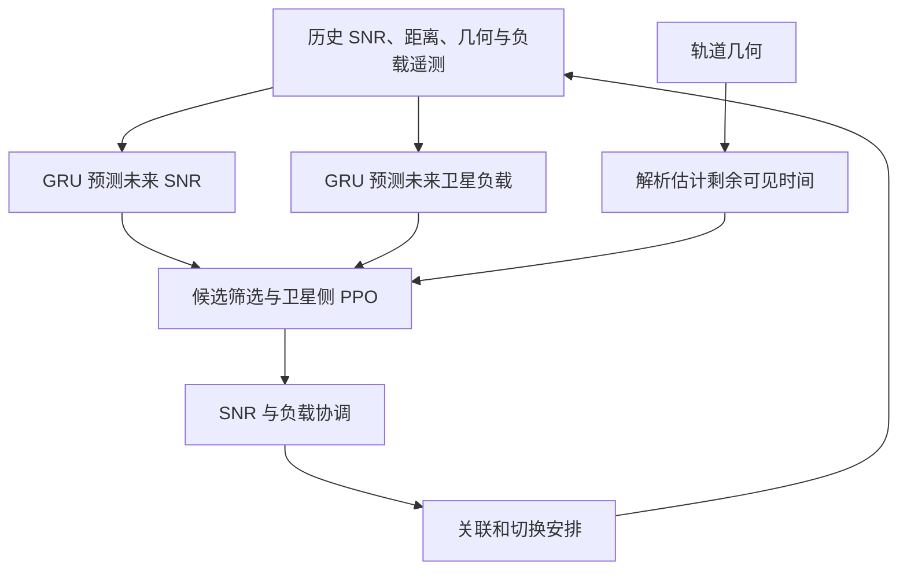

# PMA-PPO：论文讲解与多星座 World Model 方案的重合分析

分析日期：2026-10-02。

**判断：这篇论文与你的想法有明显的方向重合，尤其已经覆盖“历史预测 + 提前切换 + 多智能体强化学习 + 负载与切换稳定性”。但它没有在所给全文中建立你最新版方案的核心闭环：有限、延迟、方向相关的观测 → 未知同频干扰的概率状态 → 按候选计划推演实际服务 → 显式协议执行；也没有研究独立运营方因本方行动而产生的延迟响应。你的方案仍有可以研究的差异，但需要实验支持，不能仅靠把 GRU/PPO 换成 RSSM/MPC 来认定创新。**

本文基于你提供的 15 页 PDF。文中页码均为 PDF 页码；“原文结果”“我的核算”“对你方案的建议”分别标明，避免把作者主张当作已经独立验证的事实。

## 1. 论文信息与比较对象

| 项目 | 内容 |
| --- | --- |
| 标题 | *Intelligent Handover Management for 6G LEO Satellite Constellations: A Predictive Multi-Agent PPO Approach* |
| 作者 | Abdul Samim、Attiq Ur Rehman、KyungHi Chang |
| 期刊 | IEEE Transactions on Network and Service Management |
| 版本 | 所给 PDF 为 2026 年已接受、尚未完全编辑的作者版本；不据此补写正式卷期页码 |
| DOI | [10.1109/TNSM.2026.3735527](https://doi.org/10.1109/TNSM.2026.3735527) |
| 方法名称 | Predictive Multi-Agent Proximal Policy Optimization，PMA-PPO |
| 原文 | [本地 PDF](Intelligent_Handover_Management_for_6G_LEO_Satellite_Constellations_A_Predictive_Multi-Agent_PPO_Approach.pdf) |

这里主要比较你的 2026-10-02 版本：

- [多星座对等共存：历史观测世界模型与预测切换详细方案](多星座对等共存_历史观测世界模型与预测切换_详细研究方案.md)。
- [多星座世界模型：神经网络输入输出简表](多星座世界模型_神经网络输入输出简表.md)。

该版本以独立运营的同频 LEO 星座为场景，首篇可以只做 L1，也可以做 L1+L2；L3 留待后续。主方法为共享概率 RSSM、解析轨道/链路/协议模块和受约束 MPC。网络学习未知功率动态，速率与累计服务量通过解析计算得到，采用满缓冲连续服务抽象。

根目录 [ICC 英文研究简报](../WorldNTN_ICC_research_brief_EN.md) 和 [具体研究计划](../WorldNTN_ICC_concrete_research_plan.md) 还有“单一协调网络内，联合接收波束、关联和资源重分配”的早期版本。第 10 节另作比较，避免混淆两条研究范围。

## 2. 论文解决什么问题

LEO 卫星快速移动，使用户当前看起来最好的服务星很快变差；大量用户同时选择同一目标星，又会造成容量集中和切换失败。论文希望同时实现三个目标：提高网络吞吐、减少切换、平衡卫星负载。

它提出的基本逻辑是：先预测接下来几步的链路质量与卫星负载，再让卫星侧 PPO 智能体提出切换决策，最后通过协调机制形成关联安排。

**它的主要不确定性是未来 SNR 和共享卫星负载。你的最新版方案主要面对的是无法直接读取的外方辐射活动、方向相关的干扰，以及可选的行动反馈。** 两者都需要预测，但预测对象和信息条件不同。

## 3. 系统模型：统一协调的双层网络

原文 §II、表 III 的主要设置如下。

| 项目 | 论文设置 |
| --- | --- |
| 控制层 | 100 颗 LEO 卫星，高度 1200 km，承载预测与协调功能 |
| 数据层 | 300 颗 VLEO 卫星，高度 300 km；区域分析中使用 32 颗活动数据星 |
| 区域 | 韩国附近，ROI 标称直径 600 km |
| 用户 | 地面与空中用户；随机航点移动，最大速度 1000 km/h；负载扫描为 50–300 用户 |
| 业务 | 满缓冲，用户持续有数据需要传输 |
| 接入资源 | 每颗数据星 16 个波束；模型限制每星最多 16 个同时关联用户 |
| 链路 | 20 GHz 下行、每波束 20 MHz；最小 SNR 门限 8 dB |
| 控制连接 | 光学 ISL，单链路容量 10 Gbps；允许网络内交换状态和协调 |

**双层不是两个互不共享信息的运营方。** 高层负责控制，低层负责数据，属于一个协调体系；不能把 LEO/VLEO 两层直接对应成你方案中的独立星座 A/B。

原文 §II-E 使用接收信号与噪声的比值：

$$
\gamma_{u,s}(t)=\frac{P_{u,s}(t)}{N_0W},\qquad
C_{u,s}(t)=W\log_2\!\left(1+\gamma_{u,s}(t)\right).
$$

这里的 $\gamma$ 必须是线性 SNR。论文认为波束空间隔离足以使波束间干扰可以忽略，吞吐公式中没有你方案所需的外方同频干扰项 $I^{\rm ext}$。

原文第 6 页还明确采用当前系统状态完全可得、全网同步决策、可靠控制信道等理想化假设。因此，它没有建立单 RF 扫描预算、候选方向缺测、测量采样/到达双时间及报告年龄的在线观测模型。

论文包含传播时延和控制开销分析，这一点需要承认；但这种分析与在每条候选计划中推进准备、批准、断流、失败恢复和资源占用，是不同层次的建模。

## 4. PMA-PPO 的方法如何工作



### 4.1 先用两个预测器生成未来特征

SNR 预测器使用历史 SNR、距离、距离变化率及仰角特征，通过 GRU 编码，再用 MLP 输出未来多步 SNR。负载预测器使用历史利用率、切换到达记录和用户移动信息，输出未来负载。具体见式 (23)–(25)。

表 III 给出：历史长度 10 步、SNR 与负载预测窗口均为 5 步、每个 GRU 预测器 2 层、隐藏维度 128。结论部分将预测范围描述为 1–5 秒；复现时仍应明确控制步长，不能只看步数。

剩余可见时间通过轨道几何解析估计，并用于剔除可用时间太短的候选星。论文使用 $\tau_{\min}=20$ s 作为剩余可见时间阈值。**这不是你方案中“接通后至少驻留 10 s”的同一个参数。** 前者判断还能看见多久，后者限制多久内不主动再次切换。

### 4.2 每颗数据星运行 PPO 智能体

原文明确以 VLEO 卫星为智能体。其观测包含预测 SNR、预测邻星负载、剩余可见时间和候选可用性，见式 (27)。策略网络产生切换/关联动作，协调器最终形成 $x_{u,s}(t)$。

PPO 的策略更新使用裁剪目标和优势估计。论文的创新组合主要在预测模块、负载协调和网络架构，而不是提出一种全新的 PPO 更新规则。

**PMA-PPO 与 MAPPO 是本文中的两种方案名称，不能混用。** 原文把 MAPPO 作为不含所提预测和负载协调的对照算法。PMA-PPO 的逐用户动作编码、多个卫星提出冲突动作后的完整仲裁细节，没有在全文中同样清晰地展开；复现需要进一步落实这些接口。

### 4.3 用质量、负载和稳定性共同设计奖励

论文式 (31) 为：

$$
R_s(t)=w_1R_{\rm snr}(t)+w_2R_{\rm load}(t)+w_3R_{\rm stability}(t).
$$

三项分别倾向于选择预测质量好的链路、抑制负载偏离平均值、惩罚仍有较长可见时间时的移交。可行性约束包括单星关联、每星用户容量和 SNR 门限，见式 (10)–(12)。

这已经覆盖了“换星有成本”“需要避免乒乓切换”“应考虑其他用户与卫星负载”等一般设计思路。你的论文不能把这些单独列作新贡献。

### 4.4 它与显式世界模型规划的区别

PMA-PPO 主要执行：

$$
\text{历史}\rightarrow\text{未来 SNR/负载特征}\rightarrow\text{策略动作}.
$$

你的完整结构化世界模型则希望执行：

$$
(\text{历史 belief},\text{候选计划 }P)
\rightarrow\text{未知功率动态与显式协议轨迹}
\rightarrow\text{未来服务分布}
\rightarrow\text{计划比较}.
$$

关键区别是**是否能从同一个当前判断出发，针对保持、立即准备、延后执行等不同计划，生成相互一致的服务轨迹**。第一篇没有给出这种候选计划条件化的在线环境展开。

PPO 仍然通过与环境交互学习动作的长期后果，不能说它完全不考虑未来或完全不学习用户间影响。需要证明的是显式推演在你的信息条件和反馈机制下，是否比同样拥有历史的策略更有效。

## 5. 训练与实验结果

### 5.1 数据与对照

原文 §IV-A 说明：GRU 和 PPO 都用 MATLAB Satellite Communications Toolbox 生成的合成轨迹训练，没有实际卫星遥测。训练与评估使用独立随机种子生成的 episode，改变用户位置、移动和阴影衰落。

比较算法包括 CHO、MAPPO、MADDPG、QMIX；各学习算法训练 10000 个 episode，但部分超参数不同。它有训练/测试分离，也比较了多个算法家族，这些是优点；结果仍是该合成环境下的仿真证据。

### 5.2 主要结果及引用边界

| 指标 | 原文报告 | 解读与核查 |
| --- | --- | --- |
| 300 用户时切换失败率 | PMA-PPO 2.5%，CHO 11.2% | 降幅 $(11.2-2.5)/11.2\approx77.7\%$，可从图 7(a)核算；不是所有场景统一下降 77.7% |
| 平均 SNR | 约 11–11.5 dB，优于对照 | 图 7(b)；宜比较 dB 差或换算线性功率比，不直接把 dB 数值比例当物理增益 |
| 过载时间比例 | PMA-PPO 4.1%，CHO 25.8% | 图 7(c)；原文“降低 74.06%”与这组数字不一致，见下一节 |
| 乒乓切换率 | 100/200/300 用户时为 2.1%/3.5%/4.9% | 图 8；论文采用 5% 作为其讨论阈值，不据此称它为通用标准要求 |
| 吞吐分布与公平性 | CDF 优于基线；摘要/结论称公平性改善 35.13% | 正文缺少与该百分比直接对应的清晰计算口径，不宜直接引用为已核验的公平性增益 |

这些实验支持“预测与协调的组合在其模型下优于所比较方法”。它们没有单独证明 GRU 比强解析预测器好，也没有单独分离预测模块与协调模块各自的贡献。

## 6. 阅读时需要注意的证据与一致性问题

以下是基于所给作者版本的核查，不等于否定论文整体方法。

### 6.1 没有充分分离预测器和协调器的贡献

PMA-PPO 对 MAPPO 的比较同时改变预测输入和负载协调。原文将两者的组合差异解释为预测设计收益，但没有完整提供“同 PPO 去掉预测”“同预测去掉协调”等独立消融，也没有系统报告 SNR/负载多步预测误差和概率校准。

因此，你应采用同一个 MPC 比较几何、HSMM、GRU 与 RSSM，并在同一个世界模型上比较单步与多步控制；否则也会遇到同样的归因问题。

### 6.2 过载百分比的核算不一致

原文第 12 页给出 PMA-PPO 4.1%、CHO 25.8%，同时称过载时长减少 74.06%。按这一对数字核算应为：

$$
\frac{25.8-4.1}{25.8}\times100\%\approx84.11\%.
$$

74.06% 的对应基准与计算过程在这里不清楚。引用时可报告图中原始比例，并注明作者百分比有待核实。

此外，模型约束每星最多 16 个关联用户，却仍报告非零“过载时间”，需要明确过载是申请负载、提供负载、资源需求还是已接纳用户数。你自己的评估应把请求拥塞、接纳失败和实际资源超配分开定义。

### 6.3 吞吐与链路参数缺少一致解释

按论文每用户单个 20 MHz 波束和 11–11.5 dB SNR，用式 (8)得到约 75–78 Mbps。正文却把图 7(d)的中位用户吞吐描述为约 400 Mbps；图中 CDF 在 0.5 附近的位置也不支持该文字描述。

这是链路参数、吞吐单位或聚合口径需要澄清的问题。它不能仅靠平均 SNR 推出全体用户速率分布有错，但足以说明不应直接拿这组吞吐数字作为你系统的目标值。

### 6.4 控制时延与“实时性”需要完整预算

原文第 4 页允许 ISL 长度达到 5000 km，第 11 页又称控制往返延迟被限制在 10 ms。按它给出的 $300\text{ km}/c+2\times5000\text{ km}/c$，仅传播项就约 34.3 ms，尚未计处理。这不排除实际使用更短路径，但“10 ms 上界”需要额外路径限制。

附录给出约 $7.9\times10^8$ ops/步。若总执行能力为 $10^9$ ops/s，单这一数量级约需 0.79 s；是否能满足控制周期，还取决于并行部署、真实操作计数、历史编码和其他开销。多项式复杂度是可扩展性描述，不等于已经实测满足时限。

表 III、第 10 页用户配置与其他段落还分别出现 300 用户、30 地面加 5 空中用户，以及 32 活动星和图中的 12 星。可能是不同实验子集，但配置对应关系需要明确。复现时应逐图记录场景。

## 7. 与你的最新版 idea 逐项比较

| 维度 | PMA-PPO 已覆盖的内容 | 你的最新版方案 | 重合判断 |
| --- | --- | --- | --- |
| 核心任务 | LEO 选星与切换管理 | 同频共存下选星与切换时机 | 高，属于同一控制问题家族 |
| 提前决策 | 用未来 SNR/负载改善切换 | 用未来服务轨迹决定准备与执行 | 高，不能主张首次预测切换 |
| 历史信息 | GRU 编码 SNR/负载历史 | 历史功率、方向、年龄、动作、控制确认形成 belief | 部分重合；使用历史本身已有 |
| 网络关系 | 统一协调的双层网络 | 独立运营方，只切本方授权卫星 | 有明确问题差异 |
| 无线质量 | SNR，忽略所讨论波束间干扰 | $S/(I^{\rm ext}+I^{\rm own}+N)$，方向与 RB 相关 | 有明确建模差异 |
| 在线信息 | 当前系统状态理想可得 | 单 RF 有限扫描、缺测、延迟和 pending 动作 | 有明确差异；需同信息基线证明价值 |
| 学习对象 | 未来 SNR/负载预测加 PPO 策略 | 未知有效功率概率动态；协议和速率解析计算 | 有方法差异，不能只以模型名称证明创新 |
| 计划比较 | 预测特征交给 PPO 与协调器 | 同一 belief 下展开保持、准备、等待、执行等合法计划 | 有实现差异；需报告计划排序与闭环收益 |
| 切换成本 | 奖励惩罚、容量门限、CHO 流程、控制开销分析 | 逐事件执行与实际接收窗口积分，失败也有服务损失 | 一般成本重合，执行建模深度不同 |
| 外方响应 | 未建立跨运营方干扰反馈模型 | L2 推演本方发射改变外方测量与切换的延迟响应 | 所给全文未覆盖这一具体机制 |
| 多方学习 | 多个卫星代理协作学习 | L3 各运营方独立学习、对手池与交叉版本测试 | “多智能体”重合，协作关系和训练问题不同 |
| 满缓冲服务 | 已采用 | 初版同样采用连续速率服务 | 重合，是共同抽象，不是创新 |

**你的 L2 必须指真实的物理反馈。** A 发出准备请求并不会自动改变 B 的干扰；A 的关联/发射真正生效后，B 接收到自己的延迟测量并可能响应，之后才改变 A 的未来干扰。这比泛称“多智能体互相影响”更具体。

## 8. 只做 L1、加入 L2、以后做 L3，分别怎样定位

| 范围 | 与该论文的关系 | 应证明的内容 |
| --- | --- | --- |
| L1：外方活动外生 | “历史预测帮助提前切换”已有明显近邻；有限观测下的方向相关干扰和可执行服务规划仍有研究空间 | 历史在缺测/延迟下确实帮助预测干扰持续性；完整服务积分改变计划排序；收益超过 GRU+同一 MPC 和历史 PPO |
| L1+L2：固定规则的外方响应 | 具体行动反馈比论文的 SNR/负载预测更有区别 | 同一初始世界中，不同 A 计划引起不同 B 响应；动作条件模型改善响应时间/持续性预测，并减少反弹和返星 |
| L3：双方参数也学习 | 已有 MARL 会使“多个学习者”这一说法失去独立新意 | 证明独立运营方非平稳响应下的对手版本泛化与逐方服务收益；不能把统一合作训练直接当作独立竞争已解决 |

L1 可以形成完整研究，不必为了躲开这篇论文强行增加 L3。但如果 L1 实验最终只表现为“给 PPO 多加一段 SNR 预测”，与这篇工作的重合就会很强。

如果纳入 L2，应设计它相对 L1 的机制实验，而不是只增加更多卫星或更多 UE。两星座双 UE 就可以检验该反馈链。

## 9. 建议加入的基线与关键实验

### 9.1 以同样信息和执行器比较方法

| 对照 | 用途 |
| --- | --- |
| 当前测量 + 滞回/计时器；几何最长覆盖 | 排除收益来自普通防频繁切换规则或公开轨道 |
| 几何/HSMM/GRU + 同一个 MPC | 检验学习模型和概率潜状态是否必要 |
| 循环 PPO，输入同样历史、年龄与掩码 | 对比历史策略与显式模型规划，避免只赢过无记忆策略 |
| PMA-PPO 思路的适配版：预测 SINR/资源特征 + PPO | 直接回应本篇近邻；明确这是共存场景适配，不能称原算法原样复现 |
| 额外完整状态/预测特征的辅助 PPO | 评估信息不足带来的损失；单列为有额外信息的参考 |

原论文以卫星为代理，你的首版以本方控制器为决策方，不能机械一一对应。适配时应声明代理、动作和输入如何变化；所有主要方法共用合法动作、测量预算、确认时延、失败恢复和资源执行器。

### 9.2 三类实验最能说明差异

1. **同 MPC 换预测器。** 按 1/5/10/20/30 s 报告聚合干扰误差、区间覆盖、服务量误差和计划排序，再报告实际服务量。不能只报后验重构误差。
2. **同预测器换执行建模。** 比较计入/忽略准备、断流和恢复的决策；所有方法最后仍在同一真实执行器里测试，检验是否少选了短暂高质量但来不及获益的目标。
3. **L2 行动响应对照。** 保持和切换分支从同一基础世界、相同外生随机流出发，重新运行 B 的报告与触发；比较行动无关预测器与行动条件预测器，检查是否改变计划排名并减少 A1→A2→A1。

各方法的累计服务量、最长中断、切换/返星、接入失败和规划超时应一起报告。L2/L3 还要分别报告 A/B 的服务，不能用 A 的改善宣称全系统公平。

## 10. 与早期“波束—关联—资源联合控制”版本的关系

早期 ICC 版本强调一个协调网络内的多 UE 资源耦合，这与 PMA-PPO 的关联、负载平衡和多用户协调重合更强。“提前释放资源给其他用户”“减少拥塞切换”不能只凭动机就视为全新问题。

相对具体的差异是：量化相位接收波束在本星抗干扰与换星之间的选择、部分观测干扰、逐事件资源预留与释放，以及迁移中断如何进入真正可执行的联合轨迹。第一篇使用卫星波束容量和固定链路增益，没有研究你早期版本的终端接收波束优化。

最新版已经收窄为接收方向随服务星跟踪，不主动联合学习连续波束。因此，介绍最新版贡献时不应继续把早期的接收波束优化当作已包含的区别。

## 11. 建议采用的研究表述

**L1 版本：** 面向独立 LEO 星座的同频共存，从本方有限、延迟且方向相关的功率测量估计未知干扰动态，结合解析几何和切换协议比较候选计划的累计服务，在统一测量与执行条件下验证历史预测和多步规划的收益。

**L1+L2 版本：** 在上述基础上，建模本方已生效行动引起的外方延迟响应，通过动作条件预测比较不同准备与执行计划，检验是否减少干扰反弹、服务中断和返星。

不宜单独作为贡献的说法包括：首次使用历史、首次预测 LEO 切换、首次 MARL 选星、首次考虑切换惩罚、首次使用剩余可见时间，以及仅凭 RSSM 名称宣称首次世界模型。这篇论文足以覆盖其中多个宽泛主张。

本分析确定的是你与这篇具体工作的差异；是否具有全领域新颖性，还要结合已有同频共存选星和世界模型工作。你的方案目前是设计，以上收益均是待验证主张。

## 12. 原文证据索引

| 阅读问题 | 原文位置 |
| --- | --- |
| 标题、作者、版本、摘要主张 | 第 1 页 |
| 双层架构和区域容量 | §II-A，第 2–3 页 |
| 波束复用与忽略干扰 | 第 3–4 页 |
| ISL 距离和时延 | 第 4 页，式 (1)–(3) |
| 满缓冲、SNR 和速率模型 | 第 5 页，式 (4)–(8) |
| 当前状态、同步与控制可靠性假设 | 第 6 页 |
| 关联约束和优化目标 | 第 6–7 页，式 (9)–(18) |
| 合成训练数据与评估分离 | 第 7 页，§IV-A |
| 预测器、卫星代理和奖励 | 第 8–9 页，式 (23)–(34)、算法 1–2 |
| 系统与学习参数 | 第 10 页，表 III–V |
| 控制开销与对照说明 | 第 11 页，表 VI |
| 性能与一致性检查 | 第 12–13 页，图 7–8 |
| 复杂度计算 | 第 13–14 页，附录 A |

另一篇相关分析：[ILCHO 论文讲解与多星座 World Model 重合分析](ILCHO_论文讲解与多星座WorldModel重合分析.md)。

## 13. 补充：整体模型与神经网络的输入输出

**整体算法输入历史链路、负载和几何信息，输出用户—卫星关联与切换安排。神经网络分别输出未来 SNR、未来负载、动作概率和价值估计；最终关联矩阵还要经过动作选择与协调，不能把所有输出都归到一个网络头上。**

本节主要依据原文第 8–10 页，式 (23)–(29)、算法 1–2 和表 III。$u$ 表示用户，$s$ 表示卫星，$t$ 表示当前控制步，$H$ 表示预测步数。

### 13.1 整体方法的输入输出是什么

| 层次/模块 | 输入 | 输出 | 输出如何得到 |
| --- | --- | --- | --- |
| 整体在线控制器 | 用户—候选星的历史 SNR、历史距离、距离变化率、仰角；各星历史负载、切换到达记录和用户移动信息；用户/卫星几何及容量、质量门限等配置 | 当前用户—卫星关联 $x_{u,s}(t)$，由关联变化形成切换安排 | 两类预测器 + 解析可见时间 + PPO + 协调 |
| SNR 预测模块 | 每个用户—卫星对的链路与几何历史 | 接下来 $H_{\rm snr}$ 步的 SNR 预测序列 | GRU 编码，MLP 输出 |
| 负载预测模块 | 每颗星的历史利用率、切换到达记录及移动信息 | 接下来 $H_{\rm load}$ 步的负载预测序列 | GRU 负载预测器 |
| 剩余可见时间模块 | 用户/卫星位置、相对几何、卫星角速度、最低仰角等 | 剩余可见时间 $\tau_{u,s}^{\rm rem}$ | 解析计算，非网络预测头 |
| 候选筛选 | 预测 SNR、剩余可见时间和对应门限 | 合法候选集合/候选可用指示 | 门限判断；算法 2 使用下一步预测 SNR 与剩余可见时间 |
| 卫星侧 PPO 与协调 | 各星聚合的预测特征、候选状态与策略提出的动作 | 满足单星关联和容量约束的关联安排 | 策略动作选择后统一协调 |
| 仿真评估 | 实际链路、实际关联、切换事件与负载 | 吞吐、失败率、过载、乒乓切换等指标 | 环境和统计计算，非上述网络直接输出 |

最终输出可以用论文的二元关联矩阵表示：

$$
\mathbf X(t)=[x_{u,s}(t)]\in\{0,1\}^{U\times S}.
$$

$x_{u,s}=1$ 表示用户 $u$ 关联卫星 $s$。前后两步的关联变化用于判定切换。该矩阵表示控制安排；真实接入是否成功及失败指标仍由环境/执行过程产生。

### 13.2 SNR 网络直接输入输出什么

原文式 (23)列出：

$$
x_{u,s}^{\rm snr}(t)=
\big[\mathrm{SNR}_{u,s}(t-w:t),\ d_{u,s}(t-w:t),\ \dot d_{u,s}(t),\ \cos\theta_{u,s}(t)\big]^\top.
$$

| 直接输入项 | 含义 | 来源 |
| --- | --- | --- |
| 历史 $\mathrm{SNR}_{u,s}$ | 该用户—卫星链路过去的信噪比 | 遥测/仿真记录 |
| 历史 $d_{u,s}$ | 过去的用户—卫星距离 | 几何计算 |
| 当前 $\dot d_{u,s}$ | 距离增大或减小的速度 | 几何变化率 |
| 当前 $\cos\theta_{u,s}$ | 仰角的余弦特征 | 几何计算 |
| 上一步 GRU 隐状态 | 循环网络保留的历史记忆 | 网络内部状态 |

需要区分 **GRU 本体**和**完整 SNR 预测器**的输出：

$$
\text{链路特征序列}\xrightarrow{\rm GRU}h_{u,s}(t)
\xrightarrow{\mathrm{MLP}_{\rm SNR}}
\big[\widehat{\mathrm{SNR}}_{u,s}(t+1),\ldots,
\widehat{\mathrm{SNR}}_{u,s}(t+H_{\rm snr})\big].
$$

GRU 本体直接更新隐藏状态；MLP 读出该状态，得到未来 SNR 序列。表 III 给出隐藏维度 128、2 层 GRU、历史长度 10、预测长度 5。因此，单个用户—卫星对的最终 SNR 预测包含 **5 个未来数值**。

原文同时写 $d_x=4$，但式 (23)把两个历史序列和两个当前特征并列，没有完整交代当前特征在时间轴上如何对齐、窗口端点如何处理、特征如何归一化。实现时可以整理成“时间 × 特征”张量；具体张量预处理不能假称已在论文中完整公开。

该预测器的读出是 SNR 数值序列，原文没有给出均值/方差或置信区间输出头。GRU 内部的更新门 $z$ 是门控变量，不能将它解释为你 RSSM 的随机潜状态 $z$。

### 13.3 负载网络直接输入输出什么

原文式 (25)为：

$$
\widehat\rho_s(t+1:t+H_{\rm load})=
\mathrm{GRU}_{\rm load}\!\left[
\rho_s(t-w:t),\ N_{{\rm HO},s}(t-w:t),\ \mathbf v_{\rm user}(t)
\right].
$$

| 直接输入 | 直接预测输出 |
| --- | --- |
| 历史利用率 $\rho_s$，表示该星已使用容量的比例 | 未来各步的利用率 $\widehat\rho_s$ |
| 历史切换到达记录 $N_{{\rm HO},s}$ | 该量作为输入帮助预测负载，没有单独的未来到达记录输出头 |
| 用户移动向量 $\mathbf v_{\rm user}$ | 该量作为输入；网络没有直接输出用户未来位置 |
| 循环隐状态 | 更新后的内部记忆；供序列预测使用 |

表 III 为负载预测窗口给出 5 步，因此每颗星的最终预测可表示为：

$$
\widehat{\boldsymbol\rho}_s(t)=
[\widehat\rho_s(t+1),\ldots,\widehat\rho_s(t+5)].
$$

原文算法 2 的简写只列了负载与切换历史，没有再列用户移动向量；正文式 (25)包含该向量。用户移动如何聚合、输入总维度和负载读出层细节并未完整说明。可以确定的是预测目标为负载序列，不能额外补写成未来 RB 分配表、私有调度策略或功率分布。

### 13.4 PPO 的两个网络直接输入输出什么

原文式 (27)给出卫星 $s$ 的策略观测：

$$
\mathbf s_s^{(t)}=
\big[
\widehat{\mathrm{SNR}}_s^{(t+1:t+H)},\
\widehat\rho_{-s}^{(t+1)},\
\boldsymbol\tau_s^{(t)},\
\mathbf I_{\rm candidate}^{(t)}
\big].
$$

| 神经网络 | 直接输入 | 直接输出 | 后续用途 |
| --- | --- | --- | --- |
| Actor/策略网络 $\pi_\theta$ | 未来 SNR 特征、预测邻星负载、剩余可见时间、候选可用指示组成的卫星级观测 | 经 softmax 得到的各动作概率 $\pi_\theta(a_s\mid\mathbf s_s)$ | 选择/采样动作，再交协调器形成关联 |
| Critic/价值网络 $V_\phi$ | 原文价值函数所对应的状态观测 $\mathbf s_s$ | 一个标量 $V_\phi(\mathbf s_s)$，估计未来折扣累计奖励 | PPO 训练时构造优势和价值损失 |

式 (28)–(29)分别写为：

$$
\pi_\theta(a_s\mid\mathbf s_s)
=\operatorname{softmax}(W_\pi\varphi(\mathbf s_s)+b_\pi),
\qquad
V_\phi(\mathbf s_s)=W_v\varphi(\mathbf s_s)+b_v.
$$

策略的直接输出是动作概率向量；$a_s$ 是由此选择的动作。论文没有充分规定每颗卫星控制多 UE 时的动作枚举、输出头大小以及不同用户/候选如何拼接，所以不能把 Actor 输出维度武断写成 $S$、$U\times S$ 或某个固定数字。

价值网络的标量也不是未来 SINR、吞吐或累计服务量。它估计的是由质量、负载和稳定性奖励共同定义的回报。原文直接写出的价值函数是上述状态到标量的关系；不能仅凭 CTDE 名称补出一个未公开的完整全局 Critic 输入张量。

### 13.5 训练目标、解析结果与网络输出的区别

| 量 | 在论文中的角色 |
| --- | --- |
| 未来真实 SNR、未来真实负载 | 仿真产生的预测训练目标；不是运行时读取的真实未来输入 |
| 奖励 $R_s$、优势 $\widehat A_t$、价值目标 | PPO 训练所需的反馈/计算量，不是 Actor 的动作输出头 |
| 剩余可见时间、候选可用标记 | 解析/规则模块的结果，然后成为 PPO 输入 |
| 用户吞吐、公平性、失败率 | 环境或评估统计，不是 GRU/Actor 直接输出 |
| 最终关联矩阵 $\mathbf X$ | 动作选择与协调后的算法输出，不是 SNR 预测器输出 |

整条接口可以概括为：

```text
历史 SNR + 几何 ──> SNR-GRU + MLP ──> 未来 SNR 序列 ─┐
历史负载 + 切换记录 + 移动信息 ──> 负载 GRU ──> 未来负载 ─┤
轨道/位置 ──> 解析剩余可见时间与候选筛选 ───────────────┤
                                                     ↓
                                       PPO Actor：动作概率
                                                     ↓
                                        动作选择 + 协调
                                                     ↓
                                        用户—卫星关联/切换

同一状态观测 ──> PPO Critic：回报估计标量（用于训练）
```

与你方案的直接对应是：本篇确实有未来物理/资源数值预测，但它预测的是 SNR 和负载；你的最新版学习未知入射功率分布，再由解析模块计算方向相关 SINR、协议下的速率与服务量，并据此比较计划。
