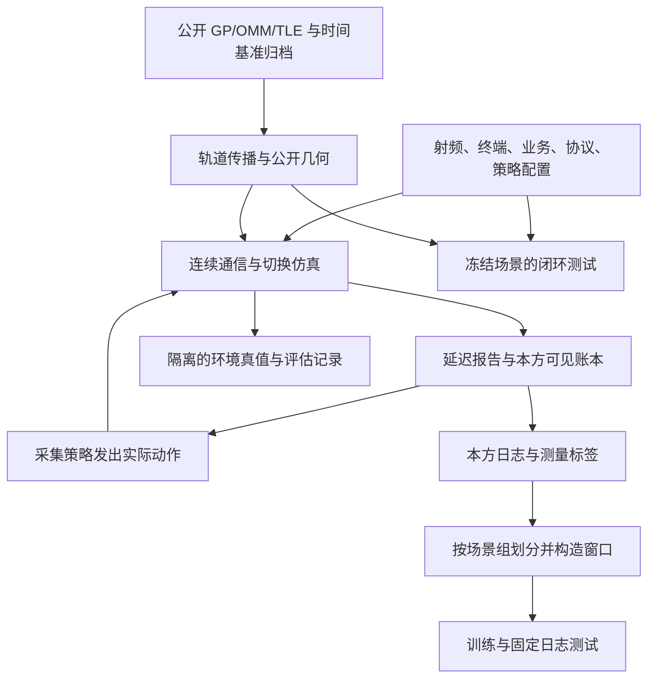

# 多星座宽带 LEO World Model：训练、验证与测试数据采集及生成计划

版本：审阅稿 v0.1；编写日期：2026-10-02。

**本文是后续实现数据生成器的规格草案。本轮交付文档；轨道目录下载、仿真代码实现和数据集生成在用户审阅修改后进行。所有“默认值”均为拟采用的研究配置，不代表已经测得、已经生成或商用系统实际参数。**

对应主方案：[多星座对等共存：详细研究方案](多星座对等共存_历史观测世界模型与预测切换_详细研究方案.md)。模型接口见[神经网络输入输出简表](多星座世界模型_神经网络输入输出简表.md)。论文数据流程参考：[PMA-PPO 与 ILCHO 建模及训练测试数据生成详解](PMA_PPO与ILCHO_建模及训练测试数据生成详解.md)。

本文中的“本方”指正在采集训练视角的运营方 A；B 是外方。通信对象为固定阵列宽带终端，单 RF、单活动数据连接，使用一个完整 250 MHz 信道。数据面采用连续服务量计算；不构造数据包、重传或逐 RB 调度。

## 0. 审阅入口：建议先确认这些决定

下面给出能落地的默认方案。修改时可直接改“拟定默认值”，随后实现应读取修改后的配置，不由程序自行猜测。

| 决定 | 拟定默认值 | 修改的影响 |
| --- | --- | --- |
| 第一版研究范围 | L1 必做；L2 单独数据包；L3 暂不生成 | L2 必须增加对方延迟响应和分支重跑 |
| 轨道来源 | 合成 Walker 诊断 + 真实公开 GP 几何，两套数据分开 | 可区分算法机制与实际星座几何分布的影响 |
| 真实轨道组合 | A 使用 Starlink 目录，B 使用 OneWeb 目录 | 仅借用轨道；双方射频、用户和调度仍是合成配置 |
| 公开轨道格式 | CelesTrak GP JSON 主归档，兼容已有 TLE | 支持较长目录号，避免只抓传统两行格式漏星 |
| 日期 | 后续执行时取得的快照附近；不预填虚构历史档案 | 真正的跨日期测试需要相应日期的存档 |
| 终端 | 每方 1 个固定测试 UE；负载组另加背景 UE | 初始核心验证与容量扩展分别统计 |
| 频谱 | 20 GHz、250 MHz、单极化、双方同频 | 是受控共存实验，不据此声称两个商用系统实际同频 |
| 采集状态 | 本方规则策略 + 合法随机探索；外方按 level 固定 | 无需已训练好的 world model 或 PPO 即可启动 |
| 首轮规模 | SYNTH-L1 200 组 + REAL-L1 200 组基础世界 | 是接口与可预测性验证规模，不预先宣称统计充分 |
| 划分 | 每套目标 160/20/20 组 train/val/test；以场景组为单位 | 相近场景合并后按组分配，数量允许据清单调整 |
| 采集时长 | 每组核心 600 s，前置 30 s，尾部 60 s，共 690 s | 确保历史预热和末端预测标签完整 |
| 首轮测量误差 | dB 域标准差 1 dB；理想 0 dB 与压力 2 dB 分开 | 为合成测量误差，须在数据卡注明 |
| 信道残差 | 首版额外阴影/跟踪误差为 0；后续独立扩展 | 首版可以固定网络的信号残差头为 0 |
| 测试形式 | 固定日志预测测试 + 冻结世界的闭环控制测试 | 静态日志不能代替算法真正执行后的性能测试 |

特别需要审阅的新增假设是：第 6 节的参考导频、候选扫描和检测模型，第 7 节的采集策略概率，第 10 节的场景分布，以及第 14 节的验收阈值。它们补足了原研究方案尚未完全规定的实现细节。

建议阅读顺序：先改本表，再审阅第 3 节的数据源、第 6 节的测量、第 10–13 节的规模与测试，最后核对第 17 节总配置。其余章节用于后续实现与验收。

## 1. 最终要交付什么

最终数据产物包含以下六部分，各有用途：

1. **不可覆盖的公开数据原件**：GP/OMM/TLE 快照、目录、获取时间、查询参数、文件校验值、来源说明。
2. **场景清单**：轨道、地区、双方终端、设备、外方规则、时延、种子和初始状态；能够重新运行同一世界。
3. **本方可见日志**：公开几何索引、本方已知状态、实际发出动作、已到达测量和控制确认。
4. **训练样本索引与编码配置**：窗口范围、监督掩码、归一化统计、候选与外源集合映射。
5. **独立评估记录**：环境功率真值、逐星贡献、实际 SINR、速率、服务量及分支结果；训练加载器不能读取。
6. **质量报告与数据卡**：数据数量、覆盖分布、异常、划分、局限、版本、复现实验步骤。

核心原则：**TLE/GP 提供卫星运动信息；用户、发射活动、测量、负载与 handover 必须由通信仿真生成。下载星历本身得不到这些训练日志。**



## 2. 信息来源：哪些抓取，哪些配置，哪些运行后产生

| 信息 | 来源 | 保存方式 | 是否允许进入 A 的输入 |
| --- | --- | --- | --- |
| A/B 公开卫星轨道 | CelesTrak；必要时 Space-Track 历史档案 | 原始文件 + 规范化星历表 | 允许，受发布时间/首次见到时间约束 |
| 卫星标识、分组、可得运行状态 | 来源目录或额外 SATCAT | 带来源版本的目录 | 公开字段允许；状态未知不能猜成确定在役 |
| 闰秒、UT1/地球定向配置 | 传播库固定内置表，或归档 IERS 文件 | 文件/库版本和哈希 | 作为物理计算基础，不做学习标签 |
| 本方 UE 位置 | 研究配置生成 | 本方配置与场景清单 | 允许 |
| 外方 UE 位置、连接、负载 | 隐藏场景配置生成 | simulator-private | 不允许 |
| 带宽、功率、阵列、方向图 | 本文受控参数 | 版本化 YAML | 本方已知配置允许；外方实际发射配置隐藏 |
| 外方选择/响应规则 | L1/L2 场景配置 | simulator-private | 不允许直接输入阈值、计时器或策略标签 |
| 本方动作 | 采集控制器实际发出 | issued_actions | 发出后允许 |
| 本方状态与资源 | 状态机、调度器、报告到达 | own_states、资源表 | 仅本地已知或已经报告的部分 |
| 切换请求与确认 | 协议事件循环 | control_events | 确认到达后允许 |
| 信号与干扰测量 | 物理功率 + 测量过程 | measurements | 只对真正测过且报告已到达的方向开放 |
| 逐外星真实 q、真实 SINR、R/D | 仿真环境内部计算 | eval_truth | 仅诊断/评估 |

首版不需要下载用户个人位置、商用网络私有负载、真实运营方调度表或实际 handover 日志。地形、天气、雨衰和真实终端测量可作为后续新版本，不能在没有数据时声称已建模。

| 扩展因素 | 首版处理 | 将来启用时需要补充 |
| --- | --- | --- |
| 雨衰、大气与遮挡 | 不建模额外损耗 | 固定衰落模型或带时间/位置的气象地形资料，独立验证标签可见性 |
| Doppler | 可由距离变化率计算，接收假设理想补偿 | 频偏/跟踪误差和相应测量或接收机模型 |
| 馈电链路、网关和核心网 | 未显式建网，时延并入声明的固定余量 | 拓扑、路径、瓶颈与控制消息路径配置 |
| 全网其他地区的业务 | 不生成；仅研究地区测试/背景 UE 与参考导频辐射 | 更大地区的隐藏用户和业务分布、截断边界验证 |
| 载荷硬件、波束斜视和姿态 | 使用本研究的阵列/方向图及频率相关响应 | 商用硬件实测或明确的新误差模型 |
| 实测网络校准 | 当前没有 | 用户合法取得的测量日志、设备标定与时间同步信息 |

因此 REAL 数据的准确称呼是“公开真实轨道驱动的区域通信仿真数据”，不能称为商用星座全网实测数据。

## 3. 公开轨道数据获取和归档

### 3.1 数据源与格式

主源采用 CelesTrak 的 GP 查询。其官方说明提供 JSON、CSV、XML/KVN 等格式，并提醒传统 TLE 对较长目录号的限制；JSON 使用 OMM 字段名，但不等同于完整标准 XML OMM 消息。实现必须显式指定格式。[CelesTrak GP 格式说明](https://celestrak.org/NORAD/documentation/gp-data-formats.php)

候选查询配置如下，**这是后续执行的接口模板，本轮不下载目录**：

```yaml
orbit_sources:
  - operator_role: A
    source: celestrak_gp
    group: starlink
    format: json
    url: "https://celestrak.org/NORAD/elements/gp.php?GROUP=starlink&FORMAT=JSON"
  - operator_role: B
    source: celestrak_gp
    group: oneweb
    format: json
    url: "https://celestrak.org/NORAD/elements/gp.php?GROUP=oneweb&FORMAT=JSON"
```

执行前根据[官方当前目录](https://celestrak.org/NORAD/elements/)核对组名和服务可用性。只获取使用的星座，不同时反复下载包含相同对象的全集。已有 TLE 可以导入；不要求为了保存两种格式再下载一遍同一目录。

Space-Track 是需要账户的可选来源：`gp` 用于当前根数，`gp_history` 用于历史根数。历史查询要缓存已下载范围，避免重复获取。首次实现以无需该账户的路径完成首轮数据；若后续确需历史数据，再使用本地凭据配置。[Space-Track API 与 GP_HISTORY 说明](https://www.space-track.org/documentation)

### 3.2 获取流程

1. 读取目标组、任务需要的日期和本地缓存清单。
2. 若已有符合任务要求的固定快照，离线复用，不联网刷新。
3. 需要新快照时，单下载进程串行获取两个组；仿真 worker 不访问远端。
4. 响应先写临时文件，检查 HTTP 状态、内容类型、非空记录与可解析性。
5. 保存完整原始响应字节、SHA-256、响应时间和查询信息；成功后原子写入归档目录。
6. 解析生成派生表；原件不改写，后续更新新增快照，不覆盖旧快照。
7. 任一来源失败时记录失败原因；可使用满足年龄要求的缓存，或明确将 REAL 阶段标为未完成。

建议归档结构：

```text
data/orbits/raw/celestrak/starlink/<retrieved_utc>_<sha256>.json
data/orbits/raw/celestrak/oneweb/<retrieved_utc>_<sha256>.json
data/orbits/manifests/<snapshot_id>.json
data/orbits/normalized/<snapshot_id>.parquet
data/time_reference/<time_reference_id>/
```

快照 manifest 至少包含：

```text
snapshot_id, source_name, request_url, request_parameters,
request_started_utc, retrieved_utc, http_status,
response_etag, response_last_modified, sha256, byte_count,
raw_record_count, parsed_record_count, rejected_record_count,
parser_version, source_documentation_url, retrieval_log_path
```

响应头中的时间只按其原始含义保存，不直接解释成每颗卫星轨道的发布时间。

### 3.3 抓取频率、错误与历史来源

CelesTrak 的说明要求缓存并限制重复下载，GP 通常按两小时检查更新；重复请求和错误循环可能被阻止。采用“任务需要时获取一次”的默认方式；以后若建立连续档案，同组间隔不得小于两小时，还须遵守执行时的来源政策。收到 403/404 等错误后停止本次自动获取并记录，不更换代理或继续循环。[CelesTrak 获取说明](https://celestrak.org/NORAD/documentation/gp-data-formats.php)

本计划不启动定时任务。需要连续多日档案时，在后续任务中明确档案起止日期和采集频率。Space-Track 的总体请求上限及不同数据类的缓存要求按其官方说明落实，不把总体上限当作应该达到的下载频率。[Space-Track 使用说明](https://www.space-track.org/documentation)

凭据仅从环境变量或忽略提交的本地文件读取，不写入 URL、数据集、日志或 Markdown。对外共享数据时保留来源与当时适用的引用说明。

### 3.4 三个时间必须分清

| 时间 | 含义 | 用法 |
| --- | --- | --- |
| `element_epoch` | 根数参考历元 | 判断传播距离历元有多远 |
| `source_published_at` | 来源明确给出的发布/创建时间；可能没有 | 有证据时保存，不能从 epoch 推断 |
| `available_time` | 研究控制器实际可以使用该版本的时间 | 无可靠发布时间时，用本项目首次成功见到它的时间 |

**epoch 不是发布时间。** 新下载的根数即使 epoch 较早，也不能在严格历史回放中假装更早就已经获取。历史档案若只有 epoch 而没有可用时间，只能标为“事后几何重建”，不能宣称验证了当时在线可知信息。

首版 REAL 使用冻结快照：设 `t_download` 为两组成功归档的较晚时间。所有 episode 的预热起点均不早于它，核心起点从 `t_download+30 s` 到 `t_download+24 h-660 s` 的区间选择。整个 episode 固定该快照，不在中途突然替换根数。

“用真实公开轨道做几何仿真”与“重放真实通信网络”是不同的数据来源声明；本计划只承诺前者。

### 3.5 解析、目录和异常处理

规范化根数保留来源提供的以下字段及其原单位：

```text
NORAD_CAT_ID, OBJECT_NAME, OBJECT_ID, EPOCH,
MEAN_MOTION, ECCENTRICITY, INCLINATION, RA_OF_ASC_NODE,
ARG_OF_PERICENTER, MEAN_ANOMALY, BSTAR,
MEAN_MOTION_DOT, MEAN_MOTION_DDOT,
ELEMENT_SET_NO, REV_AT_EPOCH,
REF_FRAME, TIME_SYSTEM, MEAN_ELEMENT_THEORY
```

另附 `operator_role, source_group, snapshot_id, available_time, metadata_defaults_applied`。对 CelesTrak JSON 省略的约定字段按其格式文档补全并标记，未知字段不能凭空补出。

实施检查：

- ID 用 int64 或字符串内部表示，不假设只有五位；模型中卫星 ID 仅用于关联，不作为无限增长的独立输出头。
- 同一对象同一版本去重；相同 epoch 但内容不同的根数不能静默覆盖，保留版本并记录选择理由。
- TLE 导入校验行号、行长度、目录号匹配、校验位和历元解析。[传统 TLE 字段说明](https://celestrak.org/NORAD/documentation/tle-fmt.php)
- OMM/JSON 检查必需字段、有限数值、角度单位、偏心率及平均运动合法性；保留传播器错误码。
- 主包建议在完整录制区间内满足 `abs(t-element_epoch)<=72 h`；该值是本研究质量门槛，不是轨道精度保证。超龄记录隔离，压力包可单列 3–7 天，不能混入主包。
- 研究目录默认保留所选组中可正常传播、轨道高度处于 200–2000 km 范围的对象；目录/高度筛选理由逐星记录。该范围是场景边界，不是“已商业服役”的判断。
- 在轨、可传播和通信载荷正在服务不是同义词。缺少明确运行状态时，将其服务资格标为 `synthetic_service_assumption`，不要把目录成员自动解释成商用活跃卫星。
- 起降轨、机动嫌疑、数据缺失和过滤造成的目录变化单独统计；不得为得到更好的通信结果而事后挑星。

## 4. 轨道传播、坐标和可见性

### 4.1 两条轨道管线

| 管线 | 输入和传播器 | 用途 |
| --- | --- | --- |
| `SYNTH` | 合成 Walker 参数；两体圆轨道 + 地球自转 | 确定性诊断、机制对照、可控相位泛化 |
| `REAL_GP` | 归档 GP/OMM/TLE；SGP4 + 坐标转换 | 真实星座几何下的通信仿真 |

SGP4 原始输出是 TEME；建议使用 python-sgp4 配合 Skyfield 转换到统一地固与局部坐标。SGP4 引力常数按相容实现固定，地面经纬度使用 WGS84 椭球，两者不能因名字相似随意混换。[python-sgp4 官方说明](https://github.com/brandon-rhodes/python-sgp4)

实现时锁定库版本、编译加速状态、时间表和坐标转换选项。Skyfield 可从 OMM 字段载入卫星，根数应在接近自身历元的时间使用；不能用一次当前下载外推数月来伪造跨月测试。[Skyfield 卫星文档](https://rhodesmill.org/skyfield/earth-satellites.html)

### 4.2 时间与坐标约定

- 对外日期一律 UTC；仿真内部使用相对起点的 int64 纳秒，物理运算转换为秒。
- 日历到连续时间的转换交给固定的时间库；如跨闰秒，使用连续时间尺度映射，不把 UTC 字符串直接做浮点相减。
- 保存 TEME 到 ITRS/ECEF 的转换实现；位置统一 m，速度 m/s，角度 rad。
- 终端输入为 WGS84 纬度、经度、椭球高；首版高度取 0 m，是理想地面，不加入地形遮挡。
- 卫星相对方向在 UE 的 ENU 系表示；阵列局部坐标还需固定 ENU 到阵列坐标的姿态矩阵。
- 首版使用固定版本内置时间表，记录其适用范围；精度扩展可显式归档 IERS 文件。正式生成阶段禁止库悄悄联网更新时间表。[Skyfield 时间与 IERS 文档](https://rhodesmill.org/skyfield/time.html)

### 4.3 生成的公开几何

每个相关卫星—本方 UE 对计算：位置与速度、斜距、距离变化率、ENU 单位方向、方位/仰角、方向变化率、FSPL、一程传播时延、剩余可见时间、本方授权和视场。

候选筛选规则：

1. 本方授权、仰角至少 25°、接收阵列可指向；初版电子扫描视场取天顶夹角不超过 65°。
2. 网络候选上限 K=4，优先当前星和已准备目标，再按剩余覆盖与方向差异补齐；并列按稳定 ID 排序。
3. 没有候选、只有当前星、候选暂未测到，都保留；不要只留下“至少有两个好选择”的时段。
4. 外方干扰源集合独立构造：保留本方地点地平线以上、历史/预测区间可能相关的外星，不能套用 K=4 或本方 25°接入门槛。
5. 只可根据公开几何和明确的误差界裁剪网络源集合，不能使用外方真实活动筛出“实际发射的几颗”后作为输入。

环境内部可跳过当前确实不发射的源以加速求和；这是模拟器计算优化，不能改变模型可见的目录或 mask。

### 4.4 真值轨道与控制器星历

首版两者使用同一份冻结轨道，是“轨道准确”的受控假设，研究重点放在未知辐射活动。不要将同一个 SGP4 结果称为真实精密轨道真值。

后续轨道误差扩展应另外定义 `truth_orbit` 与 `controller_ephemeris`：真值可以来自更高精度参考或明确的扰动模型，控制器继续使用截至决策时可得的版本。若没有精密参考，不声称模拟了真实定位误差分布。

公开未来几何使用决策时可用的同一版根数传播；不得用未来新发布版本修正当前输入。缓存键至少包含星历哈希、时间、传播设置和时间参考版本。

## 5. 通信环境：把几何变成可测功率和服务

### 5.1 固定物理配置

| 项目 | 默认值/规则 |
| --- | --- |
| 合成星座 | A：550 km、53°；B：600 km、55°；各 36 面×20 星，F=1 |
| 诊断相位 | B 升交点偏移 5°、沿轨偏移 10°；泛化集另采全局相位 |
| 固定诊断地点 | A：40°N、100°W；B：向东 1 km |
| 阵列 | UE 16×16，中心频率半波长间距，中心频率模拟相移跟踪服务星 |
| 阵列姿态 | 平面阵列法向朝当地天顶；单元理想模板；视场限制按第 4 节 |
| 频率与带宽 | 20 GHz、250 MHz、单极化；每个被调度数据流使用整个信道 |
| 同频活动数据波束 | 每星至多 8；扫描 2/4/8/16/32 时仍固定并核算总功率 |
| 发射功率 | 每数据波束标称 10 W，每星总预算 80 W；导频/控制计入 |
| 发射方向图 | 主方案的 30 dBi 峰值、2°参数、30 dB 衰减上限模板 |
| 噪声 | NF=6 dB，T=290 K，线性噪声系数用于计算 |
| 传播 | 自由空间；首版未知额外损耗为 0 |
| 时钟 | 决策 1 s；调度/物理 50 ms；导频与协议边界精确切分 |
| 频率积分 | 5 点 Gauss–Legendre；3/5/9 点对照 |
| 业务 | 满缓冲连续服务，效率系数 η=1 |

真实 GP 模式只替换轨道和卫星目录。20 GHz、250 MHz、8 波束、10/80 W 等仍为研究配置，数据卡必须写明其合成性质。

### 5.2 调度与负载生成

每星维护已连接 UE 的持久循环队列，每 50 ms 从游标开始选取至多 M_co 个空间兼容用户。卫星处的发射方向间隔至少 2°是默认兼容条件；即便通过该条件，也仍计算实际同星波束间干扰。

本时段有 n 个活动数据波束时：

$$
P_{s,b}=\min\!\left(P_{\rm nom},\frac{P_s^{\max}-P_s^{\rm pilot/control}}{n}\right).
$$

所有真实发射与预留分别入账。没有数据流时不产生数据辐射；预留本身不发射。无法并行的用户轮询等待，不能一律拒绝为“第九个用户”；当前首版没有按连接人数设置硬容量。

本方负载从以下结果生成：已连接数、活动波束数、波束时间份额、实际功率、功率余量、等待请求和预留。区分瞬时值、上一秒统计与未来已知安排，不把本秒结束后的统计提前填入本秒开始的状态。

### 5.3 功率、SINR 与服务量

环境按实际发射的每个同频波束计算 UE 处功率，包含本方其他波束、外方波束及实际导频/控制。阵列响应随频率计算，不能重复乘阵元数或重复扣 FSPL。

未来模型将预测逐外星聚合入射功率 q，并由解析层得到方向干扰与 SINR；生成器在物理层知道真实波束后可以独立算出 q、SINR 和服务量。后者只进评估域，不直接作为默认训练标签。

$$
\Gamma_u(f,t)=\frac{\mathsf S_u(f,t)}{\mathsf I_u^{\rm ext}(f,t)+\mathsf I_u^{\rm own}(f,t)+N_0},
\qquad R_u(t)=m_u(t)\eta\int_{\mathcal F}\log_2(1+\Gamma_u(f,t))\,df.
$$

功率谱密度用 W/Hz，总功率用 W，显示量可另存 dBm。噪声 N0=kBT F；频段总噪声为 N0B。先在线性域叠加，再转换 dB。

传播按发送区间映射到接收区间，保留 episode 起点前仍在传播的本方发射记录。使用一致的发送/接收时刻几何；距离传播不再额外乘一个吞吐折扣。

`m=0` 的原因分别记录为未调度、扫描、RF 转向、协议切换或失联。没有数据时 SINR 记 invalid；不可用“0 dB”代替无链路，也不能把正常轮询等待全部记为 handover 中断。

## 6. 测量怎样生成：扫描、误差、缺失和延迟

### 6.1 参考导频是需要明确的仿真配置

只有服务用户的数据波束并不足以保证未连接候选可测。为此，首版增加一个明确的合成参考导频 profile，审阅时可替换：

- 每颗对该研究地区具备服务资格的卫星，每 100 ms 发一个 2 ms 的参考导频，单次全信道总功率 1 W。
- 参考波束指向本运营方配置的研究地区中心，使用已声明的发射方向图；方向与时序可由本方控制器获知。卫星之间的起始相位由稳定 ID 固定，所有方法共享。
- 同一卫星在该 2 ms 内暂停本信道数据，导频时隙与数据时隙不重叠；功率和服务损失如实核算。控制握手另按协议 profile 计时，首版将其占用合并到已声明的控制时隙，不额外虚构持续辐射。
- 本方服务方向与候选扫描均观测这一可识别参考信号；从参考功率推算假设数据功率时，使用参考/数据发射功率及波束增益的已知比值。
- 外方导频也是干扰源；外方参考波束和私有终端位置不作为本方输入。

这是为生成可复现测量而定义的基准，不是商用发现信号标准。参考波束未覆盖终端、功率太弱或扫描错过时隙时，应产生未检测/缺失，不能自动补出候选质量。若该 profile 导致大量不可测候选，先报告覆盖情况，再通过新的配置版本调整，不能直接伪造报告。

首版各方导频地区中心取各自测试 UE 的固定位置；背景 UE 不保证处于该参考波束主瓣。每星导频起始相位取 `2 ms × (stable_hash(sat_id) mod 50)`，相位表保存到对应配置；本方可用本方表安排扫描，外方实际参考指向不输入本方模型。只有测试 UE 的扫描/测量按第 6.2 节作为学习日志采集，背景 UE 按冻结几何策略服务。

### 6.2 测量预算与扫描策略

服务参考信号每 100 ms 尝试测量一次。每秒最多扫描一个其他本方候选，扫描驻留 20 ms，额外转向/稳定/返回各暂取 2 ms，总占用 24 ms；这些新增时长均为合成初值。

扫描时序与目标参考时隙对齐，单 RF 在整个转向和扫描区间不能同时接收旧链路数据。处于 SWITCHING/RECOVERY 时按协议禁止或限制扫描，不能叠加一个“免费 RF”。

采集期候选扫描规则：

1. 已准备目标在最近 1 s 没有有效测量时优先扫描。
2. 其余合法候选按“最久未测”轮询，20% 概率在合法集合中均匀探索。
3. 同一 UE 每秒只有一个候选扫描机会；不足一个候选则空闲，不生成虚假记录。
4. 记录扫描的请求、实际区间、目标、指向和预算占用；评分方法比较时使用同一规则，后续可单独研究主动测量。

### 6.3 功率报告与误差

每次成功取得参考测量区间，环境先在相同频谱和时间积分得到 S_ref 与 J=I+N，再加入测量误差：

$$
S_{\rm report,dBm}=S_{\rm true,dBm}+\epsilon_S,
\qquad J_{\rm report,dBm}=J_{\rm true,dBm}+\epsilon_J.
$$

首版 `epsilon_S, epsilon_J` 为 dB 域零均值高斯，标准差 1 dB；模型是测量误差假设，不是射频实测标定。理想组取 0，压力组取 2 dB。若后续增加时间相关误差或校准偏差，应保存对应参数与种子。

训练似然使用同一测量误差配置，将接收机测量噪声与外方实际功率随机性区分；不能要求潜在功率轨迹精确复现每次独立测量噪声。

接收机检测门槛拟设参考 S/J 为 −15 dB，使用带同一测量误差的检测统计判定。未检出时保留检测结果、门槛和删失标记，不输出精确 S=0；不把“below threshold”解释成卫星没发射。该门槛仅是导频检测抽象，不是数据解调门槛。

`sinr_ref_db` 从同一报告中的 S_ref/J 派生，不再添加一个独立噪声抽样或独立监督项。I_est 如需计算，在 W 域做 `max(J_report-N_est,0)` 并记录截断/噪声不确定性。

所有报告记录 `sample_start, sample_end, sample_time, arrival_time`；默认 sample_time 为积分结束时刻，duration 独立保存。报告延迟从 sample_end 之后计时。

### 6.4 延迟与缺失

基准报告延迟按主方案：600 km 参考距离总延迟 0.2 s，去掉参考传播后留下固定处理项，再按实际消息路径加传播时间。首版无额外报告丢失；压力组可配置 5% 报告丢失和 0–0.2 s 非负排队抖动，分别生成新配置 ID。

`arrival_time<=decision_time` 才能进入模型历史。没有新报告时保留旧报告及 age；不将重复旧值当作新观测。缺失值存 null/mask，批处理的数值占位 0 没有物理含义。

## 7. 控制策略、外方行为与切换日志生成

### 7.1 初始化和预热

每次模拟从核心起点前 30 s 开始。初始化时，本方在合法候选中选择最高仰角星并完成一个明确的初始连接设置，记录为 initialization，不计入 handover 次数；没有候选则以 DISCONNECTED/RECOVERY 开始。外方依照其初始化规则建立状态。

初始化连接时间、资源队列游标和 pending 队列写入初始快照。前 30 s 正常运行测量、策略和协议，用来形成历史，不参与核心控制性能统计。不允许用未来 30 s 的实际功率反向挑一个“最好”的初始星。

### 7.2 本方采集策略

每个 episode 固定一种策略，首轮在 train/val/test 内按场景组分层分配以下比例：

| 策略 | 占比初值 | 行为 |
| --- | --- | --- |
| `geometry_hold` | 30% | 尽量保持；公开几何显示剩余资格少于 5 s 时，准备覆盖时间最长的合法目标 |
| `measured_hysteresis` | 30% | 目标最近有效测量不超过 1 s，换算质量比当前高至少 3 dB 且持续 2 s，才准备 |
| `legal_exploration` | 30% | 每个无 pending 的合法决策机会以 0.05 概率准备一个随机合法目标；准备延迟选 0/2/5 s，获准后额外等待选 0/2 s |
| `geometric_lookahead` | 10% | 使用公开几何、名义本方链路与固定干扰假设，比较同一协议下的候选计划，不读取未来真实干扰 |

采集策略都执行同样的权限、单 RF、准入和功率约束；主动执行满足 10 s 最短驻留和 20 s 防返星，覆盖即将失效时按声明应急规则处理。测量策略对照使用相同预算。

探索策略在准备过程中的每个整秒决策点以 0.1 概率取消一次，以采到合法取消与迟到确认处理；不连续重复发送相同请求。首版接入资格满足时成功，另用压力场景的 5% 接入失败采到失败/恢复数据，不随机伪造成功标签。

行为策略的类型、参数和版本保存到实验元数据；它们不作为 world model 的“正确答案”。首版不需要 PPO。若训练后回采数据，保存使用的模型 checkpoint 与采集轮次，新增数据只加入训练组或预留适应组。

### 7.3 外方 L1

B 使用自己的公开几何和外生业务选择服务星，例如保持到剩余可见时间少于 5 s，再选择覆盖最长目标。B 的调度、接入失败和随机数不使用 A 引起的质量变化。

从同一基础状态让 A 保持或切换，B 的关联、波束、功率和发射区间必须完全一致。B 接收到的 SINR 可以变化，但不能反馈到 L1 的发射/关联行为。

### 7.4 外方 L2

B 改用自身已到达测量：当前质量低于 3 dB 持续 2 s、驻留满 10 s、且已测候选高至少 3 dB 时准备切换；随后按相同协议执行。规则在 episode 内冻结，B 的报告和确认也有延迟。

上述阈值是默认隐藏环境参数。训练场景可采其他已列入配置的阈值，A 不能直接读取 B 的阈值、当前关联或触发计时器。每条 A 行动分支必须重新运行 B 的测量、计时器和执行。

L1 与 L2 分包，元数据标记 level；如将来混合训练，须明确模型是否接收 level，以及与不提供 level 的对照。首轮默认分别训练、分别评估。

### 7.5 本方状态与 handover 事件

状态机至少实现 CONNECTED、PREPARING、READY、SWITCHING、RECOVERY；无服务状态单独标记。每个请求都有 command_id，每次切换尝试有 handover_id。

默认协议参考量：命令总延迟 0.1 s、准备处理 1.0 s、确认总延迟 0.2 s、执行断流 0.5 s、准备超时 5 s、接入超时 1 s；失败恢复处理 2 s，再加实际命令/确认路径。参考距离 600 km，消息传播段数及固定余量按主方案第 6.2 节实现。准备首版不预留数据波束或发射功率，执行接入时再次检查资格和资源。

事件至少包括：

```text
prepare_requested, command_delivered, approved, rejected,
confirmation_arrived, cancelled, approval_expired,
switch_started, connected, failed, timeout,
recovery_started, recovered, resource_released
```

每条事件保存实际 event_time 和可知 arrival_time。环境物理状态在实际执行时变化，控制器账本按本地可知事件或报告到达更新；本方本地事件可令两个时刻相同。记录时不能把未来的最终状态覆盖到历史快照。

`last_connect_time` 在接通确认到达后使用确认携带的真实接通时刻。命令 pending、绝对执行期限、驻留起点、返星截止跨重规划和跨训练窗口保留。迟到批准按 command_id 检查，已取消/过期请求不能重新生效。

### 7.6 A/B 视角转换

首版默认只导出 A 的学习日志。若要训练 B 视角，应另外生成将 B 设为被研究方的受控运行，重新明确其外方属于 L1 还是 L2，并将相关运行分到同一场景组。

**不能简单把同一段 L1 交互的 A/B 标签交换后，称为另一个 L1 样本。** 原运行中 A 的采集策略可能会响应 B 的质量变化；交换观察方之后，“外方是否响应”的条件可能已改变。

## 8. 单次采集的执行顺序

采用事件队列与固定物理网格结合，不用每秒一次的大步更新代替所有过程。

```text
读取固定场景、轨道快照、种子、初始状态
从 t_core_start - 30 s 运行到 t_core_start + 660 s

对每个下一个事件或物理网格边界 t：
    将前一段实际发射映射到接收区间，累计服务和测量积分
    完成本时刻到期的执行、资源与传播事件
    投递 arrival_time <= t 的报告，更新各自可见账本
    处理超时、取消、资格失效和预先授权计划的执行守卫
    到达 1 s 决策点时，用当前可见状态选择并记录动作
    到达调度/导频边界时，更新波束、功率和队列游标
    安排未来命令、确认、测量完成及报告到达事件
    保存状态快照、实际动作、新事件和已完成测量

训练域与评估域分别写盘；封存 manifest 和质量结果
```

同一时间戳事件须规定稳定优先级并测试：先结算左侧区间，再处理到达/结束，再评估守卫和发命令，最后配置右侧区间发射。极端同时事件用确定的 event_sequence 打破并列，不能依赖容器迭代顺序。

仿真不会等待控制器计算而暂停物理时间。规则采集器首版计算延迟取 0 ms，作为采集用理想化配置显式记录；后续算法性能比较测量各自实际计算时间，并按同一命令路径推进。MPC 初始截止预算取主方案的 200 ms，超时执行仍合法的旧计划或公共恢复规则。

## 9. 数据表、字段与访问边界

### 9.1 公共键、单位和缺失

所有日志关联键使用：

```text
dataset_version, scenario_group_id, base_world_id,
episode_id, branch_id, observer_operator, ue_id,
record_id, schema_version
```

`branch_id=root` 表示原始运行。事件再附 command_id/handover_id；表内 record_id 唯一。时间使用 UTC 起点 + 相对 int64 ns；坐标 m、速度 m/s、角度 rad、功率 W、频谱功率 W/Hz、带宽 Hz。dBm/dB 派生列带明确后缀。

表格中的物理缺失用 null；张量化时同时产生 value 和 mask。低于门槛、没有扫描、报告丢失、报告尚未到达分别编码。类别字典和枚举版本随数据集保存。

### 9.2 场景清单与初始快照

`world_manifest.json` 保存：

```text
orbit_mode, orbit_snapshot_ids, time_reference_id, core_start_utc,
core_duration_s, prehistory_s, tail_s,
region_id, public_config_id, private_config_hash,
level, observer_operator, behavior_policy_version,
split, seed_manifest, simulator_commit, dependency_lock_hash,
initial_state_hash, collection_profile, assumptions
```

外方实际 UE 坐标、策略参数、初始化关联等保存在单独的 private scenario 文件；manifest 只提供可追溯引用。训练读取器明确选择允许字段，不能把整个 manifest 拼成网络特征。

初始环境快照保存双方协议状态、资源队列游标、已安排事件、报告队列、在途发送区间、外生随机流计数和时间参考；可见账本另存。分支恢复必须复制这些状态，而不只是复制卫星位置。

### 9.3 `geometry`：公开几何

主要字段：

```text
sat_id, operator_role, ephemeris_version, geometry_time,
element_epoch, ephemeris_available_time, ephemeris_age_s,
ue_position_ecef_m, sat_position_ecef_m, sat_velocity_ecef_mps,
los_enu, range_m, range_rate_mps, angular_rate_radps,
elevation_rad, azimuth_rad, propagation_delay_s,
fspl_db, remaining_visibility_s, authorized, in_fov,
candidate_nominal_power_w, candidate_signal_budget_dbm
```

可缓存“每星每时刻位置”并按 UE 派生，避免为每个 episode 重复保存整个星座的高频坐标。历史和未来几何缓存必须带 `as_of_time`/星历版本，保证决策时的信息约束。

### 9.4 `own_states`：本方可见状态

每个决策点、重要状态改变点保存：

```text
state_time, serving_sat, serving_beam, prepared_target,
protocol_state, confirmed_connected_time, dwell_elapsed_s,
pending_command_ids, trigger_start_time, execute_due_time,
return_block_until, full_buffer,
known_resource_snapshot_id, resource_report_age_s,
current_plan_id, connection_valid
```

本方资源采用规范化子表，避免在一格中塞全部调度列表：

```text
resource_snapshot_id, sat_id, state_sample_time, state_available_time,
connected_user_count, pending_admission_count,
active_data_beams, max_cochannel_beams,
tx_power_total_w, tx_power_headroom_w,
scheduled_interval_ids, reserved_interval_ids,
airtime_stat_window_start, airtime_stat_window_end, airtime_share
```

默认控制器与本方中央调度账本共置，所以本地账本修改即时可知；远端协议执行仍以确认到达为准。如果以后改为终端仅接收网络遥测，资源状态必须增加相应报告延迟，不能继续读取即时全本方调度。

### 9.5 `issued_actions`：实际动作

```text
action_id, command_id, handover_id, action_type,
source_sat, target_sat, issued_time, planned_prepare_time,
execute_wait_s, guard_profile_id, policy_version,
legal_action_mask_id, selection_probability
```

本地无命令的 hold/wait 也可按决策点记录，但信令计数仅统计真正发送的控制消息。动作概率仅用于诊断采样覆盖，不是必须输入模型的字段。计划候选存到单独的 planner trace，不混入实际动作表。

动作实际生效时间保存在环境执行日志；只有通过本地事件或确认可知后，才允许在相应本方历史中使用。

### 9.6 `control_events`：切换控制事件

```text
event_id, command_id, handover_id, event_type,
source_sat, target_sat, event_time, arrival_time,
result, reason_code, reported_connection_time,
approval_expiry_time, related_resource_ids,
message_count_delta, known_interruption_interval_ids
```

训练日志可以存完整的最终事件表，但加载器必须按 arrival_time 截取；为降低误用风险，另提供按到达顺序生成的 observer event stream。最终成功/失败结论不能传播到尚在 pending 的历史行。

原因码至少区分：不可见/失去资格、未批准、批准过期、取消、资源要求不满足、配置的随机接入失败、超时和恢复失败。若基准调度允许任意有限连接数轮询，则不会仅因连接数超过 M_co 就拒绝；容量拒绝需要明确启用最低 airtime/服务要求及对应准入检验。

### 9.7 `measurements`：合法测量

```text
measurement_id, scan_id, reference_sat_id, reference_signal_id,
sample_start, sample_end, sample_time, arrival_time,
rx_boresight_enu, rx_weights_or_pattern_id,
channel_id, polarization, center_frequency_hz, bandwidth_hz,
reference_config_id, measurement_duration_s,
signal_power_ref_dbm, interference_plus_noise_dbm,
noise_estimate_w, noise_calibration_age_s, sinr_ref_db,
measurement_error_profile_id, detected, valid, censor_flag,
missing_reason, newly_arrived
```

保存参考发射/测量频谱配置的版本索引，使训练器可以复算相同测量算子。2 ms 导频测量、20 ms 扫描和整秒平均功率不能混为同一标签；测量似然必须按对应的时间/频谱区间投影。

### 9.8 `eval_truth`：评估域

单独保存或按可复现配置重算：

```text
truth_sat_beam_activity, private_ue_associations,
source_incident_power_q_w, signal_psd_wphz,
external_interference_psd_wphz, own_interference_psd_wphz,
noise_psd_wphz, sinr_linear, receive_mask,
rate_bps, service_bits, actual_protocol_state,
outage_intervals, branch_plan_scores
```

归因用的逐外星 q 只作诊断；主评估首先看方向聚合干扰、服务量和计划排序。不可辨识的逐星分解即使与真值不同，也不直接等同于预测器失败。

默认不为所有未测候选每 50 ms 存一份“假想已连接”真值。确需比较候选计划时，从同一快照重新运行合法分支，包含准入、功率重分配、切换和外方响应。

### 9.9 目录组织

```text
data/worldntn/v0_1/
  dataset_card.md
  source_manifest.json
  config/                         # 公开配置、schema、类别字典
  private_scenarios/              # 仅模拟器/评估进程可读
  worlds/                         # manifest 与可重放快照
  splits/                         # train/val/test/OOD 场景组清单
  observer_logs/
    <episode_id>/<observer>/
      own_states.parquet
      own_resources.parquet
      issued_actions.parquet
      control_events.parquet
      measurements.parquet
      measurement_gaps.parquet
  geometry_cache/                 # 共享轨道与几何缓存
  sample_index/                   # 窗口索引，避免复制同一段日志
  normalization/                  # 仅训练集拟合的统计量
  eval_truth/                     # 与训练接口物理分开
  eval_scenarios/                 # 冻结闭环测试入口
  reports/                       # 质量、规模、运行日志
```

原始公开轨道归档放在公共 `data/orbits`，数据集引用内容哈希。Parquet 存事件/表格；大块稠密缓存可用分块数组格式，具体压缩库版本在实现阶段锁定。训练 API 只接收 observer_logs、公开配置和允许的几何视图，不接收 private/eval 路径。

## 10. 场景设计与样本量

### 10.1 分阶段生成

| 阶段 | 规模建议 | 目标与交付 |
| --- | --- | --- |
| D0 确定性诊断 | 约 16 个定制小场景 | 无干扰、强干扰、扫描、成功/取消/失败、超时、资源竞争；不进入正式 test |
| D1 SYNTH-L1 | 200 基础世界组 | 160/20/20 目标划分；核对可预测性、数据接口和成本 |
| D2 REAL-L1 | 200 基础世界组 | GP 几何下相同完整流程；单快照时只主张该快照条件下泛化 |
| D3 规模扩展 | 每轨道模式建议目标 2,000 组 | 先按 D1/D2 成本和验证曲线确定，另发布版本 |
| D4 L2 | 首轮每轨道模式 200 组，可继承几何族 | 重跑响应与分支；与 L1 相关世界保持相同 split |
| D5 OOD/敏感性 | 各面板独立列出组数 | 地区、日期、负载、规则、时延、噪声、带宽/阵列等 |

D0 通过后才运行 D1/D2。当前拟定的首次完整交付范围是 D0、D1、D2 及其测试场景包；D3–D5 是后续扩展，用户可以在第 0 节改为纳入首次任务。

200 组每组核心 600 s 为 120,000 s 核心时间；包含预热和尾部为 138,000 s。这个时长不能解释成 120,000 个独立样本，独立统计单位仍是场景组。

### 10.2 地点、轨道相位和时刻

固定地点 (40°N, 100°W) 用于 D0 与可视化算例。D1/D2 默认按以下五个理想地区中心均衡采样，每次中心扰动不超过纬经各 0.5°：

```text
(30°N, 100°W), (40°N, 100°W), (45°N, 10°E),
(35°N, 110°E), (25°N, 75°E)
```

这些是地理锚点，不代表真实用户分布、地形或商业覆盖许可。B 测试 UE 相对 A 的距离从 1/10/50 km 均衡选择，方位均匀采样；距离与方位用于生成环境，外方 UE 位置不导出给 A。

SYNTH 的 A/B 全局升交点和沿轨相位按种子生成，并保留 Walker 相对结构。REAL 不人为旋转真实星座；从快照允许的 24 h 时间范围选择起点。所有场景先依据公开几何与预定分布抽样，不根据模型表现或未来真实干扰挑选。

同一目录中轨道编号可在训练/测试重复，因为模型应利用几何而非背诵卫星标签；这只能检验新场景表现，不能据此宣称未见星座泛化。

### 10.3 负载与协议覆盖

每套首轮 200 组的拟定配额：

| 子组 | 比例 | 配置 |
| --- | --- | --- |
| 双测试 UE 核心 | 50% | 每方 1 个测试 UE，无背景用户 |
| 分散背景 | 20% | 每方另加 1/4/8 个背景 UE；地区中心周围半径 100 km 内面积均匀分布 |
| 聚集背景 | 20% | 每方另加 1/4/8 个背景 UE；各自测试 UE 周围半径 1 km 内面积均匀分布 |
| 协议/报告压力 | 10% | 配置的接入失败、报告丢失和延迟变化；单独标记 |

“面积均匀”用半径的平方分布采样，不直接令半径均匀。A/B 背景数量可不同，但预先固定抽样表。背景 UE 使用冻结的几何连接与轮询规则；首版不加入未知业务到达和独立学习的背景控制器。

16/32 背景 UE、其他 M_co、稀疏外生开关业务与额外信道损耗优先留给 OOD/压力包。若将这些因素加入训练域，需要重新定义哪些组合仍属于 OOD。

首版自然场景可能没有足够取消、超时或拒绝事件。D0 通过定制环境确保相关逻辑可检验；训练集可补充单独标记的稀有事件场景，不能把强制制造故障的频率当成自然运行概率。

### 10.4 事件覆盖报告

对每个 split 报告以下分布，不仅报告文件行数：

- 可见本方候选数为 0/1/2/3/4 的时间比例，以及外方相关源集合大小。
- 已测候选数量、报告年龄、未检测/缺失比例、扫描开销。
- 环境诊断中的干扰相对噪声分布、方向转动前后干扰变化；这些统计不返回给采集控制器。
- 保持、准备、等待、取消、成功、失败、恢复、返星及其持续时间。
- 各星已连接数、活动波束、时间份额、功率占用和正常调度等待。
- 目标不可见、没有可执行备用星、低质量但无法切换的自然时段。

如果大部分数据没有干扰或没有可执行候选，报告这一事实。需要增加“近角干扰”压力场景时单独生成挑战包，保留其选择条件，不能悄悄替换自然测试分布。

## 11. 训练、验证与测试划分

### 11.1 先定义场景组，再运行和切窗

层级为：

```text
轨道/地区/时间场景族
    → 同族的负载、协议、采集策略与随机性变体
        → episode
            → 分支、A/B 研究视角、时间窗口
```

同族所有后代必须属于同一 split。随机种子不同，不会自动把同一段几何下的近重复数据变成独立场景。

SYNTH 以底层轨道相位实现、地区锚点和时间片形成场景族；REAL 以关联的快照族、地理区域和 30 min 时间块形成初始场景组。再执行跨组近重复检查：若录制区间连同前后 120 s 保护带重叠，且地区范围重叠或本质上是同一场景变体，则合并到同组。

不同快照只要覆盖同一批卫星的相邻同一地区/时间实验，也要检查关联，不能用“文件哈希不同”绕过分组。实际组数不够时减少初始规模或增加真正不同的地区/时段；不为了凑 160/20/20 而拆散相关组。

先固定分组表和 split，再按组运行采集。分配依据是预先声明的公开场景因素及稳定种子，不依据未来测量或模型误差。目标比例 80/10/10，实际组数、时间和场景配额写入清单。

### 11.2 四种测试分别回答什么

| 测试包 | 数据条件 | 可支持的结论 |
| --- | --- | --- |
| `test_id` | 与训练相同配置分布的新场景组 | 当前建模分布内的泛化 |
| `test_geo_ood` | 未见地区、相位或轨道组合 | 几何分布变化下的泛化 |
| `test_time_ood` | 较晚日期的独立归档快照 | 在声明档案覆盖和可用时间下的时间泛化 |
| `test_mechanism_ood` | 未见负载/门限/延迟/测量噪声等 | 指定机制变化下的稳健性 |

OOD 尽量一次改变一个因素；多因素联合变化另成包。不能一边根据 OOD test 调参，一边继续称它为未见测试；开发阶段使用独立 OOD validation，最终 test 保持封存。

### 11.3 真正的跨日期测试

只有单日快照时，先完成 test_id 与预定几何挑战，`test_time_ood` 标为 `not_built`。不能把当前根数外推多个月或把同一天的相邻滑窗称为跨日期测试。

可扩展为连续 30 个 UTC 日期的合格归档：第 1–19 天训练，第 20 天为隔离日，第 21–24 天验证，第 25 天为隔离日，第 26–30 天测试。隔离日不取 episode。每个 episode 的完整录制区间应落在所属时间块内；不要跨块借用预热或尾部数据。档案缺日时按实际可用日期重新冻结日历，不把一次快照复制成多个日期。

若存在可核验发布时间的历史档案，可按当时可用版本回放；否则按第 3.4 节标记为事后几何测试。SATCAT/成员资格也尽量使用相应日期版本，不能把今天的在役目录直接当成过去的星座名单。

### 11.4 归一化、选模与测试封存

- 均值/方差、裁剪范围和任何数据驱动的编码词表只在 train 拟合。
- 几何和物理常数可以解析转换，不以 test 统计决定尺度。
- 超参数、预测窗口、风险权重、检查点选择用 val；test 不参与早停或模型选择。
- 训练种子至少记录 3 个用于正式结果；置信区间按基础场景组汇总/重采样，不能把重叠滑窗当作独立样本。
- 测试场景清单、配置和哈希在模型训练前冻结；算法运行产生的闭环轨迹可以不同，不能要求它们拥有完全相同观测。

## 12. 从日志构造训练样本

### 12.1 固定窗口

默认窗口包含：

```text
[t0-30, t0)    30 s 历史预热
[t0, t0+60)    60 s 学习序列
[t0+60,t0+90)  至少 30 s 后续测量支持
```

首轮按 5 s 步长建立训练窗口索引，降低磁盘重复；训练时按场景组均衡取窗。固定日志测试可每 1 s 建预测起点，但统计仍按场景组汇总。需要 60 s horizon 时，样本额外保留足够后续区间，索引不得越过 episode 录制末端。

每个决策起点 n 的输入仅包括：

```text
history_geometry[W, U, S_relevant, Fg]
arrived_events[L_event, F_event]
own_states[W, U, Fx]
issued_actions[W, U, Fa]
future_geometry[H, U, S_relevant, Fg]
candidate/source masks、时间年龄和公开配置
```

事件数量可变，保留同一个控制周期内的事件顺序。跨窗仍有效的 pending/计时器从起点账本带入，不能因为原始请求早于 30 s 就丢弃。模型是否持续保留更早循环状态是独立实验；默认按最近 30 s 重建。

### 12.2 输入和标签边界

对起点 t，输入报告必须满足 `arrival_time<=t`。预测标签可以是 t 之后实际采到、随后到达的报告，但不把它们放回该次自由展开的输入。

主监督是测过方向上的 S_ref 与 J 的似然，包含测量误差、频谱/时间积分、删失和缺测 mask；另有 RSSM 先验/后验 KL 与自由展开的多步测量损失。网络不以外方实际 UE 数、逐星真实 q、未测候选真值、真实 R/D 或未来接通结果作为默认标签。

每个标签记录对应测量时刻的实际接收指向和参考配置，作为监督投影条件。它们属于输出测量算子的描述，不能把未来扫描结果连同目标值编码进预测起点。

### 12.3 “未来动作已知”需要分两种情况

训练动作条件动态时，可以使用日志中已经执行的动作序列，学习“给定这些动作时环境如何转移”。但这些日志动作可能由未来观测触发，不能因此宣称部署时在起点已经知道它们。

因此评估分开：

1. **条件动作回放预测**：明确提供日志动作，衡量条件动力学拟合，标记为 action-conditioned。
2. **起点可执行计划预测**：在起点只用当前可见信息选定计划/守卫，展开未来执行；守卫只能读分支中当时已到达的生成报告。它才对应 MPC 的实际任务。

二者不能合并成一个“未来 30 s 预测准确率”。严格自由展开不能用未来真实质量驱动分支动作，也不能每步同化未来真实测量。

### 12.4 候选变化、缺失和泄漏防护

同一卫星在不同窗口可能处于不同数组位置，必须按 sat_id 正确关联，再用共享几何特征编码。候选进入/退出保持 mask，不让 padding ID 混同真实卫星。

加载器采用允许字段清单，禁止读取 private_scenarios/eval_truth。增加一项有意义的泄漏检验：修改未来真值和未到达报告，起点输入张量必须完全不变；改变未来已发布星历也不能改变过去输入。

## 13. 分支采集与闭环测试

### 13.1 为未测方向与计划比较补数据

纯保持策略会让训练数据集中在当前接收方向。首轮可在每个基础世界最多选择 3 个合法锚点，各追加“保持、切到候选 1、切到候选 2”短分支；候选不足时相应减少。锚点优先使用公开几何和当前可见状态确定，彼此至少间隔 60 s。

各分支复制锚点的完整环境和可见状态，向后运行 60 s，并正常执行测量预算、接入与延迟。分支不是把已记录的卫星 ID 改掉；各分支必须重新计算接收方向、调度、功率和协议。

训练分支中的测量是仿真中另一次合法交互获得的数据，不代表实际在线可以同时扫描所有分支。将这类样本标为 simulated_intervention；原始部署一次只能执行一个分支。

分支文件可复用锚点之前的只读父日志，后续独立保存。所有分支继承父场景组 split，不共享为另一集合。正式计划排序测试可以扩展到主方案的最多 19 个合法模板，计算成本单独统计。

### 13.2 L1/L2 的分支执行差异

- L1：可复用外方源辐射轨迹；本方的方向投影、自己的发射/资源、SINR 与服务重新计算。
- L2：外方从相同初态重新接收干扰、生成延迟测量并执行规则，不复用同一条外方活动日志。
- 不同计划共享外生随机场，尽量控制比较方差；行动引起的内生差异保留。

同一模型样本内，跨候选/频率/本方 UE 应使用一致的潜在外方世界。计划评分不得为每条未来样本读取其隐藏真值后另选一个最佳动作，再把这些结果平均。

### 13.3 固定日志预测测试

固定测试日志主要报告：

- 1/5/10/20/30 s 的 S_ref/J 误差、预测似然、50%/90% 区间覆盖和区间宽度。
- 当前服务方向与探索后候选方向分别统计；按报告年龄、候选数量、负载、level 分层。
- 对弱信号/删失数据采用相应似然或检测统计，不对不存在的精确值算普通 MSE。
- 后验重构与自由展开分开；逐星 q 仅作辅助诊断。

### 13.4 冻结场景闭环测试

静态日志中的动作是采集策略产生的，不能直接用其吞吐代表 world model+MPC。训练完成后，必须将每种待比较算法接入相同的测试世界重新运行。

至少保存可运行入口，支持：几何保持/滞回、几何预测+MPC、GRU+相同 MPC、结构化 RSSM+MPC；历史 PPO/Q 策略可后续加入，并使用相同合法输入和执行器。

比较使用相同世界配置、外生种子、测量预算、计算延迟计账和资源约束。各算法的动作、观测和闭环外方响应可以不同。记录累计服务量、切换/返星次数、准入失败、最长中断、信令、扫描成本、功率/时间份额、规划耗时和超时率。

冻结测试模型参数，但允许正常更新隐状态、计时器和计划。使用测试场景轨迹更新权重的实验必须另标在线适应，不能混入固定模型测试。

### 13.5 计划排序参考值

对同一起点的一组合法计划，预测器只能看起点可见信息；环境从完整隐藏快照执行各计划，获得独立的实际 D 与代价。比较排序相关性、选错计划比例及相对最佳已枚举计划的损失。

这里的“最佳”只针对已枚举计划与声明的环境采样，不是任意策略的全局最优。一个噪声实现的计划排名也不等于期望排名；随机环境下对相同初态做多次外生采样，报告估计误差。

## 14. 数据生成验收

### 14.1 必须通过的确定性检查

| 检查 | 验收条件 |
| --- | --- |
| 原始资料 | 每条采用的根数可追溯到原始文件、哈希和版本；解析/过滤计数相符 |
| 时间与几何 | 传播错误显式记录；坐标/单位一致；公开未来几何不读取未来版本 |
| 无发射 | 相应源的辐射贡献为零；不能因“卫星可见”就加数据干扰 |
| 阵列 | 匹配接收的 256 阵元峰值增益为 256；不能额外再乘 256 |
| 链路预算 | 与解析单链路算例一致，功率/噪声都在线性域相加 |
| 资源 | 活动波束不超过预算；数据+导频/控制总功率不超过 80 W；数据流只能分配一次 |
| 单 RF | 扫描、转向和切换区间不能同时正常接收旧链路数据 |
| 协议 | 未获准不执行；取消/过期的迟到批准不激活；失联后按恢复流程推进 |
| 可知时间 | 输入中没有 arrival_time 大于决策时间的记录；未来结果不回填过去状态 |
| 标签 | 无扫描没有相应实测标签；未检测与真零功率区分；SINR 不重复独立监督 |
| L1 | 同初态、同外生随机场的不同 A 分支，B 辐射轨迹一致 |
| L2 | A 仅发请求且尚未改变实际辐射时，不产生提前响应；反馈按真实延迟发生 |
| 划分 | 场景组无跨 split；父子分支和近重复世界不跨集合 |
| 可复现 | 相同输入、版本和种子得到相同事件序列；数值误差在声明容差内 |
| 访问隔离 | 删除/修改 eval_truth 不改变训练输入与测量监督加载结果 |

手算量级检查：20 GHz、600 km 的自由空间损耗约 174 dB；290 K、NF=6 dB、250 MHz 的噪声约 −84 dBm；256 阵元的理想匹配增益约 24.08 dB。它们是单位/公式检查，不是整套系统性能结果。

### 14.2 数值分辨率与计算优化验收

在预先选定的 20 个诊断/验证世界上比较物理网格 50/25 ms 与频率求积 3/5/9 点，协议和 2 ms 导频边界始终精确切分。评估依据为累计服务量、干扰变化和计划排序，而不只看中心频率 SINR。

拟定接受门槛：5 点相对 9 点、50 ms 相对 25 ms 的 episode 服务量相对差在 95% 场景不超过 1%；有明显收益差的候选最优计划变化比例不超过 2%。收益差小于主方案滞回门槛的近似并列另报。若不通过，增加分辨率并更新配置，不能只删掉难例。

若使用轨道插值缓存，抽样与直接传播比较，方向误差先要求小于 0.01°，并检查链路与计划结果。该角度门槛本身不能保证旁瓣/零陷附近功率准确，最终仍以服务和排序误差为准。

若裁剪外方源，按完整求和对照检验：主测试不接受未解释的背景功率损失。首版优先保留所有相关源；确需裁剪时保存背景项和误差统计，而不是只保留最近一颗外星。

上述百分比是可修改的工程验收目标，不是统计显著性结论；质量报告应给出误差分布与失败样本。

### 14.3 数据覆盖检查

D0 必须至少有成功切换、准备取消、迟到确认、资格失效、接入失败与恢复、报告延迟、资源轮询、无候选各类定制场景。正式数据中的自然发生频率另算，不能用 D0 的人为数量补充自然统计。

首轮 D0 的 16 项清单如下；可以用小型可控轨道与人工配置的真实发射安排构造，不必每项启动完整星座：

| ID | 场景 | 要验证的现象 |
| --- | --- | --- |
| D00 | 无任何无线发射 | J 只剩噪声；无数据服务 |
| D01 | 单一期望链路 | 功率、方向图与解析速率量级一致 |
| D02 | 外方主瓣附近干扰 | 接收指向改变时外方干扰按阵列响应变化 |
| D03 | 外方旁瓣方向 | 不把所有可见源都乘主瓣峰值 |
| D04 | 两源聚合歧义 | 相同当前聚合功率可对应不同切后干扰，用于辨识限制诊断 |
| D05 | 宽带斜视 | 频率积分与中心频率近似的差异可复现 |
| D06 | 多用户同方向 | 按时间轮询，不超过单活动数据流/波束规则 |
| D07 | 同星多波束 | 本方其他波束实际进入干扰求和 |
| D08 | 总功率受限 | 波束增加时功率不超预算，导频消耗计入 |
| D09 | 候选扫描 | 单 RF 接收间隙和有限测量预算正确 |
| D10 | 低于检测门槛 | 生成删失/缺失，不能写精确零信号 |
| D11 | 延迟批准后成功切换 | 未到达确认前保持 pending，接通时间与获知时间分开 |
| D12 | 取消后批准迟到 | 不重新激活目标，不重复扣除同一成本 |
| D13 | 接入失败后恢复 | 连续中断、超时、资源释放和重接入完整 |
| D14 | 可见性消失/无备用星 | 保留真实不可服务时段，不能自动删除 episode |
| D15 | 重规划与跨窗计时器 | 绝对执行期限不会每秒后移；驻留/返星限制不因切窗重置 |

L1 分支不变性在 D1 前额外检查；启用 L2 时再加入提前响应、延迟触发与不响应的定制场景，不要求未启用 L2 的首轮先完成其全部实现。

对于稀少的反应事件，先报告数量。L2 数据如果没有足够“响应/不响应”的对照，不能仅因标记了 L2 就认为具备响应预测训练条件；补采场景时发布新场景清单并维持既有 split。

验收不要求生成器提前证明 RSSM 优于 GRU。数据正确、信息边界成立和覆盖可描述是采集验收；模型优势属于训练后的实验问题。

## 15. 随机性、版本和可复现性

### 15.1 随机数分流

首轮主种子拟设 20261002，以稳定哈希/SeedSequence 派生独立流：

```text
orbit_phase, region_and_users, load_configuration,
background_activity, measurement_error, report_loss,
protocol_failure, queueing_jitter, behavior_exploration,
external_rule_parameters, branch_interventions
```

不能只设一个全局随机种子，然后依赖调用次数。A 多执行一次动作若消耗一次随机数，不应导致 L1 的 B 后续所有随机结果移位。

共享外生量使用基于场景、实体、事件类型和稳定时间/序号的键控随机数；分支策略探索另用分支流。对不存在的事件不强行匹配随机结果；需要配对的是共同外生驱动，行动导致的事件差异是实验内容。

随机种子不使用 Python 进程默认的非稳定字符串 hash。manifest 保存所有派生种子及算法版本，恢复快照保存必要的随机流状态。

### 15.2 数据版本规则

以下任一变化产生新 dataset/config 版本：轨道快照、时间表、物理/测量/协议参数、目录筛选、策略、split、标签定义、代码或依赖中影响结果的部分。

数据集封存后不原地覆盖。修复有错误的记录时新建修订版本，记录受影响 episode 和旧版弃用原因；不得仅替换有利于结果的测试样本。

保存代码 commit；若存在未提交变更，保存补丁哈希和副本。精确记录 Python、NumPy、sgp4、Skyfield、表格存储库及运行平台。跨硬件浮点结果不保证字节级一致时，应区分文件哈希一致与物理结果容差一致。

### 15.3 断点和完整性

一个 episode 先写临时目录，完成质量检查后写 `COMPLETE` 和哈希清单，再原子转为正式目录。中断目录保留为 incomplete，加载器默认不读取。

继续任务按 manifest 中缺失的世界运行；不能重复下载同一份轨道或用新快照替换恢复任务的旧轨道。分支引用的父快照也必须验证哈希。

## 16. 计算量、存储与实施顺序

### 16.1 不提前假定运行时间

先运行 D0 和 10 个代表性世界，测量单 episode 时间、峰值内存、压缩后大小、各模块耗时与相对真实时间的速度。分别测 SYNTH/REAL、双 UE/背景负载，不能只用最小场景外推全部成本。

50 ms 下 690 s 有 13,800 个基础时段；每个时段还可能按导频或协议事件切分。若保存全目录每个时段的全部 UE×星×频率张量，存储会迅速膨胀。

建议：

- 原始轨道每快照只存一次，位置按轨道/时刻共享缓存。
- 优先保存稀疏事件与合法测量，不复制每个滑窗的数据。
- 全频率真值按需分块或在评估时重算；默认每段保存可复现快照、核心服务统计和诊断抽样。
- 完整真值诊断抽样按场景 ID 预先决定，不能按模型误差挑选；生成所有测试计划参考值时仍使用完整物理计算。
- 采用少量并行 episode；并行度由试运行的峰值内存决定，轨道缓存只读共享。
- 不以减少干扰源、跳过控制延迟或放宽日志可知时间来加速。

首次批量任务建议先把输出预算设为 20 GB，作为试运行估算与分批写盘依据。若估算超出，可压缩/共享缓存/重算评估真值；涉及减少场景数或改变物理配置的调整必须回到审阅后的任务范围，不静默缩减数据。

### 16.2 后续代码模块

| 模块 | 职责 | 首个可检查产物 |
| --- | --- | --- |
| `source_archive` | 获取、缓存、校验公开资料 | 原件与 source manifest |
| `orbit_geometry` | SYNTH/SGP4、坐标、可见性、版本化未来几何 | 几何表与单星轨迹图 |
| `scenario_factory` | 配置、场景组、seed、split | 冻结 world/split 清单 |
| `radio_environment` | 阵列、发射、传播、频谱和服务计算 | 单链路与干扰诊断 |
| `resource_scheduler` | 同频多波束、轮询、功率账本 | 资源守恒报告 |
| `handover_protocol` | 请求/批准/执行/恢复、事件队列 | 可重放切换时间线 |
| `measurement_process` | 导频/扫描、噪声、检测、报告延迟 | 双时间测量日志 |
| `behavior_policies` | 规则采集、探索、L1/L2 对手 | 实际动作与策略元数据 |
| `observer_logger` | 信息可见性和字段允许清单 | observer_logs |
| `branch_runner` | 完整快照分叉和共同外生驱动 | 分支日志与排序参考 |
| `dataset_builder` | 分组、窗口、mask、归一化 | train/val/test 索引 |
| `dataset_audit` | 物理、泄漏、划分、覆盖与复现验证 | 质量报告、数据卡 |

仿真和数据生成阶段不依赖已经训练好的神经模型；训练框架可随后接入。实现时建立依赖锁定文件，不能在每次生成时安装不同的“最新版”。

### 16.3 拟定命令接口

下面是需要实现的接口设计，**当前仓库尚无这些命令，不是已经可运行的脚本**：

```bash
python -m worldntn_data archive --config configs/data_v0_1.yaml
python -m worldntn_data catalog-audit --config configs/data_v0_1.yaml
python -m worldntn_data build-worlds --config configs/data_v0_1.yaml
python -m worldntn_data simulate --stage diagnostic --config configs/data_v0_1.yaml
python -m worldntn_data audit --stage diagnostic --config configs/data_v0_1.yaml
python -m worldntn_data simulate --stage pilot --config configs/data_v0_1.yaml
python -m worldntn_data build-samples --config configs/data_v0_1.yaml
python -m worldntn_data audit --stage pilot --config configs/data_v0_1.yaml
python -m worldntn_data package --config configs/data_v0_1.yaml
```

除 archive 外，其余阶段默认离线；读取缺失快照时明确报错，不在训练中自行下载。阶段失败可断点恢复。生成后必须同时给出文件位置、场景组数、样本索引数、测试范围、异常及未完成的可选面板。

## 17. 总配置草案

此 YAML 是总配置入口草案。它引用本文规定的 profile；后续代码还需把 profile 内容展开到版本化配置文件中，避免隐藏在实现常量里。`null` 是运行时解析的快照标识，不是遗漏的数据值。

```yaml
dataset:
  name: worldntn_broadband_array
  version: v0_1
  master_seed: 20261002
  observer: A
  levels: [L1]
  orbit_modes: [SYNTH, REAL_GP]
  pilot_world_groups_per_mode: 200
  core_duration_s: 600
  prehistory_s: 30
  tail_s: 60
  output_budget_gb: 20

orbit:
  real_groups: {A: starlink, B: oneweb}
  archive_format: json
  snapshot_ids: null
  real_start_rule: after_snapshot_archive
  maximum_epoch_distance_h: 72
  snapshot_frozen_within_episode: true
  synthesis_profile: walker_550_600km_v1
  time_reference_profile: pinned_builtin_v1

radio:
  center_frequency_hz: 20000000000
  bandwidth_hz: 250000000
  polarization_count: 1
  array_shape: [16, 16]
  array_spacing_center_wavelengths: 0.5
  rf_chains: 1
  max_cochannel_data_beams: 8
  nominal_beam_power_w: 10
  satellite_total_power_w: 80
  noise_figure_db: 6
  noise_temperature_k: 290
  physical_step_s: 0.05
  frequency_quadrature_points: 5
  channel_residual_profile: ideal_zero_v1
  full_buffer: true

observations:
  pilot_profile: regional_reference_1w_2ms_100ms_v1
  serving_measurement_period_s: 0.1
  candidate_scans_per_second: 1
  candidate_scan_dwell_s: 0.02
  scan_repoint_each_way_s: 0.002
  measurement_error_std_db: 1.0
  reference_detection_sinr_db: -15
  report_delay_profile: distance_scaled_0p2s_at_600km_v1

control:
  decision_step_s: 1
  own_candidate_limit: 4
  minimum_elevation_deg: 25
  minimum_dwell_s: 10
  return_block_s: 20
  protocol_profile: distance_scaled_prepare_execute_v1
  preparation_reserves_data_resources: false
  collector_mix:
    geometry_hold: 0.30
    measured_hysteresis: 0.30
    legal_exploration: 0.30
    geometric_lookahead: 0.10

sampling:
  scenario_mix:
    core_two_ue: 0.50
    dispersed_background: 0.20
    clustered_background: 0.20
    protocol_report_stress: 0.10
  background_counts_per_operator: [1, 4, 8]
  branch_anchors_per_world_max: 3
  branch_duration_s: 60
  branch_choices: [hold, candidate_1, candidate_2]

split:
  unit: scenario_group
  train_fraction: 0.80
  validation_fraction: 0.10
  test_fraction: 0.10
  real_time_block_s: 1800
  near_duplicate_time_guard_s: 120
  temporal_ood_requires_archives: true

samples:
  history_s: 30
  learning_sequence_s: 60
  future_label_tail_s: 30
  train_window_stride_s: 5
  prediction_horizons_s: [1, 5, 10, 20, 30]
  supervision: measured_signal_and_interference_plus_noise
  include_private_truth_as_features: false
  include_rate_service_as_labels: false
```

## 18. 数据卡与最终交付清单

数据卡至少回答：

1. 这是怎样的阵列宽带共存问题；哪些参数来自真实公开轨道，哪些是合成假设？
2. 每个源何时获取、快照/历元多旧、解析后保留多少星、过滤了什么？
3. 采集策略、外方 level、测量预算、检测与延迟是什么？
4. 训练/验证/测试有多少场景组、episode、分支、窗口和实际测量？
5. 哪些字段可见、哪些仅评估；如何防止未来确认或私有状态泄漏？
6. 测试是单快照条件下测试、跨地区、跨日期还是机制外推？哪些包尚未构建？
7. 哪些场景没有备用星/没有强干扰/无法完成切换？如何计入结果？
8. 质量检查结果、数值精度、失败例和已知局限是什么？
9. 用哪版代码、依赖、配置和种子可以复现？需要多少磁盘和计算时间？

用户审阅时可按以下清单修改：

- [ ] 确认首轮是否仅 L1，以及是否把 L2 纳入首次生成。
- [ ] 确认真实轨道使用 Starlink/OneWeb，或替换其中一个目录。
- [ ] 确认接受“真实轨道 + 合成同频通信配置”的数据性质。
- [ ] 确认首轮 SYNTH/REAL 各 200 组，还是直接采用其他规模。
- [ ] 确认地区、双方终端间距和背景负载范围。
- [ ] 确认参考导频、扫描间隙、1 dB 误差及 −15 dB 检测抽象。
- [ ] 确认固定单快照先行；跨日期档案作为后续扩展，或提供历史来源。
- [ ] 确认是否保留默认分支采集，以及完整真值保存的磁盘预算。
- [ ] 确认输出和监督继续遵循主方案：未知功率预测，SINR/服务由解析层计算。

审阅完成后，后续执行顺序为：**冻结修改后的规格 → 实现与诊断 → 获取并归档所需轨道 → 冻结场景与 split → 试运行估算 → 批量采集 → 构造样本 → 审计与打包**。诊断用的合成场景可以在联网获取之前完成；REAL 场景须在轨道归档之后生成。任何实现中发现的规格矛盾记录到变更清单，不通过静默改参数掩盖。

## 19. 外部依据与核验日期

以下来源于 2026-10-02 查阅，正式实现时重新核对接口和获取政策。网络资料支撑轨道格式与软件接口；本文通信参数、测量 profile、数据规模和划分规则是为本研究提出的设计。

| 来源 | 本文用途 |
| --- | --- |
| [CelesTrak GP 数据格式与获取说明](https://celestrak.org/NORAD/documentation/gp-data-formats.php) | GP 查询、格式选择、目录号限制、缓存与错误处理 |
| [CelesTrak 当前 GP 分组](https://celestrak.org/NORAD/elements/) | 确认星座目录入口；不据此推断每星硬件或实际用户容量 |
| [CelesTrak TLE 字段说明](https://celestrak.org/NORAD/documentation/tle-fmt.php) | 兼容传统根数导入与校验 |
| [Space-Track 官方文档](https://www.space-track.org/documentation) | 可选历史来源、GP/GP_HISTORY 区别与获取要求 |
| [Skyfield 卫星文档](https://rhodesmill.org/skyfield/earth-satellites.html) | OMM/TLE 载入、根数时效与公开几何计算 |
| [Skyfield 时间文档](https://rhodesmill.org/skyfield/time.html) | 时间尺度、闰秒与 IERS 时间参考管理 |
| [python-sgp4 官方仓库](https://github.com/brandon-rhodes/python-sgp4) | SGP4、TEME 输出、引力常数和批量传播接口 |
