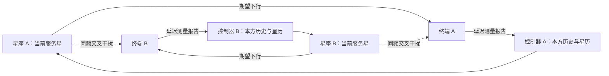
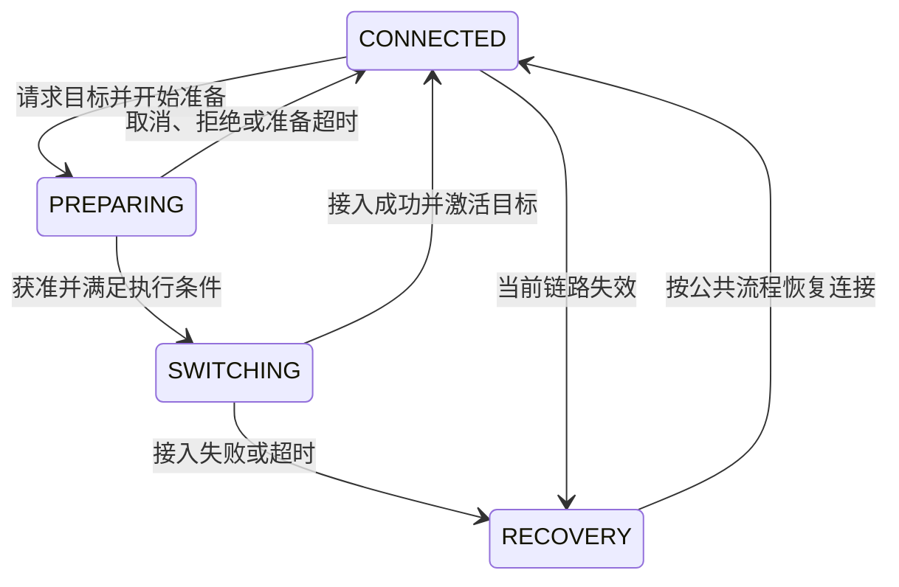
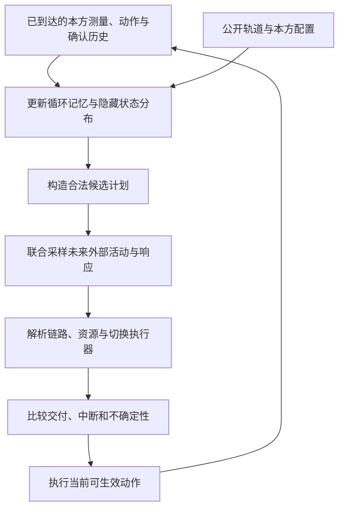

# 多星座对等共存：基于历史观测的世界模型与预测卫星切换

> **选定方向：** 两个乃至多个独立 LEO 星座在同一频谱上提供下行服务，不设置固定主、次系统。各运营方依据本方合法获得的历史观测，在本星座的授权候选卫星之间决定保持、准备和切换。
>
> **核心方法：** 已知轨道与协议执行器 + 基于历史的概率世界模型 + 受约束滚动规划。模型必须利用过去的测量、接收指向、动作与反馈，预测不同候选行动的多步后果。
>
> **三个交互层次：** L1：对方使用不响应本方干扰的固定策略；L2：对方使用固定但会响应干扰的策略；L3：多个系统都学习和更新策略。每一层都可以从两个终端扩展到多个终端，从两个星座扩展到多个星座。
>
> **文档状态：** 研究设计与实现规范，尚无本文方案的训练或实验结果。参数是可调整的工程起点，不是商用系统实测值、标准规定或性能承诺。编写与文献核查日期：2026-10-01。

本文根据已选定的多星座方向细化方案，不覆盖或改写原有文档。与[原 WorldNTN 具体计划](../WorldNTN_ICC_concrete_research_plan.md)相比，本文把主任务收敛为**跨系统同频干扰下的卫星关联与切换时机**；接收波束由几何跟踪器执行，第一版不同时优化连续相位、发射预编码和载频。

阅读基础：[同频共存论文笔记](Feasibility_In_Band_Coexistence_论文讲解与WorldModel评估.md)、[数字孪生与有限观测控制笔记](JSAC_digital_twin_论文讲解与单频LEO卫星选择WorldModel方案.md)。

| 想先解决的问题 | 阅读位置 |
| --- | --- |
| 三个层次是什么，怎样体现对等 | 第 1–3、6 节 |
| 怎样根据过去观测行动 | 第 4–5、11、14 节 |
| 需要哪些数据，如何生成与划分 | 第 7–10、13 节 |
| 用什么模型，具体如何训练和使用 | 第 11–16 节 |
| 多系统多用户怎样扩展与验证 | 第 17–18、21–23 节 |
| 直接开始实现 | 第 20、22–23 节 |

## 1. 研究问题与主要决策

### 1.1 一句话描述

> 在其他星座的服务关联、发射活动和控制策略不公开，而本方链路测量有限且存在延迟的条件下，如何结合公开轨道和历史观测，预测当前干扰的持续性及候选卫星切换后的服务窗口，提高实际交付并减少不必要的中断与反复切换？

这个问题包含三个不同判断：

1. **现在发生了什么？** 当前信号下降可能来自期望信号减弱、同频干扰增强、资源变化或执行中的切换。
2. **继续保持会怎样？** 干扰可能正在结束，也可能继续增强，或者长期维持。
3. **采取不同动作会怎样？** 换星改变接收方向、资源占用、观测机会；在 L2/L3 中，还可能引起其他系统响应。

模型应学习可利用的未知动态，不重新学习已知轨道公式。需要前瞻控制不等于一定需要神经模型，最终必须与同信息条件下的经典预测控制比较。

### 1.2 建议名称

中文工作题目：**部分可观测多星座对等共存中的历史条件世界模型与预测切换**。

英文工作题目：**History-Conditioned World Models for Predictive Handover in Partially Observed Multi-Constellation Coexistence**。

建议方法名称使用描述性的 **Physics-Grounded Recurrent World Model + MPC**。等模型和实验稳定后再决定缩写，避免先堆叠 Graph、Transformer、Dreamer 等名称。

### 1.3 第一版明确采用的选择

| 项目 | 本文主方案 |
| --- | --- |
| 控制单位 | 每个运营方一个逻辑控制器，协调本方多个终端；跨运营方独立决策 |
| 终端 | 固定位置、定向阵列、单活动数据连接；单 RF 是研究假设 |
| 服务资格 | 终端仅在本运营方允许的候选中切换，不默认跨运营商漫游 |
| 频谱 | 固定下行载频与总带宽；带内资源块由公共规则调度 |
| 动作 | 保持、准备目标、等待、取消、执行获准切换；失联时使用公共恢复流程 |
| 波束 | 根据服务方向跟踪，方向图和跟踪损失明确；不学习独立连续波束动作 |
| 本方调度 | 所有比较方法共享因果调度器和准入规则 |
| 跨系统信息 | 公共轨道可用；不默认共享实时关联、资源表、终端位置或未来计划 |
| 环境主因 | 来自其他星座及本系统其他实际传输的同频干扰 |
| 模型 | 集合编码器 + 循环随机状态空间模型 RSSM；多用户阶段加入稀疏图消息传递 |
| 决策方式 | 先采用 world-model MPC；后续才评估模型内策略学习或规划器蒸馏 |
| 初始业务 | 各周期外生业务需求，记录成功交付和缺口；排队模型作为明确扩展 |

Starlink、Amazon 仅作为轨道与业务形态的参考。正文模拟器使用星座 A/B/C，**等优先级是本研究的场景设定**，不据此描述商用网络实际的频谱权利或私有协议。

## 2. 系统、用户与真实干扰关系

### 2.1 从两个终端开始，但从一开始保留集合定义

定义运营方集合 $\mathcal M=\{1,\ldots,M\}$。运营方 $m$ 拥有卫星集合 $\mathcal S_m$ 和终端集合 $\mathcal U_m$，$\mathcal U=\cup_m\mathcal U_m$。终端 $u$ 所属运营方记为 $m(u)$。

最小场景：$M=2$，$|\mathcal U_A|=|\mathcal U_B|=1$。两个终端相近，各有独立阵列，各自由本方一颗卫星服务。



终端靠近有助于构造交叉干扰较明显的机制例，但不能只测试共址情形。应扫描距离、相对方位和实际覆盖，统计强干扰事件在自然场景中的发生比例。

### 2.2 为什么换星能改变干扰？

本方换星会改变终端接收波束的指向。相同外部信号经过不同接收方向图后，接收功率可能明显不同。同时，服务卫星变化会改变期望信号、发射指向及对其他用户的干扰。

两条期望链路的 SNR 数字相近，并不意味着强交叉干扰。需要考虑地面视角的角度分离、双方发射和接收方向图、同频资源是否重叠以及功率和路径损耗。

**当前 SINR 下降也不能唯一说明外星正在靠近。** 因此记录期望信号估计、干扰加噪声估计、波束方向与测量年龄，比只存一列 SINR 更有用。

### 2.3 聚合干扰必须由实际传输产生

设协议/调度子时隙为 $\ell$，资源块为 $q$。$b_{v,s,q}(\ell)\in\{0,1\}$ 表示卫星 $s$ 是否正在资源块 $q$ 上向终端 $v$ 发射数据。对由 $s$ 服务的终端 $u$：

$$
\Gamma_{u,s,q}(\ell)=
\frac{b_{u,s,q}(\ell)P_{s,q}(\ell)g_{s\to u}^{(u)}(\ell)}
{N_0F_uB_q+
\sum_{(s',v)\ne(s,u)}b_{v,s',q}(\ell)P_{s',q}(\ell)g_{s'\to u}^{(v)}(\ell)}.
$$

该式用于已安排的传输；未安排数据时，不能把零分子的数值当成链路测量。潜在候选链路质量需按明确的参考信号或候选发射条件评估。

$g_{s'\to u}^{(v)}$ 包含卫星 $s'$ 朝 $v$ 发射时在 $u$ 方向的增益、传播增益，以及 $u$ 实际接收指向下的增益。所有功率用线性单位求和，最后才转换为 dB。

关键实现要求：

- 干扰和频谱重叠由实际发射事件决定；可见但未发射的星不自动贡献满功率干扰。
- 预留资源本身不等于发射；导频、控制信号是否发射要单独定义并计入。
- 每次关联或调度变化后重算相关链路，不播放一条与动作无关的最终 SINR 序列。
- 三个及以上星座时，累加所有有效同频源，不能只保留最近角度的一颗星。
- 同一个干扰源作用于多个终端时，使用同一源活动状态，通过各自传播与方向图映射。
- 几何近共线只是一种风险线索；主指标使用实际交付和中断，角度指标作为解释性统计。

### 2.4 多用户资源约束

设 $x_{u,s}(\ell)$ 表示实际已接通连接。主版要求：

$$
\sum_{s\in\mathcal S_{m(u)}}x_{u,s}(\ell)\le1,
\qquad b_{u,s,q}(\ell)\le x_{u,s}(\ell).
$$

第一版采用星内正交资源池，星间允许同频复用：

$$
\sum_u \big(b_{u,s,q}(\ell)+r_{u,s,q}(\ell)\big)\le1,
$$

其中 $r$ 是确实占用该资源块时段的获准预留。若目标准备只保存上下文而不预留带宽，则该阶段 $r=0$。不要把“准备上下文”和“占住数据资源”混为一谈。

一颗卫星可服务多个用户。会话/波束槽上限只有在所选载荷模型有对应依据时才加入，不能人为规定每星只服务一个人以制造冲突。

本方控制器管理本方权威资源账本；对外星座只估计其活动。真实模拟器可以知道所有系统资源，但任何部署算法不得直接读取其他系统账本。

## 3. 三个交互层次：物理场景相同，控制关系不同

### 3.1 L1：固定且不响应本方干扰的外部策略

对方按最高仰角、最长剩余服务时间、覆盖计划或本方业务负载等规则行动，不把本方造成的链路恶化用于关联或调度决策。

$$
A_t^{-m}\sim\pi^{-m}_{\mathrm{fixed}}(c_t,\chi_t^{-m},d_t^{-m}).
$$

$-m$ 表示其他所有运营方。固定的是策略及参数，**不是卫星不移动或对方不换星**。本方看不到其私有协议状态和业务，但知道公开几何。

为保证这一层确实无反馈，对方的 MCS、重传、资源重分配等若会受本方干扰影响，也必须关闭该反馈或改为明确的开环发送规则。仅声明“关联规则固定”还不够。

同理，L1 的会话结束时刻不能由受干扰后的累计成功交付决定，否则会话占用本身也形成反馈。第一版可使用外生到达与持续时间，实际交付只用于评价；交付驱动的队列、重传和会话结束放入 L2。

用途：隔离“历史估计 + 多步规划”的收益。从本方看，适合用部分可观测决策过程建模。对方关联/活动的未来可在保持同一外生条件下重放，但本方接收干扰仍随本方接收指向变化。

### 3.2 L2：固定但会响应干扰的外部策略

对方策略参数不更新，但根据自己的历史 SINR、吞吐率和切换状态行动，例如“质量下降持续一段时间才换星”。

$$
A_t^{-m}\sim\pi^{-m}_{\mathrm{fixed}}(\mathcal H_t^{-m}).
$$

本方动作改变对方接收情况，经过测量、触发和执行延迟后，对方可能响应：

$$
A_t^m\longrightarrow O_{t+1:t+k}^{-m}
\longrightarrow A_{t+k}^{-m}
\longrightarrow O_{t+k+1}^{m}.
$$

这不是瞬时互相读取动作。模拟器应按真实时间推进，不能因为先计算 A 再计算 B，就让 B 免费知道 A 当前尚未生效的选择。

用途：检验模型能否预测反应延迟、持续触发和切换后的反馈。对方策略冻结时，本方仍可把对方的内部记忆作为隐藏环境状态；但对方轨迹已经不能作为动作无关的背景回放。

**L2 是本文最适合作为主论文核心的层次。** 它具有真实动作反馈，又便于固定对方策略来解释因果关系。

### 3.3 L3：多个系统都学习和更新策略

每个系统使用自己的历史、模型和目标，策略参数在训练过程中变化：

$$
A_t^m\sim\pi_{\phi_m}(\mathcal H_t^m),\quad m=1,\ldots,M.
$$

整体是部分可观测、一般和的多系统交互问题。一个系统的收益提高不必意味着其他系统收益提高；双方同时改变策略还会造成训练分布变化。

主版采用**分批收集、分轮更新、对手池训练**：每个采集批次冻结所有策略，批次之间更新各系统，再保存检查点。它实现多个系统在整个训练过程中共同学习，同时让每批数据对应可追溯的策略版本。

若要研究“同一 episode 内也实时更新网络权重”，应作为单独的快速非平稳实验，不与主训练协议混用。部署时可以持续更新隐状态，并不要求每个时隙都更新模型权重。

### 3.4 三层的关键区别

| 项目 | L1 | L2 | L3 |
| --- | --- | --- | --- |
| 对方移动、换星 | 是 | 是 | 是 |
| 对方行为响应本方干扰 | 否 | 是 | 是 |
| 对方策略参数在训练中改变 | 否 | 否 | 是 |
| 可将对方关联轨迹视为固定外生输入 | 仅在规定的无反馈条件下可以 | 不可以 | 不可以 |
| 本方模型需要动作条件响应预测 | 完整协议和观测后果需要；对方外生转移可独立 | 需要 | 需要，并处理策略分布变化 |
| 核心难点 | 隐状态估计和持续性 | 互相响应、振荡与延迟 | 非平稳训练、跨策略泛化和长期共存 |

层次与规模独立。两个星座也能做 L3，四个星座也能先做 L1。不要把“第三层”误解为“三颗卫星”或“三个运营商”。

## 4. 模型为什么必须基于过去一段时间的观察？

### 4.1 当前观测通常不构成充分状态

例如当前都是 5 dB SINR，可能分别对应：

- 刚经历短时干扰峰值、正在恢复；
- 干扰刚开始、即将进一步恶化；
- 两条视线接近同向运动，将持续受扰；
- 对方刚换星，旧的趋势已经失效。

一个只接受当前 SINR 的网络很难区分这些情况。历史中的接收指向、信号和干扰估计、几何变化及动作反馈，可能让这些情况部分可辨。

但**同样的合法历史仍可能对应多个不同的真实世界**。模型应输出未来分布，不能承诺唯一恢复对方身份或确定预测所有突发事件。

### 4.2 正确的历史定义

对运营方 $m$，决策时刻 $t$ 的可用历史为：

$$
\mathcal H_t^m=
\{c_{\le t}^{\mathrm{public}},
O_{\le t}^{m,\mathrm{arrived}},
A_{<t}^{m,\mathrm{issued}},
E_{\le t}^{m,\mathrm{confirmed}}\}.
$$

其中 $O^{\mathrm{arrived}}$ 只含截至 $t$ 真正到达的报告；每条报告保留采样时刻。$E^{\mathrm{confirmed}}$ 是已确认的执行结果，未确认命令仍作为 pending 状态。

已知星历推算的未来几何可作为规划上下文，未来真实关联、干扰、业务和测量则不能提前输入。

部署策略形式为：

$$
b_t^m\approx p(s_t^{\mathrm{hidden}}\mid\mathcal H_t^m),
\qquad A_t^m=\operatorname{Plan}(b_t^m,c_{t:t+H}^{\mathrm{public}},\chi_t^{m,\mathrm{known}}).
$$

$b_t^m$ 是 belief，即当前隐藏状态的概率判断；$\chi^{\mathrm{known}}$ 是本方已确认账本与待确认记录，不等于模拟器中的全部真实执行状态。

### 4.3 历史不仅要有观测，还要有动作

假设上一时刻把接收方向从 S1 改为 S2，测得干扰下降。若模型不知道这次动作，可能误判为外部干扰源关闭。下次规划时就可能错误地认为所有方向都变好了。

因此至少输入：测量对象、接收方向、采样时间、到达时间、已发命令、已收到的执行确认、当前连接及准备状态。历史中的奖励可由已到达交付反馈计算；不能提前使用尚未报告的成功比特。

### 4.4 窗口与循环记忆怎样选择？

第一版建议控制周期 $\Delta=1$ s，扫描 10、30、60、120 s 的历史长度。30 s 可作为初始配置，但不得宣称它覆盖所有相关动态。

推荐部署时持续维护循环状态；训练时使用带预热段的连续窗口。若希望严格只依赖最近 $W$ 秒，则每次从这段历史重新编码，代价是丢失更早信息；这与长期维护 GRU 状态是不同设置，实验应区分。

比较无历史、短历史、长历史，并让经典滤波、GRU 预测器和循环 PPO 使用相同信息。若更长历史没有收益或引入陈旧模式，应根据验证集收缩。

## 5. 观测权限、测量成本和控制时序

### 5.1 三个数据视图

| 视图 | 包含什么 | 能否输入在线控制器 |
| --- | --- | --- |
| 公共视图 | 发布版本的星历、公开轨道与终端已知配置 | 可以，计入星历年龄和误差 |
| 本方视图 | 本方位置、已到达测量、业务报告、准入确认、命令日志 | 可以，按实际到达时刻使用 |
| 全局真值视图 | 所有系统关联、发射活动、隐模式、尚未到达报告、未来随机实现 | 不可以；用于模拟器推进和隔离的评估 |

第一版不默认知道外系统终端精确位置。最小机制例可另设“已知共址终端位置”诊断组，但必须标注额外信息，不能据此宣称适用于未知外部用户分布。

### 5.2 建议的测量接口

当前服务方向：导频得到的期望信号估计、干扰加噪声估计、SINR/CQI、ACK/BLER、实际接收方向与时间戳。

候选方向：按固定预算和公共规则安排测量间隙，记录可检测的同步/参考信号与对应质量。一次方向测量能否识别多颗星，由实际参考信号和接收方向图决定，不能免费读取该方向上全部真实链路。

本方多个用户的报告可以经本方网络汇总；其他运营方用户的报告不能默认共享。跨用户融合的收益必须计入上报延迟与开销。

同一个候选的旧测量要保留年龄和缺失掩码。前向填充仅是存储表示，不能每个时隙重复当成新观测计算训练损失。

### 5.3 时间戳与事件队列

每条测量或命令至少区分：

1. `sample_time`：物理采样时间。
2. `arrival_time`：报告到控制器的时间。
3. `decision_time`：决策开始时间。
4. `issued_time`：计算结束并下发的时间。
5. `effective_time`：动作在网络或终端生效时间。
6. `complete_time`：切换完成或失败时间。
7. `confirmation_arrival_time`：结果对控制器可见时间。

计算期间环境继续前进。必须将决策耗时算入命令生效过程；超时后执行事先声明的公共保底规则，不能让模拟器暂停等待搜索。

### 5.4 切换状态机



PREPARING 阶段通常仍可使用旧连接；SWITCHING 阶段才计相应重定向、同步和接入中断。根据选定协议区分换星重同步与完整小区切换，不给所有卫星编号变化统一加同一个重建延迟。

计划只能提交请求和执行获准动作。准入失败、控制器尚未收到确认、覆盖已经结束等情形都必须真实存在。初始可以从已连接状态开始，但失联后的恢复流程必须实现。

### 5.5 候选集合不能依赖隐藏真值

先按本方已知的轨道、终端视场、服务资格和覆盖配置形成可请求集合；再按实际确认形成可执行集合。未知干扰强度、未报告负载或未观察到的故障不能被悄悄用于删掉坏候选。

较大规模下需要截断候选时，规则应同时保留当前星、已准备目标、长服务窗口候选和几何方向不同的候选。报告截断召回率，并给所有方法同样的候选预算。

## 6. 优化什么：实际服务、稳定性与对等共存

### 6.1 本方可实现的效用

令 $D_{u,t}$ 为周期中成功交付、未重复计数的比特数，已扣除测量和切换造成的不能收数时段。令 $d_{u,t}$ 为该周期业务需求量，单位同为 bit；有业务时定义需求满足率：

$$
v_{u,t}=\frac{D_{u,t}}{\max(d_{u,t},d_{\min})}.
$$

零需求用户应从该周期需求满足统计中剔除；$d_{\min}$ 只用于数值稳定，不制造虚假业务。一个可用的本方奖励是：

$$
r_t^m=
\sum_{u\in\mathcal U_m}\omega_u\log(\epsilon+v_{u,t})
-\lambda_{\mathrm{sig}}C_{t}^{m,\mathrm{signaling}}
-\lambda_{\mathrm{fail}}N_t^{m,\mathrm{failure}}.
$$

各项尺度、归一化和权重在验证集固定。对已在交付量中扣除的切换中断，不再次作为同一损失重复扣除。额外惩罚可以表达信令、失败或设备稳定性偏好，但应说明含义。

服务量可先使用注明假设的速率映射；后续加入公共、因果 MCS/BLER 规则。不能让调度器看真实当前 SINR 后瞬时挑选完美编码，而控制器却只获得延迟测量。

### 6.2 对等地位不等于共享全局奖励

主版各系统优化本方效用，使用相同形式和同等级约束。它不保证达到全局最优或纳什均衡。

模拟器同时评估：每个系统的交付、需求满足、低分位用户服务、最长连续中断、切换次数，以及系统间的失衡程度。不同系统用户数不同时，还应报告按用户和需求归一化后的指标，避免大系统自然总量更高造成误判。

如果引入 $\sum_m J_m$、最弱系统服务约束或跨系统公平奖励，并在训练中使用其他系统真实服务，则这是**额外协调目标或集中训练信息**，必须另设实验，不能混称为纯独立运营。

主版不直接沿用原主次论文的单向保护门限。若以后需要双向或多向保护约束，应明确反馈或信息来源；本方测到的接收干扰不等于自己给别人造成的干扰。

### 6.3 服务窗口是预测对象，不是唯一优化目标

定义候选计划执行后，从成功接入起到首次发生持续服务不足或已知可服务条件失效的时间为 $T_{u,s}^{\mathrm{usable}}$。持续服务不足应设最短持续时间或滚动交付门限，避免把一个瞬时噪声点当成必然切换。

模型预测：

$$
\Pr(T_{u,s}^{\mathrm{usable}}>\tau\mid\mathcal H_t^m,\mathcal P),
$$

$\mathcal P$ 是完整候选计划，包含准备、执行以及切后保持/恢复规则。在多用户和 L2/L3 中，它还依赖本方其他用户的计划及对外部响应的分布预测。

接入失败时约定该次目标服务窗口为 0，并单独报告接入成功概率。也可报告“条件于接入成功”的窗口分布，但不能只展示成功样本而忽略失败。

可见时间长并不等于可用服务时间长；一次高质量短连接也不一定不值得。最终比较累计服务和中断，服务窗口用于解释和辅助规划。

## 7. 训练数据从哪里来：先建可交互模拟器

### 7.1 数据主体应当是连续交互轨迹

本任务不适合先做一张“每时刻每颗星的 SINR 表”，再给每行贴一个最佳卫星标签。这样很难保存测量缺失、切换延迟、资源竞争和其他系统响应。

主训练数据应来自：

```text
公开或合成轨道 + 地面位置 + 设备与频谱配置
                         ↓
各系统业务、调度器、关联策略、协议执行器
                         ↓
实际发射与接收方向 → 物理链路与聚合干扰
                         ↓
有限测量、报告延迟、执行反馈
                         ↓
各系统依据自己的历史行动 → 再推进环境
```

初期以仿真为主是合理的。公开星历只提供几何基础，不提供完整跨运营商调度、干扰测量和切换结果；不能宣称仅下载公开星历就得到了世界模型训练集。

### 7.2 必须准备的原始资料

| 类别 | 需要的数据或配置 | 起步来源 | 校验重点 |
| --- | --- | --- | --- |
| 星座轨道 | 卫星标识、所属系统、轨道壳层、历元、轨道参数或历史星历 | 论文中可复现的 Walker 参数；后续固定版本的公开星历 | 坐标系、时间尺度、传播器、版本与有效期 |
| 地面终端 | 本方/外方归属、经纬度、高度、业务类别、设备类别 | 合成位置；覆盖城市、郊区和不同纬度 | 仿真知道全部位置；控制器仅获得授权位置 |
| 射频链路 | 载频、带宽、资源块、功率规则、噪声系数、损耗、阵列方向图 | 论文参数或明确的研究配置 | 阵列增益不可重复计算；功率与带宽一致 |
| 服务覆盖 | 每星可服务波束、小区/服务组、视场、授权窗口 | 可解释的固定覆盖规则 | 可见不等于可接入；若用户必须成组换星需保持组约束 |
| 本方与外方业务 | 会话到达、持续时间、需求量、空间相关性 | 独立业务生成器 | 流量驱动实际占用，不能直接人为生成“有利干扰” |
| 调度规则 | 资源分配、功率、MCS、导频和静默规则 | 固定公共调度器 | 所有可部署规则因果；L1 禁止隐藏反馈路径 |
| 关联规则 | 最高仰角、最长服务时间、滞回、持续触发、负载感知等 | 自行实现并固定版本 | 明确输入权限、参数、内部记忆和更新时机 |
| 执行时延 | 测量、上报、计算、下发、准备、重同步/接入、确认 | 参数化事件模型，后续测量校准 | 准备与数据中断分开，不统一机械添加一个 RTT |
| 随机残差 | 功率误差、校准误差、测量噪声、协议失败等 | 可解释的独立随机模型 | 初期少量机制；按机制逐步加入并消融 |

使用历史星历时，应保存当时可获得的发布版本或注入对应误差。事后拟合的精确轨道可以作为模拟真值，但不能悄悄作为当时控制器已经知道的信息。

建议先不加入云雨、地面干扰源和恶意源，把多星座交叉干扰做好。额外因素可以以后用来测试失配，不能替代主问题中的非协同调度建模。

### 7.3 两种环境复杂度

**诊断环境：** 少量用户、明确阵列与功率、固定或 HMM/HSMM 驱动的活动、简单对方策略。它容易验证实现和定位错误。若真生成机制就是已知 HMM，应提供匹配的 HMM/HSMM 强基线。

**主实验环境：** 外部用户会话、服务需求、资源调度和关联共同决定发射，产生随时间相关、跨用户相关的干扰。未知性来自控制器看不见其内部状态，不通过给每条候选独立添加随机 INR 来制造。

两种环境都应包含低干扰、可通过换星改善和换星无法改善的情形。不可预测随机扰动可作为负对照，但不能期待历史模型预测其独立随机实现。

### 7.4 场景生成参数应该怎样扫描？

以下仅为机制诊断的起点，主实验应根据链路预算和自然分布校准：

| 维度 | 建议覆盖 | 生成方式与边界 |
| --- | --- | --- |
| 相邻跨系统终端距离 | 共址、0.1、1、5、20 km 等 | 分别生成方位；不预设距离一定对应强干扰 |
| 地理位置 | 多个纬度与局部/分散用户组 | 先检验各星座真实可见性与授权覆盖 |
| 相对轨道运动 | 不同倾角、同/近倾角、不同轨道相位 | 由轨道传播自然产生短暂相遇和长期接近 |
| 外生业务 | 持续满缓冲诊断 + 会话式速率需求 | 会话可用 Poisson 到达、log-normal 持续时间等起步；生成器与模型结构独立 |
| 活动持续时间 | 均值约 5、30、120 s 的不同组 | 检验比控制窗口更快、相当、更慢的变化；参数不代表商业业务统计 |
| 提供负载 | 低、中、接近容量、超过容量 | 按固定名义服务能力归一化设定并报告实际负载，不直接指定最终干扰强度 |
| 测量和执行 | 低/中/高延迟、不同丢失率 | 各阶段分开取值；检查总延迟与可预测时间的关系 |
| 对方触发规则 | 多种滞回、持续触发、最短驻留 | 测试规则和参数留出，避免仅记忆一套阈值 |

细粒度射频/协议事件不必与 1 s 控制周期相同。可从 50 ms 的链路更新加精确事件时间开始，在快速角度变化或切换附近加密，并比较 10/50/100 ms 的离散化误差；这些数字只是数值实验起点。

采样几何时保持轨道连续性；多个 episode 可以截取同一长轨迹，但必须在数据划分中绑定。先做因素独立扫描和小型组合，再用随机化组合扩展，避免一次加入所有不确定因素后无法解释结果。

## 8. 每条轨迹到底保存哪些数据？

### 8.1 记录格式原则

采用“场景元数据 + 稀疏事件表 + 周期快照 + 隔离真值”的格式。基础存储可以用 JSON/YAML 保存配置、Parquet 保存表、Zarr/NPZ 保存必要数组；这只是建议，不强制依赖特定库。

主键始终保留 `world_id / episode_id / operator_id / ue_id / sat_id / timestamp` 中所需部分。卫星 ID 用于关联记录，模型主要使用几何与属性，避免记住特定编号。

### 8.2 必备数据表

| 表/文件 | 核心字段 | 在线输入权限 | 用途 |
| --- | --- | --- | --- |
| `scenario_manifest` | 场景 ID、外生种子、日期、位置组、星座版本、全部配置 hash、模拟器版本、层次 | 仅允许的公共配置进入输入 | 复现、分组划分、追踪生成条件 |
| `ephemeris_public` | 卫星/运营方 ID、发布时刻、历元、轨道参数、有效期、误差配置 | 发布后可用 | 重建候选几何与未来几何 |
| `ue_static_private` | 用户归属、位置、终端能力、天线配置 | 仅本运营方 | 计算本方服务与干扰投影 |
| `geometry_cache` | UE—卫星方向、距离、仰角、角速度、几何可见窗口 | 由合法星历与本方位置计算的部分可用 | 计算缓存；无需重复存入每个训练窗口 |
| `measurements` | 测量 ID、接收方向、目标导频、资源块、样本/到达时间、期望功率、干扰加噪声、SINR、噪声方差、缺失/失败标记 | 报告到达后本方可用 | 观测编码、观测似然、估计不确定性 |
| `commands` | 命令 ID、发出时间、动作、目标、前置条件、命令版本、期望执行时间 | 本方发出后可用 | 动作条件建模与 pending 队列 |
| `execution_events` | 接收命令、生效、拒绝、准备、接入、失败、确认到达 | 仅已经到达的本方反馈可用 | 区分请求与实际效果，训练协议结果预测 |
| `resource_reports` | 本方卫星资源账本版本、已分配/预留、有效时间、报告年龄 | 按本方接口使用 | 联合动作约束和负载历史 |
| `traffic_reports` | 本方需求、业务类别、采样/到达时间、有效期 | 到达后可用 | 需求预测与奖励计算 |
| `delivery_feedback` | 服务区间、发送/成功比特、ACK/BLER、报告时间、重复传输标记 | 到达后可用 | 交付模型、实际奖励与服务统计 |
| `policy_metadata` | 每个采集方算法、参数、检查点、训练轮次、探索概率、采样权重 | 外方信息不能输入在线模型 | 数据分层、对手池回溯、覆盖分析 |
| `truth_private` | 全系统关联、实际发射、真实信道、真实干扰分量、隐藏策略状态、未来随机事件 | 不可用 | 环境推进、诊断、oracle、明确标注的辅助监督 |
| `branches_manifest` | 分支组、父状态、分叉时刻、干预动作、外生流 ID、结果文件 | 分支真值不在线提供 | 反事实评估、候选排序诊断 |

`truth_private` 应存放在独立目录并由单独加载器访问。不能仅在同一大张量中口头声明“训练时不会用某些列”。可部署数据加载器采用字段白名单。

### 8.3 单条测量记录示例

以下数字仅说明格式，不代表真实网络参数：

```json
{
  "world_id": "world_000042",
  "episode_id": "episode_000042_policy03",
  "operator_id": "A",
  "ue_id": "A_u03",
  "measurement_id": "meas_01892",
  "sample_time_s": 102.20,
  "arrival_time_s": 102.85,
  "beam_target_sat_id": "A_s0147",
  "reference_signal_id": "rs_0147",
  "azimuth_rad": 1.30,
  "elevation_rad": 0.92,
  "resource_block_id": 4,
  "signal_estimate_dbm": -92.0,
  "interference_plus_noise_estimate_dbm": -98.0,
  "sinr_estimate_db": 6.0,
  "measurement_variance_db2": 0.8,
  "valid": true,
  "measurement_gap_s": 0.02
}
```

在 102.50 s 决策时，这条报告还不可见；在 103.00 s 时可见，但其年龄为 0.80 s。上述功率为同一测量带宽下的示意量，字段单位和测量带宽须在 schema 中固定。

### 8.4 哪些标签不能直接当作现实训练条件？

- 对方真实服务星、真实功率、精确模式标签：主训练不要求能直接获得，可用于隔离的辅助监督。
- 所有未测候选的当前真实 SINR：不能作为默认输入；作为仿真特权监督时必须单列实验和成本。
- “事后最优卫星”：不是天然策略标签。一条未来随机实现下的最优动作，未必是给定当前历史的最优期望动作。
- 服务窗口结束时间：只有在对应动作和后续规则下观察到足够轨迹才能形成完整标签。
- 对方策略检查点：用于记录和采样对手，不能让在线模型直接读取隐藏的真实策略类别。

## 9. 怎样采集足够有用的训练轨迹？

### 9.1 先覆盖真实动作支持

如果所有数据都由“永远连接最大 SNR 卫星”生成，模型几乎没有证据判断其他候选的结果。数据需要混合合理行为策略，并记录实际采集比例。

建议的初始混合如下，比例仅作为采集预算起点：

| 采集策略 | 参考比例 | 补充的数据 |
| --- | --- | --- |
| 当前已测质量 + 滞回/持续触发 | 25% | 常规保持、被动切换、阈值附近行为 |
| 最长剩余服务时间 | 15% | 稳定长连接与覆盖边界 |
| 几何干扰规避/解析前瞻 | 20% | 提前换星、方向差异明显的候选 |
| 本方负载感知关联 | 15% | 多用户资源竞争和目标拒绝 |
| 受约束随机探索 | 15% | 合法但常规策略不常访问的动作 |
| 当前版本世界模型策略 | 10% | 实际使用模型时遇到的分布和错误 |

首轮没有世界模型时，将其比例分配给前几类。探索必须遵守协议和候选资格，可在计划层随机选择目标或延迟，而不是每个子时隙无条件乱切。

为了比较模型与策略学习的样本效率，应统计所有采集轨迹、仿真分支和额外标签，不能把世界模型的预训练数据当作免费资源。

### 9.2 对方策略也要形成训练分布

L1 至少包含最高仰角、最长服务窗口、固定覆盖计划，以及不同活动负载。

L2 至少包含不同滞回、触发时间、最短驻留、报告延迟、目标偏好和本方负载规则。它们根据自己的观测行动，不能从全局真值触发响应。

同一回合的对方策略参数一般保持固定。训练中可跨 episode 切换策略；回合内策略突变放进明确的适应实验。不能为了复杂而每秒随机换一套完全无规律的政策。

### 9.3 每个 episode 的生成流程

```text
1. 选择一个基础世界：日期/轨道相位、终端位置、设备、业务生成条件。
2. 为每个系统选择行为策略和随机流，初始化连接、协议状态与事件队列。
3. 推进物理和协议时钟；产生实际发射、链路、测量与数据交付。
4. 将已到达报告分别交给各自控制器，严格构建各自可见视图。
5. 在各自决策时刻生成请求；加入计算与传输延迟后进入执行队列。
6. 执行准入、切换和调度，更新真实资源、接收方向及交叉干扰。
7. 同时写出可见日志和隔离真值，直到完整回合结束。
8. 保存配置 hash、检查点、种子流、退出原因及质量检查结果。
```

系统决策可同步，也可存在偏移。同步实验中，各方都使用同一时刻之前已经到达的信息，统一下发后再推进环境；异步实验使用同一全局事件队列处理。两种模式都需要评估。

### 9.4 分支数据：如何比较保持和切换？

从同一模拟器状态复制分支，分别执行保持、准备 S2、准备 S3 等计划。分支共享轨道、外生会话到达和可共享的随机扰动，但重新计算所有受动作影响的状态。

在 L2/L3 中必须重新运行其他系统的观测、记忆和响应。不能沿用旧分支中的对方选星、资源分配和吞吐率。随机流应按“场景、实体、时间、过程类型”索引，避免动作改变随机数调用次数后导致外生世界也跟着变化。

有两类分支评价，必须区分：

- **同一真实隐藏状态下的分支：** 检查模型的物理一致性和具体状态下的动作效果。它提供仿真特权信息。
- **给定同一可见历史的分支分布：** 还要对隐藏状态的不确定性积分，才能评价可部署策略的条件期望选择。

第一类不能直接被当成第二类。当前历史看不见的模式，不能通过事后最优动作标签强迫模型“猜中”。

### 9.5 重点事件覆盖与自然分布

训练集需要覆盖接近共线、相对方向长期接近、对方切换、目标接入拒绝、覆盖结束、多个源同时活跃和反复切换。

可以对稀有事件增采，但应保存抽样条件和权重。主测试集保留自然发生比例，另建稀有事件压力测试；不能只在筛出的高收益事件上报告平均提升。

## 10. 数据划分、规模与质量控制

### 10.1 先分基础世界，再切时间窗口

划分单位为基础世界组：相同日期/轨道区间、地面位置组、外生业务随机实现及其所有行为策略回放、分支和不同运营方视图必须属于同一数据集合。

按日期块、地区、轨道相位或过境段做组隔离。相邻且高度相关的段应加时间隔离带，不能仅因 episode ID 不同就当作独立场景。

四类数据角色：

- **训练集：** 训练模型和策略、拟合归一化器、训练经典模型参数。
- **验证集：** 选网络规模、历史长度、规划窗口、搜索宽度和奖励权重。
- **校准集：** 在模型及主要配置固定后校准概率、风险阈值和回退规则。
- **测试集：** 最终冻结评估，不参与调参、增采条件选择和模型选择。

归一化统计只从训练集得到。填充值、均值和分位数不能跨全数据集计算。

### 10.2 ID 与 OOD 测试集

| 测试类别 | 留出的变化 | 要检验什么 |
| --- | --- | --- |
| ID | 相同配置分布下的独立世界 | 基本控制和预测性能 |
| 几何 OOD | 新地区、日期块、轨道相位/壳层组合 | 是否只记住几何轨迹 |
| 对方策略 OOD | 未见关联规则或未见参数区间 | 是否学会可适应的响应预测 |
| 规模 OOD | 更多用户、更多星座、不同候选数 | 集合/图模型扩展能力 |
| 业务 OOD | 未见会话持续性、负载和空间相关性 | 对活动动态的泛化 |
| 执行 OOD | 新测量噪声、时延、丢失率、切换失败分布 | 信息与协议失配下的稳健性 |

一次只改变一类因素有利于诊断，再增加组合 OOD。必须分开报告零样本迁移、仅更新隐状态的适应、使用新数据微调，以及全部重训。

### 10.3 建议数据预算

以下数字是扩容路线，不是最低理论样本量，也不预设本地算力足够：

| 阶段 | 建议规模 | 目的 |
| --- | --- | --- |
| 调试 | 20–50 个完整 episode，每个约 300–600 s | 检查链路、权限、事件和奖励 |
| 机制诊断 | 约 200 个基础世界，若干策略回放 | 判断可选空间、历史信息价值、预测上限 |
| 初始训练 | 约 1,000 条连续 episode | 训练 GRU/RSSM 并发现数据缺口 |
| 主训练起点 | 约 4,000 条 600 s episode | 混合策略和场景，约 240 万网络时间步（1 s 周期） |
| 验证/校准 | 各约 500 条独立 episode | 调参与校准分开 |
| ID 测试 | 约 1,000 条独立 episode | 置信区间与自然分布表现 |
| 每类 OOD | 先约 200–500 条，再按区间精度扩充 | 检验泛化边界 |

不同策略回放和分支会增加记录条数，但不会同比增加独立基础世界数。网络时间步、运营方决策数、用户测量条数和训练窗口数应分别报告。

必须画 10%/25%/50%/100% 数据学习曲线，再判断是否值得扩大到更多轨迹。

### 10.4 存储与计算预算

不要预先为每个窗口重复保存整段未来几何。保存轨道和原始事件，按需构造特征并缓存公共几何。

例如 16 个用户、每人 16 个候选、64 个 float32 特征、600 个时间点，仅密集特征就约 39 MB/episode；4,000 条约 157 GB，尚未包含真值和分支。因此优先使用稀疏测量表、共享缓存、按窗口加载和适当压缩。

卫星数量较大时，避免存储“所有卫星 × 所有用户 × 所有资源块 × 所有时刻”的完整信道张量。只缓存几何可达边，实际发射按稀疏事件计算；裁剪规则不得遗漏累计影响显著的弱干扰源。

### 10.5 必须通过的数据检查

1. 每条在线观测满足 `arrival_time <= decision_time`；确认同理。
2. 所有动作属于本方权限，并在协议状态上可请求或可执行。
3. 资源、功率、单活动连接等约束逐事件成立。
4. 候选质量随接收方向变化符合统一物理模型。
5. 相同公共外生流在分支中一致，内生响应能够不同。
6. 测量丢失不是零功率；旧测量不重复当作新标签。
7. 同一基础世界、分支、各运营方视图不跨数据集。
8. 每个特征标注单位、来源、采样时刻和可用时刻。
9. 同一事件不重复计算成功比特、资源预留或切换损失。
10. 数据集公布场景分布及无干扰、无可选目标、不可恢复事件的比例。

## 11. 推荐模型：集合/图编码的循环随机世界模型

### 11.1 为什么选择 RSSM？

RSSM（Recurrent State-Space Model，循环状态空间模型）把确定性记忆与随机隐藏状态结合，适合表达“历史中有信息，但仍不能唯一确定真实环境”的情况。

本文借鉴潜在动力学与多步规划的思路，采用小型状态模型处理通信特征；不需要生成图像或视频。方法背景可参考 [PlaNet](https://arxiv.org/abs/1811.04551)；模型内想象训练策略可参考 [DreamerV3](https://arxiv.org/abs/2301.04104)。这些论文不证明本方案在卫星任务中必然获胜。

建议按三档实现：

| 模型 | 结构 | 作用 |
| --- | --- | --- |
| M0 | 共享候选 MLP + GRU + 概率预测头 | 低成本强基线，先确认历史可利用 |
| M1 | 集合编码器 + RSSM + 解析链路/协议 + MPC | 主方法起点，适合双系统、小规模多用户 |
| M2 | 稀疏异构图编码器 + 因子化 RSSM + 同一执行器 | 多用户、多星座的扩展 |

Transformer 可以作为替代历史编码器消融，但第一版没有必要同时引入大模型、图网络和复杂自博弈。

### 11.2 模型输入分为四组

**候选链路特征：** 本方用户到本方候选星的相对方向、距离、角速度、剩余可服务窗口、配置资格、最近合法测量、测量年龄、测量方向、是否当前服务/准备目标、缺失掩码。

**外星几何特征：** 外方可见星的方向、角速度、所属系统/硬件类别等公开属性。其是否发射、服务谁、功率多少是隐藏量，不直接填真值。

**本方控制状态：** 已确认连接、命令队列、准备状态、计时器、资源报告及年龄、已到达业务和交付反馈。

**历史事件特征：** 新到达报告、已发动作、确认/拒绝/失败、距离上一个事件的时间。没有新测量的时刻仍推进记忆，但不伪造观测。

模型不应只根据绝对卫星 ID 记忆行为。保留 ID 作跨时间跟踪键，使用相对几何、系统属性和共享网络计算表示；另做卫星编号置换测试。

### 11.3 动态候选集合与多用户图

起步用共享 MLP 编码每条链路，再用带掩码的注意力或集合聚合。集合大小变化不要求固定卫星编号对应固定输出神经元。

进入 M2 后，建议节点为本方 UE、本方候选卫星、外方可见卫星/系统因子。边包括：

- 本方可服务边：几何、配置和连接关系；
- 本方资源竞争边：多个 UE 共享本方卫星资源；
- 干扰投影边：外星公开方向对本方接收候选的影响；
- 观测关联边：多个本方 UE 可以共同约束同一外部源。

图中不能加入外方真实 UE—服务星边，除非该实验明确提供了该信息。外方用户节点若不可观测，主版以潜在活动因子表示，不填入真值坐标。

复杂度应与有效边数近似相关。不能对全国所有终端任意全连接，也不能在模型中人为给远隔地区创建并不存在的共同干扰。

### 11.4 确定性记忆与随机状态

一种实现形式是：

$$
e_t=\operatorname{Encoder}(O_t^{\mathrm{arrived}},c_t,\chi_t^{\mathrm{known}}),
$$

$$
h_t=f_\theta(h_{t-1},z_{t-1},A_{t-1}^{\mathrm{issued}},c_t,\chi_{t^-}^{\mathrm{known}}),
$$

$$
p_\theta(z_t\mid h_t),\qquad
q_\theta(z_t\mid h_t,e_t).
$$

$h_t$ 保存确定性记忆，$z_t$ 表达隐藏状态不确定性。收到新信息时用后验 $q$ 更新；预测未来时用先验 $p$ 展开，不读取真实未来观测。

$\chi_{t^-}^{\mathrm{known}}$ 表示尚未同化本批新报告前、按旧记录递推的账本。用于评分的先验不能通过“已更新账本”提前读到同一批执行结果；同化后的已知状态再进入后续决策。

动作输入包含“发出的请求”，实际执行状态通过确认和已知协议递推估计。尚未确认的执行结果必须留在隐状态/随机执行分支中，不能直接从模拟真值补全。

当一个控制周期有多次报告或动作时，使用有序事件编码器或固定子步序列；不能只保留最后一次测量并丢掉其间动作。

### 11.5 延迟观测如何更新记忆？

第一版可采用带时间戳与测量年龄的事件编码器，直接学习延迟报告与当前状态的关系。它是近似方法，必须按延迟长度评价性能。

如果采用显式滤波与物理测量似然，使用固定滞后缓冲：在报告的采样时刻同化，再依据已知命令和随后可见事件传播至当前时刻。训练和推理使用一致规则。

不能把在 $t$ 到达、于 $t-2$ 采集的测量当成当前物理值；也不能用当前后验重构误差冒充“提前两秒预测误差”。后验重构与先验预测应分别统计。

### 11.6 结构化预测外部发射，保持跨候选一致性

对本方 UE $u$，外部同频有效入射功率写作 $q_{u,j,q,t}\ge0$，$j$ 为外方卫星。它包含该卫星实际发射波束对该位置的综合作用，但不包含本方当前接收波束增益。

$$
I_{u,q,t}^{\mathrm{external}}(w)
=\sum_{j\in\mathcal S_{-m}}q_{u,j,q,t}
G_{\mathrm{rx},u}(w,\Omega_{u,j,t}).
$$

模型预测这些有效活动/功率的联合分布，解析方向图把它们投影到不同候选接收方向。这样，同一隐藏世界中的候选 S1/S2/S3 共享外部原因。

输出需保证功率非负；若发射功率、方向图或覆盖边界属于合法已知配置，可加入对应物理范围约束。未知配置不能用真实值偷偷收紧预测范围。

同一卫星可能同时向多个区域发射，不能强迫所有地面位置具有相同入射功率。建议使用“共享的系统/卫星活动因子 + 位置相关功率解码器”；必要时按实际波束组增加潜因子。共享因子用于相关性，位置映射用于差异。

第一版可为活动使用 Bernoulli/类别变量，为正功率使用 log-normal 或少量混合分量；只观测到聚合功率时，潜源分解可能不可辨识。因此重点检验干扰投影和动作排序，不把源身份识别准确率设为必需成功条件。

L2/L3 的状态转移还必须依赖本方行动及其对外部系统的可能影响。它可以通过潜在响应模型学习有效活动的变化，不要求在线精确恢复对方所有 UE 和策略。

### 11.7 已知模块与学习模块的边界

| 显式计算 | 由模型学习/估计 |
| --- | --- |
| 轨道、可见性、公开方向和路径损耗主体 | 未知关联、发射活动、功率残差 |
| 给定接收指向下的方向图 | 不公开的波束活动对本方位置的有效作用 |
| 本方已知准入与资源守恒 | 未知背景需求、未确认执行结果 |
| 协议合法动作、计时器、命令排队 | 执行成功/随机延迟的条件分布 |
| 本方实际调度造成的干扰与交付映射 | L2/L3 中其他系统响应及其不确定性 |

不必让神经网络重复拟合已知奖励公式。预测隐变量之后，由一致的链路与执行器计算服务结果；可加入交付预测辅助头，但不能出现两套互相矛盾的资源规则。

## 12. 模型输出、服务窗口与不确定性

### 12.1 最低输出要求

对每个候选计划，至少输出以下轨迹的样本或分布：

1. 本方各 UE 的未来期望信号、干扰投影和链路质量。
2. 准备、接入成功/失败、资源拒绝及完成时间。
3. 各周期成功交付、业务缺口、连续中断时长。
4. 目标仍满足可服务条件的概率与服务窗口分布。
5. 未来可到达的测量/确认，用于需要反馈的计划模板。
6. L2/L3 中外部有效活动和响应模式的不确定性。

应输出同一个世界样本中的联合轨迹，保留跨时刻和跨用户相关性。独立抽取每个候选、每个时刻的边际值，会错误估计持续中断及多个备用目标同时变差的风险。

### 12.2 服务窗口标签怎样获得？

必须先约定“切到目标后按什么规则继续运行”。例如：保持该目标，直到发生持续服务不足、授权结束或几何不可用，再转公共恢复流程。本方其他用户执行规定的参考策略，外系统正常响应。

以首次服务条件失效为事件，保存事件类型、事件时间、观察截止时间和是否右删失。若 episode 结束前未失效，只知道窗口至少这么长，不能将 episode 长度当作真实失效时间。

若日志中的行为策略提前主动切走，也不能把切走时刻当作目标失效。此类停止通常与链路状态相关，属于可能有信息的删失：主版使用继续保持的仿真分支补充标签，或只把服务窗口作为 rollout 导出统计。需要生存分析头时，必须声明并处理删失假设。

### 12.3 首版优先由轨迹推导服务窗口

先学习多步联合链路和交付分布，再在每个模拟轨迹上计算服务窗口和持续中断。这样无需额外训练一个可能与链路预测矛盾的窗口网络。

数据充足后，可加入离散 hazard 辅助头：

$$
\lambda_k=\Pr(T\in[k\Delta,(k+1)\Delta)\mid T\ge k\Delta,\mathcal H_t,\mathcal P),
$$

$$
\Pr(T\ge n\Delta)=\prod_{k=0}^{n-1}(1-\lambda_k).
$$

已知的可见性/授权失效作为确定性边界显式截断。窗口头只在明确计划和有效标签条件下训练，不能拿任意行为策略的驻留时间当作所有动作的服务窗口。

### 12.4 不确定性处理

随机潜状态表达环境随机性和当前不可辨识性；多个独立训练模型的差异可作为模型不确定性的近似信号。建议先 3 个模型，算力允许再比较 5 个。

一个未来世界应连续递推其共享潜状态；模型身份可在整条 rollout 中固定，以保留模型误差的时间相关性。不要每步重新独立抽取全部源状态和模型，再把拼接结果当成连贯环境。

模型集成和轨迹采样可参考 [PETS](https://arxiv.org/abs/1805.12114) 的方法思路。本文应独立验证区间覆盖、失败概率和规划风险的校准，不把模型方差小等同于真实可靠。

不能仅因为某个模型集成意见一致就宣布识别了真实外部策略。多个模型可能共同失配，因此还应设置分布外场景、低置信回退和公共恢复规则。

## 13. 如何训练世界模型？

### 13.1 训练样本是连续序列

一个样本包含：历史预热段、带损失的训练段、用于多步监督的后续段。例如 1 s 周期下：

```text
30 步 burn-in       60 步学习区间           20 步额外未来标签
|----------------|-----------------------|------------------|
恢复循环记忆        逐步后验更新与先验训练    支持学习区间末端的多步预测
```

这 110 步必须来自同一条连续轨迹。每个预测起点只用当时已经到达的信息形成 belief；未来段只能作为损失标签，不能参与起点编码。

`burn-in` 阶段更新隐状态，通常不计损失并可停止梯度；学习区间进行截断反向传播。若训练截断历史只有 30 s，却声称依赖数分钟记忆，需要增加更长序列或检查点重建机制，并做对应消融。

部署跨周期维护隐状态；episode 开始、会话重置或历史完全丢失时按公开规则初始化。不同独立场景不能沿用同一个隐状态。动态用户/卫星出现和消失时，应定义节点记忆保留、过期和重新初始化规则。

### 13.2 推荐训练张量

以下是逻辑形状，可用稀疏图表示替代密集 padding：

| 张量 | 逻辑形状 | 内容 |
| --- | --- | --- |
| `own_link_features` | `[batch, time, own_ue, candidate, feature]` | 本方候选几何、合法测量及年龄 |
| `candidate_mask` | `[batch, time, own_ue, candidate]` | 当前可请求集合的 padding/资格掩码 |
| `external_nodes_edges` | 图节点与边表 | 公开外星属性、到本方 UE 的几何边 |
| `new_observation_mask` | 与观测字段对应 | 标识该步新到达的有效测量 |
| `command_history` | `[batch, time, own_ue, action_feature]` | 已发请求及目标属性 |
| `protocol_features` | `[batch, time, own_ue, protocol_feature]` | 已确认状态、pending、计时器 |
| `resource_features` | 本方卫星节点表 | 已知资源与报告年龄 |
| `outcome_targets` | 按真实报告/事件索引 | 合法记录的测量、交付、失败和延迟 |
| `loss_mask` | 按标签字段对应 | 可监督、删失、缺失、预热和终止掩码 |

目标星动作应引用稳定实体键和目标特征，不直接依赖当步候选排序编号。候选排序改变后必须保持动作含义一致。

### 13.3 损失由可获得的标签构成

一个建议总损失为：

$$
\mathcal L=
\lambda_{\mathrm{obs}}\mathcal L_{\mathrm{obs}}
+\beta\mathcal L_{\mathrm{KL}}
+\lambda_{\mathrm{multi}}\mathcal L_{\mathrm{multi}}
+\lambda_{\mathrm{exec}}\mathcal L_{\mathrm{exec}}
+\lambda_{\mathrm{delivery}}\mathcal L_{\mathrm{delivery}}
+\lambda_{\mathrm{window}}\mathcal L_{\mathrm{window}}.
$$

| 项 | 标签与计算 | 注意事项 |
| --- | --- | --- |
| 观测似然 | 新采样/到达测量的功率、质量分布 | 按时间戳对齐；未测候选不补真值；检测下限按删失或检测事件处理 |
| 潜状态 KL | 后验与先验的 KL | 控制信息使用和动态一致性；可比较 KL balancing/free-bits，防止潜状态失效 |
| 多步预测 | 多个预测起点的未来观测和交付 | 从起点后验展开，之后使用先验，不逐步喂真实未来观测 |
| 执行结果 | 获准、拒绝、成功、失败、完成延迟 | 只对实际尝试过或合法分支得到的结果监督；未尝试不算失败 |
| 交付 | 已记录成功比特、需求缺口 | 与协议和资源执行器一致，不从隐藏即时 SINR 直接生成完美奖励标签 |
| 服务窗口 | 明确计划下的失效时间/删失 | 首版权重可设为 0，由 rollout 推导；有有效分支后再加入 |

连续功率可在 log-power 或 dB 域建模观测误差；物理干扰聚合和 SINR 仍在一致的线性域计算。混合分布、Bernoulli 和延迟分布应使用相应似然，不把所有标签都当高斯 MSE。

多步项可使用 NLL、CRPS 或能量评分等分布损失，并分别评价均值、尾部和校准。损失权重按训练标签尺度和验证性能确定，避免大量易预测的几何特征压过少量关键失败事件。

有限测量日志上的良好校准，仅覆盖实际采样到的方向和状态分布，不能自动推广到未测候选。应利用独立诊断分支或隔离的评估真值检查未访问计划；这些查询和标签也计入评估/数据预算，不回流测试信息到训练。

### 13.4 区分后验重构、先验预测与部署预测

后验重构已读取当前观测，适合训练表示，但不等于预测能力。一步先验评价必须在读取被评价的新观测之前计算。

多步动力学拟合可以使用日志中已经执行的本方动作序列作为条件，这只能说明“给定这些动作，模型是否拟合结果”。如果这些动作本来是根据后来的观测作出的，就不能把这种测试称为在线提前预测。

部署评价应在当前历史上生成计划，并因果模拟其执行、将来可到达报告和外部响应，不提前输入真实未来动作序列。两类结果分别命名、分别报告。

对于延迟报告，预测标签应区分物理采样时刻和到达时刻。预测未来物理链路时，不把尚未到达的旧样本当作未来采样真值。

### 13.5 主训练与特权辅助训练

**主训练版本：** 模型输入和监督主要来自本方可见交互日志；对方隐藏状态由潜变量解释。这样最接近部署时可持续收集的数据条件。

**仿真辅助版本：** 使用外方真实关联、功率或模式监督部分隐头，以提高初始学习效率。输入仍只能使用本方历史，但必须明确这是特权监督，并给相应学习基线相同监督预算。

“推理时不输入真值”不代表“训练时从未用真值”。两个版本都要报告，避免将仿真标签带来的收益归因于模型结构。

### 13.6 训练顺序

1. 固定训练/验证/校准/测试划分，验证数据加载器和权限。
2. 在诊断环境拟合物理 + 持续性、HMM/HSMM 和 GRU 概率预测器。
3. 训练 M1，先检查一步先验、潜状态使用和候选干扰投影。
4. 逐步增加多步长度，例如 1、5、10、20 步，检查自由展开误差。
5. 接入相同 MPC，与经典预测器逐项比较，不立即增加动作维度。
6. 收集模型控制时的新轨迹，补充它实际会访问的状态和动作。
7. 保留旧场景回放，周期性重训/微调，防止只适应最近策略。
8. 在固定验证集选择检查点，校准风险，再执行冻结测试。

模拟器中的因果动作覆盖主要依靠混合行为、受约束探索和有效分支；仅靠观察性日志中的相关性，不能保证对未见动作的反事实预测正确。

### 13.7 起步超参数

| 参数 | 建议起点 | 必做检查 |
| --- | --- | --- |
| 链路编码器 | 两层 MLP，宽度 128 | 更小 64 是否足够 |
| 确定性循环状态 | GRU 256 维 | 128/256 对照与延迟开销 |
| 随机状态 | 32 维高斯或小型离散潜变量 | 单高斯是否无法表达多个可能关联；与确定性 GRU 比较 |
| 集合编码 | 带 mask 的池化/小型注意力 | 候选顺序置换与数量变化 |
| 图层（M2） | 2 层消息传递，隐藏维 128 | 无图模型同参数预算对照 |
| 功率分布 | 2–3 个 log-power 混合分量或其他可校准分布 | 单峰、多峰和低功率检测下限 |
| batch | 16 个序列起步 | 按有效节点/边数动态调整，避免过度 padding |
| 学习率 | Adam 类优化器，约 $10^{-4}$–$3\times10^{-4}$ 起步 | 在验证集选取，不按测试集改 |
| 预热/学习/未来 | 30/60/20 步起步 | 历史、预测长度和截断记忆敏感性 |
| 模型集成 | 3 个，独立初始化和世界组 bootstrap | 5 个是否值得额外开销 |
| 停止准则 | 验证集多步评分与闭环效用共同判断 | 不只取训练损失最低模型 |

这些是实现建议，不是 PlaNet/Dreamer 的逐项复现配置。高维多用户场景需按每系统局部图分组，不能直接把小模型参数当作全国规模计算保证。

## 14. 在线如何使用模型做决定？

### 14.1 先估计，再比较计划



### 14.2 第一版搜索哪些计划？

对单用户，先使用可解释模板：

- 保持当前星，在未来固定重规划点重新评估；
- 现在准备目标 S2，确认到达后在允许时刻执行；
- 等待 $d$ 秒，再按同样规则准备 S2；
- 保留已准备目标并等待，或取消并准备其他目标；
- 无正常连接时执行公共恢复策略。

延迟 $d$ 可先取少量值，例如 0、2、5 s；是否适合由事件时间尺度决定。目标选择、准备开始和执行时机应区分。

“仅有保持/立即跳到目标”的一步动作空间不能表达准备与等待，也无法充分检验你关心的切换时机。

### 14.3 预测窗口与几何长时约束

初始短期模型窗口可取 20 s，并比较 5、10、20、60 s。选择依据是测量年龄、对方响应时间、切换完成时间和可预测持续时间，而非固定照搬某篇论文的窗口。

卫星可能几分钟后离开覆盖，已知几何不必完全由 1 s 步长神经展开到几分钟。可使用两层处理：短期随机轨迹精细展开，远期确定性服务结束时间作为约束或有明确含义的终端项。

如果使用近似终端价值，单独报告其贡献。不能把整段未来真实交付作为终端项，也不能在短窗口之外默认永远保持当前好速率。

### 14.4 用多个可能世界评价同一个计划

对每个候选计划 $\mathcal P$，从当前 belief 和模型集成采样 $N$ 条联合轨迹，计算各自累计效用 $G_n^m(\mathcal P)$。

一个可用评分为：

$$
\widehat J_m(\mathcal P)=
\frac1N\sum_{n=1}^N G_n^m(\mathcal P)
-\lambda_{\mathrm{unc}}U_{\mathrm{model}}(\mathcal P)
-\lambda_{\mathrm{out}}\widehat{\Pr}(T_{\mathrm{out,max}}>T_{\max}).
$$

这里 $U_{\mathrm{model}}$ 可取模型间计划价值差异；最后一项反映对长连续中断的额外偏好。它不是数学上的可靠性保证。若改为机会约束，应验证概率校准与整个窗口的联合风险。

不同计划可共享一致的外生采样条件以降低比较方差，但 L2/L3 中外部响应必须随本方计划重新演化。一次 rollout 内同一外源状态对所有本方用户一致。

最重要的约束是：**选择同一个计划来应对一组不确定世界，不能在每个世界中读取隐藏真值后再选择各自最优动作，并把平均值当成可实现收益。**

### 14.5 未来动作必须因果

最简单的方案是开环请求序列，加统一执行条件。例如“已收到批准且尚未超时才执行，否则等待/取消”。这些条件只能查看那个模拟时刻已经可见的生成报告。

如果采用未来观测反馈，所有 rollout 使用同一个事先定义的反馈规则；不能让规则读取抽样出的真实外部服务星、真实资源或尚未到达的确认。

每次真实执行只提交当前动作，新报告到达后重新规划。可以复用上一轮剩余计划作为搜索初值，但目标失效和状态变化要重新检查。

### 14.6 多用户如何联合规划？

运营方 $m$ 同时考虑自己的 $|\mathcal U_m|$ 个用户。优先按共享候选卫星、资源池和实际干扰关系分组，采用：

1. 每用户生成少量候选计划；
2. 从当前可行联合计划开始；
3. 通过坐标更新、束搜索或离散采样替换部分用户计划；
4. 每次用统一资源和协议执行器检验完整联合轨迹；
5. 保留预算内评分较好的可行方案。

不能为每个用户独立选择“自己最好”然后默认所有目标都有足够资源。当前满载的两颗星互换用户时，最终关联可行也不代表中间预留过程可行，必须模拟释放/预留和对应中断。

跨运营方仍独立决策。各系统不能把其他系统的动作当作自己的优化变量，除非明确进入另设的集中协调上界实验。

### 14.7 在线伪代码

```text
for 每个运营方 m 的决策时刻 t:
    reports = 取 arrival_time <= t 的本方新报告
    ledger = 更新已确认状态与 pending 命令，不读取隐藏执行真值
    belief = WorldModel.filter(reports, own_action_history, public_geometry, ledger)

    plans = 生成本方合法候选计划及公共恢复备选
    for plan in plans:
        trajectories = []
        for model, latent_sample in 当前模型/隐藏状态采样:
            rollout = 从同一个当前 belief 复制预测状态
            按 plan 请求、协议事件和可见确认推进本方状态
            预测外部活动；L2/L3 同时预测对本方动作的响应
            使用共享物理/资源规则计算链路、交付与未来观测
            trajectories.append(rollout)
        score[plan] = 联合轨迹效用 - 经过校准的不确定性/长中断惩罚

    best_plan = 在截止时间前选出的可行方案
    issued_command = 当前可执行步骤(best_plan)
    下发命令并登记计算、传输与预计生效时间
    若超时或无可行方案，使用所有方法共用的保底/恢复规则
```

## 15. 从 L1 训练到 L2，再到 L3

### 15.1 L1：建立可解释的预测基础

先固定外部策略分布，验证：历史是否帮助区分活动持续性；相同源状态是否正确投影到不同接收方向；切换延迟是否影响目标价值。

L1 的外部潜状态转移可不依赖本方动作，但完整模型仍通过本方接收方向、资源和协议状态产生动作条件输出。保留这种结构有利于检查是否错误学出了“本方动作改变外星轨道”。

先不使用外部真实服务星标签，也训练一个有标签辅助版本。两者差异可以显示有限观测究竟造成多大难度。

### 15.2 L2：重点学习响应，而不是只外推旧曲线

新增数据必须覆盖本方不同行动引起的外部变化：本方保持、提前切换、延迟切换、切到不同方向后，对方是否在不同延迟后响应。

外方内部真实 SINR/触发计时器可以存在于模拟器，但本方模型只能通过自己的历史进行概率推断。首版可以使用端到端潜在响应模型；可解释扩展再增加“对方可能保持/即将切换”的辅助头。

关键验证：在同样的当前观测下，模型是否能正确排序不同本方动作的长期后果；是否减少“我换过去，对方随后也换，马上再次相遇”的反复切换。

若训练时仅用一套对方规则，模型可能只记住阈值。必须保留未见规则/参数测试，并与 HMM/HSMM 加对手策略混合模型等经典预测方法比较。

### 15.3 L3：多方共同训练的具体流程

推荐各运营方使用相同架构、独立参数与隐状态作为起点。参数共享可以另作扩展，但不能因此共享真实运行时私有信息。

建立检查点池 $\mathcal P_m=\{\pi_m^{(0)},\pi_m^{(1)},\ldots\}$，包含规则策略、历史学习策略和不同训练种子的策略。

```text
初始化：用 L1/L2 混合日志预训练各系统世界模型，建立规则对手池。

对训练轮次 r:
    1. 为各系统采样当前策略或历史策略检查点，整批采集期间冻结。
    2. 在训练世界中运行多个独立系统，各自仅接收本方视图。
    3. 分别把轨迹加入本方 replay，并记录所有采集策略版本。
    4. 用新数据 + 历史混合数据更新本方世界模型。
    5. 若使用 MPC，更新世界模型后控制器行为自然改变；无需强制另训 actor。
    6. 若使用模型内策略学习，固定本轮 world model，在模型内更新 actor/critic。
    7. 用固定验证对手集合交叉对战，保存合格检查点并更新对手池。
```

可以轮流更新不同系统，也可以独立并行优化后统一发布新版本；采集批次内的版本须明确。交替冻结是一种训练稳定措施，不是共同学习已经收敛的证明。

对手池采样可从“近期策略、历史策略、规则策略”混合开始，例如 50%/30%/20%；根据覆盖和训练稳定性调整，不能只与自己的同一个最新副本对战。

### 15.4 分清三种适应

| 适应方式 | 改变什么 | 所需数据 |
| --- | --- | --- |
| 在线 belief 更新 | 隐状态/记忆改变，参数不变 | 新到达的合法观测 |
| 在线模型微调 | 世界模型参数更新 | 一段新交互日志和可验证标签 |
| 策略改进 | actor 或规划评分/搜索策略改变 | 模型 rollout 或真实交互回报 |

主部署实验先允许第一种，固定模型和策略参数。另设少样本微调实验，计入采样与计算成本。不能将“模型有记忆”和“每秒重新训练”混为一谈。

### 15.5 如何评价共同学习后的稳定性？

- 与未共同训练的策略和不同随机种子交叉组合测试。
- 更换一方设备能力、负载或用户数量，检查另一方是否仍可服务。
- 扫描同步/异步决策和控制延迟，检查切换振荡。
- 记录各方收益、最差方表现和进入长时间劣势的比例。
- 可以训练有限预算的近似最佳响应，检查现有策略是否容易被单边改进；这不是严格均衡证明。

不把多智能体方法自动等同于合作 MAPPO。MAPPO 的代表工作主要研究合作任务；本场景的独立收益属于一般和交互。[MAPPO 原论文](https://arxiv.org/abs/2103.01955)可用于设计对照和训练实现参考，但不能直接套用全局共享奖励后宣称实现了非协同共存。

## 16. 是否需要训练一个直接输出动作的策略网络？

### 16.1 主版本：世界模型 + MPC，不单独训练 actor

模型负责依据历史预测；MPC 负责在当前 belief 下比较行动。优点是目标和约束较容易解释，也便于固定规划器只比较不同预测模型。

这已经是基于历史行动的系统。并不要求“一个神经网络直接输出卫星编号”才算学习控制。

### 16.2 扩展 A：把规划器蒸馏成策略

从当前历史 belief 得到规划器选出的可执行动作，用作策略训练目标。目标来自当前信息下的规划，不能使用未来真值 oracle 生成先知标签而不披露。

策略输入仍是历史编码、候选集合和本方状态。输出采用候选指针/共享评分器加动作类型，保留协议 mask。部署时可让 actor 提供搜索初值，由短预算规划校正。

重新收集蒸馏策略轨迹，检查其访问的新状态，避免只在规划器自身轨迹上验证。统计蒸馏带来的速度与效用损失。

### 16.3 扩展 B：Dreamer 风格的模型内策略学习

使用真实历史形成 posterior 起点，在 world model 中采样短期想象轨迹，训练 actor/critic。每条轨迹显式执行候选资格、资源和切换规则，外系统按响应分布演化。

actor 只能看到模拟出来的本方可用信息或由其形成的 belief，不能看到某个抽样世界中隐藏的真实外方状态。具有额外真值的 critic 若用于训练，要标为集中/特权训练配置。

对于离散目标和不可微协议，不要求通过整个执行器直接求梯度；可以用离散策略梯度或其他适合的更新方式。先验证想象展开误差，再增加长度，避免 actor 利用模型漏洞。

只有在 MPC 的端到端时延或搜索规模成为瓶颈时，才值得优先投入这一层。

## 17. 从双系统双用户扩展到多系统多用户

### 17.1 建议的规模路线

| 规模阶段 | 系统数 | 总终端数示例 | 主要检验 |
| --- | --- | --- | --- |
| S0 | 2 | 2，各系统 1 个 | 交叉干扰、历史和切换持续性 |
| S1 | 2 | 8、16、32 | 本方资源竞争、跨用户观测融合 |
| S2 | 3–4 | 16、32、64 | 多源聚合、不同系统策略组合 |
| S3 | 4–8 | 64、128 或更多 | 稀疏分组、计算预算与泛化边界 |

这些不是强制规模。候选卫星数量由轨道和资格产生，报告每用户候选数量分布、多候选可执行时间比例和实际参与发射的卫星数。

### 17.2 地理分布需要两类

**局部重叠覆盖组：** 多个运营方终端交错分布，有机会出现明显交叉干扰和本方资源竞争，便于分析机制。

**分散场景：** 在多个地区放置终端，检查哪些耦合真实存在，哪些组可以独立处理。不要假设所有美国地区的用户都相互竞争同一颗星。

覆盖范围和同频关系产生图边，模型和规划器按局部相连区域工作；当一颗可见星跨组服务时保留必要共享约束，不能任意切图后重复分配同一份资源。

### 17.3 不同系统数怎样进入同一个模型？

用共享的外星/外系统编码器和掩码聚合，使输入数量可变。系统类别用公开设备/轨道属性表达；新运营方出现时允许初始化新节点，而不是必须扩展固定类别输出层。

训练分布可以包含 2、3、4 个系统；测试更多系统属于规模泛化，应单独报告。仅采用图网络不能保证在 2 个系统上训练后直接推广到 8 个系统。

外部源增加会使聚合功率和不可辨识性上升，训练必须包含多个弱源叠加以及主导源切换，不能始终只给一个显著干扰源。

### 17.4 计算预算

粗略展开成本随“联合计划数 × 预测步数 × 世界样本数 × 每步有效边数”增长。模型集成进一步增加成本，不能将各维上限同时拉满。

起步可用每用户 4–8 个候选计划、总计 16–32 条联合计划、20 步、16–32 个联合世界样本；模型集成样本总预算要明确，避免误以为每个模型各有完整预算却只报告一次。

先实测端到端计算时间，再调局部分组、候选剪枝、预测长度和样本数。若每个周期 1 s 而实际规划超过 1 s，就必须将超时纳入服务损失，或采用更轻策略。

## 18. 必须比较的基线与实验设计

### 18.1 基线不是只放一个 max-SNR

| 方法 | 用途 | 信息条件 |
| --- | --- | --- |
| 最高仰角/几何最大 SNR | 几何起点 | 相同公开星历与候选资格 |
| 已测 SINR + 滞回 + 持续触发 | 实用反应式对照 | 相同测量规则、预算、延迟 |
| 最长剩余可服务时间 | 排除收益只来自避免覆盖末期换星 | 相同几何与授权窗口 |
| 几何 lookahead + 切换成本 | 对照直接近邻 | 外部活动信息必须与本方法匹配；真值版另标 oracle |
| HMM/HSMM/状态空间估计 + MPC | 检验神经模型是否必要 | 用同样历史估计未知状态，同一规划器 |
| GRU 概率预测器 + MPC | 区分随机潜状态与普通循环预测 | 同训练数据和近似参数/计算预算 |
| 循环 PPO 或独立循环策略 | 检验模型展开是否优于直接历史策略 | 同观测、动作、执行器和采样预算 |
| RSSM + 单步决策 | 隔离多步规划贡献 | 同一模型与合法输入 |
| RSSM + MPC | 主方法 | 与前述可部署方法同信息 |
| 小规模完整模型/未来辅助参考 | 测量改进空间 | 明确标注额外信息；近似求解不称严格最优上界 |

经典方法应使用公开轨道，不可把基线限制为看不到星历的纯阈值规则。HMM/HSMM 应在训练数据上拟合、在验证集选状态数；简单诊断环境可另外提供正确模型参数的匹配基线。

“同观测条件”意味着相同硬件、测量规则和预算，不意味着不同动作策略最终得到完全相同观测。动作改变服务方向后观测不同，是问题本身的一部分；主动测量策略须另做对照。

### 18.2 主实验矩阵

| 实验 | 设置 | 核心判断 |
| --- | --- | --- |
| E0 | 已知几何、全可观测、确定活动 | 神经模型是否只是重复解析计算 |
| E1 | L1、双系统双用户、有限观测 | 历史是否提高干扰持续性与目标价值预测 |
| E2 | E1 加报告、准备、执行延迟 | 预测收益在可执行时序下是否成立 |
| E3 | L2、双系统双用户 | 是否捕捉外方响应，减少反复切换 |
| E4 | L2、双系统多用户 | 联合规划是否改善资源竞争与本方弱用户服务 |
| E5 | L2、3–4 系统多用户 | 聚合干扰与异质响应下是否仍有效 |
| E6 | L3、对手池共同训练 | 跨检查点组合是否稳定，是否有单边长期受损 |
| E7 | 未见地区、策略、规模和执行条件 | 泛化、校准与回退能力 |
| E8 | 无可预测结构、无可执行替代星、所有候选同时受扰 | 模型何时不值得使用 |

E0 也是实现检查：同信息、确定环境中，若复杂方法大幅胜过充分调优的解析规划，应先检查搜索预算、基线实现或隐藏信息是否不一致。

### 18.3 核心消融

- 去掉历史，只保留当前观测与已知几何。
- 保留历史但去掉接收方向或动作记录，检查是否混淆环境变化与自身行为。
- 去掉测量年龄，检验陈旧信息处理。
- L2/L3 中把外方响应强制为动作无关，检验响应预测价值。
- 用确定性 GRU 替换 RSSM，检验多模态不确定性。
- 相同 world model 分别使用单步、短窗和长窗规划。
- 去掉跨用户共享源因子，检验联合相关性。
- 去掉模型集成/风险评分，检验尾部服务和模型利用问题。
- 独立逐用户选择替换联合资源执行，检验真实耦合收益。
- 仅合法日志监督与仿真特权辅助监督对照。

任何消融都应保持对应可执行流程。不能在去掉某模块时顺便改变测量能力或准入权限，否则无法判断收益来源。

### 18.4 主要评价指标

**通信服务：** 各系统和各 UE 成功交付、需求满足率、低分位服务、最长连续中断、失联持续时间、切换成功/失败、短时间内往返切换次数、目标准入拒绝率。

**共存：** 系统间归一化服务差异、最弱系统表现、双方/多方同时受损比例、交叉干扰分布，以及训练后对不同对手的交叉测试矩阵。

**预测：** 不同 horizon 的概率评分、区间覆盖、失败概率校准、干扰事件剩余时间误差、服务窗口预测、候选计划排序与决策损失。仅下一步 SINR MSE 不足以证明控制价值。

**开销：** 采集网络时间步、仿真查询数、分支数、训练 GPU 时间、模型大小、测量/报告成本、规划时延与超时率。记录全部预训练和对手池训练成本。

**统计：** 独立训练种子先取 3 个，关键结论建议至少 5 个；测试使用配对基础世界，并按世界/episode 组计算置信区间，而不是把强相关时间步当独立样本。L2/L3 配对共享外生随机流，允许内生响应不同。

### 18.5 优先画的结果图

1. 实际交付量—切换次数的 Pareto 曲线，标出中断与计算约束。
2. 同一事件中的历史测量、预测分布、切换准备/执行、真实交付时间线。
3. 多步干扰/服务窗口预测与校准图。
4. 历史长度与预测窗口扫描，显示什么时候更多记忆或更长展开有害。
5. 不同对手组合下每个系统的收益矩阵，检查共同学习是否只适应同伴。
6. 用户/星座规模—端到端时延与服务性能曲线。

## 19. 一个说明“历史如何改变行动”的完整例子

本节数字完全是说明性假设，不是仿真、实测或性能预期。采用 L1，30 s 决策窗口，业务充足，当前已连接 A1，当前速率均为 2 Mbps。目标 A2 已可按规定流程接入，切换造成 0.5 s 数据中断，之后可稳定提供 6 Mbps。

当前连接有两种可能隐藏模式：

| 模式 | 保持 A1 的未来 | 30 s 交付 |
| --- | --- | --- |
| 短暂受扰 | 前 3 s 为 2 Mbps，后 27 s 为 12 Mbps | $2\times3+12\times27=330$ Mbit |
| 持续受扰 | 30 s 始终为 2 Mbps | $2\times30=60$ Mbit |

切到 A2 的交付为 $6\times29.5=177$ Mbit。设模型依据历史得到：

- 历史甲显示与“接近干扰结束”一致的趋势，短暂模式概率为 0.8；保持的期望交付为 $0.8\times330+0.2\times60=276$ Mbit。
- 历史乙显示与“进入持续照射”一致的趋势，短暂模式概率为 0.2；保持的期望交付为 $0.2\times330+0.8\times60=114$ Mbit。

忽略额外风险偏好时，甲倾向保持，乙倾向切换。当前速率相同，行动差异来自历史形成的不同概率判断。

这个例子只能解释机制，不能证明复杂模型必要：HSMM 或经典滤波如果能估出相同概率，也可以做出相同决策。因此实验必须比较概率判断、计划排序和最终服务，而不是仅展示神经模型会“提前切换”。

若换到 L2，还要预测 A2 的发射是否促使 B 换星，导致 6 Mbps 的稳定假设不再成立；多用户时，还要扣除 A2 资源分享对本方其他用户的影响。例子的固定 177 Mbit 不能直接沿用。

## 20. 建议的实现模块与配置

### 20.1 模块边界

以下为建议目录，本文未声称这些代码已经实现：

```text
configs/
  constellation/           # 固定版本轨道与场景参数
  hardware/                # 天线、带宽、功率、测量接口
  scenarios/               # L1/L2/L3、规模和数据划分
simulator/
  orbit.py                 # 公共/真实星历及几何
  links.py                 # 统一方向图、传播与聚合干扰
  traffic.py               # 独立外生业务流
  scheduler.py             # 各系统因果资源调度
  protocol.py              # 准入、准备、切换、恢复
  event_queue.py           # 测量、命令、执行和报告时序
  views.py                 # 每个控制器的权限白名单
  environment.py           # 多系统闭环推进
data/
  collect.py               # 混合策略采集
  branch.py                # 保留外生流、重算内生响应
  split.py                 # 按基础世界划分
  schema.py                # 单位、主键与可用时间
  sequence_loader.py       # burn-in、掩码、连续窗口
models/
  baseline_filters.py      # 几何、HMM/HSMM 等
  set_encoder.py           # 共享候选编码
  graph_encoder.py         # 稀疏多用户扩展
  rssm.py                  # 记忆、先验、后验与潜状态
  emission_heads.py        # 活动、功率、观测与执行概率
  hybrid_rollout.py        # 模型 + 解析链路/协议
controllers/
  baselines.py             # 反应式与几何前瞻
  mpc.py                   # 合法计划生成和联合评价
  policy_actor.py          # 后续蒸馏/想象学习扩展
training/
  fit_world_model.py
  collect_and_refit.py
  opponent_pool.py
evaluation/
  prediction.py
  closed_loop.py
  cross_play.py
  calibration.py
  reports.py
```

全局真值不能通过 `environment.info` 等旁路被控制器意外读取。建议模拟器分别返回 `controller_view[m]` 和独立 `evaluator_truth`，部署控制器接口只接收前者。

### 20.2 最小配置示例

下列 YAML 仅展示建议字段和起点，设备功率、方向图和时延须通过独立 profile 给出并校准：

```yaml
scenario:
  interaction_level: L1
  num_operators: 2
  users_per_operator: [1, 1]
  operator_priority: equal
  cross_operator_roaming: false
  public_ephemeris: true
  share_private_user_positions: false
  share_associations: false
  episode_seconds: 600

radio:
  downlink_carrier_hz: 20000000000.0
  total_bandwidth_hz: 20000000.0
  num_resource_blocks: 20
  intra_satellite_orthogonal: true
  inter_satellite_reuse: true
  active_data_connections_per_ue: 1
  hardware_profile: profiles/research_array_v1.yaml

timing:
  decision_interval_seconds: 1.0
  execution_engine: event_driven
  delay_profile: profiles/declared_protocol_delays_v1.yaml
  include_planning_wall_time: true

observation:
  current_link_pilots: true
  candidate_measurement_rule: fixed_budget_round_robin
  measurement_budget_profile: profiles/declared_measurement_budget_v1.yaml
  timestamps_and_age: true
  external_truth_input: false

world_model:
  architecture: set_rssm
  deterministic_hidden_dim: 256
  stochastic_latent_dim: 32
  ensemble_size: 3
  burn_in_steps: 30
  training_steps: 60
  extra_future_steps: 20
  privileged_supervision: false

planner:
  horizon_steps: 20
  total_joint_world_samples: 24
  max_joint_plans: 24
  enforce_protocol_guards: true
  replan_each_decision: true

data:
  split_unit: base_world_group
  store_truth_separately: true
  preserve_branch_groups: true
  record_policy_versions: true
```

该配置中的 profile 路径是待实现的接口，不是现有文件。20 GHz/20 MHz 是与现有研究计划一致的示意起点，不等同于原同频论文的全部带宽设置。保留必要上行控制和接入过程，不能将“固定下行频率”解释为所有上下行都在同一频率。

### 20.3 优先验证的实现不变量

**物理层：** 无外部发射时交叉干扰为零；同一外部场下更换接收方向按方向图改变功率；多个非相干源在线性域相加；总发射功率守恒。

**协议层：** 未获准不能成功接入；切换过程不能同时虚构两条活动数据连接；准备时间不全部当作中断；失败释放资源且记录损失。

**信息层：** 决策看不到尚未到达报告；删除真值目录后可部署加载器仍可工作；对方隐藏策略 ID 不进入网络输入；候选 mask 不读取隐藏质量。

**交互层：** L1 本方动作不能改变规定为外生的对方决策流；L2 本方动作经过规定时延后能够改变对方观测和响应；同步更新时没有调用顺序信息优势。

**学习层：** 窗口不跨场景，未来标签不进入历史编码，缺失值不作零标签；推理自由展开没有真实未来后验更新。

这些是决定结论可信度的针对性验证，不需要为每一个静态配置字段编写冗余测试。

## 21. 与已有论文的具体差异及待验证贡献

### 21.1 同频共存可行性论文

[Feasibility Analysis of In-Band Coexistence in Dense LEO Satellite Communication Systems](https://arxiv.org/abs/2311.18250)提供双链路方向性干扰和选星可行性基础。本文沿用其物理动机，改变为对等、连续、部分可观测的执行问题，不能直接继承其单向保护结论。

### 21.2 全网关联与对方关联预测论文

[Satellite Selection for In-Band Coexistence of Dense LEO Networks](https://wireless.ee.ucla.edu/pdf/pub/satellite-selection.pdf)已研究跨时间干扰约束、全网关联和用深度学习估计另一系统关联。因此，多用户、时间平均指标、对方选星预测都不能单独作为本文新意。

本地原文：[Satellite Selection for In-Band.pdf](<Satellite Selection for In-Band.pdf>)。本文要进一步检验的是合法历史下的隐藏状态分布、可执行切换过程，以及本方动作引起对方响应时的预测与控制。

### 21.3 Lookahead-based Lookaside 论文

本次核对了本地原文第 3.1–3.2 节及结论。它已使用轨道前瞻和切换惩罚；核心奖励基于角度隔离，并讨论了从历史与公开轨道推断对方行为、进行概率前瞻的可能性。不能说“历史推断”或“概率 lookahead”这一想法从未被提出。

更需要用实验区分的是：本文是否真正实现有限且延迟观测下的概率状态估计、实际链路/交付与执行时序，以及多系统响应和多用户资源耦合。

来源：[论文页面](https://onlinelibrary.wiley.com/doi/10.1002/sat.70040)；[本地完整 PDF](<Satell Commun Network - 2026 - Liu - Lookahead‐Based Lookaside Selection  Mitigating Inline Frequency Interference Between.pdf>)。

### 21.4 可以争取的贡献表述

1. **问题与环境：** 对等多星座下，严格区分 L1/L2/L3 的历史可观测控制模型，含实际聚合干扰、报告延迟和执行过程。
2. **模型：** 用公共几何约束共享外部活动因子，形成跨候选、跨用户一致的动作条件预测，估计候选服务窗口及外部响应。
3. **控制：** 在相同信息和预算下，用概率预测选择切换目标与时机，并验证对双向响应、未知策略和规模变化的收益与边界。
4. **数据：** 提供可复现的连续交互日志、观测权限 schema、分支生成规范与按基础世界隔离的基准。

这些是候选贡献，不是已证实首创。即使最终模型采用成熟 RSSM，只要问题、观测、动作反馈和验证有实质价值，仍可形成清晰研究；反之，扩大网络和增加模型名称不会自动形成贡献。

## 22. 开发里程碑与继续推进的条件

| 阶段 | 实际产物 | 通过条件 | 不通过时怎么办 |
| --- | --- | --- | --- |
| P0：物理与执行 | 双系统双用户环境、事件日志、基础策略 | 干扰、资源、测量和切换不变量成立 | 先修环境，不开始训练 |
| P1：数据接口 | 字段白名单、连续序列加载器、世界组划分 | 无未来泄漏，日志足以重建本方视图 | 补采时间戳和动作，不用真值补洞 |
| P2：预测可行性 | 经典估计、GRU 与多步预测报告 | 历史具有可测的预测或校准价值 | 简化问题或确认信息不足 |
| P3：L1 world-model MPC | M1 与同规划器强基线 | 实际交付/切换权衡改善，开销可接受 | 区分预测问题和规划问题 |
| P4：L2 双向响应 | 有效分支数据、响应模型、振荡分析 | 动作条件模型优于外生轨迹近似 | 扩充响应数据或缩短预测窗 |
| P5：多用户、多系统 | 联合资源规划、图/集合比较 | 收益来自真实耦合，扩展时间可控 | 局部分组、剪枝或策略蒸馏 |
| P6：L3 共同学习 | 对手池、交叉组合测试、适应实验 | 不只适应同伴，最弱系统与振荡可解释 | 保留 L2 为主结果，调整训练协议 |

以下结果应被允许出现：几何 + 经典估计已足够；历史几乎无法判断未来；切换生效慢于干扰变化；多数时候没有可执行备用星；同频聚合干扰使所有候选都差；计算开销抵消收益。

不应通过人为延长切换惩罚、删掉困难事件、让基线少看信息或把卫星容量压得不合理来维持世界模型优势。

## 23. 最先执行的具体工作清单

第一轮工作应产生以下可检查结果，再投入大规模训练：

1. 定义两个星座、两名终端、固定载频、方向图、功率与实际资源规则。
2. 用自然几何统计：多候选比例、强干扰持续时间、方向差异、目标剩余覆盖。
3. 实现保持、最长服务、滞回切换，以及准备—执行—恢复状态机。
4. 建立每系统独立观测视图与统一事件日志，检查数据权限。
5. 采集 200 个左右基础世界，混合行为策略，按世界划分数据。
6. 训练几何/HSMM、GRU 和小型 RSSM，比较 1/5/10/20 s 预测。
7. 在相同 MPC 中替换预测器，画交付—切换权衡和预测校准图。
8. 加入会响应干扰的对方策略，并生成真实反馈分支，检验模型是否预测响应。
9. 先扩展到每系统多个用户，再扩展系统数，最后进入共同学习。

首轮最重要的产物是一条完整链路：**合法历史 → 当前 belief → 候选行动的概率轨迹 → 可执行请求 → 实际反馈 → 更新历史**。只有这条链路闭合后，才有依据讨论更复杂的模型或更大规模。

## 24. 资料与阅读位置

| 资料 | 本文用途 |
| --- | --- |
| [原 WorldNTN 具体研究计划](../WorldNTN_ICC_concrete_research_plan.md) | 本方资源、协议执行与数据时序基础；本文收敛到多星座关联方向 |
| [同频共存论文讲解](Feasibility_In_Band_Coexistence_论文讲解与WorldModel评估.md) | 单对链路干扰机理、原主次设定与边界 |
| [数字孪生与有限观测控制讲解](JSAC_digital_twin_论文讲解与单频LEO卫星选择WorldModel方案.md) | 有限测量、记忆策略、接入与切换建模 |
| [同频共存可行性原论文](https://arxiv.org/abs/2311.18250) | 物理选星动机 |
| [全网共存与关联预测论文](https://wireless.ee.ucla.edu/pdf/pub/satellite-selection.pdf) | 全网、时间约束和预测关联近邻 |
| [Lookahead-based Lookaside](https://onlinelibrary.wiley.com/doi/10.1002/sat.70040) | 轨道前瞻、角度奖励、切换成本与相关边界 |
| [PlaNet](https://arxiv.org/abs/1811.04551) | 循环随机潜状态与模型规划的方法背景 |
| [DreamerV3](https://arxiv.org/abs/2301.04104) | 模型内想象训练策略的扩展背景 |
| [PETS](https://arxiv.org/abs/1805.12114) | 概率集成与采样不确定性的方法背景 |
| [MAPPO](https://arxiv.org/abs/2103.01955) | 多智能体 PPO 训练参考，同时保留合作任务与本问题的区别 |

本文的轨道、协议、数据和训练配置均需在具体实现中版本化；相关论文用于定位方法与边界，不构成本方案已经实现、已经优于基线或已经完成完整创新性查新的证据。
