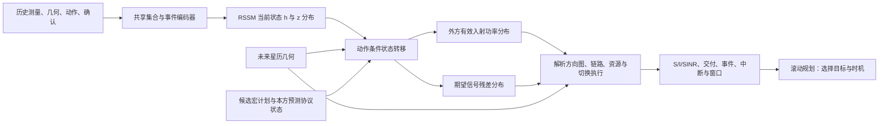
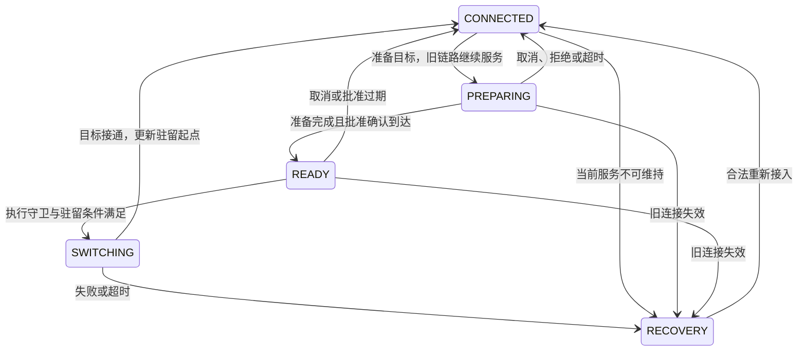

# 多星座对等共存：结构化世界模型 + 滚动规划

**研究任务：根据本方已收到的历史测量、公开星历和切换记录，预测不同选星计划的未来服务，再决定是否换星、换哪颗、何时准备和执行。** 保留 L1/L2/L3 三个交互 level；三个 level 使用同一模型结构，区别在外方是否响应本方，以及策略参数是否更新。

主方案采用**一个共享的概率世界模型 + 解析轨道/链路/协议模块 + 受约束 MPC**。本稿给出实现设计，参数是初始实验配置，尚无训练结果；更新日期：2026-10-01。对应速查：[神经网络输入输出简表](多星座世界模型_神经网络输入输出简表.md)。

## 1. 为什么选这个方案，什么意义上“最优”

公开轨道基本可算，外方发射活动与响应、候选切后的干扰、未确认执行结果不可直接知道；而切换有准备时间、断流和失败风险。因此需要预测**行动后的整段服务**，不能只按下一秒 SINR 排名。

“结构化世界模型 + 滚动规划”适合作为主方案，因为可把已知物理规律与未知动态分开，也能显式比较切换代价。但是目前不能证明它最优：MPC 只在预测模型、评价窗和搜索到的合法计划内选最优；模型误差、有限搜索和多方独立决策都可能使实际结果次优。最终须用同信息、同测量预算的“几何预测 + MPC”“HSMM/GRU + 同一 MPC”和历史策略比较。若经典预测已经足够，应采用更简单的预测器。

初版边界如下：

| 项目 | 确定设计 |
| --- | --- |
| 场景 | 多个独立 LEO 星座同频下行，地位对等；先 A/B 两星座、每方 1 个固定终端 |
| 选星权限 | 只在本运营方授权卫星间切换；跨运营方不共享私有用户位置、关联和资源表 |
| 终端 | 定向接收阵列、单 RF、单活动数据连接；接收指向由服务星几何跟踪 |
| 可控变量 | 保持、准备目标、等待、取消、执行获准切换；不同时学习连续波束和载频 |
| 已知执行器 | 本方准入、RB 调度、资源守恒、波束跟踪、协议状态机；所有方法共用 |
| 时钟 | 每 1 s 更新判断并规划；物理链路按 50 ms 更新，协议事件按精确时间处理 |
| 预测起点 | 最近 30 s 已到达的历史；预测未来 30 s，必要时所有计划共同扩至 60 s |

**控制周期、历史窗口、预测窗口、驻留时间是四个不同参数。每秒规划不代表每秒换星。**

第一轮可直接采用以下合成配置，之后扫描参数而非冒充商用系统：

| 模块 | 起步参数 |
| --- | --- |
| 轨道 | A 高度 550 km/倾角 53°，B 为 600 km/55°；各 36 面×20 星，Walker 相位 F=1；B 升交点整体偏移 5°、沿轨道相位偏移 10° |
| 几何与终端 | 合成历元 2026-10-01T00:00:00Z；两体圆轨道加地球自转；A UE 40°N/100°W，B UE 向东 1 km；授权且仰角至少 25°可请求 |
| 频谱与发射 | 20 GHz 下行、20 MHz、20 个 1 MHz RB；每活动 RB 1 W、每星总功率不超 20 W；导频/控制也入功率预算 |
| 方向图与噪声 | 发射 $G_{\rm tx,dBi}(\psi)=30-\min\{12(\psi/2^\circ)^2,30\}$；接收16×16半波长理想阵列，匹配服务方向、不重复叠加阵列增益；NF=6 dB、290 K、自由空间传播 |
| 业务与资源 | 初版满缓冲；同星 RB 正交、不同星复用；各星固定轮询公平调度，不允许每星只服务一个 UE 的人为限制 |

导频配置另记录参考波束、功率、RB、周期与导频/数据功率比例；服务导频先设每 100 ms 占用 2 ms。所有方法使用同一覆盖和发射表，扫描某方向不保证检测到候选。候选筛选和干扰事件由真实几何产生，无备用星或无强干扰的时段照样保留。

## 2. 三个 level：保留什么差别

| Level | 外方策略 | 本方动作如何影响外方 | 模型与数据要求 |
| --- | --- | --- | --- |
| **L1：外生变化** | 规则和参数固定；如按剩余覆盖时间选星，不响应本方造成的质量变化 | 会改变双方物理 SINR，但不改变外方关联、发射或调度安排 | 预测外方活动的持续性；不同行动分支可复用外方活动轨迹，接收干扰必须重算 |
| **L2：固定规则响应** | 参数固定，但使用外方自己的延迟 SINR、触发计时器、驻留时间进行调整 | 本方选星/发射变化 → 外方测量变化 → 延迟响应 → 本方后续干扰变化 | 世界模型转移必须以本方行动为条件；每个分支重新运行外方观测与响应 |
| **L3：多方学习** | 各运营方用私有历史训练自己的模型/控制器，批次间更新参数 | 相互响应，且训练过程中响应规律会变 | 采集批次内冻结参数；批次间更新，用旧版本对手池训练和交叉测试 |

“固定策略”不等于一直连接同一颗卫星。L1 若开启随 SINR 改变的 MCS、重传、调度或交付驱动的会话结束，就已经引入反馈，不能仍称无响应。L3 的每秒隐状态更新也不等于每秒重新训练网络。

三层都不要求在线识别外方每个用户和真实服务星。对等表示各方采用同等级规则、分别优化本方服务；不保证全局最优、纳什均衡或跨系统公平。

## 3. 所有输入到底是什么

记当前决策时刻为 $t_n$，控制周期 $\Delta=1\,\mathrm{s}$，历史窗口 $W=30$ 步，预测窗口 $H=30$ 步。模型读到的是：

$$
\mathcal H_n=\{\text{在 }t_n\text{ 前已到达的测量和确认，已发命令，本方已知状态，公开几何}\}.
$$

**历史里每个时刻的星位可以由星历重建，但每颗卫星的信号、干扰和 SINR 不会每时刻都有实测值。** 测量只来自当前服务方向与预算允许的候选扫描。

### 3.1 卫星位置、未来几何与传播延迟

轨道模块保存所有配置星座的卫星目录。对历史 $t_{n-W+1:n}$ 和未来 $t_{n+1:n+H}$，使用**截至 $t_n$ 已发布的同一版星历**分别传播，得到每颗星的位置/速度。未来每步的位置都独立由传播器算，网络不预测轨道，也不靠自己的预测位置再预测下一位置。

真实 GP/OMM 数据使用匹配的 SGP4 与坐标转换，不能当作普通两体轨道根数；保存发布可用时间、历元和版本。公开数据的格式与传播背景见 [CelesTrak GP 说明](https://celestrak.org/NORAD/documentation/gp-data-formats.php)。合成诊断场景可另用明确的 Walker/两体配置。

| 原始字段/派生字段 | 单位 | 来源与用法 |
| --- | --- | --- |
| `sat_id, operator_id, ephemeris_version` | 标识 | ID 用于跨时间关联，不给每颗卫星固定输出神经元 |
| `position_ecef_xyz, velocity_ecef_xyz` | m、m/s | 每颗相关卫星、每个历史/未来时刻；统一 ECEF，时间统一 UTC |
| `ephemeris_epoch, available_time, age` | UTC、s | 反映星历新旧；未来发布的修正星历不得回填当前输入 |
| `ue_position_ecef_xyz` | m | 本方终端已知位置；外方私有终端位置不输入 |
| `los_enu_xyz, elevation, azimuth` | 单位向量、rad | 从本方 UE 到卫星的方向；角度输入可用 sin/cos，避免跳变 |
| `range, range_rate, angular_rate` | m、m/s、rad/s | 用于路径损耗、Doppler、方向变化与延迟 |
| `propagation_delay = range/c` | s | 几何一程传播延迟；600 km 约 2 ms，1,500 km 约 5 ms |
| `remaining_visibility, authorized, in_fov` | s、bool | 几何可服务边界、本方授权与视场；不等于目标准入已批准 |

网络主要输入**相对方向、距离、变化率、星历年龄和资格**；绝对坐标供物理模块使用，无须把相同坐标与全部派生量重复堆入网络。按接收时刻算链路时，可迭代 $t_{\rm tx}=t_{\rm rx}-d(t_{\rm tx})/c$，并在一致坐标系处理卫星运动与地球自转。

本方候选初始保留 $K=4$ 颗：当前星、已准备目标优先，再补长覆盖和接收方向不同的候选。**K 只限制本方选星候选；外方同频可见源另成集合。** 轨道模块仍缓存全目录，网络只编码对本方区域相关的星。若外源剪枝，须保留背景干扰项并验证截断误差，不能只取一颗最近角度卫星。

### 3.2 无线测量：S、I、SINR 必须有确切含义

每条报告必须有 UE、测量对象、接收方向、频段/RB、测量带宽和双时间戳。字段规范如下：

| 字段 | 单位/定义 | 是否必需、怎样处理 |
| --- | --- | --- |
| `sample_time, arrival_time, age` | s；`age=t_n-sample_time` | 必需；只有 `arrival_time<=t_n` 才可使用 |
| `reference_sat_id, reference_signal_id` | 标识 | 指明测的是哪颗候选/哪种导频；未识别源的总功率另记 |
| `rx_boresight_enu, rx_pattern_id` | 单位向量、配置 ID | 必需；干扰随接收指向变，不能省略 |
| `rb_mask, bandwidth_hz, measurement_duration` | RB 集合、Hz、s | 必需；功率比较和链路计算须采用相同资源与采样条件 |
| `signal_power_ref`，记作 $S^{\rm ref}$ | dBm；已识别期望参考信号的功率 | 必需的信号估计；如原始 RSRP 为每 RE 功率，按参考配置转换并标明误差 |
| `interference_plus_noise`，记作 $J$ | dBm；该方向/资源上的 $I+N$ 估计 | 核心输入；接收机估计，不能用模拟器纯干扰真值代替 |
| `noise_power, noise_calibration_age` | W、s | 由带宽、噪声系数或校准得到；用于解释 $J$ |
| `interference_estimate`，记作 $\hat I$ | W；约为 $\max(J_{\rm W}-\hat N,0)$ | 可派生；保留估计误差/下限，不能把低于噪声的截断值当精确零干扰 |
| `sinr_ref` | dB；同参考条件的 $S^{\rm ref}/J$ | 接收机估计或同源派生值；用作质量与一致性检查 |
| `CQI, applied_MCS, ACK/NACK, BLER` | 类别、bool、比例 | 当前已到达的链路反馈；注明对应的传输区间及 BLER 分母 |
| `delivered_unique_bits` | bit/报告区间 | 实际成功交付、不重复计算重传的比特；有报告延迟 |
| `valid, newly_arrived, detected, censor_flag` | bool | 区分新报告、缺失、未检测与检测门限删失；另存估计方差 |

RSSI 是总接收功率，不能直接当期望信号 S；导频功率也不能未经导频/数据功率比例和波束配置转换就当连接后的数据 S。SINR 的分子、分母必须属于同一资源和测量条件。

起步测量规则：服务导频每 100 ms 采样；每秒最多扫描 1 个其他候选，候选测量间隙先设 20 ms，转向/稳定/返回时间另计。单 RF 测候选时不能同时收旧链路数据。未知候选值填 mask，数值占位 0 不表示真实功率为零；旧值保留年龄，不重复当新观测。

### 3.3 本方状态、历史动作和每次 handover 记录

| 组 | 输入字段 | 要解决的问题 |
| --- | --- | --- |
| 已确认协议状态 | `serving_sat, prepared_target, protocol_state, last_connect_time` | 当前服务、目标准备进度及驻留起点 |
| 尚未确认的命令 | `command_id, type, target, issued_time, timeout, confirmation_status` | 防止重复发请求；执行结果未知时保留 pending |
| 计时器与约束 | `dwell_elapsed, trigger_start, prepare_elapsed, execute_due, return_block_until` | 确定何时允许切换，计时器跨重规划持久化 |
| 本方无线/资源 | `assigned_RBs, reserved_RBs, per_RB_tx_power, own_sat_load` 及报告年龄 | 计算实际服务与本方资源竞争；只用权威记录或已到达报告 |
| 业务 | `demand_rate, current_queue`（若启用）、近期交付/缺口 | 初版配置外生满缓冲或已知需求率；未知未来到达不读真值 |
| 历史已发动作 | `hold/prepare/wait/cancel/execute/recover, target, issued_time` | 区分外部活动变化与本方转向/切换造成的测量变化 |
| 切换事件 | `prepare_requested, approved/rejected, confirmation_arrived, switch_started, connected/failed, recovered` | 每次记录事件时间、报告到达时间、源星/目标星、失败原因 |
| 历史实际代价 | `measurement_gap, interruption_duration, signaling_count, reserved_resource_time, lost_delivery` | 条件化执行预测，校准成本；不再重复扣同一断流损失 |

“全部 handover 过程”应保存在事件日志中；当前输入使用历史窗内的过程和跨窗仍有效的计时器，没必要每秒重复输入整段生命周期。控制器未知的真实完成时刻不能通过日志旁路进入在线输入。

### 3.4 张量接口：历史、未来上下文、计划是三类输入

```text
history_geometry[W, U, S_relevant, Fg]  # 公开几何，可重建
arrived_events[L_event, F_event]      # 变长报告/事件，含UE/卫星/RB键、双时间、方向、mask
own_states[W, U, Fx]                  # 已确认账本、pending、计时器、资源、业务
issued_actions[W, U, Fa]              # 动作及目标，用目标的共享几何token表示
future_geometry[H, U, S_relevant, Fg]  # 由当前可用星历传播，不是未来实测
plan[P]                              # 稀疏宏计划：目标、绝对准备时刻、执行等待、守卫
```

$U$ 为本方 UE 数，$S_{\rm relevant}$ 为相关本/外星总数；变长集合用 mask，报告多于一条时在桶内按事件顺序编码，再形成控制周期 token，不只留最后一条；保留每条报告的采样/到达时间、RB 和统计分母。外方实时功率、关联、资源、私有 UE 位置和未来真实测量都不是输入字段。

## 4. 模型结构：一个模型还是多个模型

### 4.1 主版：单个共享 RSSM，多功能头

**每个运营方运行一个端到端训练的结构化世界模型，所有卫星和候选共享参数。** 不为每颗星训练一个网络，不分别训练互不一致的“信号模型、干扰模型、SINR 模型”。L1/L2/L3 结构相同，使用对应交互数据训练；各运营方可以有独立参数。



具体层次与起步大小：

| 模块 | 结构/初始大小 | 作用 |
| --- | --- | --- |
| 卫星/候选编码 | 共享两层 MLP，隐藏宽度 64 | 编码几何、资格和带 mask 的测量；候选数变化仍可使用 |
| 报告/事件编码 | 共享 MLP + 桶内顺序聚合 | 输入到达时间、测量年龄、动作与确认；无新报告不制造观测 |
| 集合聚合 | masked attention，输出 128 维 | 保留服务星/目标 token，再聚合相关本外星信息 |
| RSSM 记忆 | GRU，确定状态 $h\in\mathbb R^{256}$ | 记住干扰趋势、外方响应、计时器之外的未知历史模式 |
| 随机潜状态 | $z\in\mathbb R^{32}$，对角高斯先验/后验 | 表达同一历史对应多种隐藏环境的可能性 |
| 共享输出头 | `(h,z,ue_geometry,sat_geometry,RB)` → 分布参数 | 各星、各 UE 用相同头，避免固定 ID 分类 |
| 解析模块 | 轨道、方向图、协议、调度与服务映射 | 执行已知规则，保证 SINR 和资源一致 |

初版从最近 30 s 重建当前状态，明确只依赖该窗口。后续可持续维护循环记忆；若这样做，必须说明实际包含更早历史，并采用相同训练记忆机制。

多用户时仍是同一个运营方模型：在编码器增加 UE—候选星的服务边、共享资源边和外源干扰投影边，用稀疏消息传递处理耦合。没有外方真实 UE—服务星边。算力允许后再用 3 个独立种子的同结构模型做 ensemble；这属于不确定性扩展，首版不是必须。

该“确定性记忆 + 随机状态 + 潜空间规划”的方法背景见 [PlaNet](https://arxiv.org/abs/1811.04551)，本文的功率头和协议执行器是面向当前通信任务的设计。

### 4.2 神经网络直接输出哪些量

| 输出 | 精确定义 | 分布与使用方式 |
| --- | --- | --- |
| 当前 belief | $h_n$ 与 $q_\theta(z_n\mid\mathcal H_n)$ | 不是外方真值；是多步展开起点 |
| 下一步潜状态 | $h_{k+1}$ 与 $p_\theta(z_{k+1}\mid h_{k+1})$ | 递推未知活动及 L2/L3 响应，供下一步继续预测 |
| 外方有效入射功率 $q_{u,j,r,k}$ | 外星 $j$ 在本方 UE $u$ 处、RB $r$ 上的等效接收功率，W；**含未知发射活动、发射方向图和传播，不含本方接收增益** | 可用活动概率 $\pi$ + 正功率 log-normal：$q=a\exp(\mu+\sigma\epsilon)$；$a\sim\mathrm{Bernoulli}(\pi)$；同一外星/RB的活动门共享给各UE |
| 信号残差 $\delta S_{u,s,r,k}$ | 相对已知链路预算的 dB 偏差，如阴影、跟踪误差 | Gaussian 的均值/标准差；理想物理首版可以固定为 0 |
| 未知执行结果（扩展） | 条件于请求/目标的准入失败概率、未知准备/接入处理时延分布 | 首版按声明的确定 profile 计算；只有引入随机执行后才学习对应输出头 |

$q$ 的参考接收增益设为 1（0 dBi），可理解为把未知发射和传播汇总后、尚未施加本方阵列方向图的功率。多 UE 共享同一条潜轨迹，但通过位置相关解码得到不同 $q$，不能假设相同外星在所有地点功率相同。

只有聚合测量时，每颗外星的功率分解可能不可辨识；这些量是物理约束下的潜在分解，不承诺识别真实发射星。核心验证是**已测方向的聚合干扰、多步交付和计划排序**；未测方向的推断需要探索测量与切换分支数据支持。

### 4.3 解析模块把输出变成什么

给定接收指向 $w$、外星方向 $\Omega_j$，先在线性功率域计算：

$$
I^{\rm ext}_{u,r,k}(w)=\sum_j q_{u,j,r,k}\,G_{{\rm rx},u}(w,\Omega_{u,j,k}).
$$

再加本系统其他**实际发射**产生的 $I^{\rm own}$；未发射、仅可见或仅预留的卫星不自动贡献数据干扰。导频/控制发射单独入账。

$$
S=S^{\rm budget}10^{\delta S/10},\qquad
N=k_BT_0FB_r,\qquad
\Gamma=\frac{S}{I^{\rm ext}+I^{\rm own}+N}.
$$

$S^{\rm budget}$ 由本方合法已知发射功率、发射/接收增益和路径损耗计算。噪声系数 $F$ 使用线性值；SINR 最后才转 dB。由于共享同一外部潜状态，候选 A1/A2/A3 在同一未来世界中的干扰具有一致来源，不能独立画三条互不相关的 SINR 序列。

有效传输区间内，按同一个因果 MCS/BLER 或明确的服务抽象计算成功交付；切换和测量断流时交付为 0。初版可用 $R=\eta B\log_2(1+\Gamma)$ 的理想服务抽象，$\eta$ 在配置中固定；后续使用基于已到达 CQI 的 MCS，再按实际解码结果算交付。不能让发射机用未知真实即时 SINR 选择完美 MCS。

状态机、调度与实际可收数区间联合产生：

```text
signal_w / interference_w / noise_w / sinr       # 有效链路/RB/子区间
protocol_events                                # 准备、获准、确认、切换、失败、恢复
connection_state / resource_state              # 该分支实际协议和资源
successful_unique_bits                         # 每周期成功交付
outage_intervals / signaling / reservations     # 实际代价
usable_window / access_failure_probability      # 从完整轨迹统计，不另训练矛盾的窗口网络
```

无数据传输时 SINR 使用有效掩码，不能把数值 0 当实测质量；候选潜在质量另注明假设的功率、资源和方向。50 ms 内若有接入/断流事件，先切分区间再算比特，不能先平均 SINR 再代入非线性速率。

## 5. n 时刻如何预测到 n+1、n+2……

### 5.1 先用真实历史形成当前判断

$$
e_n=\operatorname{Encoder}(\mathcal H_n),\qquad
b_n=(h_n,q_\theta(z_n\mid h_n,e_n)).
$$

迟到报告按到达顺序进入编码器，同时保留采样时刻与年龄。例如在 100 s 到达、98 s 采样的 SINR，表示 2 s 前的测量，不能直接替换成当前 SINR。初版采用这种带年龄的近似滤波，验证时扫描延迟；若严重退化，再加入按采样时刻更新并重放动作的固定滞后缓冲。

### 5.2 对某个计划递推完整状态，而非仅递推 SINR

每条分支同时保留预测物理/执行状态 $x_k^{\rm env}$ 和控制器可见账本 $x_k^{\rm visible}$：前者用于算交付，后者仅在生成确认到达后更新。$g_k$ 为公开几何，$a_k$ 在外方动态转移中只包含已经生效的本方关联/发射变化；未生效请求由协议队列推进。每条未来轨迹按下列逻辑展开（先用控制周期记号说明）：

$$
h_{k+1}=\operatorname{GRU}_\theta\!\left(h_k,[z_k,a_k,\operatorname{Enc}(g_{k:k+1}),\operatorname{Enc}(x_k^{\rm effective})]\right),
\qquad z_{k+1}\sim p_\theta(\cdot\mid h_{k+1}).
$$

实际执行时，控制周期内还会按命令生效、接入变化和报告到达等事件拆成子区间，递推器额外输入子区间长度 $\delta t$（s）。**先用子区间起点的潜状态解码功率并计算该段服务，再递推到段末**；新生效动作只影响之后的状态转移，不能用整秒末端状态反过来计算动作生效前的功率。几何与方向图在 50 ms 物理点更新，必要时把未知动态子步细化至 100/50 ms 并验证时间分辨率误差。

外部响应转移只消费已经生效的关联、波束和 RB 发射状态 $x^{\rm effective}$；未来请求/pending/未生效命令不得让源功率提前改变。首版在事件之间保持潜状态，以起点状态和随时间更新的几何解码；外方未观测变化由下一潜状态的概率转移表示。这是可验证的离散近似。

协议执行守卫只读 $x^{\rm visible}$ 与已到达的生成报告。即使样本中的 $x^{\rm env}$ 已完成准备，也须等批准到达。真实起点的 pending 完成/失败若未知，从 belief 和声明时延 profile 形成条件分支，不能读模拟器当前执行真值；已确认接通时间使用确认报告携带的事件时间，而不是确认到达时间。

```text
n：最近30s真实历史 → 当前 h_n、z_n 分布、本方已知/pending 状态
分支P：
  n→n+1：h_n,z_n + P的动作 + g_n:n+1 + x_n → 预测状态与第一秒结果
  n+1→n+2：上一步预测h,z,x + 下一步动作 + g_n+1:n+2 → 第二秒结果
  ……直到n+H；每一步几何都来自同一版星历传播
真实n+1到来：只收已经到达的新报告 → 重新同化真实历史 → 再规划
```

所以，可以说“用预测的下一状态继续预测”，但**不是把预测 SINR 当真实观测拼回历史**。主递推量是潜状态和预测协议/资源状态；真实 $n+1$ 到来后，上一轮未执行的预测只是备选计划，不是事实。

每个计划初始采样 32 条连贯未来轨迹。共同潜状态保留时间、候选与多 UE 间的相关性，不把每一秒的独立上下分位数拼成轨迹。若用 ensemble，模型身份在整条轨迹中固定，思路参考 [PETS](https://arxiv.org/abs/1805.12114)。

计划执行守卫如“收到批准才切换”需要模拟确认报告的到达；只能用该模拟时刻已到达的生成报告。不能让未来动作直接读取抽到的真实隐藏状态。

## 6. 每次 handover 的过程与真实代价

### 6.1 状态与动作



READY 只是控制器已知获准，不是第二条活动数据连接。切换开始后单 RF 无法同时维持旧星数据接收；失败按公共恢复流程重新接入，不能免费跳回旧星。取消/过期请求的迟到批准按 command_id 丢弃，不激活目标；尚有旧连接时准备失败可退回 CONNECTED，旧连接已失效则进入 RECOVERY。

### 6.2 时间如何计算

| 阶段 | 延迟组成 | 是否损失旧链路数据 |
| --- | --- | --- |
| 规划与下发 | 实际计算耗时 + 命令路径传播 + 处理/排队 | 原连接通常继续服务；计时不能暂停真实环境 |
| 目标准备 | 上下文建立、准入、预留与处理 | 通常可继续；扫描/控制占用造成的间隙单独计 |
| 批准报告到达 | 确认传播、回传、处理/排队 | 未收到批准前不能按已获准执行 |
| 等待执行 | 计划等待、最短驻留、触发门槛 | 旧链路继续服务，目标授权须仍有效 |
| RF 重指向/重调 | 终端转向、稳定、频率/时序校准 | 无法收数据的实际时段计入中断 |
| 同步与接入 | 目标捕获、同步、随机接入/握手、必要往返 | 无法收数据的时段计入中断；不能把所有阶段机械相加，需声明可否重叠 |
| 失败恢复 | 超时检测、资源释放、重试与重新接入 | 按真实失联时段计；包含失败概率 |

一程 $d/c$ 只是一段传播时延，不等于全部报告延迟或 handover 时长；透明转发、再生载荷、网关和控制器部署位置会改变路径，应由所选 profile 定义。

首个诊断 profile 可用：测量报告总延迟 0.2 s、命令总延迟 0.1 s、准备 1.0 s、确认总延迟 0.2 s、执行断流 0.5 s、准备超时 5 s、目标接入超时 1.0 s；失败后恢复处理 2.0 s，再加配置中的命令/确认总路径时延。首版接入满足已知资源/资格则成功，压力组再设 5% 接入失败作为仿真随机性；该已配置概率直接采样，不必训练执行头。目标准备首版只建上下文、不预留数据 RB；执行接入后才进入目标调度，预留版本另设资源账本实验。这些是**总量示意**，包含所选路径传播时不可再重复加一次 $d/c$；主实验应扫描时延、失败和测量误差，并区分不同切换类型。

### 6.3 代价如何进入计划评分

- **服务损失**：扫描、重指向、接入、失败恢复的断流直接减少成功交付 $D$。
- **信令成本**：准备/执行/取消的控制消息数或字节；用单独权重表达控制开销。
- **资源成本**：目标准备是否预留 RB、预留多久；由本方统一资源账本影响所有 UE 的交付。
- **风险**：失败、持续低服务、长中断的分布，由同一组轨迹评价。

同一中断已减少交付，就不再扣一遍“中断时长 × 速率”。若额外限制最长中断，表示另一项可靠性偏好，应与吞吐损失区分。

## 7. 滚动规划到底怎样选星、决定持有多久

### 7.1 规划的是一段关联过程

一个计划可以写为：

$$
P=(s_{\rm target},t_{\rm prepare}^{\rm abs},w_{\rm execute},\text{执行守卫},\text{切后保持/恢复规则}).
$$

初版在一个 30 s 预测窗内**最多一次主动切换**：切前使用当前星，准备和等待时尽量继续服务，切换期间断流，接通后保持目标至预测窗尾；物理失效时走同一恢复规则。不是“未来每一秒选最高 SINR 的星”，也不是要求整窗从第一秒起只用同一颗星。

起步计划池：保持；对最多 3 个其他候选枚举准备延迟 $d\in\{0,2,5\}$ s、批准到达后的额外等待 $w\in\{0,2\}$ s。正常连接时至多 $1+3\times3\times2=19$ 个模板。已有 pending/READY 状态时增加继续等待、取消、执行和上一轮剩余计划；准备请求不重复发送。

这个搜索限制是可实施起点。以后可用束搜索增加第二次切换，但每次仍满足驻留和协议约束；不能把一次切换模板的最优称为任意策略的全局最优。

### 7.2 计划评分：累计成功交付、信令和尾部风险

令 $D_{u,k}$ 为实际成功唯一比特，$d_{u,k}$ 为声明的业务需求。初版用下式统一比较所有计划，单位为 Mbit 等价效用：

$$
J(P)=\mathbb E\!\left[\sum_{u,k}\omega_u\frac{\min(D_{u,k},d_{u,k})}{10^6}
-c_{\rm sig}N_{\rm cmd}(P)\right]
-\lambda_{\rm risk}\operatorname{CVaR}_{0.9}(L(P))-C_{\rm terminal}(P),
$$

$$
L(P)=\sum_{u,k}\omega_u\frac{(d_{u,k}-D_{u,k})_+}{10^6}.
$$

$\operatorname{CVaR}_{0.9}$ 表示最差 10% 轨迹的服务缺口均值，使用相同 32 个样本估计；尾部样本很少时须在离线校准中增加样本验证。$N_{\rm cmd}$ 只统计当前 $t_n$ 之后的新准备/执行/取消命令；已经发送的准备成本属于过去成本，不重复进入未来评分。$\omega_u$、$c_{\rm sig}$、$\lambda_{\rm risk}$ 在验证集固定；初版可先置风险权重为 0，之后画风险—交付权衡。

满缓冲诊断把 $d$ 设得足够大；有队列时交付不超过可用业务。未来业务若未知，使用已声明的需求预测，不能读未来真值。跨系统仍各自优化本方 $J$，分别统计其他系统受损。

$C_{\rm terminal}$ 只处理已知几何的窗边界效应：对末端仍连接、且之后 5 s 内确定失去资格的样本，用配置需求率 $R_u^{\rm ref}$ 与声明的必需恢复断流 $T_u^{\rm rec}$，计算 $\mathbb E[\sum_u\omega_u R_u^{\rm ref}T_u^{\rm rec}/10^6]$ 的罚项。只计窗后尚未计入交付/风险的损失；同一次恢复已在窗内发生时，不再整段重复扣。它不是预测窗外的高吞吐奖励，需单独消融。

### 7.3 防止每秒换星：四个明确门槛

| 规则 | 初始值与定义 |
| --- | --- |
| 最短驻留 | 目标真正接通后 $T_{\min}=10$ s 内不主动执行下一次切换；准备可提前 |
| 收益滞回 | 最优切换计划相对保持的增益 $\Delta J>\max(1\ \mathrm{Mbit},0.05\lvert J_{\rm stay}\rvert)$，比较完整计划而非瞬时 SINR；已有准备计划时，新替换计划须超过继续原计划的同等增益门槛 |
| 持续触发 | 同一个目标连续满足增益条件至少 $T_{\rm trigger}=2$ s；1 s 周期下如在 n、n+1、n+2 三次评估持续成立才满 2 s |
| 防返星 | 离开的旧星在 20 s 内不作正常切换目标，抑制 A1→A2→A1 |

这些是可调的研究配置。确认失联、当前星即将失去资格，或已到达报告显示服务连续 3 s 低于业务需求的 20%（满缓冲诊断用 1 Mbps）时，进入预先定义的应急规则，可豁免驻留/收益滞回/返星限制；**不能豁免本方授权、准入、单 RF 和资源守恒**。故障/拒绝/超时也不能被持续触发规则拖住。

对每条预测轨迹计算“接通目标后，首次连续 3 s 低于上述服务门槛或确定资格失效”的可用时间。瞬时差一点不直接结束窗口。若到窗尾仍可用，记录“至少可用到这里”，不是把 H 当失效时刻。

**预测可用窗口是收益和风险判断，不是预先承诺必须连满多少秒。** 实际接通后先满足最短驻留，此后若保持仍好，就继续保持；若新观测使另一计划持续更好，才按上述门槛再次切换。

### 7.4 等待不能每轮重新开始：保存绝对时刻

若每次都选“再等 5 s 准备”，每秒把 5 s 重新起算就可能永远不切换。实现必须持久化：

```text
provisional_plan = {target, prepare_time_abs, execute_wait_s, trigger_start}
first_confirmation_arrival → execute_due_abs = max(
    confirmation_arrival + execute_wait_s,
    last_connect_time + T_min,
    trigger_start + T_trigger)
```

收益条件中断或目标变更时重置触发；同目标持续满足时保留原准备时刻。实际最早准备时刻为 `max(prepare_time_abs, trigger_start+2s)`，尚未开始触发时按当前时刻再加 2 s 推演；rollout 同样计入这段门槛等待。到期但真实门槛尚未满足则等门槛，不把期限重新设为当前+5 s。预测报告不能替真实到达信息积累触发时间。首次收到批准后只计算一次执行期限，不能每轮再加等待。

上一轮的剩余计划每次加入搜索，即使残余等待变成 4/3/1 s、已不在初始模板网格内也保留。新计划只有产生超过替换滞回的增益或原计划失效才改期；同一目标计划的触发 timer 不因重规划重置。进入 PREPARING/READY 后，每轮比较继续、显式取消和替换的未来效用，过去准备成本不再扣；执行前复核最新批准、有效期、资格、资源与服务收益。若继续准备/执行已比合法取消更差则取消，不能仅因为已准备就机械执行陈旧计划。

### 7.5 窗口长度与多用户约束

H 至少要看见准备/确认/执行、外方响应和一段切后服务。对候选计划，用配置或预测的接通延迟高分位，检查：

$$
t_{\rm connect,0.9}(P)-t_n+T_{\min}+5\,\mathrm{s}\le H\Delta.
$$

若不满足，所有比较计划共同扩展评价窗，最多 60 s；无法可靠展开时删去过晚的新正常切换模板；已有 pending/原计划不能悄悄删除，仍保留继续、显式取消和恢复分支。该检验是搜索筛选，不是延迟或服务保证；慢于分位的轨迹仍按真实延迟计入损失。已知覆盖不足以完成接入并满足驻留的目标不作为正常切换，必要的应急接入单独处理。

长周期几何覆盖直接由轨道模块检查，无须神经网络逐秒预测几分钟。不能在窗外默认最后一秒高质量永远延续。

多 UE 时不能各自挑最优星再假定资源充足。先按共享卫星/资源分组，用束搜索或坐标更新组合少量计划，统一调度器在每个未来事件验证 RB 分配、预留与释放；整条轨迹联合计分。同一未来样本的外源状态供所有本方 UE 共同使用。

### 7.6 一次真实运行的步骤

```text
每个运营方在 t_n：
  1. 接收 arrival_time<=t_n 的新报告，更新本方已知/pending账本。
  2. 用最近W秒历史估计当前belief，传播未来H步公开几何。
  3. 生成合法宏计划，加入上一轮绝对时刻剩余计划和恢复备选。
  4. 每个计划从同一belief采样32条联合未来：
       递推潜状态 → 预测功率/未知执行 → 解析链路/协议/资源 → 累计交付与代价。
  5. 比较同一窗口的J，更新持续触发与驻留守卫。
  6. 只发现在应执行的一条命令；其余时刻与目标作为可修改计划保存。
  7. 登记实际计算、下发和生效时刻；环境继续运行，到下一轮用真实反馈校正。
```

L1 同一起点跨计划缓存并复用外方源潜轨迹和入射功率，确保不会因本方计划变化而产生虚假外方响应；L2/L3 只能共享外生随机种子，响应随各计划重新演化。选择的是应对一组未来的同一计划，不能每条轨迹读隐藏真值后各选最优再平均。

独立的协议事件循环在批准到达、计划期限到达、失败/资格失效时即时检查守卫并下发已授权计划的当前命令，不必等下个整秒 MPC；即时检查只用那一刻可见信息，不重新读取隐藏世界。因此算例可在 103.3 s 发命令。

设定规划截止时间，例如初始预算 200 ms。若超时，执行仍合法的既有计划或统一恢复规则，并将实际耗时加入下发延迟；压缩候选/样本预算后报告性能和时延，不让模拟器停表等待模型。

## 8. 一个完整时序算例

以下只是算例。当前 100 s 连接 A1，驻留/持续触发均已满足；用同一 30 s 窗口比较保持与 A2 切换。A1 可在前 5 s 提供 6 Mbps，之后因持续受扰仅 1 Mbps；目标 A2 接通后提供 4 Mbps，资格足够长。

忽略这次规划的计算耗时，仅使用第 6 节总延迟 profile：

| 时刻/区间 | 动作/状态 | 实际服务 |
| --- | --- | --- |
| 100.0 s | 决定现在准备 A2，下发请求 | A1 仍服务 |
| 100.1 s | 请求生效，开始准备 | A1 仍服务 |
| 101.1 s | 目标准备完成 | 尚不能用未到达的批准报告执行 |
| 101.3 s | 批准到达，选择额外等待 2 s | A1 仍服务；执行期限记为 103.3 s |
| 103.3 s | 发执行命令 | 下发阶段 A1 继续服务 |
| 103.4–103.9 s | 执行生效，重指向/同步/接入 | 0.5 s 断流 |
| 103.9–130.0 s | 接通 A2，保持目标 | 4 Mbps；至少到 113.9 s 才允许主动再次切换 |

保持的交付：$6\times5+1\times25=55$ Mbit。

该切换计划的交付：$6\times3.4+4\times26.1=124.8$ Mbit，尚需按目标函数扣信令/风险；0.5 s 断流已经不计交付，不再重复扣一次。

模型也会比较“批准后立即执行”和“延迟 2/5 s 准备”等模板，本例不是声称额外等 2 s 最优。在真实 101 s、102 s 重新规划时，若情势基本相同，保留已经记下的 103.3 s 期限；若新测量表明 A1 恢复或 A2 变差，可以在执行前取消。A2 接通后即便下一秒 A3 的瞬时 SINR 更高，也不因此立即再切。

若是 L2/L3，A2 发射还可能触发 B 的反应，4 Mbps 不再是固定真值，必须对响应分支重新预测；不能沿用本例固定速率作为实验结果。

## 9. 数据和训练：如何学到这些预测

### 9.1 先生成可交互数据

公开星历提供几何，不提供测量、执行或反事实质量。搭建包含实际同频发射、方向图、RB 调度、报告延迟和切换状态机的模拟器：

1. 配置 A/B 轨道、终端、设备、业务、准入/切换 profile 与 level；先验证没有发射就没有数据干扰、单 RF 不会同时收两条数据链路。
2. 混合几何保持、滞回切换、预测切换和合法随机时机采集，覆盖保持、准备、取消、成功与失败，不只采一种策略。
3. 保存公共几何、本方可见日志、已发动作和事件；全局真值独立存储，只用于环境推进和评估。
4. 从同一时刻派生保持/不同目标/不同准备时刻分支；L2/L3 重新运行外方响应，不能只替换已有 SINR 日志中的卫星标签。
5. 按基础世界/episode 划分训练、验证、测试，同一个世界的窗口和所有分支必须进入同一集合。

首轮可采 200 个、每段 600 s 的基础世界做接口和预测可行性检查，之后按验证曲线扩充，不能把滑窗数量当独立样本量。轨道相位、UE 地区、外方规则参数、负载与时延都留出测试组合。

### 9.2 训练样本与监督

每个样本包含 30 s 预热历史、60 s 学习序列及至少 30 s 后续标签；切换事件保留精确时间。数据加载器按到达时间重建每个训练决策的视图，标签对齐其真实采样/传输时刻。

| 学习项 | 可得到的监督 | 不可伪造的标签 |
| --- | --- | --- |
| 聚合功率/测量似然 | 测过的方向上的 $S^{\rm ref}$、$J=I+N$ 及测量误差 | 未测候选每秒 SINR、外星私有功率不是默认标签 |
| 执行与交付 | 真正发生的准入/接入、延迟、成功唯一比特 | 行为日志没有执行过的计划，不能直接认定成功/失败 |
| 隐状态一致性 | RSSM 后验与先验的 KL | 不要求监督真实外星身份/策略 ID |
| 多步预测 | 起点只用历史，随后按已知动作和公开几何自由展开，与未来合法日志比较 | 不能每一步同化未来真值后称为多步预测 |

可用损失：

$$
\mathcal L=\mathcal L_{\rm measured\ power}+lambda_D\mathcal L_{\rm delivery}
+\lambda_E\mathcal L_{\rm execution}
+\beta\,\mathrm{KL}(q_\theta(z_k\mid\mathcal H_k)\|p_\theta(z_k\mid h_k))
+\lambda_{\rm multi}\mathcal L_{\rm free\ rollout}.
$$

直接功率标签应通过参考/数据波束和资源转换后的测量模型比较；若 SINR 由同一 S/J 派生，不把它再当第三个独立观测重复计权。确定协议首版不需要学习执行头；交付项可以用于多步校准/辅助训练，已知成功比特公式不必让网络重学。缺失、未检测和重复旧值分别使用监督掩码或删失似然。

训练初值：AdamW、学习率 $3\times10^{-4}$、batch 32、梯度裁剪 10；先训练单模型，再用验证集确定窗口、维度与风险权重。训练后报告**从起点自由展开**的 1/5/10/20/30 s 误差与区间覆盖，后验重构误差另列。

### 9.3 从 L1 到 L3 的训练顺序

| 阶段 | 本轮要证明什么 |
| --- | --- |
| L1 | 历史能预测干扰持续性，且多步规划收益超过只看当前质量；几何/HSMM 已足够时简化模型 |
| L2 | 同一历史下保持和切换会导致不同外方响应；模型能预测其延迟，减少来回切换 |
| 多 UE /多星座 | 共享源与资源联合推演优于独立逐用户选星，端到端计算仍能按期完成 |
| L3 | 批次冻结各方参数采集 → 各自更新模型 → 加入新旧对手池 → 新批次采集；测试时固定权重，只更新隐状态 |

L3 交叉测试不同检查点和未见规则，分别报告每个系统服务与切换振荡，不能只展示双方一起训练时的一组平均奖励。

## 10. 验证方案是否值得采用

| 对照/消融 | 回答的问题 |
| --- | --- |
| 最高仰角、最长覆盖；测得 SINR + 滞回 + 计时器 | 优势是否仅来自几何或防频繁切换规则 |
| 几何预测、HSMM、GRU，全部接同一个 MPC | 是否真的需要 RSSM，而不是规划器本身带来收益 |
| 相同世界模型：单步 vs 30 s；去掉历史/动作/测量年龄 | 历史、多步、动作条件和时延处理分别贡献什么 |
| 循环 PPO/历史策略，同观测、动作和协议 | 在线模型规划的收益是否足以抵消计算成本 |
| L2/L3 忽略外方响应；多 UE 独立选择 vs 联合资源推演 | 行动反馈、共享源及资源耦合是否实际影响结果 |
| 额外未来/全信息的辅助参考，单独标记 | 可改进空间；近似求解不能称严格最优上界 |

主要指标：每方及每 UE 实际交付/需求满足、最长中断、接入失败、切换与返星次数；各 horizon 的聚合干扰/交付概率校准、计划排序；规划耗时、超时率与测量成本。所有对照拥有同样星历、测量预算、报告延迟和协议能力；不同动作造成不同观测是正常现象。

先做两星座双 UE，再分别增加 UE 和星座数，最后共同学习。关键结果至少使用多训练种子，并按基础世界统计配对置信区间。若可预测性很弱、切换比干扰变化慢、没有可执行备用星或计算超时，应该报告收益边界。

## 11. 实现接口与已有工作的关系

需要的最小模块只有：`orbit_geometry`（星历/延迟）、`observations`（双时间/测量预算）、`link_budget`（统一功率/方向图）、`protocol_scheduler`（状态/资源/事件）、`structured_rssm`（过滤/转移/输出头）、`rollout_planner`（宏计划/联合采样/评分）、`train_eval`（分支数据/校准/闭环比较）。先打通这条闭环，再增加模型集成或图编码。

已有研究提供同频方向性干扰与选星的物理基础：[Feasibility Analysis](https://arxiv.org/abs/2311.18250)；已有 [Satellite Selection for In-Band Coexistence](https://wireless.ee.ucla.edu/pdf/pub/satellite-selection.pdf) 研究跨时间关联和学习预测其他系统关联；[Lookahead-Based Lookaside Selection](https://onlinelibrary.wiley.com/doi/10.1002/sat.70040) 研究轨道前瞻与干扰规避。本文不能把“用轨道前瞻”或“预测其他系统选星”单独称为新意。

应检验的具体贡献是：**在有限、延迟、方向相关的历史观测下，结构化预测行动后的联合服务轨迹，并把真实准备/切换/恢复代价与多方响应纳入可执行规划。** 只有同信息基线和三个 level 的闭环结果支持后，才能形成最终贡献表述。
